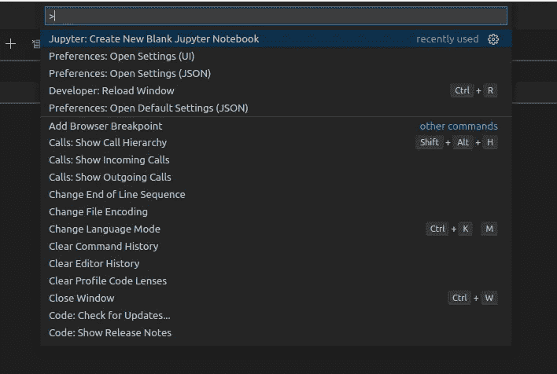

# 《VS 代码》中的 Jupyter:利弊

> 原文：<https://towardsdatascience.com/jupyter-is-taking-a-big-overhaul-in-visual-studio-code-d9dc621e5f11?source=collection_archive---------4----------------------->

## 把一个程序当作一篇文学作品，写给人类而不是电脑

诺兰·伊萨克在 [Unsplash](https://unsplash.com/s/photos/renovation?utm_source=unsplash&utm_medium=referral&utm_content=creditCopyText) 拍摄的照片

笔记本一直是软件思想增量开发的完美工具。数据科学家使用笔记本记录他们的工作，探索和试验新算法，快速勾画新方法，并立即观察结果。

> 把一个程序当作一篇文学作品，写给人类而不是计算机。
> 
> 唐纳德·克努特

[Jupyter 笔记本](https://jupyter.org/)为数据科学家如何编译他们的项目带来了一场革命，允许他们使用一种有文化的编程形式来分析数据集。然后， [JupyterLab](http://jupyterlab.readthedocs.io/en/stable/) 被开发来解决 Jupyter 笔记本的一些缺点，并且是该项目的下一代用户界面。

今天，我们多了一个选择:Visual Studio 代码。VS 代码的新 Jupyter 扩展完全支持我们喜爱的`.ipynb`文件，为编辑器带来了交互式编程。您可能会失去一些东西，比如您最喜欢的 Jupyter 扩展，但是调试之类的过程可能会变得更加简单。归根结底，这取决于您如何使用笔记本电脑。

最后，当你看完这个故事后，看看 Python 程序员和数据科学家的 VS 代码的 5 大扩展！

 [## 面向数据科学家的 5 个 Visual Studio 代码扩展

### 借助这些强大的附加组件，提高 VS 代码的生产率

towardsdatascience.com](/5-visual-studio-code-extensions-for-data-scientists-937487b987c0) 

> [学习率](https://www.dimpo.me/newsletter?utm_source=article&utm_medium=medium&utm_campaign=jupyter&utm_term=jupyter_vs_code)是为那些对 AI 和 MLOps 的世界感到好奇的人准备的时事通讯。你会在每周五收到我关于最新人工智能新闻和文章的更新和想法。在这里订阅！

# VS 代码的 Jupyter

Visual Studio 代码的 Jupyter 扩展带来了笔记本支持、交互式编程和支持智能感知、调试等的计算。这个故事研究了这个扩展，以及如何将它集成到您的日常工作流程中。

## 创建 Jupyter 笔记本

VS 代码附带了一个方便的命令面板，允许您在不离开键盘的情况下发出命令。它的设计非常好，新的 JupyterLab 3.0 复制了它，创造了类似的体验。

 [## 期待已久的 JupyterLab 3.0 终于来了

### Jupyter 项目发布了 Jupyter lab 3.0 版本，作为送给数据科学家的圣诞礼物。

towardsdatascience.com](/the-long-awaited-jupyterlab-3-0-is-finally-here-3b6648b3a860) 

因此，要创建一个新的 Jupyter 笔记本，启动命令面板(`Ctrl+Shift+P`)并搜索`new notebook`；应该是第一个结果:`Jupyter: Create New Blank Jupyter Notebook`。你总是可以通过在你的工作区触摸一个新的`.ipynb`文件来创建它，但是快捷方式总是让你更有效率。

创建一个新的空白 Jupyter 笔记本-作者图片

注意，VS 代码创建的笔记本默认是`trusted`。另一方面，我们进口的任何笔记本电脑都被视为`not trusted`保护我们免受恶意代码执行。因此，在执行之前，当编辑器提示我们时，我们应该手动`trust`笔记本。

创建笔记本后，使用顶部工具栏上熟悉的`save`图标将其存储在您的工作区中。

保存您的笔记本—作者图片

最后，我们可以使用相应的图标将笔记本导出为 Python 脚本或 HTML / PDF 文件。

导出您的笔记本—按作者分类的图像

## 使用编辑器

默认情况下，新笔记本会有一个空的代码单元供您开始使用。将您的代码添加到空单元格中，并使用`ctrl + enter`执行它。该命令将执行高亮显示的单元格。或者，您可以使用`shift + enter`来执行此单元格，同时创建并高亮显示下面的新单元格，或者使用`alt + enter`来执行高亮显示的单元格，在下面创建一个新单元格，但将焦点保持在前一个单元格上。

代码单元格-按作者排列的图像

您可以使用左侧的`+`图标添加新的代码单元，使用`bin`图标删除它，或者使用相应的箭头上下移动它。

代码单元格管理-按作者分类的图像

最后，将单元格类型更改为 markdown 真的很简单；只需点击代码上方的`M`图标。要将其改回`code`单元格，选择将出现的`{}`图标。或者，您可以相应地使用`M`和`Y`快捷键。

要降价的代码-按作者排序的图像

## 把事情做完

VS 代码的第一个真正伟大的特性是智能自动完成。编辑器可以显示成员列表、方法文档字符串和参数提示。

笔记本中的智能—作者图片

另一个有助于跟踪内存中变量的特性是变量浏览器和数据查看器。您可以在当前 Jupyter 会话中查看、检查和过滤变量。这缓解了笔记本电脑臭名昭著的无序执行问题。嗯，它并没有真正缓解这些问题，但给你一个提示。

运行代码后，单击顶部工具栏中的变量图标，您将看到当前变量的列表，这些变量将在代码中使用时自动更新。

可变资源管理器-按作者分类的图像

最后，让我们检查一下我们的调试选项。首先，VS 代码的 Jupyter 扩展支持在单个单元格中逐行执行。只需点击`play`图标旁边的按钮。

逐行执行—图片由作者提供

然而，最后一个调试选项是在 VS 代码中使用 Jupyter 的原因。您可以简单地将笔记本导出为 python 脚本并使用 VS 代码调试器，而无需改变环境！试试吧！

# 序

笔记本一直是软件思想增量开发的完美工具。第一次迭代 Jupyter Notebooks 为数据科学家编译项目的方式带来了一场革命，允许他们使用一种有文化的编程形式来分析数据集。

然后， [JupyterLab](http://jupyterlab.readthedocs.io/en/stable/) 被开发来解决 Jupyter 笔记本的一些缺点，并且是该项目的下一代用户界面。

现在我们有了第三种选择:VS 代码。

# 关于作者

我叫 [Dimitris Poulopoulos](https://www.dimpo.me/?utm_source=article&utm_medium=medium&utm_campaign=jupyter&utm_term=jupyter_vs_code) ，我是一名为 [Arrikto](https://www.arrikto.com/) 工作的机器学习工程师。我曾为欧洲委员会、欧盟统计局、国际货币基金组织、欧洲央行、经合组织和宜家等主要客户设计和实施过人工智能和软件解决方案。

如果你有兴趣阅读更多关于机器学习、深度学习、数据科学和数据运算的帖子，请在 Twitter 上关注我的 [Medium](https://towardsdatascience.com/medium.com/@dpoulopoulos/follow) 、 [LinkedIn](https://www.linkedin.com/in/dpoulopoulos/) 或 [@james2pl](https://twitter.com/james2pl) 。此外，请访问我的网站上的[资源](https://www.dimpo.me/resources/?utm_source=article&utm_medium=medium&utm_campaign=jupyter&utm_term=jupyter_vs_code)页面，这里有很多好书和顶级课程，开始构建您自己的数据科学课程吧！