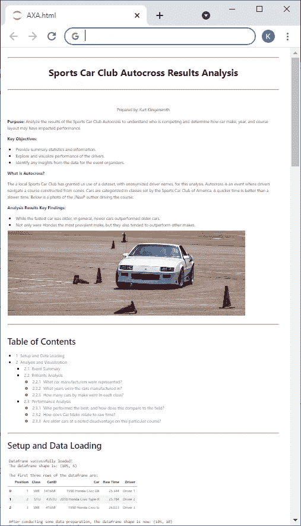
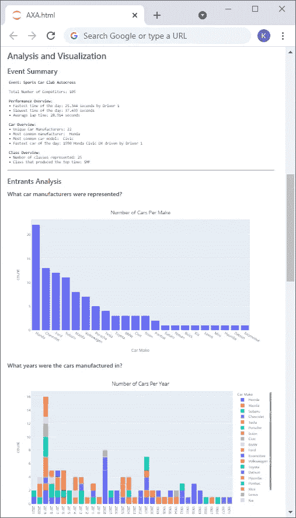
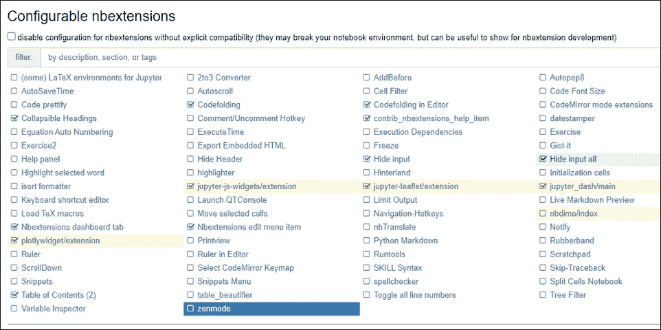
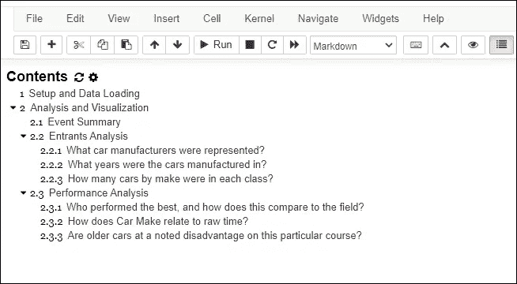
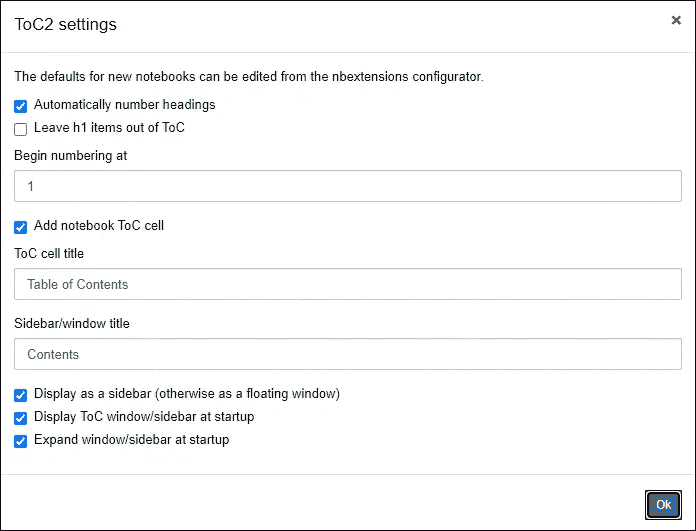
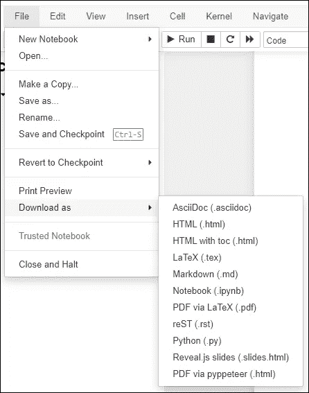

# 作为产品的 Jupyter 笔记本

> 原文：<https://towardsdatascience.com/jupyter-notebook-as-a-product-dc9d1c138e3a?source=collection_archive---------9----------------------->


库尔特和凯瑟琳·克林史密斯的照片。

## 如何为客户将 Jupyter 笔记本格式化、准备和导出为专业的 HTML 产品

一旦数据科学家的分析完成，工作最关键的方面就开始了:向客户交付结果。在这一步，即使是最伟大的工作也可能因为糟糕的演示或不及时的交付而失败。阿金的航天器设计第 20 定律很好地总结了这个难题，它指出[1]:

> 一个糟糕的设计加上一个好的展示最终是注定要失败的。一个好的设计和一个糟糕的展示是注定要失败的。
> 
> — [阿金的航天器设计定律](https://spacecraft.ssl.umd.edu/akins_laws.html)

传统上，产品交付意味着将编码输出转移到其他媒体，如 PowerPoint。但是，如果有一种方法可以将 Python Jupyter 笔记本，包括交互式图表，直接交付给客户呢？输入基于 HTML 的 Jupyter 笔记本作为产品(JNaaP)。

# 作为产品的 Jupyter 笔记本

JNaaP 的概念很简单:构造一个典型的 python Jupyter notebook [2],这样它就可以以一种清晰、可理解的方式为不同技术熟练程度的客户导出 HTML。

JNaaPs 是高度可分发的。几乎现代劳动力中的每个人都可以访问能够打开 HTML 文件的互联网浏览器，从而实现广泛的分发和最小的兼容性问题。

本文将演示如何构建作者创建的 HTML 格式的 JNaaP，这里有完整的存储库和数据:【https://github.com/kurtklingensmith/JNaaP】T2。点击“代码”和“下载 Zip”访问文件。

上述 GitHub 存储库中提供的 JNaaP 使用了本地 autocross 俱乐部提供的匿名数据。Autocross 是一项计时的业余赛车赛事，车手们在由锥形路标构建的赛道上行驶，它会生成大量数据。与在 GitHub 中查看相比，JNaaP 和笔记本在本地下载和查看时效果最佳。



作者提供的 HTML Jupyter 笔记本产品截图。

## JNaaP 的主要考虑因素:

在构建 JNaaP 之前，数据科学家必须解决两个关键问题:

1.  **客户需求:**客户需要通过数据科学功能解决哪些高级需求或问题？这驱动了 JNaaP 的结构。各个部分应该解决每个问题或需求，笔记本应该提供一个摘要。
2.  **客户技术考虑:**客户想要访问代码吗？客户在技术上是否熟练？这推动了最终的演示技巧。创建 JNaaP 需要干净的代码；本质上更具技术性的客户可能希望在最终产品中有可见的代码。对于大多数客户来说，**隐藏 HTML-export 上的代码**是最好的方法，但这不是绝对的。

# 构建 JNaaP

## 要求:

有效的 JNaaP 构造需要广泛使用 nbextensions。这里有一篇关于 nbextensions 入门的文章: [Jupyter 笔记本扩展，作者 Will Koehrsen](/jupyter-notebook-extensions-517fa69d2231)【3】。所提供的[示例 JNaaP](https://github.com/kurtklingensmith/JNaaP) 使用了以下 nbextensions 功能:

*   目录(2)
*   代码折叠
*   隐藏输入
*   隐藏所有输入
*   plotlywidget/扩展



nbextensions 作者截图。

示例 JNaaP 还需要:

*   [nbconvert](https://nbconvert.readthedocs.io/en/latest/) :用于导出【4】。
*   [Plotly Express](https://plotly.com/python/plotly-express/) :用于交互式可视化[5]。

## 设计 JNaaP

从结构上看，JNaaP 应该是独立的。阅读以下典型 JNaaP 元素列表时，在此下载提供的示例[作为参考:](https://github.com/kurtklingensmith/JNaaP)

*   **标题:**标题应该简洁地概括笔记本的内容。考虑添加日期戳、作者和联系信息。使用降价并最大限度地利用降价格式功能。各种降价功能的概要可以在【6】中找到。下面是一个标题降价的例子:

```
**<center><font size = "6">The JNaaP Title<center>**
***
<center><font size = "2">Prepared by: Data Scientist<center>
```

*   **背景:**这应该通过阐述 JNaaP 的目的、关键分析目标以及理解 JNaaP 所必需的任何相关背景信息或故事来做好准备。这还应包括 ***预先的关键发现和结果*** ，这些发现和结果由笔记本中稍后的分析提供支持。如果时间有限，客户应该只需要阅读这一部分，并相信笔记本中进一步的分析会支持调查结果。使用 markdown 来格式化和显示此部分。
*   **目录:**使用 nbextensions，[目录(2)](https://jupyter-contrib-nbextensions.readthedocs.io/en/latest/nbextensions/toc2/README.html)【7】扩展允许读者快速跳转到笔记本的不同部分。



作者目录截图:通过在 nbextensions 中启用目录来添加目录。确保单击了工具栏上的目录按钮。单击“目录”旁边的齿轮，并选中“添加笔记本目录单元格”，以确保目录出现在 JNaaP 中。

*   **数据加载和设置:**这是笔记本加载数据和库的地方。一般来说，这对客户来说用处不大，但是使用 print 语句显示数据帧头和一些汇总维度可以通过显示数据的可视化描述来增加价值。
*   **分析部分:**这是数据科学工作的地方，包括可视化。构建分析，使其从背景和客户需求中解决分析目标。解决这个问题的一个好方法是使用客户分析性问题的标题。请注意，干净的代码和干净显示的表格、结果和代码输出对于有效的 JNaaP 是必要的。明智地使用打印声明、降价和可视化技术，给人一种干净、专业的印象。

## 确保 HTML 中的交互式图表

Plotly Express 提供简单高效的交互式图表，具有干净、专业的外观。交互式方面允许用户放大或缩小图表，甚至生成屏幕截图。确保这些图表导出并在 HTML 文件中保持交互的关键是 hashtag 下面的代码:

```
import plotly.express as px
import plotly.graph_objects as go
import plotly.io as pio
# The below line ensures charts export to HTML
pio.renderers.default='notebook'
```

有了这段代码，交互式图表就可以导出了。下面是所提供的 JNaaP 的一个例子。注意所有轴都有标签，并提供了图例，查看者可以将鼠标悬停在数据点上以获取更多信息。清晰明了的演示对于成功的 JNaaP 至关重要。关于定制 Plotly 图表的更多文档可在[此处](https://plotly.com/python/plotly-express/)【8】获得。

来自所提供的 JNaaP 的示例图表。

## Python 打印的力量

Python 的 print()函数为 markdown 提供了一个强大的替代方案。值得注意的是，通过打印功能可以进行可重复的分析。考虑 JNaaP 示例中的以下内容:

```
mode = df['Car Make'].mode()
print("\u2022 Most common manufacturer:", mode.to_string(index=False))
```

上面的代码将获取 dataframe 并打印一条语句，标识数据集中最常见的汽车制造商。因为它不是 markdown，而是一个 print()函数，使用 python 来标识最常出现的条目，所以该代码可重复用于来自其他事件的未来数据集。

请注意“\u2022”文本，它会生成 unicode 项目符号。与 markdown 类似，Python print()函数有许多格式化的可能性，这将改善 JNaaP 的专业外观。[示例 JNaaP](https://github.com/kurtklingensmith/JNaaP) 提供了一个设置类来打印粗体文本的例子。

# 发布到 HTML 文件

JNaaP 完成后，有几种方法可以将其导出到 HTML。导出前有两个注意事项:

*   **有无代码:**有些客户可能想看代码。其他人可能不会。保持所有代码的整洁，并在客户需要时做好记录。这将增强可解释性，减少 HTML 文件的混乱。
*   **预览 JNaaP:** 通常，大多数客户都不想看到代码。广泛使用 nbextension 的[代码折叠](https://jupyter-contrib-nbextensions.readthedocs.io/en/latest/nbextensions/codefolding/readme.html)【9】和[隐藏输入](https://jupyter-contrib-nbextensions.readthedocs.io/en/latest/nbextensions/hide_input/readme.html)允许在导出之前预览 JNaaP 的外观[10]。这可以通过避免重复导出来节省时间。

一旦确定代码包含完成，有几种方法可以将 JNaaP 导出到 HTML:

**Jupyter Notebook 的内置功能:**如果包含代码，这是创建 JNaaP 最简单的方法。这个方法就像点击文件，下载为，HTML(。html)。然后，Jupyter 会将笔记本作为 HTML 文件下载到浏览器默认的下载文件位置。



作者导出截图。要导出包含代码的 JNaaP，请单击“文件”、“下载为”、HTML(。html)。

**使用 nbconvert 导出:** Nbconvert 提供更多选项。下面的代码块做了几件事:

```
%%capture
!jupyter nbconvert --to html --no-input --no-prompt Notebook.ipynb
```

*   第一行(%%capture)确保不会显示 nbconvert HTML 导出行的输出。
*   最后一行将笔记本导出为 HTML。以 html 指定格式，没有输入，没有提示隐藏代码。行尾应该是正在转换的笔记本的文件名。

HTML 文件导出到 Jupyter 笔记本 ipynb 文件所在的目录。通过向 nbconvert 行添加以下代码，也可以使用深色主题:

```
--HTMLExporter.theme=dark
```

这将需要重新格式化 Plotly 图表配色方案，虽然；运行以下代码可以将 plotly 主题调整为暗:

```
pio.templates.default = "plotly_dark"
```

# 结论

将 Jupyter 笔记本作为基于 HTML 的产品交付，通过将基于代码的分析工作作为最终产品生产的一部分，简化了数据科学工作。它还通过消除从一个工具(Jupyter)到其他工具(如 PowerPoint 或 Word)的翻译工作来减少错误和返工。最后，HTML 文件具有广泛的兼容性，易于传输，使得产品易于交付给客户。最终，结构良好的 JNaaPs 可以提供一种可重复的一体化分析和报告生成的方法。在这种情况下，非数据科学家可以拿一个准备好的 JNaaP 笔记本，执行它，并生成一个可交付的产品。

请随意参考[链接示例](https://github.com/kurtklingensmith/JNaaP)并创建自己的 JNaaPs。

## 参考

[1] D .阿金，[阿金的宇宙飞船设计法则](https://spacecraft.ssl.umd.edu/akins_laws.html) (2021)，戴夫·阿金的网站。

[2]朱庇特项目，[朱庇特项目](https://jupyter.org/) (2021)，https://jupyter.org/。

[3] W. Koehrsen， [Jupyter 笔记本扩展](/jupyter-notebook-extensions-517fa69d2231) (2018)，走向数据科学。

[4] Nbconvert， [nbconvert:将笔记本转换为其他格式](https://nbconvert.readthedocs.io/en/latest/) (2021)，Nbconvert。

[5] Plotly Express，[Plotly Express | Python | Plotly](https://plotly.com/python/plotly-express/)(2021)，Plotly |图形库。

[6] M. Zaman，[终极降价备忘单](/the-ultimate-markdown-cheat-sheet-3d3976b31a0) (2021)，走向数据科学。

[7]jupyter _ contrib _ nb Extensions，[目录(2)](https://jupyter-contrib-nbextensions.readthedocs.io/en/latest/nbextensions/toc2/README.html) (2021)，非官方 Jupyter 笔记本扩展。

[8] Plotly Express，[Plotly Express | Python | Plotly](https://plotly.com/python/plotly-express/)(2021)，Plotly |图形库。

[9]jupyter _ contrib _ nb Extensions， [Codefolding](https://jupyter-contrib-nbextensions.readthedocs.io/en/latest/nbextensions/codefolding/readme.html) (2021)，非官方 Jupyter 笔记本扩展。

[10]jupyter _ contrib _ nb Extensions，[隐藏输入](https://jupyter-contrib-nbextensions.readthedocs.io/en/latest/nbextensions/hide_input/readme.html) (2021)，非官方 Jupyter 笔记本扩展。