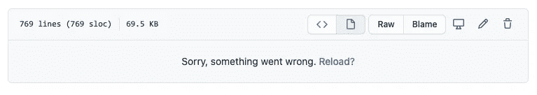
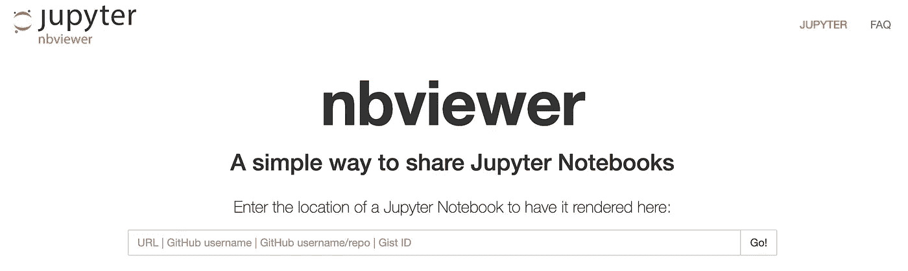
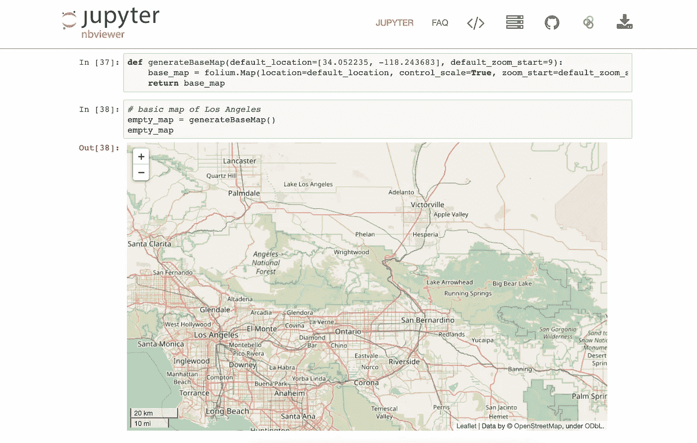

# Jupyter 笔记本不在 GitHub 上渲染？这里有一个简单的解决方案。

> 原文：<https://towardsdatascience.com/jupyter-notebook-not-rendering-on-github-heres-a-simple-solution-e51aa6ca29b6?source=collection_archive---------14----------------------->

## 你可以用这个网站代替！

你有没有尝试过预览你的 Jupyter 笔记本文件，并在等待了大约 20 多秒后收到这个讨厌的错误信息？



大约 70%的时候，我们会看到这条信息。仿佛看你的`.ipynb`文件会不会渲染就是一场赌博。

好消息，这个“对不起，出了点问题。重装？”消息对您的实际提交没有影响。这只是 GitHub 的一个问题，因为它无法呈现文件的预览。

经过大量的研究，似乎在互联网上没有人很确定为什么会出现这个问题。人们推测这可能是文件大小的问题，或者是浏览者使用的浏览器类型的问题。

不管是什么导致了这个问题，不要担心。我有你祈祷的答案！

# 解决方案



[**Nbviewer**](https://nbviewer.jupyter.org/) 是一个 web 应用程序，让你在 GitHub 上输入一个 Jupyter 笔记本文件的 URL，然后它将这个笔记本呈现为一个静态的 HTML 网页。这给了你一个稳定的链接，你可以和其他人分享。

# **其他好处**

除了总是能成功渲染一个 Jupyter 笔记本，它还对用户有其他优势。

在极少数情况下，`.ipynb`文件实际加载到 Github 上时，有时会无法显示某些对象。

例如，GitHub 无法加载 follow 地图。当我们试图生成洛杉矶的地图时，我们得到了这个错误:

```
Output of folium.__version__
```

然而，如果我们使用 nbviewer，完整的交互式地图加载没有问题。自己看吧！



此外，这个网站的功能并不是 Python 独有的，你可以用它来显示包含其他编程语言的文件，比如 Ruby 和 Julia。

总的来说，如果您是团队中唯一的技术专家，并且您需要能够轻松快速地将 Jupyter 笔记本分发给可能没有安装学习环境的同事，那么这是一个很好的解决方案。不幸的是，你仍然不能在私有存储库上共享文件。

所以，下次当你发现自己要等 20 多秒才能在 GitHub 上呈现一个代码文件时，请记住，nbviewer 会让你的生活变得更轻松！