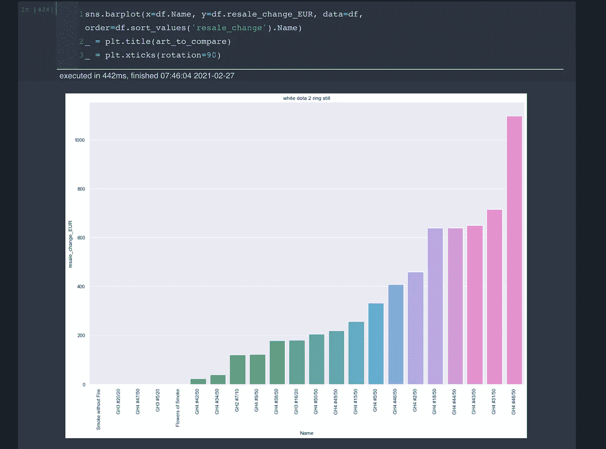
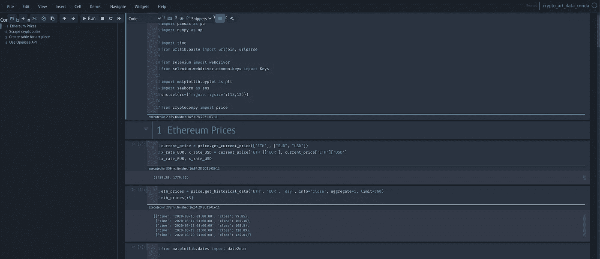
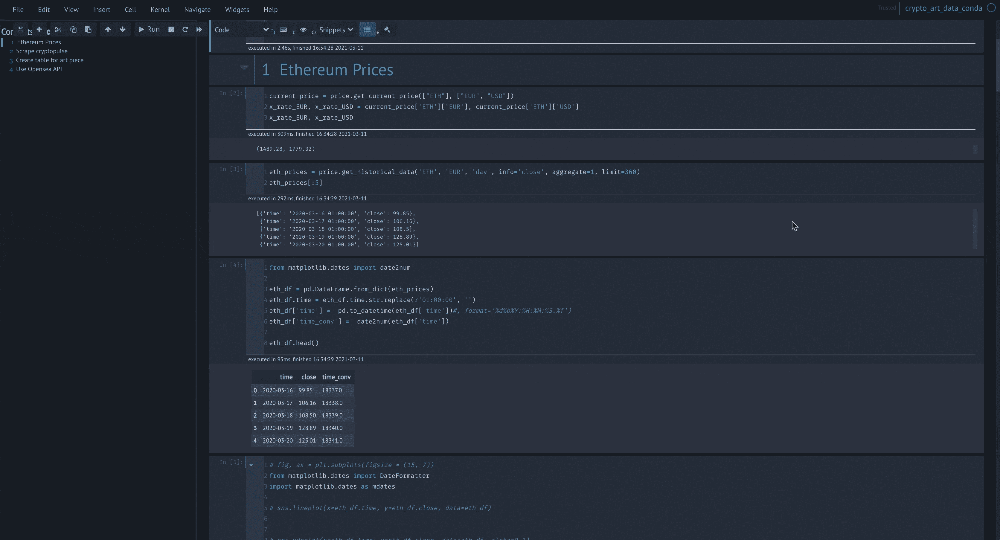
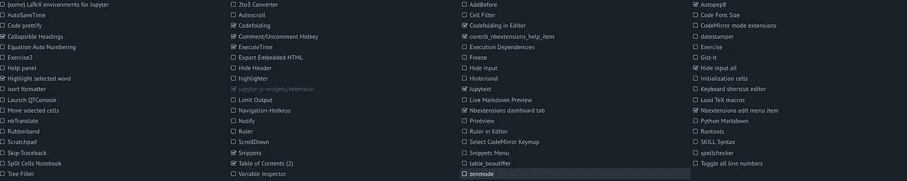
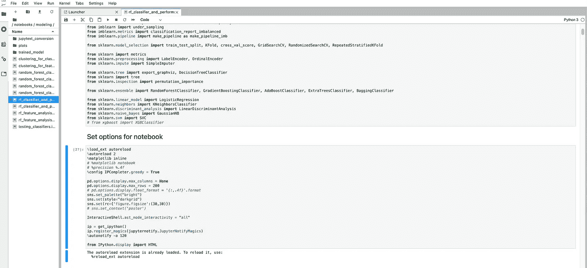
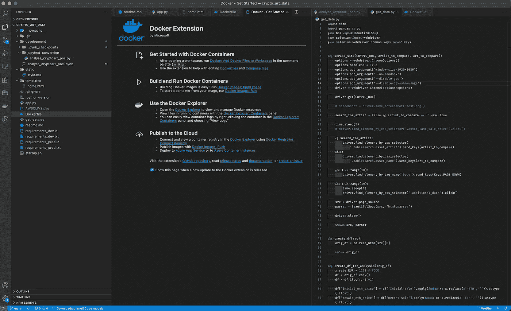

# Jupyter 笔记本还是实验室还是 VS 代码？

> 原文：<https://towardsdatascience.com/jupyter-notebook-or-lab-or-vs-code-b772f8388911?source=collection_archive---------3----------------------->

## 为什么不是全部？


艾通过作者创造艺术。见上[opensea as NFT](https://opensea.io/accounts/createdd?ref=0xc36b01231a8f857b8751431c8011b09130ef92ec)；受到阿曼达·冯【https://unsplash.com/photos/1w2xsyc2wwI 的启发

在过去的几年里，我一直在使用各种 ide 进行 Python 开发。最近，我问自己，检查更新我目前的实践是否有用，看看替代方案是否能提供更好的生产率，这是否有意义。经常会有这样一个问题:一个 IDE 是否比另一个好。在这篇文章中，我想说明最好的方法是为特定的任务使用最好的工具。

# 目录

*   [Jupyter 笔记本还是实验室还是 VS 代码？为什么不是全部？](https://github.com/Createdd/Writing/blob/master/2021/articles/jupyterNbOrLab.md#jupyter-notebook-or-lab-or-vs-code-why-not-all)
*   [目录](https://github.com/Createdd/Writing/blob/master/2021/articles/jupyterNbOrLab.md#table-of-contents)
*   [为什么你不需要决定哪个更好](https://github.com/Createdd/Writing/blob/master/2021/articles/jupyterNbOrLab.md#why-you-dont-need-to-decide-which-is-better)
*   [为什么要 Jupyter 笔记本](https://github.com/Createdd/Writing/blob/master/2021/articles/jupyterNbOrLab.md#why-jupyter-notebook)
*   [为什么选择 Jupyter 实验室](https://github.com/Createdd/Writing/blob/master/2021/articles/jupyterNbOrLab.md#why-jupyter-lab)
*   [为什么 VS 代码](https://github.com/Createdd/Writing/blob/master/2021/articles/jupyterNbOrLab.md#why-vs-code)
*   [免责声明](https://github.com/Createdd/Writing/blob/master/2021/articles/jupyterNbOrLab.md#disclaimer)
*   [关于](https://github.com/Createdd/Writing/blob/master/2021/articles/jupyterNbOrLab.md#about)

# 为什么你不需要决定哪个更好

目前，我混合使用

*   Jupyter 笔记本
*   朱庇特实验室
*   VS 代码

我总是问自己，Jupyter 实验室是否已经发展到可以取代我的 Jupyter 笔记本(NB)工作流程。简而言之答案是否定的，NB 相对于 Lab 还是有很多优势的，我会在下面详细阐述。但是，理解这一点很重要，它不需要被替换。对于他们擅长的任务，你可以很容易地使用他们两个。

因此，我使用:

*   用于开发数据科学概念验证(POC)的 NB
*   Jupyter 实验室用于管理和重新安排我的概念证明
*   VS 与笔记本无关的代码。

本质上，我在一个数据科学项目中不同程度地使用了这三种工具。

# 为什么是 Jupyter 笔记本

我仍然在我的大部分 POC 工作中使用 NB。以下是一些原因:

# 主题化和语法突出显示

使用 jupyterthemes，您可以根据自己的需求轻松调整主题。我用了很多“切斯特主义”主题(`jt -t chesterish -T -N`)，看起来像



切斯特主义主题；作者截图

您可以使用各种 jupyterthemes 标志指定。目前，我将它与`!jt -t chesterish -f fira -fs 10 -nf ptsans -nfs 11 -N -kl -cursw 2 -cursc r -cellw 95% -T`一起使用(你会在其他文章中找到类似的设置)。查看官方[网站](https://github.com/dunovank/jupyter-themes)查看旗帜及其含义的完整列表。该设置如下所示:



风格笔记本；作者截图



笔记本 Overeview 作者 GIF

我更喜欢深色主题，因为我经常在显示器前工作，任何有助于减轻我眼睛疲劳的东西都很受欢迎。

# 笔记本配置

我使用了一些特定的 NB 配置，可能对你也有帮助。

```
%load_ext autoreload
%autoreload 2
%matplotlib inline
%config IPCompleter.greedy = Truepd.options.display.max_columns = None
pd.options.display.max_rows = 200sns.set_palette("bright")
sns.set(style="darkgrid")
sns.set(rc={'figure.figsize':(30,30)})InteractiveShell.ast_node_interactivity = "all"ip = get_ipython()
ip.register_magics(jupyternotify.JupyterNotifyMagics)
%autonotify -a 120
```

*   自动重新加载允许我重新加载导入的。当我计算一个单元格时。由于 Jupyter NB 和 VS 代码文件之间的交互，我需要在两种环境下开发，并希望我的笔记本中的所有内容都是最新的
*   贪婪的 IP completer 允许我列出 python 字典中的所有选项，并通过 tab 键浏览它们，而不是查找每个选项。不过要小心，因为 NB 中有太多大对象可能会降低速度。
*   熊猫(pd)和 seaborn (sns)选项只是我的一个偏好设置。我不希望 pandas 数据帧中的行经常被截断，我也希望 seaborn 数据帧中的行更大
*   节点交互性“all”只是输出所有语句，而不是最后一条语句。这使我不必总是为我的语句键入“print ”,而可以简单地键入变量名。请注意，这也会导致绘制图形的不同行为。
*   最后一个是 jupyternotify。这非常有帮助，因为一些计算需要时间(例如训练模型，或优化超参数)。使用此选项，您可以设置一个计时器，并在计算完成时通知您。当您想在计算过程中处理其他零件时，这非常有用。

# NB 扩展

jupyter NB 有各种[笔记本扩展](https://github.com/ipython-contrib/jupyter_contrib_nbextensions)。以下是我使用的一些:



笔记本扩展；作者截图

*   用于格式化代码并使其更具可读性
*   [隐藏输入](https://jupyter-contrib-nbextensions.readthedocs.io/en/latest/nbextensions/hide_input_all/readme.html)和[可折叠标题](https://jupyter-contrib-nbextensions.readthedocs.io/en/latest/nbextensions/collapsible_headings/readme.html)，用于显示单元格的结果而非代码。并且还关注笔记本中的某些部分。有助于演示
*   [突出显示选中的单词](https://jupyter-contrib-nbextensions.readthedocs.io/en/latest/nbextensions/highlight_selected_word/README.html)，显示我在哪里使用了我想要编辑的相同变量
*   [代码折叠](https://jupyter-contrib-nbextensions.readthedocs.io/en/latest/nbextensions/codefolding/readme.html#)用于细胞中更复杂和更长的功能
*   [目录](https://jupyter-contrib-nbextensions.readthedocs.io/en/latest/nbextensions/toc2/README.html)用于显示笔记本的标题。这对于浏览笔记本并使其更具可读性是绝对必要的。
*   [执行时间](https://jupyter-contrib-nbextensions.readthedocs.io/en/latest/nbextensions/execute_time/readme.html)用于了解执行需要多长时间。在训练和比较 ML 模型和参数优化方面非常有用。
*   最后，[注释热键](https://jupyter-contrib-nbextensions.readthedocs.io/en/latest/nbextensions/comment-uncomment/readme.html)如果你使用不同于英文的键盘布局，这是必须的。我在 macOS 中使用德语键盘，因此代码注释快捷键不起作用。使用 jupyter NB，您可以选择设置不同的热键。这是我至今不使用 jupyter 实验室的一个重要原因。因为您仍然没有这个选项，并且除了手动键入“#”之外，没有其他方法来注释/取消注释代码部分。如果你想要适当有效的编码，这是无法忍受的。

我不使用“腹地”扩展来完成代码。我过去用过，但是性能不好，还拖慢了整个笔记本。

“变量检查器”也是如此。一旦你存储了更多的数据帧或模型，就会降低笔记本的速度，使其无法使用。我花了一段时间才发现这些扩展导致了问题。因此，我不再使用它，如果你的笔记本更大，我建议你不要使用它。

# 为什么是朱庇特实验室

目前，我只使用 Jupyter 实验室进行笔记本整理。我的存储库是用 VS 代码管理的，但有时我需要重新整理笔记本。这不能在 VS 代码中完成，而且用 Jupyter NB 很麻烦。要么我想检查我在类似的笔记本中完成了哪些步骤，要么我想复制某些单元格。此外，在 Juypter Lab 中拆分笔记本要容易得多

*   对您的笔记本电脑有一个很好的概述，
*   在一个选项卡中打开多个笔记本
*   复制并拖动笔记本中的多个单元格



Jupyter 实验室概述:作者截图

# 为什么 VS 代码

对于 Jupyter NB 中没有完成的事情，我使用 VS 代码。我知道 VS 代码支持。ipynb 文件与“笔记本风格”的方法。然而，直到现在，它还没有达到真正的 Jupyter NB 的好处(见上面我的列表)，而且速度也非常慢。装货总是要花很长时间，我已经烦透了。

但是一旦我离开笔记本环境，我就用 VS 代码做所有的事情。我已经用了很多年了，在我看来它仍然是最好的选择。

原因如下:

*   语法突出显示
*   代码完成和建议
*   功能和文件导航
*   扩展和集成(如 Docker、林挺、格式化、测试、代码片段)
*   饭桶



VS 代码概述；作者截图

基本上，在笔记本概念验证之后开发应用程序所需的一切在 VS 代码中都很棒。

如果你使用另一个 IDE(例如 PyCharm)而不是 VS 代码，我认为这也足够了。在我看来，如果你已经用 IDE 开发了一个特定的工作流，并且它工作正常，那么切换就没有太大的意义了。我更喜欢 VS 代码的原因是轻量级和可定制性。它非常直观，易于上手。不需要创建项目什么的。只需添加您需要的扩展并开始编程。你可以想加多少就加多少，也可以保持超级苗条。它还可以支持许多其他语言，这使得它非常适合在大型项目中使用。

# 放弃

我与本文中使用的任何服务都没有关联。

我不认为自己是专家。我不是博主什么的。除了做其他事情，我只是记录事情。因此，这些内容并不代表我任何作品的质量，也不完全反映我对事物的看法。如果你觉得我错过了重要的步骤或者忽略了什么，可以考虑在评论区指出来或者联系我。

我总是乐于听取建设性的意见以及如何改进。

这是 2021 年 3 月 16 日写的。我无法监控我的所有文章。当你阅读这篇文章时，提示很可能已经过时，过程已经改变。

如果你需要更多关于某些部分的信息，请在评论中指出来。

# 关于

丹尼尔是一名艺术家、企业家、软件开发人员和商业法毕业生。他曾在各种 IT 公司、税务咨询、管理咨询和奥地利法院工作。

他的知识和兴趣目前围绕着编程机器学习应用程序及其所有相关方面。从本质上说，他认为自己是复杂环境的问题解决者，这在他的各种项目中都有所体现。

如果您有想法、项目或问题，请不要犹豫与我们联系。


连接到:

*   [Allmylinks](https://allmylinks.com/createdd)

直接:

*   [领英](https://www.linkedin.com/in/createdd)
*   [Github](https://github.com/Createdd)
*   [中等](https://medium.com/@createdd)
*   [推特](https://twitter.com/_createdd)
*   [Instagram](https://www.instagram.com/create.dd/)
*   [createdd.com](https://www.createdd.com/)
*   [课程](https://www.createddseries.com/)