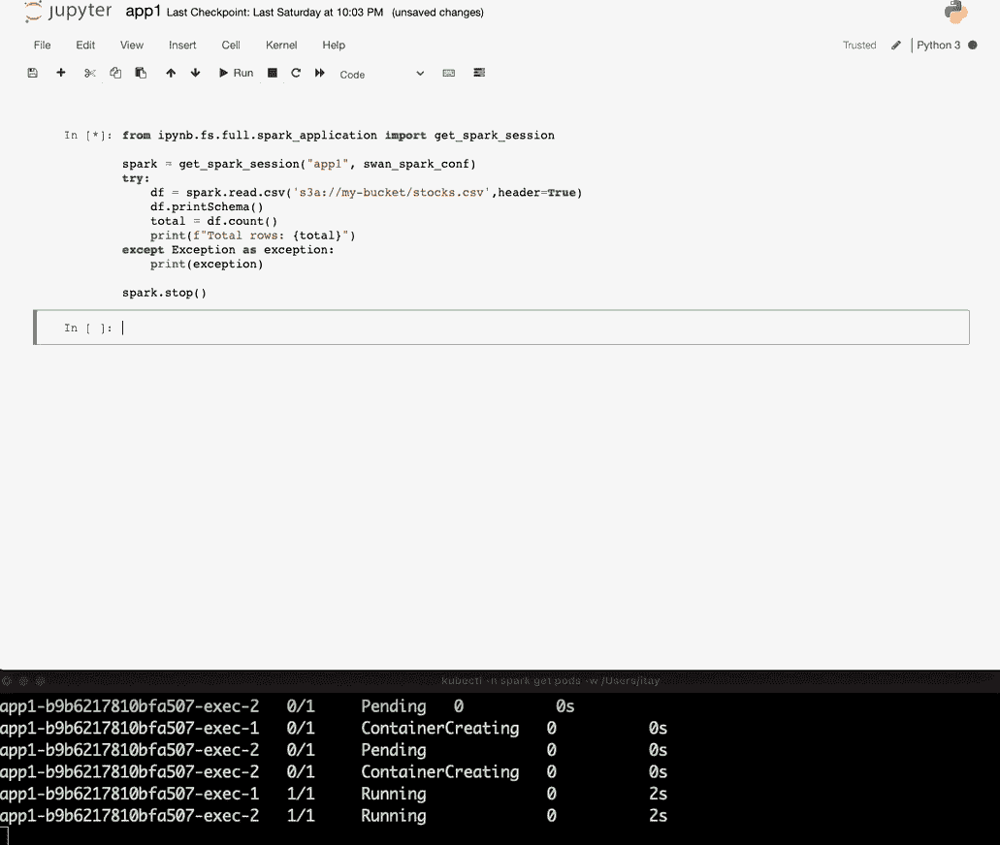
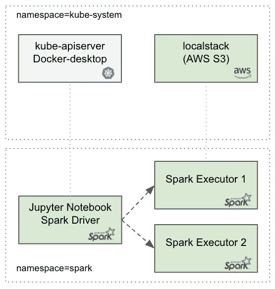
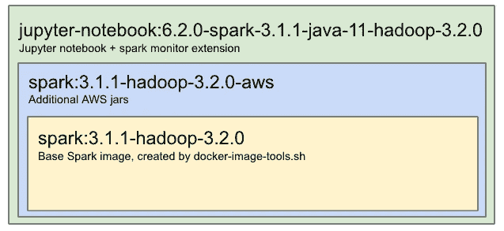

# Jupyter 笔记本& Kubernetes 上的火花

> 原文：<https://towardsdatascience.com/jupyter-notebook-spark-on-kubernetes-880af7e06351?source=collection_archive---------4----------------------->


照片由[飞跃设计](https://unsplash.com/@leap_design?utm_source=medium&utm_medium=referral)在 [Unsplash](https://unsplash.com?utm_source=medium&utm_medium=referral) 上拍摄

## 设置本地环境的完整指南

[Jupyter notebook](https://jupyter.org/) 是一款知名的运行实时代码的 web 工具。Apache Spark 是一个流行的数据处理引擎，Kubernetes 上的 Spark 终于 [GA](https://spark.apache.org/releases/spark-release-3-1-1.html#core-spark-sql-structured-streaming) ！在本教程中，我们将在 Kubernetes 中打开一个 Jupyter 笔记本，并在客户端模式下运行一个 Spark 应用程序。我们还将使用一个很酷的 [sparkmonitor](https://github.com/swan-cern/jupyter-extensions/tree/master/SparkMonitor) 小部件进行可视化。此外，我们的 Spark 应用程序将从 AWS S3 读取一些数据，这些数据将在本地使用 [localstack](https://github.com/localstack/localstack) S3 进行模拟。



正在运行的应用程序(*作者图片*)

# 装置

## 先决条件:

*   git(2 . 30 . 1 版)
*   docker-desktop(3 . 2 . 1 版)和 Kubernetes(1 . 19 . 7 版)
*   AWS-CLI(2 . 1 . 29 版)
*   kubectl (v1.20.4)

## Jupyter 安装:

我们的设置包含两个图像:

1.  Spark 图像—用于旋转 Spark 执行器。
2.  Jupyter 笔记本图像—用于 Jupyter 笔记本和 spark 驱动器。

我已经将这些图像发送到 [docker-hub](https://hub.docker.com/u/itayb) 中，因此您可以通过运行以下命令快速获取它们:

```
docker pull itayb/spark:3.1.1-hadoop-3.2.0-aws
docker pull itayb/jupyter-notebook:6.2.0-spark-3.1.1-java-11-hadoop-3.2.0
```

或者，您可以从头开始构建这些映像，但这有点慢；有关这方面的更多信息，请参见附录。

下面的 YAML 包含了运行 Jupyter 和 Spark 所需的所有 Kubernetes 资源。在本地将以下文件另存为 *jupyter.yaml* :

接下来，我们将为 spark 创建一个新的专用名称空间，安装相关的 Kubernetes 资源并公开 Jupyter 的端口:

```
kubectl create ns spark
kubectl apply -n spark -f jupyter.yaml
kubectl port-forward -n spark service/jupyter 8888:8888
```

请注意，专用名称空间有几个好处:

1.  安全性 Spark 需要创建/删除 pod 等权限。最好将这些权限限制在特定的名称空间。
2.  可观察性——Spark 可能会产生许多 executor pods，因此如果它们被隔离在一个单独的名称空间中，跟踪它们可能会更容易。另一方面，您不希望错过所有这些 executor pods 之间的任何其他应用程序 pod。

就是这样！现在打开你的浏览器，进入 http://127.0.0.1:8888 ，运行我们的第一个 Spark 应用程序。

## 本地堆栈安装:

下面你可以看到在 Kubernetes 中安装 localstack 的 YAML 文件:

在本地将该文件保存为 *localstack.yaml* ，安装 localstack 并通过运行以下命令来暴露端口:

```
kubectl apply -n kube-system -f localstack.yaml
kubectl port-forward -n kube-system service/localstack 4566:4566
```

现在我们有了本地运行的 S3，让我们创建一个桶并在里面添加一些数据:

在本地将该文件保存为 stocks.csv，并使用以下命令将其上传到我们的本地 S3:

```
aws --endpoint-url=[http://localhost:4566](http://localhost:4566) s3 mb s3://my-bucket
aws --endpoint-url=[http://localhost:4566](http://localhost:4566) s3 cp examples/stocks.csv s3://my-bucket/stocks.csv
```



pod/名称空间分布(*作者图片*

# 运行 Spark 应用程序

在 Jupyter 主页上点击“新建”按钮，然后点击 Python3 笔记本。在新笔记本上复制以下代码片段:

然后点击“文件”→“另存为……”，称之为“spark_application”。我们将立即从应用程序笔记本中导入此笔记本。

现在让我们创建我们的 Spark 应用程序笔记本:

现在运行此笔记本，您将看到结果！

# 观察

我希望本教程可以帮助你走向生产。请注意，在进入生产环境之前，需要采取一些措施(特别是在安全性方面)。以下是其中的一些:

1.  应用程序被包装在 try/except 块中，以防应用程序失败，我们希望确保没有执行器继续运行。失败可能会让 Spark 执行器运行，这会消耗冗余资源。
2.  我们使用 AnonymousAWSCredentialsProvider 来访问本地 S3。在生产中，将[身份验证提供者](https://hadoop.apache.org/docs/current/hadoop-aws/tools/hadoop-aws/index.html#Changing_Authentication_Providers)更改为*WebIdentityTokenCredentialsProvider*或*SimpleAWSCredentialsProvider*。
3.  为本地工作添加了以下配置(使用 local stack):*spark . Hadoop . fs . s3a . path . style . access = true**spark . Hadoop . fs . s3a . connection . SSL . enabled = false*
4.  为了简单起见，我们使用 root 用户，但是最佳实践是在生产中使用非 root 用户。
5.  我们在本教程中禁用了 Jupyter-notebook 的身份验证。确保您的笔记本电脑仅暴露在您的 VPN 中，并从 CMD 中移除空令牌。
6.  在生产中，您将需要为 jupyter 和 executors 授予 S3 访问权限。您可以使用通常与 Kubernetes 服务帐户相关联的 IAM 角色和策略。
7.  我们使用持久性卷来保存笔记本。在生产中，您需要将*存储类名:主机路径*更改为 *gp2* (或者您正在使用的任何名称)。

# 附录



Docker 图片层次可视化(*作者*图片)

1.  如果您想在本地构建自己的 spark 基本映像，可以从主 [apache 归档文件](https://archive.apache.org/dist/spark/)下载 Spark，解压缩并运行构建脚本:

```
wget [https://archive.apache.org/dist/spark/spark-3.1.1/spark-3.1.1-bin-hadoop3.2.tgz](https://archive.apache.org/dist/spark/spark-3.1.1/spark-3.1.1-bin-hadoop3.2.tgz)
tar xvzf [spark-3.1.1-bin-hadoop3.2.tgz](https://archive.apache.org/dist/spark/spark-3.1.1/spark-3.1.1-bin-hadoop3.2.tgz)
cd [spark-3.1.1-bin-hadoop3.2](https://archive.apache.org/dist/spark/spark-3.1.1/spark-3.1.1-bin-hadoop3.2.tgz)
./bin/docker-image-tool.sh -u root -r itayb -t 3.1.1-hadoop-3.2.0 -p kubernetes/dockerfiles/spark/bindings/python/Dockerfile build
docker tag itayb/spark-py:3.1.1-hadoop-3.2.0 itayb/spark:3.1.1-hadoop-3.2.0
```

2.要为上面的 spark 基本映像添加 AWS S3 支持，您可以构建以下 docker 文件:

并使用以下命令构建它:

```
docker build -f spark.Dockerfile -t itayb/spark:3.1.1-hadoop-3.2.0-aws .
```

3.构建 Jupyter 笔记本 docker 映像时，您可以使用以下 docker 文件:

并使用以下命令构建它:

```
docker build -f jupyternotebook.Dockerfile -t itayb/jupyter-notebook:6.2.0-spark-3.1.1-java-11-hadoop-3.2.0 .
```

# 摘要

我们在 Kubernetes 应用程序上运行了我们的第一个 Spark，并在本地环境中运行了模拟 AWS S3 (localstack)。我们还使用了一个非常有用的小工具来监控 spark 进程(由 [swan-cern](https://github.com/swan-cern/jupyter-extensions/tree/master/SparkMonitor) )。现在是时候写一些很棒的 ETL 了！

最后但同样重要的是，感谢[阿萨夫·加利亚](https://medium.com/u/e38defa204d7?source=post_page-----880af7e06351--------------------------------)帮助我完成这个项目。