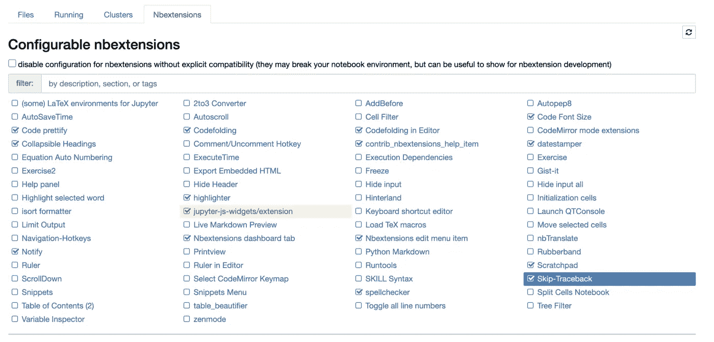

# Jupyter 笔记本 vs PyCharm

> 原文：<https://towardsdatascience.com/jupyter-notebook-vs-pycharm-7301743a378?source=collection_archive---------4----------------------->

## 意见

## 当数据科学家应该使用一个而不是另一个的时候


美国宇航局在 [Unsplash](https://unsplash.com/s/photos/jupiter?utm_source=unsplash&utm_medium=referral&utm_content=creditCopyText) 上拍摄的照片。

# 目录

1.  介绍
2.  Jupyter 笔记本
3.  皮查姆
4.  摘要
5.  参考

# 介绍

作为一名仍在教育环境中学习的数据科学家，你可能会使用一个主要工具，而作为一名专业数据科学家，你可能会专注于*另一个不同的工具*。当然，使用多种工具或平台是有益的，但具体使用哪种工具和平台有时间和地点的限制。许多数据科学家使用的两个有益且重要的工具是 Jupyter Notebook 和 PyCharm。每一个都有其各自的功能，但最终目标可能惊人地相似，那就是组织和执行数据科学过程的代码(*在本文中仅指数据科学*)。话虽如此，我想在下面强调两者的好处以及何时使用其中一个。

# Jupyter 笔记本



NBextensions 选项卡(这是一个非常有用的附加组件)。作者截图[2]。

该工具对于教育机构和专业机构中的数据科学家来说非常有用。使用它的时间通常是在项目开始的时候，在这个时候你的代码不是一成不变的，你关注的是研究而不是最终产品。

当开始一个数据科学项目时，您可以使用 [Jupyter Notebook](https://jupyter.org/) [3】导入数据、分析数据、选择特定功能以及创建新功能、创建模型并进行比较，并在进行过程中可视化大多数步骤。你甚至可以在你的笔记本电脑上完成大部分的端到端数据科学过程，除了一个主要步骤(*然而，有一些平台正在将笔记本电脑与更多的机器学习操作步骤*)相结合，这就是部署，你通常会与另一个平台如 AWS 一起完成。

除了模型部署，您可能希望在我们将在下面讨论的下一个工具中执行这些主要的数据科学步骤，但是当您第一次开始时，我认为在您的笔记本中预处理和训练数据更容易，而不必担心生产部分。

> 为了使这些要点更清楚，下面是你什么时候可以和应该使用 Jupyter 笔记本:

*   样机研究
*   数据摄取
*   探索性数据分析
*   特征工程
*   模型比较
*   最终模型

这些步骤在数据科学的研究步骤中更受欢迎的原因是，它只是更容易-然而，这种说法可能并不适用于每个人，因为它最终取决于偏好。

> 话虽如此，让我们来强调一下 Jupyter 笔记本的优势:

*   自由的
*   简单的启动，只需在你的终端输入`juptyer notebook`
*   可视化显示(*用户界面*
*   文本编辑(*通用代码注释、降价、代码修饰、可折叠标题、荧光笔、拼写检查器、便笺本*
*   SQL 自适应(*用户名/密码/主机/端口/数据库名设置*

# 皮查姆


Chris Ried 在[Unsplash](https://unsplash.com/s/photos/python?utm_source=unsplash&utm_medium=referral&utm_content=creditCopyText)【4】上拍摄的照片。

[py charm](https://www.jetbrains.com/pycharm/)【5】是一个类似的工具，它组织代码并帮助运行数据科学过程。它甚至有 Jupyter 笔记本支持——然而，它只是在付费的专业版本中可用。也就是说，如果你正在使用那个版本，那么很多好处和何时使用也将适用于 PyCharm——然而，我仍然认为将它们分开更容易——因为当它在 py charm 中显示时，UI 变得有点不稳定。因此，假设我们正在使用 PyCharm 的社区版本(*免费版本*)，我们将突出显示该产品，而不是与 Jupyter Notebook 集成的产品。

> 为了更清楚地说明这一点，下面是您可以并且应该使用 PyCharm 的情况:

*   代码编辑
*   用于生产(通常不是研究)
*   代码是长期的(*不像 Jupyter，它专注于试错*)

如您所见，主要区别在于 PyCharm 用于通常是最终产品的代码，而 Jupyter 更多地用于基于研究的编码和可视化。

> 话虽如此，让我们强调一下 PyCharm 的优势:

*   Python 开发
*   Git 集成
*   代码格式
*   PEP-9 风格
*   调试器功能
*   运行脚本
*   单元测试
*   更多的开发人员可能习惯于使用这个工具，所以就整理而言，这个工具在工程部门或角色之间更容易使用

正如您所看到的这些好处，其中许多与数据科学的软件工程方面相吻合，或者只是简单的软件工程。

# 摘要

总而言之，这两种工具对于数据科学家来说都非常有用。有些人可能更喜欢其中一个，当然，这最终取决于你和你工作的公司，或者如果你在学校，或者作为一名专业数据科学家工作。PyCharm 可以从 Jupyter Notebook 中获得很多好处，但是在笔记本中进行快速、反复试验的数据科学研究使这个过程变得容易得多。然而，一旦完成了这一部分，您很可能会转向另一个工具来实现您的最终代码库，其中的代码是 PyCharm。如果你是一名机器学习工程师，那么 PyCharm 可能是你学习的完美工具。

> 总而言之，这两种工具都有一些重要的优点:

```
* Use Jupyter Notebook for protyping and research* Use PyCharm for the final code repository and its respective implementations
```

我希望你觉得我的文章既有趣又有用。如果您同意或不同意这些工具之间的比较，请随时在下面发表评论。为什么或为什么不？你认为还需要指出哪些比较(*或差异*)吗？这些当然可以进一步澄清，但我希望我能够阐明一些共同的相似之处、不同之处，以及何时使用 Jupyter 笔记本或 PyCharm 工具。感谢您的阅读！

*我与这些公司都没有关系。*

*请随时查看我的个人资料、* [Matt Przybyla](https://medium.com/u/abe5272eafd9?source=post_page-----7301743a378--------------------------------) 、*和其他文章，并通过以下链接订阅接收我博客的电子邮件通知，或通过点击屏幕左侧的* *的* ***订阅图标，如果您有任何问题或意见，请在 LinkedIn 上联系我。***

**订阅链接:**[https://datascience2.medium.com/subscribe](https://datascience2.medium.com/subscribe)

# 参考

[1]美国宇航局在 [Unsplash](https://unsplash.com/s/photos/jupiter?utm_source=unsplash&utm_medium=referral&utm_content=creditCopyText) 拍摄的照片，(2021)

[2] M.Przybyla，Jupyter 笔记本截图的 NBextensions 选项卡附件，(2021)

[3]Jupyter 项目， [Jupyter 笔记本主页](https://jupyter.org/)，(2021)

[4]克里斯·里德在 [Unsplash](https://unsplash.com/s/photos/python?utm_source=unsplash&utm_medium=referral&utm_content=creditCopyText) 上拍摄的照片，(2018)

[5] JetBrains s.r.o .， [PyCharm 主页](https://www.jetbrains.com/pycharm/)，(2000–2021)