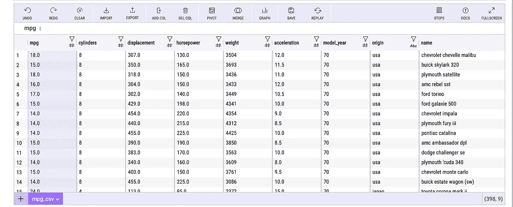
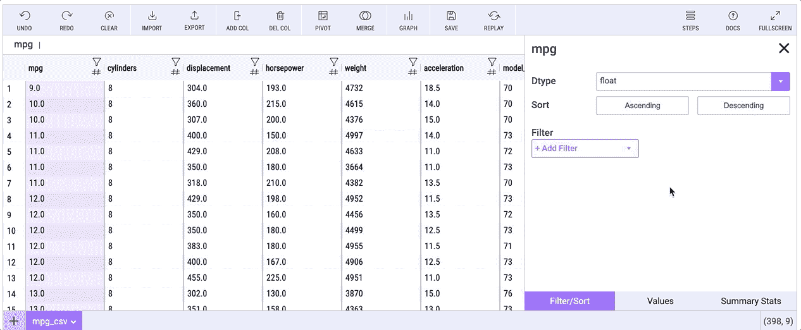
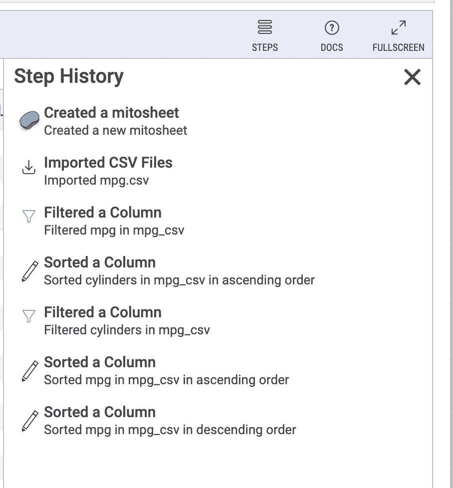
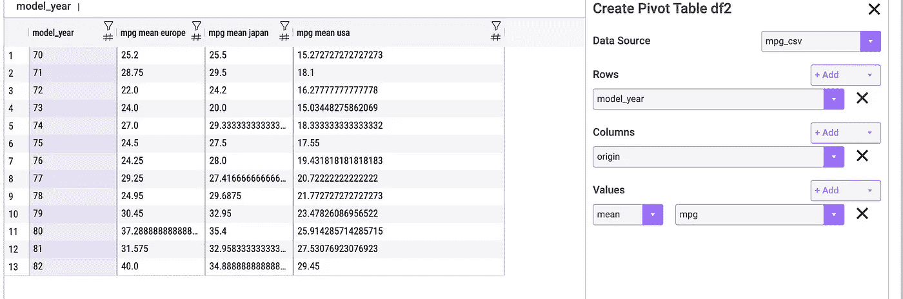
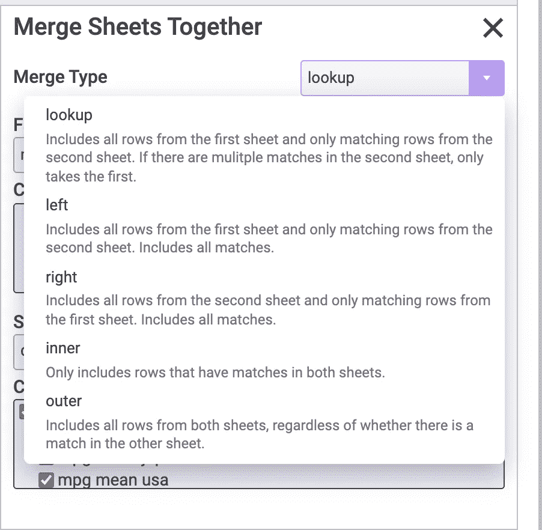
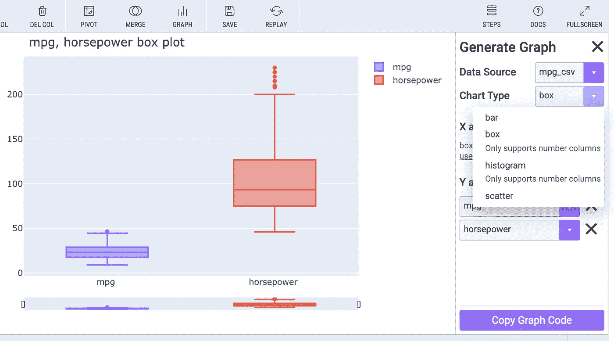
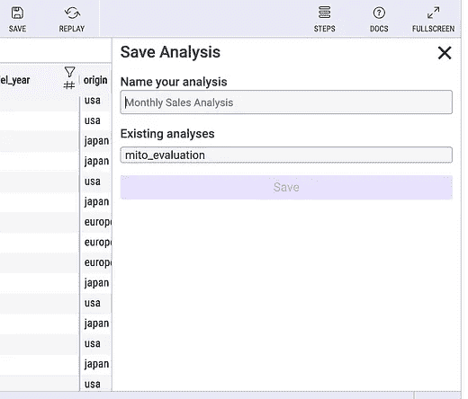
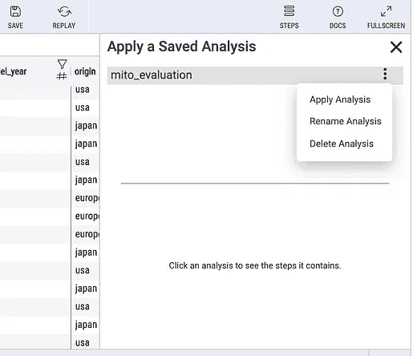
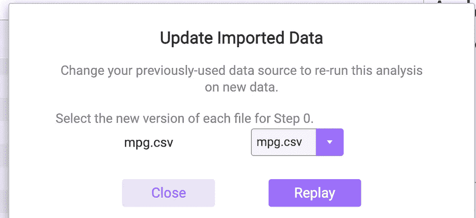

# 没有代码的 Jupyter 笔记本——米托之路

> 原文：<https://towardsdatascience.com/jupyter-notebook-without-code-the-mito-way-3e3b3415d44?source=collection_archive---------7----------------------->

## 有什么好的吗？


由[内达·阿斯塔尼](https://unsplash.com/@nedaastani?utm_source=medium&utm_medium=referral)在 [Unsplash](https://unsplash.com?utm_source=medium&utm_medium=referral) 上拍摄的照片

我使用的第一个综合统计分析软件是 SAS，开始使用 SAS 并不容易，因为它有自己的语法，在我能够使用它做任何事情之前，我必须学习它。当然，在我学会之后，它变得非常方便，因为你可以在你的项目中重用代码。

后来又碰到了 SPSS，另一种常用的统计软件。这个软件基本上是点击式的，你可以在图形用户界面中进行数据处理和分析。一个特别有用的特性是根据您所做的操作自动创建脚本。使用生成的脚本，您可以简单地将其应用于其他类似结构的数据集。

对于初学者来说，学会 SPSS 似乎更容易，因为与用 SAS 编写代码相比，点击更直观，尤其是如果你没有任何编程经验的话。

最后几段是我第一次遇到[美图](https://trymito.io/)时想到的想法，这是一个基于 Jupyter 的工具，它使用点击的方式准备并呈现你的数据。就像 SPSS 一样，它可以根据你所做的操作生成代码。因此，对于代码经验较少的数据科学初学者来说，mito 可能是一个不错的起点。

等一下。美图到底是做什么的？让我们在这篇文章中探索一下。

## 假设

在您进入本教程之前，让我们假设以下事情，以便我们在同一页上。

*   已经在你的电脑上安装了 Python。也请确保你的 Python 版本是 3.6+。在您的终端中，您可以使用`python — version`进行检查。
*   有使用 [Jupyter 笔记本](/4-simple-yet-useful-jupyter-features-you-should-know-14e5a43cf2e6)的经验。为了更好的笔记本体验，请确保您安装了 [jupyter lab](https://jupyter.org/install) 。
*   知道如何设置虚拟环境。conda 是一个很好的工具，参见[我的文章](/8-essential-commands-to-get-started-with-conda-environments-788878afd38e)中的说明。

## 装置

在终端中，输入以下命令安装安装程序。

```
python -m pip install mitoinstaller
```

然后，您可以运行以下命令，使用安装程序安装 mito 库:

```
python -m mitoinstaller install
```

## 在 Jupyter 笔记本中创建工作表

在终端中，激活所需的虚拟环境后，可以通过运行`jupyter lab`启动 jupyter lab。您将看到 jupyter 服务器正在默认的 web 浏览器中运行。

创建一个笔记本，并在单元格中输入以下代码行，这将为您创建一个 mito 表。

```
import mitosheet
mitosheet.sheet()
```

请注意，您必须使用您的电子邮件注册，然后才能继续。然后会提示您选择要导入的文件。对于本教程，让我们使用作为 seaborn 数据集一部分的 [mpg](https://raw.githubusercontent.com/mwaskom/seaborn-data/master/mpg.csv) 数据集。导入后，你会看到下面的表格。有用的一点是数据集的形状显示在底部的右上角。因此，您将对文件的导入是否正确有一个合理的想法。



导入的数据

如你所见，这种床单的整体外观非常干净。就我个人而言，我喜欢这种字体和它的大小，它们很悦目。

## 代码自动生成

如开头所述，mito 能够为您刚刚完成的步骤自动生成代码。因此，在导入数据集后，您将看到一个带有代码的单元格出现在当前单元格的下方。

自动生成用于导入的代码

一切都应该是简单明了的，因为 mito 不仅生成代码，它还注释代码，这样对于那些不熟悉 Python 或 pandas 的人来说就很清楚了。

## 浏览数据

你能做的第一件事是探索你的数据。特别是，您可以快速查看数据的列。



数据查看器

如上面的动画图像所示，选择列后，将显示数据资源管理器。有三个选项卡。

*   **过滤/排序**:您可以通过指定一系列标准来过滤您的数据，并且您可以根据需要对数据进行排序。
*   **Value** :显示频率表，这样你就可以知道有哪些可用的值以及它们的频率。
*   **汇总统计数据**:直方图非常方便，因为它提供了数据分布的直观概览。接下来，您将看到摘要

在动画中，您可能会注意到我们使用`mpg`列对数据进行排序。该操作产生了额外的代码行，这些代码行说明了这些操作并被添加到单元中。

## 操作步骤

到目前为止，我们已经完成了操作数据集的几个步骤。一个有用的方法是通过点击右边的“步骤”按钮来查看步骤。下图将展示这些步骤。



步骤历史

美图的一个有用的特点是，你可以很容易地清除这些步骤和撤销/重做你的步骤。正如你所注意到的，在顶部有不同的按钮:撤销、重做和清除。例如，如果您单击“清除”，您会看到我们已经完成的步骤将从历史记录中删除。如果您只想撤消几个步骤，也可以单独删除前面的步骤。

## 数据透视表

对于许多初学者来说，在 Pandas 中创建数据透视表不是最简单的，因为参数不是太清楚。幸运的是，使用美图似乎更容易——下面的截图向您展示了这样的操作。



如你所见，美图使用的术语与熊猫不同。本质上，它使用行和列来表示创建的数据透视表，这样您可以首先可视化您的数据透视表，然后指定所需的数据。下面的代码片段向您展示了相应的 Python 代码。你可以看出用美图的方法更直观。

```
pivot_table = tmp_df.pivot_table(
    index=['model_year'],
    columns=['origin'],
    values=['mpg'],
    aggfunc={'mpg': ['mean']}
)
```

## 合并表格

也可以通过点击“合并”按钮，直观地将数据帧与美图合并。在菜单中，您可以指定要合并的表格。支持常见的合并类型，如下图所示。



指定这两个表后，可以指定它们合并的键。但是，我注意到这里有一个限制，因为您只能为每个表指定一个键。如果我没有弄错的话，如果你想使用多个键，它现在似乎不支持这个功能。

## 创建图表

您也可以使用 mito 创建图形，尽管现在支持的图形看起来很有限。



图表

正如你所看到的，你现在只能用美图创建柱状图、柱状图和散点图。与前面步骤不同的一点是，创建图形的代码不会自动包含在单元格中。为了方便您，我已经为您复制了代码。

```
# Import plotly and create a figure
import plotly.graph_objects as go
fig = go.Figure()# Add box plots to the graph
for column_header in ['mpg', 'horsepower']:
    fig.add_trace(go.Box(y=mpg_csv[column_header], name=column_header))# Update the title and stacking mode of the graph
# See Plotly documentation for customizations: [https://plotly.com/python/reference/box/](https://plotly.com/python/reference/box/)
fig.update_layout(
    title='mpg, horsepower box plot',
    barmode='stack'
)
fig.show(renderer="iframe")
```

如你所见，美图使用 [plotly](https://plotly.com/) 作为其绘图后端。

## 保存分析并重放

在许多情况下，我们需要重复我们的处理步骤。米托也使之成为可能。您只需点击顶部的“保存”按钮即可保存您的分析。当您需要使用不同的数据集重新运行分析时，只需单击“REPLAY ”,即可开始重新进行分析。



## 最后的想法

除了上述操作之外，您还可以添加和删除列，这对于您来说应该非常简单，不用我向您展示这些操作。差不多就是对这个美图工具的回顾了。

在我看来，美图库似乎是一个仍在开发中的成长工具。开发人员似乎很勤奋，并且正在努力为那些不太懂编码的人制作一个更好的工具。也就是说，它可能对那些不熟悉 Python 或 Pandas 的人有用。然而，我怀疑这个工具的长期使用，因为到目前为止，所有这些操作都不需要复杂的编码技能。换句话说，mito 正试图解决一些不太难编码的问题，因此大多数人可以学习编码来解决这些问题，而无需大量的时间投入。

与此相关，美图团队的开发人员可能会考虑的另一件事是，如果用户已经知道安装 Python 和 Jupyter Notebook，他们可能对 Python 和 Pandas 编程相对熟悉。有了这种水平的编码技能，他们应该已经熟悉了美图在这个阶段必须提供的操作。换句话说，美图的目标受众似乎并不明确。

尽管如此，我很感激开发人员做出了巨大的努力，将这个 GUI 工具放在一起，以推进数据科学领域。

感谢阅读这篇文章。通过[注册我的简讯](https://medium.com/subscribe/@yong.cui01)保持联系。还不是中等会员？[用我的会员链接](https://medium.com/@yong.cui01/membership)支持我的写作。