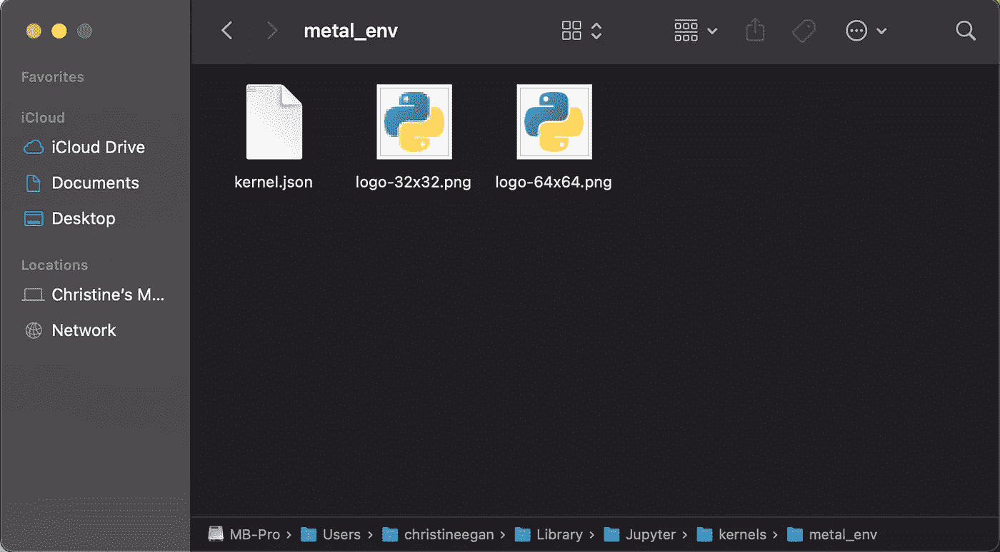
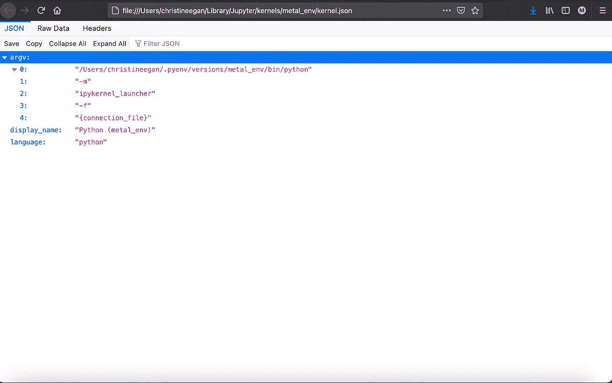
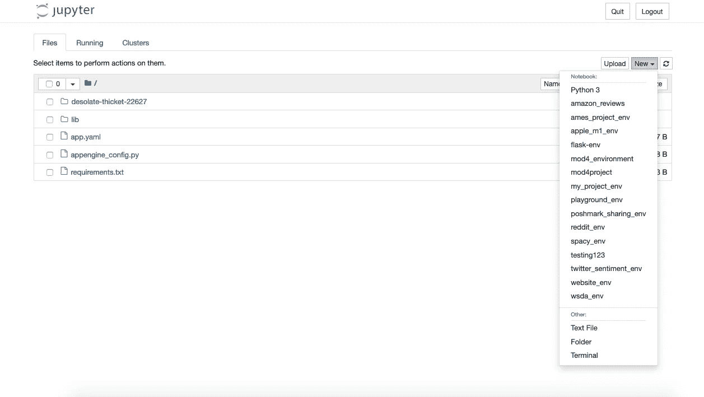

# 在 Python 数据科学项目的虚拟环境中使用 Jupyter Notebook

> 原文：<https://towardsdatascience.com/jupyter-notebooks-i-getting-started-with-jupyter-notebooks-f529449797d2?source=collection_archive---------6----------------------->

## 了解如何安装 kernelspec 来访问 Jupyter Notebook 中的 Python 数据科学虚拟环境


图片由来自 [Pixabay](https://pixabay.com/?utm_source=link-attribution&utm_medium=referral&utm_campaign=image&utm_content=912219) 的 [Reimund Bertrams](https://pixabay.com/users/8385-8385/?utm_source=link-attribution&utm_medium=referral&utm_campaign=image&utm_content=912219) 拍摄

在[为 Python 数据科学项目](/virtual-environments-for-python-data-science-projects-on-mac-os-big-sur-with-pyenv-and-virtualenv-60db5516bf06)创建虚拟环境中，我解释了如何安装 [Pyenv](https://github.com/pyenv/pyenv) 和 [Virtualenv](https://virtualenv.pypa.io/en/latest/) 来管理 mac OS Big Sur 上的 Python 版本和虚拟环境。

有了这个脚手架，下一步将是创建一个项目目录，激活一个新环境，并安装一些流行的数据科学包，如 [Pandas](https://pandas.pydata.org/) 、 [Matplotlib](https://matplotlib.org/) 、 [Seaborn](https://seaborn.pydata.org/) 和 [Jupyter](https://jupyter.org/) 。然后，我们将安装一个 kernelspec，这样这些库就可以在 Jupyter Notebook 中使用了。

## I .使用 Pyenv 和 Virtualenv 创建并激活虚拟环境

首先，我们需要安装所需的 Python 版本。即使 Python 已经安装在您的计算机的多个位置，Pyenv 也需要您的项目将使用的版本的它自己的副本。除非您有理由使用旧版本，否则最新的稳定版本是一个很好的起点。

```
% pyenv install 3.9.1
```

将来，如果您想在另一个环境中使用 Python 3.9.1，就不需要重新安装了。您只需要安装一次 Python 的每个版本就可以使用它。

现在 Pyenv 已经有了您想要使用的 Python 版本的副本，您可以创建一个虚拟环境并将其分配给该版本。

```
% pyenv virtualenv 3.9.1 project_env
```

语法如下:

```
% pyenv virtualenv [python version] [environment name]
```

接下来，您的项目将需要一个目录。您可以通过输入以下内容来创建一个:

```
% mkdir project_dir
```

输入您的目录:

```
% cd project_dir
```

然后，将虚拟环境指定为该目录的本地环境。现在，只要您进入项目目录，环境就会打开:

```
% pyenv local project_env
```

如果您希望在其他地方激活该环境，可以在终端中输入该目录并使用:

```
% pyenv activate project_env
```

## 二。用 Pip 安装 Pandas，Jupyter，Matplotlib，Seaborn 等流行的数据科学包

下一个任务是将带有 Pip 的流行数据科学包安装到我们的虚拟环境中。这一步非常重要，因为只有安装到环境中的特定软件包版本才能在该环境中运行。每次创建新环境时，您都必须安装所需的所有软件包，即使它们已经安装到另一个环境中。

目前，我们正在安装:

*   熊猫——这样我们就可以操纵数据
*   **Jupyter** 、**笔记本**和**Ipykernel**——这样我们就可以使用 Jupyter 笔记本来编写、执行和注释代码
*   **Matplotlib** 和 **Seaborn** 用于数据可视化。

在您的项目目录中，您可以使用 Pip 开始安装:

```
% pip install pandas jupyter notebook ipykernal matplotlib seaborn
```

现在，您将能够在这个环境中使用这些包。

## **三。创建一个 kernelspec，开始在 Jupyter 笔记本上使用虚拟环境**

[Jupyter 笔记本](https://jupyter.org/)是一个交互式环境，你可以在其中编写和执行 Python 代码，还可以添加 markdown 单元格来解释你的方法和代码。我们将使用 [Ipykernel](https://ipython.readthedocs.io/en/stable/index.html) 将我们的虚拟环境链接到 Jupyter，这样我们就可以在笔记本中轻松使用该环境。

一个 **kernelspec** 是一个在**~/Library/Jupyter/kernels**目录下的 JSON 文件，当你安装 Jupyter 的时候就已经安装好了。在内核目录中有一个文件夹，用于您已经安装的每个虚拟环境。每个文件夹里面都有 **kernel.json** 。



在~/资源库/Jupyter /kernels 文件夹中

如果你打开它，它看起来像这样:



由 Ipykernel 创建的 Python 虚拟环境的 kernelspec JSON 文件

要为您的虚拟环境创建 kernelspec，请在项目文件夹中输入以下内容，并确保在执行此操作时环境已被激活:

```
% python -m ipykernel install --user --name myenv --display-name "Python (myenv)"
```

**我们来分解一下语法:**

*   **python:** 表示该命令应该由 python 执行
*   **-m** :表示将模块作为程序运行的选项
*   **ipykernel:** 要运行的模块
*   **安装**:指示 ipykernel
*   **—用户**:表示应该安装在当前用户的目录下
*   **—命名我的项目环境**:指定“我的项目环境”作为 kernelspec 目录的名称
*   **—display-name“Python(myenv)”**:指定将在 Jupyter 中显示的名称，以表示环境。

如果这个计划有效，终端应该显示如下内容:

```
Installed kernelspec my_project_env in /Users/myusername/Library/Jupyter/kernels/my_project_env
```

## **四世。推出 Jupyter 笔记本**

安装您的 kernelspec 后，我们可以打开 Jupyter 笔记本并使用我们的新环境。

```
% jupyter notebook
```

这是一款 Jupyter 笔记本电脑。您的项目目录将显示在浏览器中。在右上角，您会看到一个下拉菜单，上面写着“新建”。单击按钮并选择下拉列表，查看安装了 kernelspec 的虚拟环境列表。单击新环境的显示名称，打开一个新笔记本。



Jupyter 笔记本目录

让我们测试一下笔记本电脑，并通过尝试将它们导入到我们的笔记本电脑来确保我们的初步软件包安装成功。

在第一个单元格中键入 import 语句，导入所选环境中可用的任何包，以便在笔记本中使用。

```
import pandas
```

如果笔记本没有输出错误信息，说明安装已经成功！现在你可以开始为你的项目编码了。如果你确实得到了一个错误信息，我建议仔细阅读本系列的[第一篇](https://christineegan42.medium.com/general-setup-for-data-science-projects-in-python-with-macos-big-sur-65784fc20231)和[第二篇](/virtual-environments-for-python-data-science-projects-on-mac-os-big-sur-with-pyenv-and-virtualenv-60db5516bf06)教程，以确保你没有错过任何一个步骤。

## v .我们做了什么？

1.创建了一个新的虚拟环境，当我们用 Pyenv 和 Virtualenv 打开我们的项目目录时，它就会激活。
2。安装了流行的数据科学软件包 Pandas、Jupyter、Notebook、Ipykernel、Matplotlib 和 Seaborn。
3。为 Ipykernel 生成了一个 kernelspec，将我们的环境与笔记本电脑联系起来。
4。使用终端在浏览器中打开一个 Jupyter 笔记本目录。

5.创建了一个将使用我们新的虚拟环境的新笔记本。

6.学习了导入熊猫和检查安装的 import 语句。

## 👩🏻‍💻关于作者

你好。我是克里斯汀。拥有语言学学位并对自然语言处理感兴趣的数据科学家。

## 💡要更多地了解我的工作…

📅[一天中的数据](https://christineegan42.medium.com/data-in-a-day-complete-your-first-data-science-project-with-python-in-just-one-day-2e4202fb0ae6)
📰christineegan42.medium.com/
📫如何联系我:
📧[christineegan42@gmail.com](mailto:christineegan42@gmail.com)