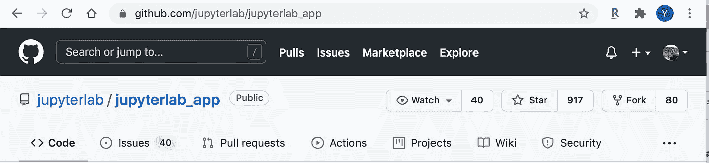
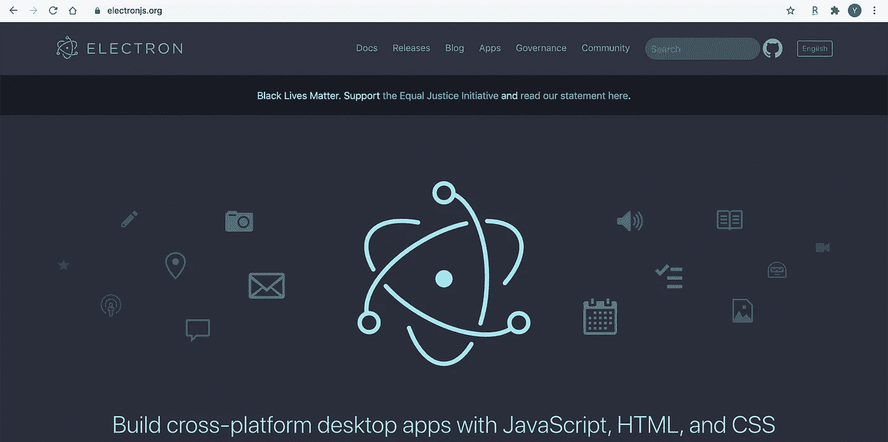
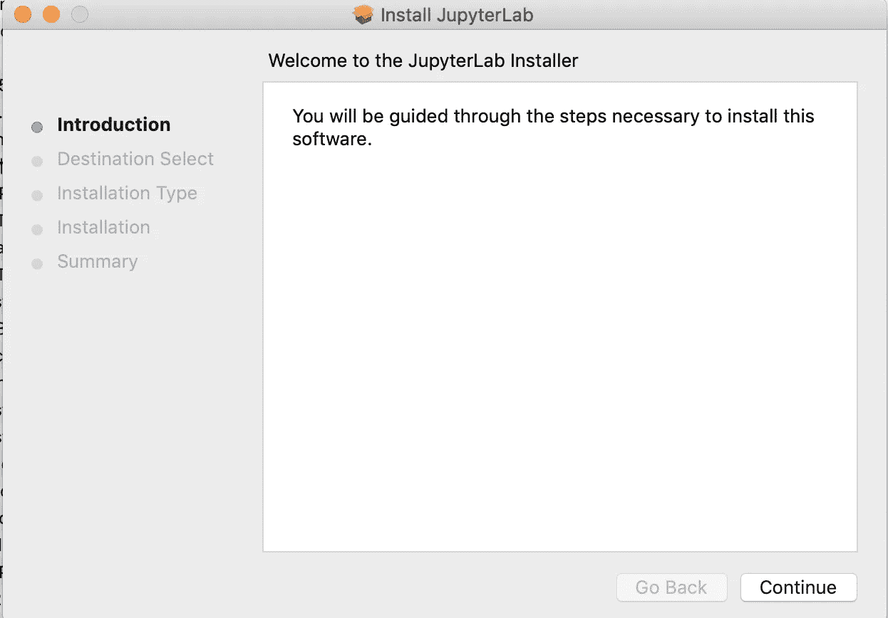
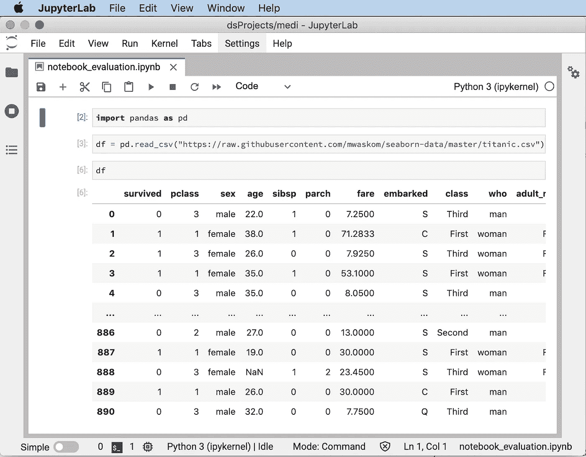

# JupyterLab 桌面应用——笔记本使用的游戏改变者？可能不会

> 原文：<https://towardsdatascience.com/jupyterlab-desktop-app-a-game-changer-for-using-notebooks-probably-not-e6918b4d54a1?source=collection_archive---------2----------------------->

## 意见

## 让我们试一试

多梅尼科·洛亚在 [Unsplash](https://unsplash.com?utm_source=medium&utm_medium=referral) 上拍摄的照片

尽管主要的 python IDEs(例如， [Visual Studio Code](/getting-started-with-jupyter-notebooks-in-visual-studio-code-5dcccb3f739b) 、PyCharm 以及最近的 [DataSpell](/will-you-switch-from-pycharm-to-dataspell-the-latest-data-science-ide-from-jetbrains-ab2a0ef70504) )都支持编辑 Jupyter 笔记本，但当我在数据科学项目中使用笔记本时，JupyterLab 仍然是我的首选 IDE。作为一个交互式 IDE，JupyterLab 允许我们在基于单元的组织中一步一步地可视化数据(例如，表格数据、图像)。

当我们使用 JupyterLab 时，有几种方法可以启动它——使用终端或者使用 Anaconda Navigator 应用程序。无论哪种情况，你都必须启动另一个应用程序才能运行 JupyterLab。虽然没什么大不了的，但是多出来的一步在某种程度上代表了不便。为了解决这个问题，JupyterLab 团队一直在努力让它变得更好。

大约不到一周前，在 Jupyter 的博客中，他们宣布了 JupyterLab 桌面应用的发布。下面为感兴趣的用户提供了博客文章的链接。

 [## JupyterLab 桌面应用程序现已推出！

### 我们很高兴地宣布 JupyterLab 桌面应用程序的发布！

blog.jupyter.org](https://blog.jupyter.org/jupyterlab-desktop-app-now-available-b8b661b17e9a) 

这个库很快变得流行起来，在 GitHub[上已经获得了 900 多颗星。](https://github.com/jupyterlab/jupyterlab_app)

需要注意的是，Jupyter 的网页上没有下载链接。相反，它可以在 GitHub 页面上找到。JupyterLab 开发团队做出了明智的选择，使用 [electron](https://www.electronjs.org/) 构建桌面应用程序，因为 electron 允许程序员使用 web 开发语言开发跨平台的桌面应用程序，包括 JavaScript、HTML 和 CSS。

使用电子作为构建前端的工具，因此 JupyterLab 桌面应用程序是一个跨平台的独立 IDE。主要操作系统的安装程序都可以在 GitHub 页面上找到。

*   **Windows**:[Windows Installer](https://github.com/jupyterlab/jupyterlab_app/releases/latest/download/JupyterLab-Setup-Windows.exe)
*   **Mac** : [macOS 安装程序](https://github.com/jupyterlab/jupyterlab_app/releases/latest/download/JupyterLab-Setup-macOS.pkg)
*   **Linux** : [Debian，Ubuntu Linux 安装程序](https://github.com/jupyterlab/jupyterlab_app/releases/latest/download/JupyterLab-Setup-Debian.deb) & [红帽，Fedora，SUSE Linux 安装程序](https://github.com/jupyterlab/jupyterlab_app/releases/latest/download/JupyterLab-Setup-Fedora.rpm)

为了尝试一下，我在我的 MacBook 笔记本电脑上下载了 macOS 安装程序。安装是没有痛苦的，你只需要按照提示，将应用程序安装在所需的目的地。

需要注意的是，你需要在电脑上安装 conda，因为 JupyterLab 桌面 App 需要 [conda 环境](/8-essential-commands-to-get-started-with-conda-environments-788878afd38e)作为其服务器相关管理。因为我的电脑作为我的数据科学工作站已经有一段时间了，它已经完成了 conda 相关的设置。因此，我启动了桌面应用程序，它运行得非常流畅。

JupyterLab 桌面应用程序

如你所见，它的用户界面和你在网络浏览器上看到的一样。因此，如果您熟悉 JupyterLab web 界面，您很快就可以开始使用相同级别的用户体验编辑笔记本。

就应用程序的菜单而言，它只提供了任何 Mac 应用程序都必须提供的最少命令，因此，开发团队有很大的空间为应用程序添加功能。当然，这也需要他们做额外的工作来完成，因为 JupyterLab 桌面应用程序就像一个 UI 包装器，充当 JupyterLab 的容器。因此，我敢打赌，他们仍将专注于核心的 JupyterLab 开发，我怀疑他们会在桌面应用程序提供的基础上做更多的改进。

## 最后的想法

无论如何，对于有经验的 JupyterLab 用户来说，这不会是一个太大的游戏改变者。它所能做的可能是通过允许你直接启动 JupyterLab 来为你节省一个步骤。

然而，对于 JupyterLab 初学者或数据科学初学者来说，我怀疑它是否会非常有吸引力，因为他们必须分别安装桌面应用程序和 conda 才能使其工作。他们为什么不干脆去安装 Anaconda？它将负责 conda 环境，Anaconda Navigator 为您提供了非常方便地安装和运行 JupyterLab 的快捷方式。

感谢阅读这篇文章。通过[注册我的简讯](https://medium.com/subscribe/@yong.cui01)保持联系。还不是中等会员？使用我的会员链接，通过[支持我的写作。](https://medium.com/@yong.cui01/membership)