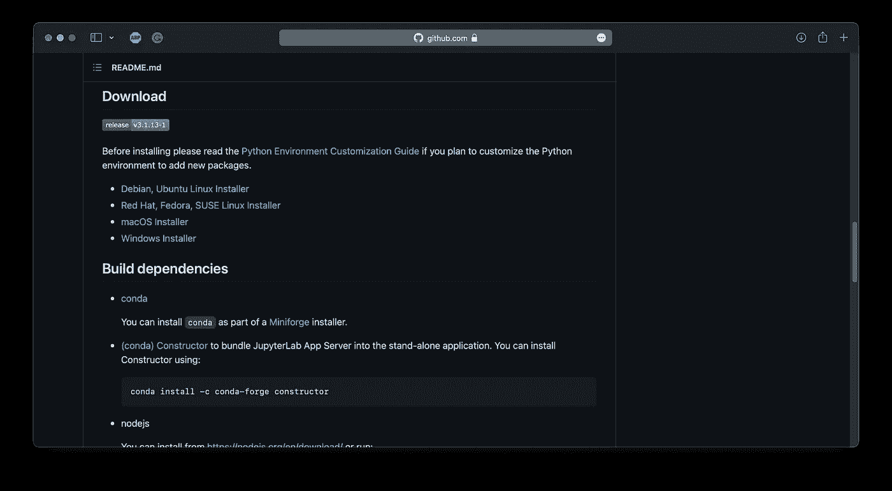

# JupyterLab 现在是一个桌面应用程序。你应该关心吗？

> 原文：<https://towardsdatascience.com/jupyterlab-is-now-available-as-a-desktop-app-should-you-care-f29e214924f1?source=collection_archive---------2----------------------->

## 它比浏览器版本有优势吗？实践安装指南和审查。


由[布鲁克·卡吉尔](https://unsplash.com/@brookecagle?utm_source=unsplash&utm_medium=referral&utm_content=creditCopyText)在 [Unsplash](https://unsplash.com/s/photos/guy-laptop?utm_source=unsplash&utm_medium=referral&utm_content=creditCopyText) 拍摄

最受欢迎的数据科学 IDE 刚刚变得更好。谢天谢地，通过终端启动 JupyterLab 的日子已经过去了，因为桌面版[已经在几周前发布了。是的，你没看错——你现在可以在任何操作系统上安装 JupyterLab 作为桌面应用程序。本文将向您展示如何做到这一点。](https://blog.jupyter.org/jupyterlab-desktop-app-now-available-b8b661b17e9a)

不想看书？请观看六分钟的视频:

# 如何安装 JupyterLab 桌面？

不，您不需要下载源代码并构建它——但是如果您愿意，您可以这样做。作者在他们的 [GitHub 页面](https://github.com/jupyterlab/jupyterlab_app)上放置了安装程序的链接，所以下载与您的操作系统匹配的文件:



图 1 —下载 JupyterLab 应用程序(图片由作者提供)

例如，点击 *macOS 安装程序*会下载一个*。pkg* 文件， *Windows Installer* 会下载*。exe* 等等。

安装非常简单。在 Mac 上，你必须点击几次*继续*。我想这个过程在 Windows 上是一样的，Linux 版本可以通过终端安装。

一旦安装，你会发现 JupyterLab 列在您的应用程序。一旦打开，就会弹出一个熟悉的界面:


图 2 — JupyterLab 桌面界面(图片由作者提供)

这就是你所要做的——JupyterLab 应用程序现已安装。

# JupyterLab 桌面—您能做什么？

桌面应用程序的界面与浏览器完全相同。创建笔记本后，您可以使用 Markdown 功能——选择一个单元格，然后依次按 ESC、M 和 Enter 键:

```
# Heading 1 
- List item 1
- List item 2

**This is bolded**.

$$ \Large c = \sqrt{a^2 + b^2} $$
```


图 3 — JupyterLab 桌面(1)(图片由作者提供)

您可以运行 Python 代码并使用任何已安装的库。例如，下面是如何创建一个 Numpy 数组:


图片 4 — JupyterLab 桌面(2)(图片由作者提供)

你也可以改变内核。假设您有一个用于特定项目的专用虚拟环境，您可以通过单击屏幕底部的内核选项来访问它:


图片 5 — JupyterLab 桌面(3)(图片由作者提供)

从那里，只需选择您想要的环境。我的一个叫`env_tensorflow`，我就选中它，尝试导入 TensorFlow:


图片 6 — JupyterLab 桌面(4)(图片由作者提供)

如您所见，更改环境会重启运行时。首先选择正确的环境，然后运行代码总是一个好主意。这将为您节省大量时间，尤其是在处理大型数据集时。

简而言之，这就是 JupyterLab 桌面。问题是，你应该使用它吗？毕竟和基于浏览器的版本一模一样。

# 判决

我认为你可能会选择桌面版的两个原因是:

*   **一般来说，你更喜欢专用的桌面应用**——浏览浏览器标签很快就会变得一团糟。没有人需要在你需要的时候找不到的标签。
*   **你经常不小心关闭浏览器**——这正是我的遭遇。在 Mac 上，你可以通过按 CMD+C 来关闭任何选定的应用程序。通常，我会在屏幕的左侧显示在 Safari 中运行的 JupyterLab，而在右侧显示类似 Stack Overflow 的内容。按下 CMD+C 将关闭这两个，即使你只选择了正确的一个。它超级烦人，发生的次数比我想承认的还要多。

除此之外，桌面版与基于浏览器的版本相比没有优势。

你们觉得怎么样？您会安装 JupyterLab 桌面应用程序还是对 web 实例感到满意？请在下面的评论区告诉我。

*喜欢这篇文章吗？成为* [*中等会员*](https://medium.com/@radecicdario/membership) *继续无限制学习。如果你使用下面的链接，我会收到你的一部分会员费，不需要你额外付费。*

<https://medium.com/@radecicdario/membership>  

# 保持联系

*   注册我的[简讯](https://mailchi.mp/46a3d2989d9b/bdssubscribe)
*   订阅 [YouTube](https://www.youtube.com/c/BetterDataScience)
*   在 LinkedIn 上连接