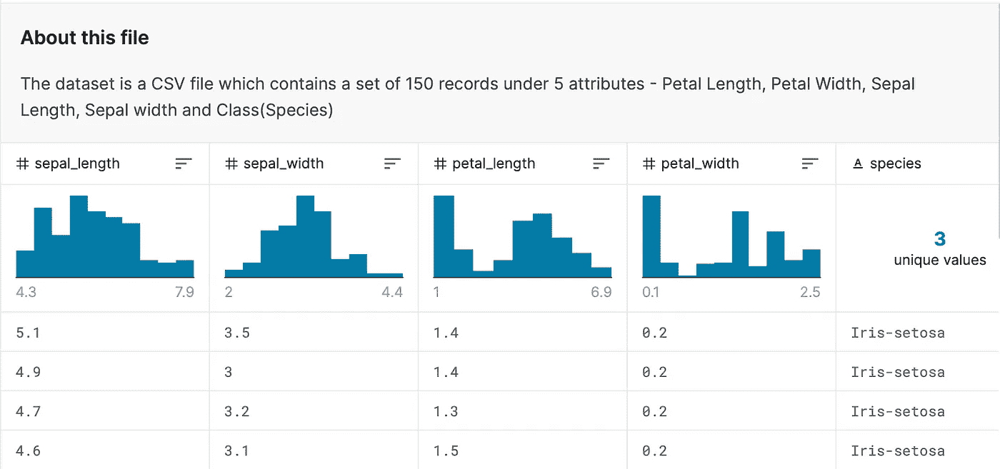
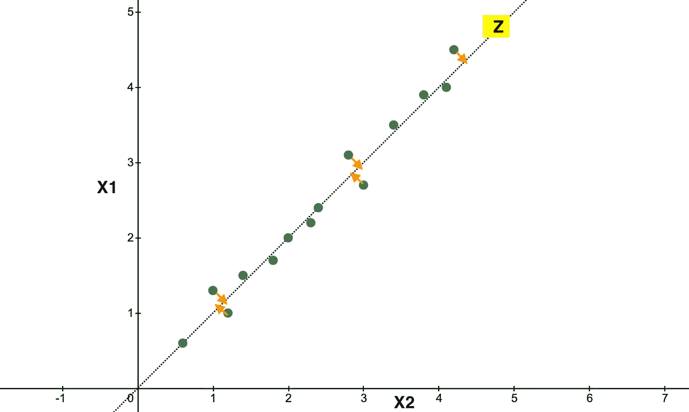
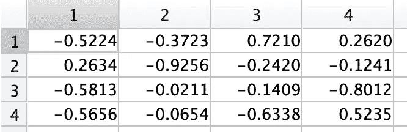
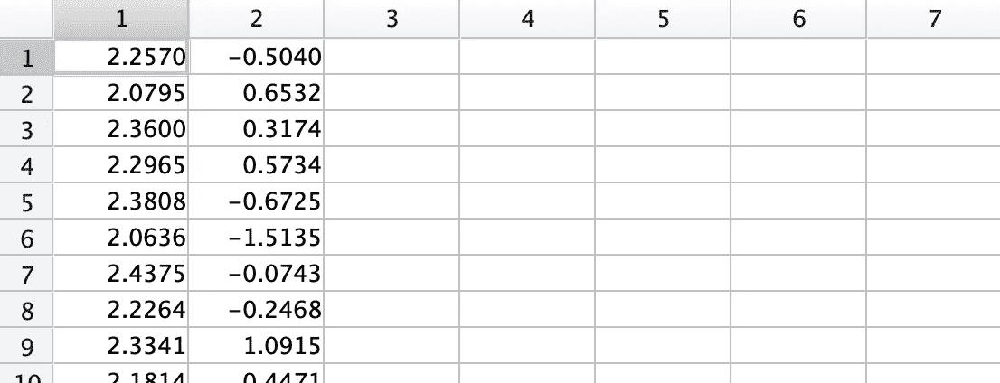
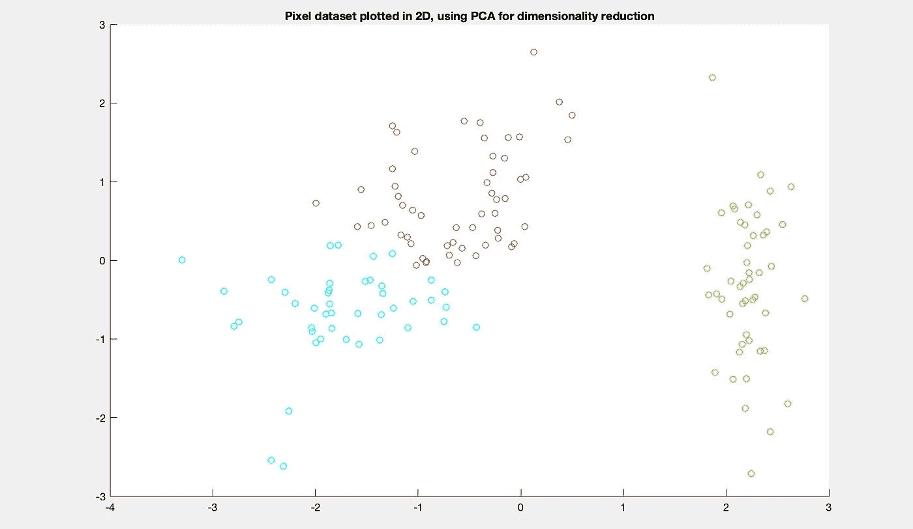

# 我们如何绘制多项式特征？

> 原文：<https://towardsdatascience.com/just-how-do-we-plot-multinomial-features-d504fc5d2cff?source=collection_archive---------23----------------------->

## 是的，您可以绘制多项式特征。如果您的数据集有 3 个以上的独立要素，那么使用主成分分析(PCA)是一个赢家。让我们看看如何在 Matlab 中做到这一点。


伯格和布什 2017

# 我们的数据集

使用 PCA，我们可以将我们的特征从(n)降低到 2 或 3 维，然后可以绘制这些特征。我们将从查看从 [kaggle](https://www.kaggle.com/arshid/iris-flower-dataset) 下载的数据集开始。

我们可以看到 4 个属性，这对于预测来说是超级的，但是不允许我们绘制可视化图。



图 Kaggle 的屏幕截图

# 谅解

当我们使用 PCA 时，我们的主要目标是将我们的多项式特征(x1，x2，x3，…xn)带到二维(z1，z2)。下面的图 1 是将 am2 维(x1，x2)向下转换为一维(Z)的简化示例。

注意*(类似于梯度下降)*我们如何在将 x1 & x2 投影到 z 上时计算投影误差



图 2:在 [Desmos](https://www.desmos.com/calculator) 中绘制

> PCA 的目标是找到数据投影的方向(向量),以便最小化投影误差。

现在我们有了一个基本的理解，让我们开始编码…

# 加载我们的数据集

让我们加载数据，并确保正常化。一般来说，我们归一化是为了更好的 ML 性能。让我们也使用 grp2idx 将 Y 标签转换成数字。

```
%% Load our data
clear;
tbl = readtable(‘IRIS.csv’);
[m,n] = size(tbl);
X = tbl{:,1:n-1};
[y,labels] = grp2idx(tbl{:,n});[X_norm, mu, sigma] = featureNormalize(X);
```

# 运行 PCA

PCA 函数为 *m 乘 n* 数据矩阵`X`返回主成分系数，也称为负载。有了这个系数，我们现在可以投影“Z”了。

```
%% use pca to reduce to 2 dimensions
K = 2;
[coef, S] = pca(X_norm);
```

如图 3 所示，我们的系数将是一个 4x4 矩阵，因为我们有 4 个特征。



图 Matlab 中 pca 的 coef 结果截图

现在让我们创建一个 coef_reduce，只包含我们喜欢的列数(K)。使用简单矩阵乘法将我们的特征从 4 减少到 2。

```
% calculate Z with 2 features
coef_reduce = coef(:, 1:K);
Z = X_norm * coef_reduce;
```

就这样，我们有一个包含 4 个特征的 **X_norm** 矩阵，但现在已经减少到 2 个特征，存储在 **Z** 矩阵中。



图 4:Z 在 Matlab 中的结果截图

# 绘制结果

在 Matlab 中，绘图现在成为一个相当标准的过程。因为我们有一个多元数据集，所以让我们创建一个托盘，用不同的颜色给每个类别着色。

```
%% Create colors pallette
figure;
palette = hsv(K + 1);
colors = palette(y, :);% Plot the data, with different Y labels being different colors
scatter(Z(:,1), Z(:,2), 30, colors);
title(‘Pixel dataset plotted in 2D, using PCA for dimensionality reduction’);
```

然后**咔嘣** …我们绘制了数据集。



图 5:在 Matlab 中绘制 Z 的结果截图

# 结论

因此，正如我们所见，绘制多项式数据集并不太难。自然，您不能像在绘制 2 个要素时那样理解单个要素，但我们可以了解数据集标注是否有意义。这在逻辑回归或 K 均值等分类算法中非常有用。

ps。下面是 featureNormalize 函数

```
function [X_norm, mu, sigma] = featureNormalize(X)
mu = mean(X);
X_norm = bsxfun(@minus, X, mu);
sigma = std(X_norm);
X_norm = bsxfun(@rdivide, X_norm, sigma);
end
```