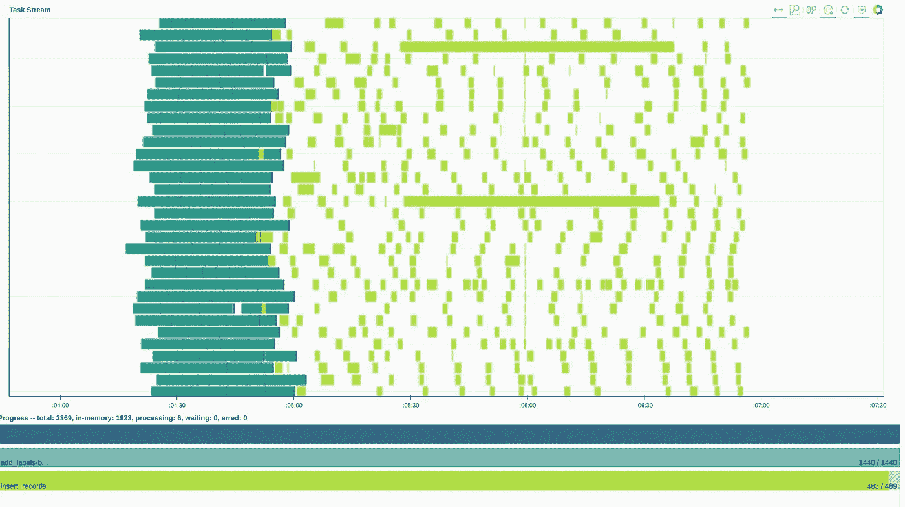

# 就从 Dask 本地集群开始吧

> 原文：<https://towardsdatascience.com/just-start-with-the-dask-localcluster-saturn-cloud-7dbfe5a89c9a?source=collection_archive---------42----------------------->

## Dask 很棒，LocalCluster 是最简单的入门方式


克里斯汀·休姆在 [Unsplash](https://unsplash.com?utm_source=medium&utm_medium=referral) 上拍摄的照片

*本文是关于实践中使用 Dask 的系列文章的第一篇。本系列的每一篇文章对初学者来说都足够简单，但是为实际工作提供了有用的提示。本系列的下一篇文章是关于循环的* [*并行化，以及其他使用 dask.delayed*](https://saturncloud.io/blog/local-cluster/) *的令人尴尬的并行操作。*

在 Saturn Cloud，[我们管理着一个数据科学平台](https://www.saturncloud.io)，该平台提供 Jupyter 笔记本、Dask 集群以及部署模型、仪表盘和作业的方法。我们已经看到一些客户在完全不必要的情况下开始使用多节点集群。当您第一次使用 Dask 时，应该选择 LocalCluster。

有许多方法可以运行 Dask 集群。这篇文章敦促用户尽可能简单地开始，并通过简单的方法来做到这一点。

# 尽可能简单

我们托管和管理多节点 Dask 集群。这些集群甚至可以使用 GPU。有了 Saturn，用户只需点击几下鼠标，就可以访问包含数百个 GPU 的集群。

但是等等。

仅仅因为你有一辆法拉利，并不意味着你应该开着它去杂货店。


[布兰登·艾奇森](https://unsplash.com/@b_atchison98?utm_source=medium&utm_medium=referral)在 [Unsplash](https://unsplash.com?utm_source=medium&utm_medium=referral) 上拍摄的照片

越简单越好。


鲁道夫·马里在 [Unsplash](https://unsplash.com?utm_source=medium&utm_medium=referral) 拍摄的照片

您的缩放顺序应该是:

1.  从熊猫开始。这通常就够了。
2.  内存不足？用熊猫配更大的机器。 [Saturn 现在拥有 4tb 内存的 Jupyter 实例](https://www.linkedin.com/feed/update/urn:li:activity:6799017968677330944)
3.  尝试 Dask 本地集群
4.  尝试多节点(也可能是多 GPU) Dask 集群

一般来说，你的堆栈越简单，你花在修补上的时间就越少，而你花在生产上的时间就越多。我写这篇文章是因为我花了时间与那些在不需要时使用多节点集群的用户交谈。这是我们的错——我们让它们很容易旋转起来。

# 为什么是 LocalCluster？

你的电脑有多个内核(我的有 4 个)。如果您正在编写常规的 Python 代码，您可能只利用了其中的一个内核。您的一些代码(特别是调用 NumPy 的代码，例如矩阵乘法)正在利用多个内核，因为 NumPy 知道如何这样做。Python **不知道**如何在多核上自动执行你写的代码。

使用 dask 集群(以及了解如何在 Dask 上并行化的库)允许您利用系统上的所有内核。Dask 附带了一些并行模块，比如`dask.dataframe`和`dask.array`。其他库，如 Xarray 和 dask-ml `也与 dask 集成。

Dask 可以帮助您通过多节点集群扩展到巨大的数据集。Dask 还可以通过 LocalCluster 帮助您利用计算机上的所有内核

## LocalCluster 比多节点 Dask 集群更容易

用一台机器工作更容易。在单台机器上， [htop](https://htop.dev/) 可以帮助您了解您的系统运行情况。在单台机器上，您不必担心将代码或数据文件复制到您的计算机集群中。在一台机器上，您可以在终端中看到整个 Dask 集群的所有日志。

## 多重处理呢？

多重处理非常适合令人尴尬的并行问题。对于非尴尬的并行问题，您将需要一个像 Dask 这样的工具，它知道如何在多个内核上并行化复杂的操作。由于 Dask 可以处理这两种类型的并行问题，所以您只需学习一种语法。此外，您还可以使用 Dask 仪表盘来监控您的工作。



Hugo Shi 截图

对于非令人尴尬的并行问题，您将需要一个像 Dask 这样的工具，它知道如何在多个内核上并行化复杂的操作。

# 如何使用 LocalCluster

有许多方法可以使用 LocalCluster。我会给你看最好的。

# 不要做什么

Dask 让入门变得非常非常容易。创建一个 Dask 客户端，你就自动得到了一个`LocalCluster`

```
>>> from dask.distributed import Client >>> c = Client() >>> c.cluster LocalCluster(16ff34f9, 'tcp://127.0.0.1:35257', workers=4, threads=8, memory=41.92 GB) >>>
```

还可以在 Python 中显式使用 LocalCluster

```
>>> from dask.distributed import Client >>> from dask.distributed import LocalCluster >>> cluster = LocalCluster() >>> client = Client(cluster)
```

我在部署生产数据管道时使用这种方法，但是我不喜欢为了研究而这样做。如果您有多个 Python 会话或笔记本，这种方法很容易让您意外地在您的计算机上结束多个集群。这也使得查看日志和找到 Dask 仪表板的地址变得更加困难。

# 做什么

打开一个终端。

```
$ dask-scheduler
```

打开第二个终端。

```
$ dask-worker tcp://127.0.0.1:8786
```

在您的 Python 会话(可能是 Jupyter 笔记本)中，执行以下操作:

```
from dask.distributed import Client client = Client('tcp://127.0.0.1:8786')
```

给你。`dask-scheduler`的默认地址是`tcp://127.0.0.1:8786`，第二个命令足以设置连接到调度程序的 Dask workers。这种方法最好的一点是，您所有工作的所有日志都在第二个终端中。要关闭它，只需在两个终端点击`ctrl-c`。

## 进程和线程

Python 有个烦人的东西叫做[全局解释器锁](https://wiki.python.org/moin/GlobalInterpreterLock)。你不需要了解太多，除了这意味着 Python 不能很好地利用多线程。这条规则的一般例外是主要进行 I/O(下载数据)的代码，或者主要利用 C++和其他非 python 库的代码(例如 NumPy)。

我们接触过的大多数用户最好使用线程上的进程(也可以混合使用)。我是这样在我的机器上做的。

1.  我有 40 GB 的 RAM(谢谢 [System76！](https://system76.com/laptops/lemur)！)
2.  我有 4 个内核。所以我想要 4 个工人。
3.  这意味着每个工人可以消耗 10 GB 的内存。

```
$ dask-worker tcp://127.0.0.1:8786 --nprocs 4 --memory-limit 10GB
```

# 结论

从简单开始，逐步扩大规模。在 Saturn，我们可以为您的所有本地集群需求提供 4tb 的实例。如果这还不够，您还可以在多节点(和多 GPU)集群上运行相同的代码，只需点击几下鼠标。祝你快乐！

声明:我是[土星云](https://www.saturncloud.io/s/home/)的 CTO。我们让您的团队轻松连接云资源。想用 Jupyter 和 Dask？部署模型、仪表板或作业？在笔记本电脑或 4 TB Jupyter 实例上工作？完全透明地了解谁在使用哪些云资源？我们做所有这些，甚至更多。

*最初发布于 2021 年 8 月 8 日*[*https://Saturn cloud . io*](https://saturncloud.io/blog/local-cluster/)*。*