# 只是利用机器学习成为更好的学习者

> 原文：<https://towardsdatascience.com/just-used-machine-learning-to-be-a-better-learner-332a00109192?source=collection_archive---------13----------------------->

## 如何充分利用我们的“第二大脑”

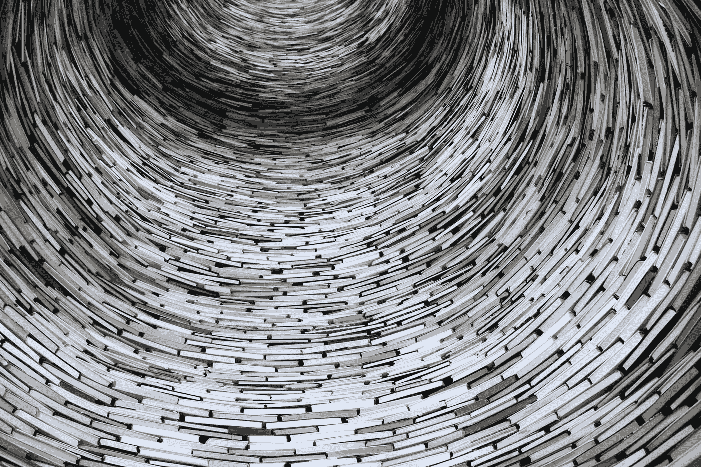

照片由[吕山德·袁](https://unsplash.com/@lysanderyuen?utm_source=medium&utm_medium=referral)在 [Unsplash](https://unsplash.com?utm_source=medium&utm_medium=referral)

在之前的一个故事中，我写了成为更好的学习者的[可能性](https://medium.com/age-of-awareness/learning-to-learn-why-and-how-its-possible-to-become-more-efficient-at-learning-everything-7169a6719f61)，步入“元”方法，获得学习过程本身的意识，并像对待技能一样对待它，改进它。

新知识的获取和理解是这个过程中必不可少的一部分，在过去的几个月里，我研究了很多关于神经科学的知识，以便更好地理解我们的大脑是如何处理和存储信息的。

与此同时，当我开始以数字方式存储有用的概念时，我偶然发现了[蒂亚戈·福特的“第二大脑”](https://fortelabs.co/blog/basboverview/)，这是一个个人知识管理系统，可以用来建立一个二级信息库，与我们主大脑的长期记忆配对，并在需要时使用。

为了更好地完成这一点，遵循第二大脑的纯粹精神，混合不同领域的知识，我决定为自己打造一个工具，融合编程、机器学习和神经科学知识，让我的第二大脑更加强大和模块化。

在这个故事中，我将不仅描述技术方面，而且描述主要特性背后的原因，因为我的主要目标是有一个工具来帮助我收集知识。

让我们从我们的(主要)大脑开始给出一些背景。

## 我们的大脑是如何工作的

我们的大脑是一个极其复杂和迷人的器官，基本上有两种不同的工具来处理信息:

*   工作记忆/短时记忆(STM):非常有限且易变，新信息首先从这里获得
*   长期记忆(LTM):实际上是无限的，我们所知道的一切都储存在这里

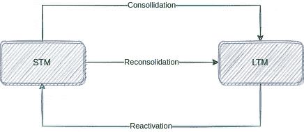

STM 和 LTM 是如何沟通的

这两个部分可以双向交换信息，从 STM 到 LTM 通过“巩固”和“再巩固”过程，从 LTM 到 STM 通过“重新激活”过程。

这些过程的核心是“组块”，一个已知和充分理解的信息的紧凑包，一个基本概念。

因此，在探讨一个新的主题时，我们可以构建组块，将一个更复杂的主题“分解”成更小的主题。

但是组块还有其他很酷的方面:

*   它们可以在工作记忆中进行组合和“压缩”,以提高效率
*   它们可以转移并应用到其他知识领域
*   它们极大地改善了存储器之间的信息共享。

让我举一个简单的例子:假设你必须记住这两个字母数字序列:

*   34ryf%s7wt
*   4x+5y^2=12

它们的长度是相同的，但我确信第二个序列更容易处理，因为关于“等式”、“加法”、“变量”、“幂”的组块的组成赋予了它“意义”，有助于在 STM 中处理它。

## (数字)第二大脑

促使我重新审视我的方法的是意识到我的知识保持力很低。

在过去的几年里，我读了大量的非小说类书籍，总体来说，接触到了大量的信息，但这并不意味着在需要的时候可以得到。

不管你读了多少书或听了多少播客，如果知识不可操作，这只是一个虚荣的衡量标准。

因此，我开始总结并保存一个笔记，如果我遇到一个有趣的概念。

我目前正在使用 Google Keep，但是[概念](https://www.notion.so/product)或[黑曜石](https://obsidian.md/)是很好的选择。

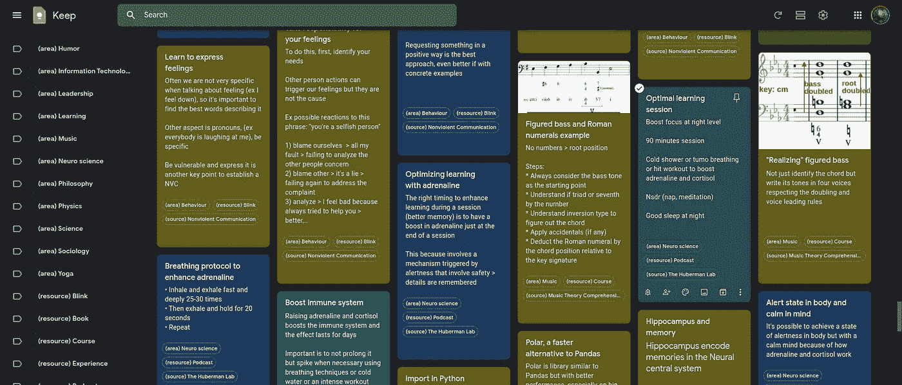

Google Keep-起点。笔记！

我使用标签构建了一个简单的 notes 分类法，引入了一些概念，如知识领域(物理学、生物学、领导力等等)、来源(来源名称，例如书名或播客名)、资源类型(书籍、播客、课程等等)和一个基本的工作流来保持一致性。

但是这还不够，尤其是考虑到可能有数千条注释的大型知识库(KB)。

我需要一些东西来以更“聪明”的方式处理这个知识库，使用组块作为构建模块，在概念之间形成新的联系——甚至来自不同的主题——并且通常在整合过程中更有效，从主要的生物 STM 传递到第二大脑本身的数字 LTM。

所以我来介绍一下第二个大脑接口！

## 技术概述

第二大脑接口(SBI 从现在开始)是一个与不同的第三方服务集成的 Python 定制应用程序。

这是逻辑架构:

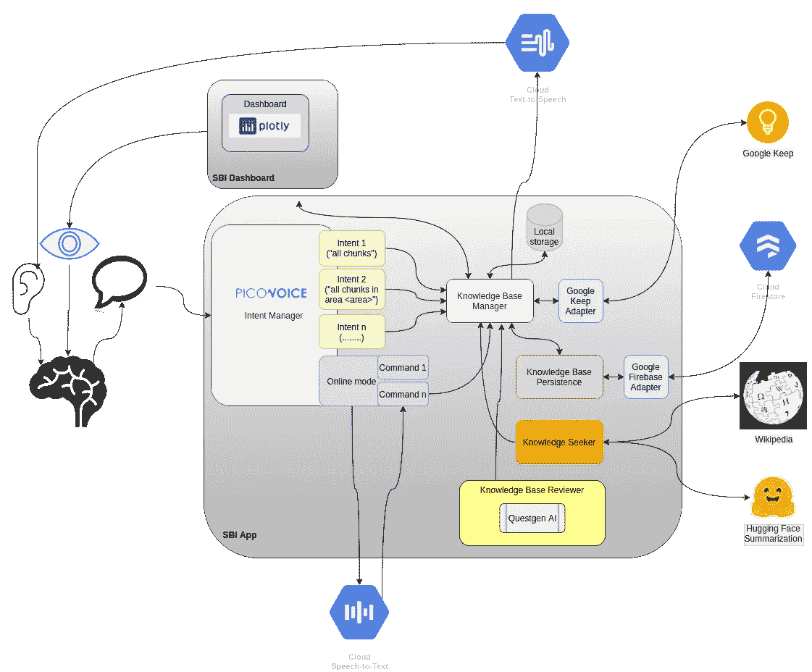

第二大脑接口——逻辑架构

Google Keep 是数据的入口点，SBI 可以通过它的 API 读写数据。

主要的块元数据(标题、文本、标签、各种时间戳)都是从那里获取的，但是我还添加了一个审查日期(稍后会详细介绍)，为了持久化它，我使用 Firestore 作为持久层，这样 SBI 就可以使用适配器执行 CRUD 操作。

但是让我们更详细地看看主要特性。

## 功能 1 —语音界面

我只是无法抗拒拥有一个声音界面的诱惑，以类似于 Alexa 或 Google Home 的方式与我的第二大脑交谈，并听取一些回复。

此外，加上一些限制(唤醒词，离线工作)，我有机会做一些非常有趣的事情。

事实上，经过一些搜索，我发现了一个非常有趣的平台，名为 Picovoice，并围绕它建立了意图管理器，具有唤醒词激活和与意图一起工作的可能性，将特定的动作映射到特定的语音输入。

让我们看看它的实际效果

第二大脑接口——基本命令

我可以直接使用 Picovoice 控制台来映射特定的意图和参数，这是一个用于训练和下载模型以在本地使用的 web 应用程序。

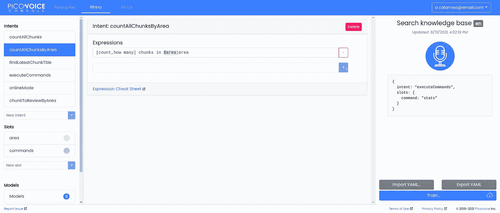

微微语音控制台

一旦理解了意图，就可以在一些特定的业务逻辑中使用它的有效负载，例如查询 Google Keep。

要了解更多关于 Picovoice 的信息，你可以阅读这个故事，在这个故事中，我详细描述了它的功能和可用的工具。

我还为一些语音命令的“在线模式”添加了谷歌语音技术，因为 Picovoice intent engine 的缺点是你必须提前训练模型才能捕捉特定的短语，对于一些功能来说，这是不可行的。

## 功能 2 —关于知识库的统计信息

我认为对知识库如何发展及其组成有一些了解是很重要的，所以基本上我对它做了一些“EDA”(探索性数据分析)。

除了口头询问一些信息，我还构建了一个 web 仪表板来添加一个可视化界面，使用 [Dash 框架](https://dash.plotly.com/)来显示图表。

我不是前端开发人员——看到截图就很清楚了:)—但是，使用 Dash，我能够构建一个用 Python 代码包装的 React 应用程序。

感谢 Keep integration，将所有数据放入 Pandas DataFrame 并开始挖掘，使用 Plotly 库非常简单。

除了一些基本信息，我还构建了:

*   Wordcloud，使用一个特定的库，查看所有可用的块。NLTK 词条解释器的使用有助于单词的规范化，因为根据定义，*语言学中的词条解释是将单词的屈折形式组合在一起的过程，因此它们可以作为单个项目进行分析，通过单词的词条进行识别。*

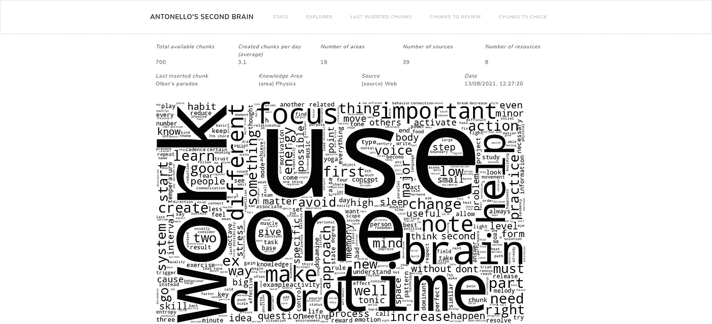

第二大脑界面——仪表板

*   直方图查看不同的块标签类型(知识领域、来源、资源类型)

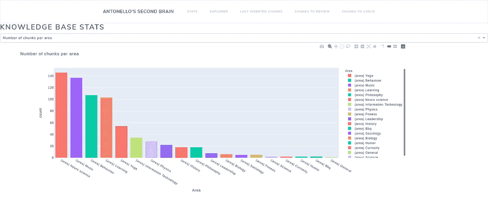

第二大脑界面——每个知识领域的组块数量

*   时间序列，以查看各个方面(块创建、编辑等)随时间的演变

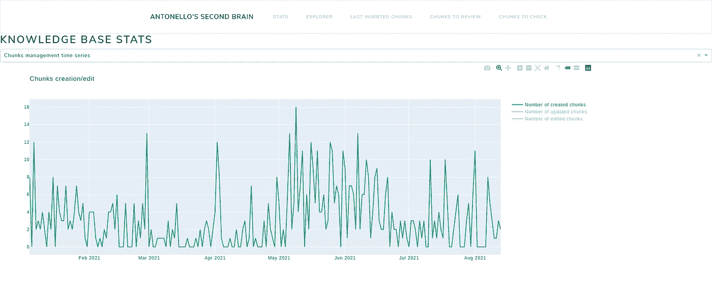

第二大脑界面——随时间的组块创造

我想我会添加一些更酷的报告，如动画信息图，以便更好地掌握知识库随时间的变化，了解新领域是如何添加的或现有领域的演变。

## 特征 3 —新知识获取和自动总结

这是 ML——更准确地说是 NLP 发挥作用的另一个特性

让我们看看它的实际效果

第二大脑界面——总结功能正在发挥作用

自动总结一些文本的可能性非常有趣，尤其是如果与维基百科配对的话。

当然，这个过程不应该完全委托给 ML，因为这是一个非常重要的行动，用我们的大脑来加强理解和知识提取，但可以作为一个更计算机辅助的工作流程的初步步骤。

从技术上来说，我使用的是在[拥抱脸](https://huggingface.co/welcome)上提供的摘要服务，可以从几个模型中挑选一个用于特定任务的训练模型(在这种情况下是文本摘要),并向其发送有效载荷进行处理。

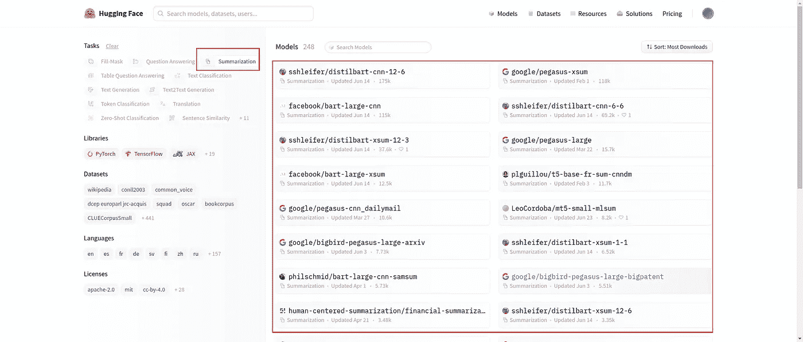

拥抱脸界面

下面是简单的代码，基本上是一个 POST 请求，在有效负载中包含摘要文本。

为了让它工作，你需要一个拥抱脸的帐户(以获得 API 令牌)并安装他们的库。

```
class Summarizer:def __init__(self):
        model_name = sb_properties.SUMMARIZER_MODEL
        api_token = sb_helper.get_hf_api()
        logger.debug("Using {} as summarization model".format(model_name))
        self.api_url = "[https://api-inference.huggingface.co/models/](https://api-inference.huggingface.co/models/)" + model_name
        self.model_id = model_name
        self.headers = {"Authorization": "Bearer {}".format(api_token)} def summarize_text(self, text_to_summarize):
        payload = {"inputs" : text_to_summarize}
        response = requests.post(self.api_url, headers=self.headers, json=payload)
        return response.json()
```

该文本摘自维基百科页面的摘要部分(如果有的话)

```
import wikipediadef retrieve_summary(self,topic):
        try:
            page = wikipedia.page(topic)
            logger.debug("Found page with title {}".format(page.title))
            logger.debug("Found page with url {}".format(page.url))
            return page.summary
        except wikipedia.exceptions.PageError:
            logger.error("Page about topic {} not found ".format(topic))
        except wikipedia.exceptions.DisambiguationError:    
            logger.error("Disambiguation error for topic {} ".format(topic))
        except Exception as e:
            logger.error("Error %s", e)
```

让我们看看示例中总结的文本之间的区别…

```
The Alcubierre drive, Alcubierre warp drive, or Alcubierre metric (referring to metric tensor) is a speculative warp drive idea based on a solution of Einstein's field equations in general relativity as proposed by theoretical physicist Miguel Alcubierre during his PhD study at the University of Wales, Cardiff, by which a spacecraft could achieve apparent faster-than-light travel if a configurable energy-density field lower than that of vacuum (that is, negative mass) could be created.Rather than exceeding the speed of light within a local reference frame, a spacecraft would traverse distances by contracting space in front of it and expanding space behind it, resulting in effective faster-than-light travel.
```

原文摘自维基百科

```
The Alcubierre drive, Alcubierre warp drive, or Alcubierre metric (referring to metric tensor) is a speculative warp drive idea based on a solution of Einstein's field equations in general relativity as proposed by theoretical physicist Miguel Alcubierre during his PhD study at the University of Wales, Cardiff, by which a spacecraft could achieve apparent faster-than-light travel if a configurable energy-density field lower than that of vacuum (that is, negative mass) could be created.[1][2]Rather than exceeding the speed of light within a local reference frame, a spacecraft would traverse distances by contracting space in front of it and expanding space behind it, resulting in effective faster-than-light travel. Objects cannot accelerate to the speed of light within normal spacetime; instead, the Alcubierre drive shifts space around an object so that the object would arrive at its destination more quickly than light would in normal space without breaking any physical laws.[3]Although the metric proposed by Alcubierre is consistent with the Einstein field equations, construction of such a drive is not necessarily possible. The proposed mechanism of the Alcubierre drive implies a negative energy density and therefore requires exotic matter or manipulation of dark energy.[4] If exotic matter with the correct properties cannot exist, then the drive cannot be constructed. At the close of his original article,[5] however, Alcubierre argued (following an argument developed by physicists analyzing traversable wormholes[6][7]) that the Casimir vacuum between parallel plates could fulfill the negative-energy requirement for the Alcubierre drive.Another possible issue is that, although the Alcubierre metric is consistent with Einstein's equations, general relativity does not incorporate quantum mechanics. Some physicists have presented arguments to suggest that a theory of quantum gravity (which would incorporate both theories) would eliminate those solutions in general relativity that allow for backwards time travel (see the chronology protection conjecture) and thus make the Alcubierre drive invalid.
```

结果还不错，即使仍然太复杂而不能被认为是一个单一的块，并且关于 Alcubierre 驱动器可行性的省略部分非常有趣。

实际上，我使用的是“google/pegasus-large”模型，但是同时使用不同的模型并挑选出最佳摘要也不错。

## 功能 4 —检查块

当我在很久以后介绍组块概念时，仍然有许多笔记，尤其是旧的笔记，不能被认为是组块(意思是清晰、紧凑并且有特定的主要概念)。

此外，不总是很容易总结一些东西，所以一个一致的“内务”活动是必要的，以保持组块的质量。

但没关系，这是学习过程本身的一部分，以改善已知的东西，“重构”或扩展。

没有直接的可能性来定义一个笔记什么时候也是一个组块，所以我只是使用词条的数量来检查是否在一个确定的阈值内(实际上是 40 个词条)。否则，有可能需要重写和/或拆分便笺。

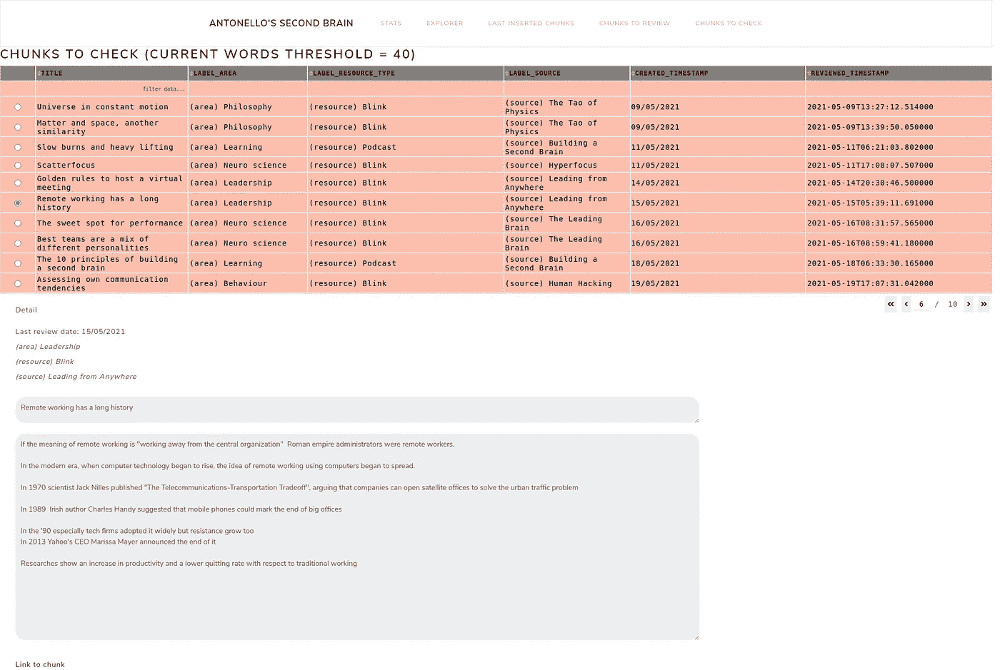

第二大脑界面——要检查的块

不是一个完美的方法，但我们仍然有我们的主要大脑来决定该做什么:)

## 功能 5 —检查组块和自动问题生成

拥有数百个可用的数据块并展望未来数千个数据块，重要的是要有一个审查机制，定期评估和改进这些数据块，因为拥有第二个大脑意味着可操作的知识。

因此，为了跟踪一个程序块何时被审查，我添加了审查日期。当块被创建时，它等于它的创建日期，但是随着时间的推移，在某个时间窗口中具有审查日期的所有块被发现为“需要审查”。

想法是再次阅读并至少承认它们的存在，模仿主要的大脑激活过程(从 LTM 到 STM)。

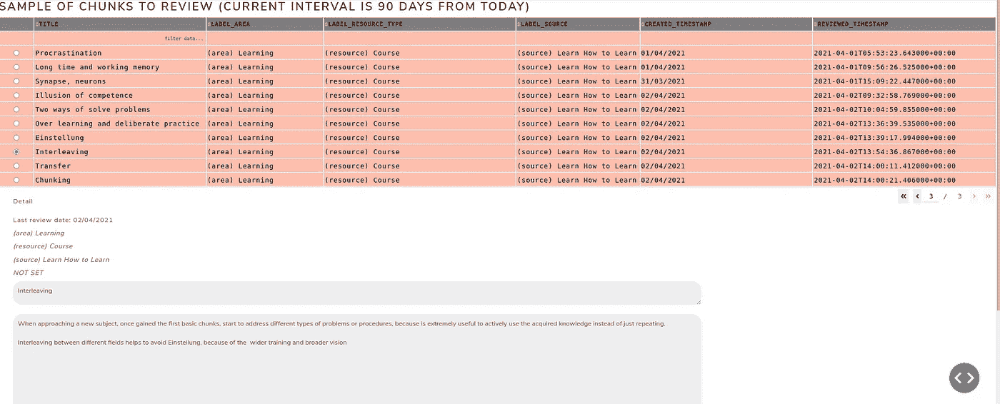

第二大脑界面——要复习的组块

但是，有没有一种方法来促进这一审查过程呢？

如果在复习过程中，我不只是阅读课文，而是回答一些与课文相关的问题，那该多好？

NLP 可以再次提供帮助，使用一个名为 [Questgen AI](https://github.com/ramsrigouthamg/Questgen.ai) 的包。

在幕后，它使用一种相对较新的方法来处理 NLP 模型，称为 T5(文本到文本转换转换器)，其中输入和输出都是文本，允许转换，在这种情况下，从语句中获取问题。


第二大脑界面——组块的问题生成

在上面的例子中，第一个问题是完美的，第二个就不那么完美了，可能需要以更接近模型训练数据的方式重写，但这是一个好的开始，并促使我以更好的方式编写一大块。

代码非常简单:

```
from Questgen import maindef generate_questions(self, question_context):
        payload = {
            "input_text": question_context            
        }
        output = main.QGen().predict_shortq(payload)

        if output:
            logger.debug(output)
            return output['questions']
        else: 
            return None
```

## 功能 6 —搜索和知识“导航”

这是最有趣的功能，因为我试图建立一个 KB 的视觉表示，以获得新的见解，并发现组块之间意想不到的关系，模拟我们的大脑在不同和更广泛的区域连接以创建新知识时如何以扩散模式工作。

这是一个搜索功能，连接所有包含输入文本的块

第二大脑界面——在知识库中搜索

但是还有更多！

我使用了一个相似性函数来查找与低于某个阈值的所选块“相似”的块(更高的值意味着更相似)

第二大脑界面——浏览知识库

因此，只需浏览节点并更改阈值，就有可能通过相似性获得某种意外收获，并以不同的方式探索知识库。

从技术上讲，这可以通过计算向量的*余弦相似度*矩阵来实现，该矩阵是通过在一些清理之后对组块文本进行矢量化而获得的。

```
import string
from sklearn.feature_extraction.text import CountVectorizer
from sklearn.metrics.pairwise import cosine_similarity
from nltk.corpus import stopwords
import pandas as pdimport re
from nltk.corpus import wordnet
import nltk
from nltk.stem import WordNetLemmatizerdef clean_string(text):
    text = ''.join([word for word in text if word not in string.punctuation])
    text = text.lower()
    text = re.sub(r'[^\x00-\x7F]+', ' ', text)
    text = re.sub(r'\s{2,}', ' ', text)
    text = ' '.join([word for word in text.split() if word not in stop_words])
    text = ' '.join([lemmatizer.lemmatize(w) for w in nltk.word_tokenize(text)])   
    return textdef compute_chunks_similarity(self, column):
            cleaned_strings = list(map(clean_string, self.model[column].values))
            vectorizer = CountVectorizer().fit_transform(cleaned_strings)
            vectors = vectorizer.toarray()return (cosine_similarity(vectors))
```

# 结论

我喜欢花时间设计和开发 SBI，因为我获得了对新主题的见解，练习了获得的技能，而且，总的来说，因为边做边学是很棒的。

此外，机器学习再次显示了它在非常具体的领域的效用，例如个人知识管理，正如我之前在健身中探索的[。](/used-again-machine-learning-in-my-workout-this-time-building-a-personal-trainer-3dfae9730c2b)

我会继续增加功能和改进它们，把 SBI 当作我个人成长的助手。

接下来的两个主要问题是:

*   使用 LDA(潜在狄利克雷分配)来发现和显示知识库中隐藏的主题和连接，
*   有可能手动链接组块，以形成特定知识的集群。

但是，除了技术细节和工具，我的主要目标是展示如何系统和连贯地获取知识，因为好奇心和学习意愿当然是基础，但它们需要专注和一致。

所以，下次你在看书、看视频或听播客时，如果有什么有趣的事情发生，停下来做个笔记。

一开始会很奇怪，你会觉得慢了下来，但事实是，每一次，你都会对你拥有的最有价值的资产进行长期投资:你的知识。