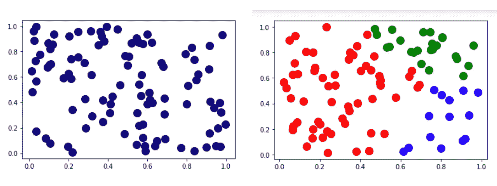
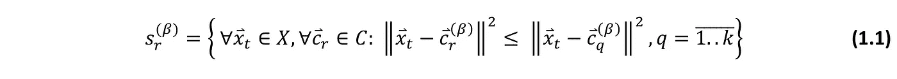
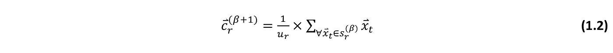
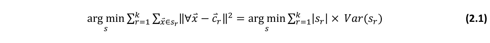
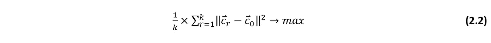
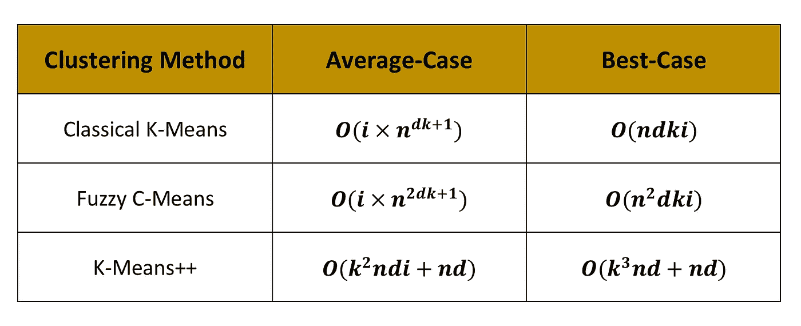
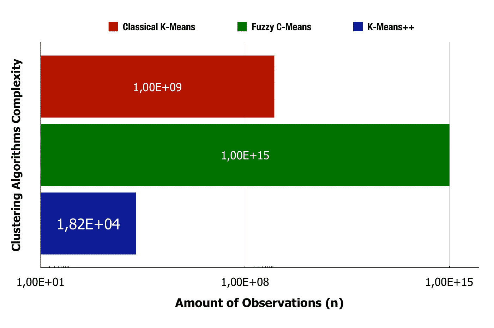
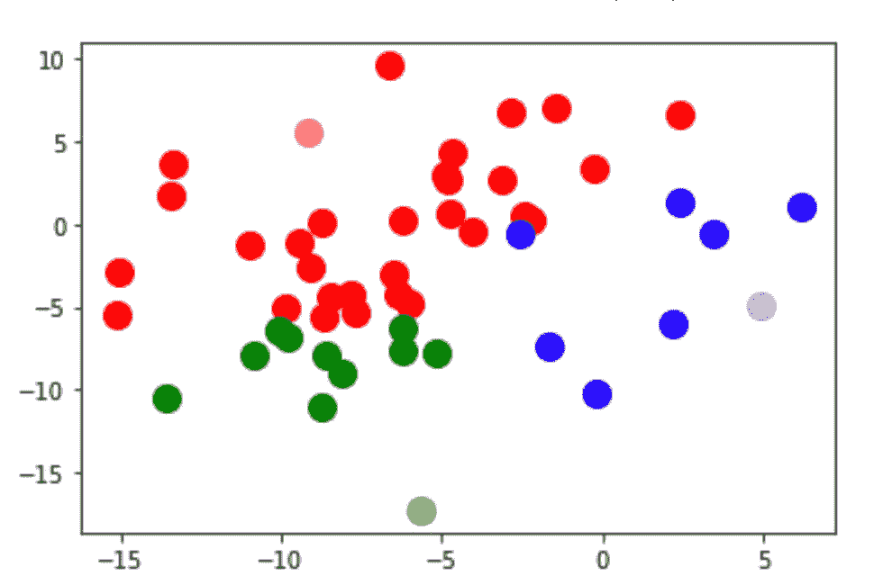
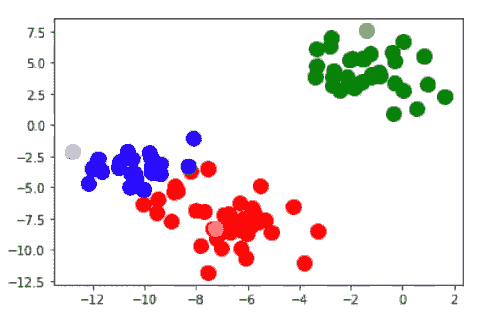
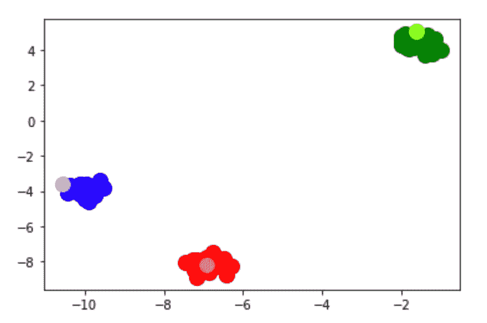

# 高维数据聚类的 K-Means++算法

> 原文：<https://towardsdatascience.com/k-means-algorithm-for-high-dimensional-data-clustering-714c6980daa9?source=collection_archive---------14----------------------->


Arthur V. Ratz 的照片

## 利用 K-Means++算法进行优化的高维数据集聚类，使用最新的 Scikit-Learn 0.20、NumPy 3.20.x Matplotlib 3.4.1、结果可视化等在 Anaconda Python 3.8.x 中实现。

# 介绍

聚类是数据分析中的一个重要步骤，广泛用于分类、收集统计数据和获取特定知识领域的见解。在执行聚类时，它旨在将数据集划分成几个组(即*簇*)，将最相似的数据分配给簇**【1，4，6】**。

数据聚类不仅仅基于一个，而是基于整个类别的*无监督机器学习* *(ML)* 算法，当组的数量未知时，有效地用于*不确定*或*模糊*数据聚类。它通过将数据与最初预定义的类相关联，提供了对数据进行分类的能力。

然而，现有的大多数基于 Lloyd-Forgy 方法的算法，在对具有大量特征的数据集进行聚类时，具有巨大的平均复杂度。

在实验上，将𝙣=𝟏𝟎实体的三维𝙙=𝟑数据集划分成𝙠=𝟏𝟎簇以进行𝙞=𝟏𝟎迭代可以在超级多项式时间(NP-hard)内完成，这与𝞀=𝟏𝟎成比例。

为了提高 Lloyd-Forgy 的聚类性能，使用了各种算法级优化。虽然，它们中的许多还没有被很好地研究过，因此是不切实际的。原始 Lloyd-Forgy 的 K-Means 聚类至少有两种已知的优化，如**模糊 C-Means** 和 **K-Means++算法，在**【2，3，6】**中讨论。**

为了有效地提高 *NP-hard* 聚类过程的性能和收敛性，我们将引入 K-Means++算法，该算法最初由 David Arthur 和 Sergei Vasilevskii 于 2007 年提出，作为 Lloyd-Forgy 算法的初始化步骤**【2，5】**。

与其他类似的算法不同，K-Means++提供了聚类和质心就地计算的能力，确保聚类以减少的迭代次数执行，等于结果聚类的总数。

K-Means++算法的平均情况复杂度已经显著降低，非常接近最好情况的 Lloyd-Forgy 算法的复杂度。K-Means++大约是𝟓.与最初的 Lloyd-Forgy 算法相比，𝟒𝟗𝙭时间更快，同时用于高维数据集的聚类。

# 劳埃德-福吉的 K-均值聚类

Lloyd-Forgy 的 K-Means 是一种算法，它基于*欧几里德* *距离*度量，将𝙣- *观测值*的数据集𝑿划分为一组𝙠- *聚类*的过程，其中每个观测值都是𝒅- *特征*的多维向量。每个聚类是到*质心之一的最小距离的一组观察值，*被评估为聚类 **[1，4，5，6]** 内所有观察值的*最近均值*。

通常，数据聚类的整个过程可以描述为:



一个数据聚类的例子|图片作者

上图展示了将𝒏=𝟏𝟎观测的二维数据集聚类成𝙠=𝟑聚类的过程(从右开始)。

输入数据集𝑿的片段如下所示:

```
0:     [ x = 0.543974 y = 0.842981 ]
1:     [ x = 0.131690 y = 0.806490 ]
2:     [ x = 0.339777 y = 0.380520 ]
3:     [ x = 0.683979 y = 0.816659 ]
4:     [ x = 0.236921 y = 0.184139 ]
5:     [ x = 0.380008 y = 0.027292 ]
6:     [ x = 0.933727 y = 0.694752 ]
7:     [ x = 0.911393 y = 0.504823 ]
8:     [ x = 0.076103 y = 0.714423 ]
9:     [ x = 0.906728 y = 0.107928 ]
10:    [ x = 0.087780 y = 0.256157 ] *       *       *
```

上面列出的每一个𝒏-observations，都是欧几里得空间ℝ **ᵈ** 中的向量𝒙。因为，𝑿是一个数据集，它的所有向量∀𝒙 ∈ 𝑿排列成一个形状协方差矩阵(𝒏 **×** 𝒅).

数据集𝑿的整个聚类分两步进行**【1】**:

1.  计算一组群集𝙎，分配所有观察∀𝒙ₜ ∈ 𝑿，𝙩 =𝟏..𝒏到集群𝒔ᵣ ∈ 𝙎，𝒓=𝟭..具有最近质心𝒄ᵣ ∈ 𝑪的𝙠，其中来自每个观测𝒙ₜ的 distance|∀𝒙ₜ𝒄ᵣ|的平方最小。
2.  更新质心𝒄ᵣ ∈ 𝑪，𝒓=𝟭..所有星团的𝙠作为*观测值的质心*，分配给每个星团𝒔ᵣ ∈ 𝙎.

继续执行步骤**1–2**，直到𝙠-clusters 𝒔 ∈ 𝙎最终计算完毕。

为了执行聚类，我们必须从数据集𝑿中选择𝙠-observations，作为质心𝑪的初始集合，计算来自𝙩=𝟏∀𝒙ₜ∈𝑿的每个观测值的平方距离..𝒏到所有质心∀𝒄ᵣ ∈ 𝑪，𝒓=𝟭..𝙠，将观测值∀𝒙ₜ映射到质心𝒄ᵣ，其中来自这些观测值∀𝒙ₜ的 distance|𝒙ₜ𝒄ᵣ|最小，并将它们分配到群集𝒔ᵣ ∈ 𝙎.

通常，我们在每次𝛃-th 迭代𝛃=𝟏时继续计算新的集群𝒔 ∈ 𝙎 **⁽** ᵝ **⁾** ..𝙞，重新评估质心并在来自先前(𝛃−𝟏)-th 迭代)的每个现有聚类内将观察结果划分成多个新的聚类，直到整个数据集最终被聚类**【1，4，5，6】**。

数学上，下面的过程可以表示为等式 **(1.1)** :



Lloyd-Forgy 基于距离的聚类过程|图片由作者提供

反过来，通过使用*质心*等式 **(1.2)** ，每个聚类的质心被更新为𝒓-th 聚类内所有𝒖ᵣ-observations 的最近平均值:



聚类的最近均值公式|作者图片

在每个聚类的质心∀𝒄ᵣ ∈ 𝑪没有改变∀𝙘ᵣ**⁽**ᵝ⁺**⁾**=∀𝙘ᵣ**⁽**T7 的情况下，聚类过程终止，返回聚类的结果集。否则，它继续进行下一次𝛃+𝟭)-th 迭代，直到整个数据集已经被聚类，并且聚类过程**【1】**，最终满足下面的条件 **(2.1)** :



K-均值聚类的收敛性|图片作者

在执行聚类时，我们的目标是最小化*类间*平方距离的总和，以便这些观察值∀𝒙 ∈ 𝒔ᵣ和每个类∀𝒔ᵣ ∈ 𝙎的质心∀𝒄ᵣ之间的距离最小。

这与方差𝑽𝒂𝒓(𝒔ᵣ的最小化非常相似，方差是𝒖ᵣ-observations 在𝒓=𝟭∀𝒔ᵣ∈𝙎每个聚类内的平均协变(成对)方差..𝙠.同时，我们的目标是最大化所有𝙠-clusters ∀𝒔 ∈ 𝙎的质心∀𝒄ᵣ ∈ 𝑪之间的距离，使得所有质心到向量空间ℝ **ᵈ** 的中心𝙘ₒ的平均距离最大。最佳*群集间*距离必须始终满足以下条件 **(2.2)** :



最佳类内距离标准|作者图片

经典的 Lloyd-Forgy 的 K-Means 过程是几种聚类算法的基础，包括 K-Means++算法、K-Medoids 算法、模糊 C-Means 算法等。尽管，由于潜在的巨大计算复杂性，这些算法中的一些不能有效地用于聚类。

# 为什么 K-Means 聚类仍然更有效

如前所述，使用 Stewart Lloyd 和 Edward Forgy 在 1965 年提出的 K-Means 算法以及其他继承方法，在许多情况下，由于超多项式的复杂性，应用于高维数据集的聚类变得低效**【1】**:


K-Means 聚类算法的复杂性|图片作者

，其中𝒏-大量的观察值，𝒌-总的聚类数，𝒅-大量的特征(即向量空间维度)，𝒊-大量的迭代，𝛔-最小的类内方差。

Lloyd-Forgy 的 K-Means 算法的最坏情况复杂度成比例地限制为:


经典的 K-均值复杂性渐近边界|图片作者

有几种方法可以解决 Lloyd-Forgy 的 K-Means 算法的巨大复杂性，例如降低数据集的维数、进行聚类以及将数据集表示为多维整数格。

虽然，在聚类大数据集的情况下，使用这些方法可能仍然是低效的，其中的观测值数量远远超过𝗻 ≫ 𝟏𝟎观测值。

此外，已知的模糊 c-均值算法的复杂度非常接近经典的 Lloyd-Forgy 算法的平均情况复杂度，并且不同之处在于加权质心计算的额外复杂度𝙊(𝗻:


模糊 C 均值算法复杂度|图片作者

为了执行高维数据集的聚类，我们需要一种不同的、更有效的算法，具有大规模数据集聚类的降低的复杂性。

# K-Means++算法及其复杂性

由 David Arthur 和 Sergei Vasilevskii 在 2007 年提出的一种优化，被公式化为 K-Means++算法，提供了执行高维数据聚类的能力，与先前讨论的最初的 Lloyd-Forgy 的 K-Means 和其他方法相比，显著更快。同时，使用优化的 K-Means++算法不影响聚类的整体质量，提高了聚类结果的类内和类间距离。与 Lloyd-Forgy 的方法不同，它主要确保数据集在迭代次数内聚类，迭代次数等于最初给定的聚类数。这反过来对数据聚类的过程产生积极的影响**【2，5】**。

K-Means++聚类过程可以表述如下**【2，5】**:

让𝙓-𝙠𝙣-observations 的数据集-𝘾和𝙎的聚类总数-𝙠质心和聚类的结果集分别为:

1.  选择质心𝙘₀作为随机观测∀𝙭 ∈ X:


2.选择质心𝙘₁作为到质心 c0 距离最大的观测∀𝙭:


3.计算𝛃=𝟏内𝙓的𝙠-clusters ∀𝒔 ∈ 𝙎..迭代的𝙠:

▪︎为每个观察𝒙ₜ ∈ 𝑿，𝙩=𝟏..𝒏，请执行以下操作:

*   检查观察值∀𝒙ₜ ∈ 𝘾是否已经追加到质心集。如果没有，继续下一步 **3.2**
*   计算从当前观测𝒙ₜ到每个现有质心∀𝙘 ∈ 𝘾的|𝒙ₜ - ∀𝙘|距离
*   找到质心𝙘ᵣ ∈ 𝘾，𝙧=𝟏..𝛃到𝒙ₜ的距离最短:


*   将观测值𝒙ₜ分配给质心为𝙘ᵣ ∈ 𝒔ᵣ的𝙧-th 聚类𝒔ᵣ ∈ 𝙎

4.检查𝙠-centroids ∀𝙘ᵣ ∈ 𝘾，𝙧=𝟏..𝙠已经被最终计算出来，并且所有的观测值都被安排到相应的𝙠-clusters ∀𝒔 ∈ 𝙎.中如果没有，继续执行步骤 **5。**否则，终止聚类过程。

5.在𝒔ᵣ ∈ 𝙎的所有现有集群中找到一个观测𝒙ⱼ，从该处到𝙧=𝟏𝙘ᵣ∈𝘾的质心之一的距离..𝛃是最大的:


6.将观测值𝒙ⱼ附加到集合𝘾，作为新聚类𝒔ᵣ+₁的质心𝙘ᵣ+₁←𝒙ⱼ；

7.继续执行步骤**3–6**，直到以下过程最终收敛，数据集最终聚类；

上面介绍的算法的主要优点是，它提供了同时计算质心和相应的结果聚类的能力，这极大地影响了算法的复杂性，并因此影响了整个聚类过程的持续时间，使得有可能比以前制定的其他类似算法更快地执行高维数据集的聚类。

在每个𝛃=𝟏..𝙠迭代，它计算下一个集群的质心𝙘ᵣ+₁，更新现有的集群𝒔ᵣ ∈ 𝙎，𝙧=𝟏..𝛃通过重新评估所有观测值∀𝒙 ∈ 𝑿到多个新建聚类的分配，使得在其最后的𝙠-th 迭代，聚类过程产生结果聚类𝙎.的集合

Python 3.9 中的代码示例使用最新的 NumPy 库实现了优化的 K-Means++聚类算法，如下所示:

上面演示的代码片段有一个重要的优化，它允许减少进程内存空间的数量，广泛用于大型数据集的聚类。在聚类过程中，它计算输入数据集𝑿中的观察值的索引，将其附加到𝘾和𝙎集，而不是将相同的高维数据克隆到多个集中。反过来，在处理高维数据集的聚类的情况下，这使得消耗显著更少量的进程存储器成为可能。

最后，您可能已经注意到，与著名的 Lloyd-Forgy 算法或模糊 c 均值聚类算法相比，K-Means++的复杂度显著降低，在一般情况下，估计仅为𝙊(𝙠 𝙣𝙙𝙞 +𝙣𝙙。具体地，在迭代总数𝙞等于聚类总数𝙠.的情况下，K-Means++的复杂度从超多项式平滑到象限，由𝙊(𝙠 𝙣𝙙 + 𝙣𝙙限定在这种情况下，K-Means++聚类的复杂性大约比原始 Lloyd-Forgy 的 K-Means 或模糊 C-Means 算法的复杂性低 28 倍:



数据聚类算法复杂性|图片作者

此外，下图显示了将具有𝙙=𝟐维度的𝙣=𝟏𝟎观测数据集聚类为一组𝙠=𝟑结果聚类，执行𝙞=𝟏𝟎迭代的估计复杂度:



K-Means、模糊 C-Means 和 K-Means 算法复杂度|图片作者

正如你所看到的，在上图中，K-Means++算法有一个复杂度(navy)，由于几个算法级的优化**【1】**，这个复杂度已经大大降低了。

# 评估聚类的质量

最后，让我们简短地看一下使用 K-Means++算法实现的数据聚类的质量。为了确保 K-Means++最有能力提供正确的结果，从而提供适当的聚类质量，我们将进行实验，通过使用*‘scikit-learn’*库，执行基于高斯正态分布生成的合成数据集的聚类。

使用*‘sci kit-learn’*生成各向同性高斯斑点使得创建用于聚类的多维数据集成为可能。该实验的主要目的是确定使用 K-Means++算法是否提供聚类的结果，这与使用*【scikit-learn】*库的情况相同。

这通常是通过生成合成数据集并使用上述 K-Means++算法执行相同的聚类来完成的。

具体来说，至少有三种主要类型的数据集可用于聚类验证，例如每个数据集分别具有*小*、*平均、*和*大*的类间距离(即*标准差(STDEV)* 参数)的数据集。

这是数据集聚类结果的可视化，具有不同的标准差𝛅:

## 案例#1: 𝙣=50，𝙠=3，𝙙=2，𝛅=4.5(小集群间距离)



## 案例 2: 𝙣=50、𝙠=3、𝙙=2、𝛅=1.5(平均集群间距离)



## 案例 3: 𝙣=100、𝙠=3、𝙙=2、𝛅=0.3(集群间距离大)



对于正在讨论的使用 K-Means++算法的数据聚类的完整结果，请参考相关项目，贡献给 Anaconda Cloud:

*   [https://anaconda.org/arthurvratz/kmeans_pp_nb/notebook](https://anaconda.org/arthurvratz/kmeans_pp_nb/notebook)

# 结论

K-Means++算法的一个优点是，它能够同时计算质心并将数据分配给聚类。高维数据集聚类是通过多次迭代实现的，与其他现有方法相比，迭代次数明显减少。K-Means++能够在最初的几次迭代中将数据分配给聚类，而不会影响聚类本身的质量。大多数情况下，它比其他方法更快，提供了早期收敛，从而提高了聚类性能。与劳埃德算法不同，它的复杂度已经大大降低，并且低于 NP-hard。最后，K-Means++算法基于使用规则或平方欧几里得距离度量，有效地最小化了类内方差，避免了已知的韦伯问题。类似于 K-Medians 和 K-Medoids 算法，它能够在聚类大型高维数据集时提供更好的欧几里德距离解决方案。

***K-Means++集群 Anaconda Python 3.8、NumPy 1.20.x、Scikit-Learn 0.20.x 中完整的源代码项目可以从我的 GitHub 和 Anaconda 云库下载:***

*   【https://github.com/arthurratz/kmean_pp_clu_optimal 
*   [https://anaconda.org/arthurvratz/kmeans_pp_nb/notebook](https://anaconda.org/arthurvratz/kmeans_pp_nb/notebook)

# 参考

1.  [*“k-means 聚类”——来自维基百科，免费百科*](https://en.wikipedia.org/wiki/K-means_clustering)
2.  [*“k-means++”——来自维基百科，免费百科*](https://en.wikipedia.org/wiki/K-means%2B%2B)
3.  [*“模糊聚类”——来自维基百科，免费百科*](https://en.wikipedia.org/wiki/Fuzzy_clustering#Fuzzy_C-means_clustering)
4.  [*《你需要的最全面的 K-Means 聚类指南》作者 Pulkit Sharma，Analytics Vidhya，2019 年 8 月*](https://www.analyticsvidhya.com/blog/2019/08/comprehensive-guide-k-means-clustering/)
5.  [*《理解 K-Means，K-Means++和，K-Medoids 聚类算法》作者 Satyam Kumar，走向数据科学，2020 年 6 月*](/understanding-k-means-k-means-and-k-medoids-clustering-algorithms-ad9c9fbf47ca)
6.  [*“K 均值聚类的进展。一种数据挖掘思维》，吴俊杰，施普林格柏林海德堡，德国柏林，2012*](https://www.springerprofessional.de/advances-in-k-means-clustering/3879526)