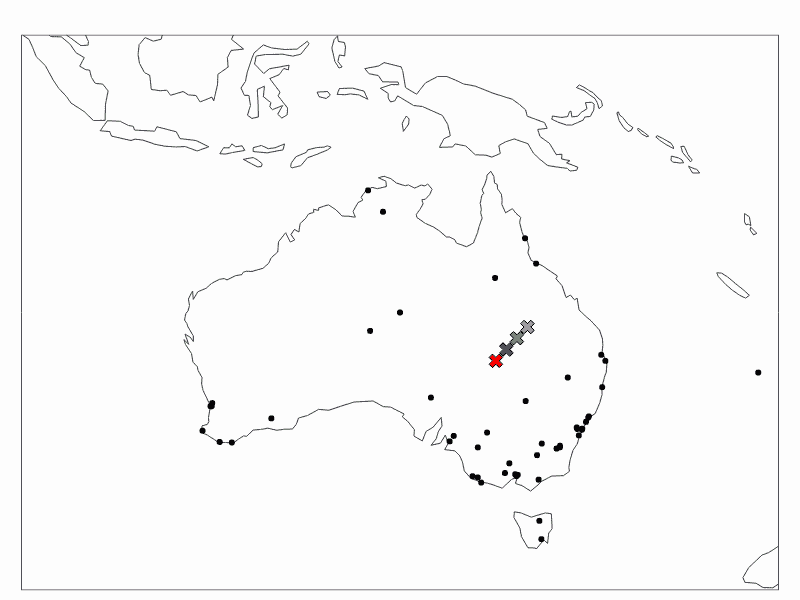
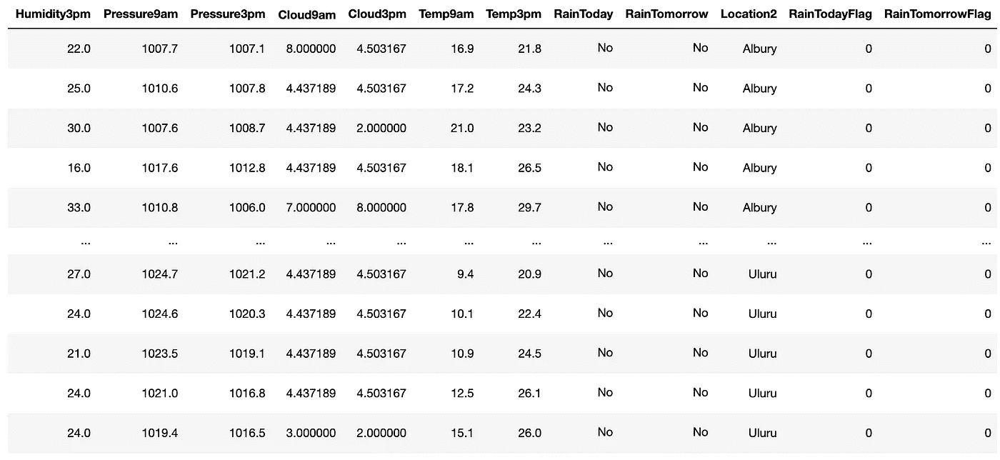

# K-Means 聚类——在 Python 中成功使用的综合指南

> 原文：<https://towardsdatascience.com/k-means-clustering-a-comprehensive-guide-to-its-successful-use-in-python-c3893957667d?source=collection_archive---------19----------------------->

## 机器学习

## 用真实数据的 Python 演示解释 K-Means 算法

k-均值聚类。图片由[作者](https://solclover.com/)提供。

# 介绍

如果你想成为一名成功的数据科学家，了解不同的机器学习算法是如何工作的是至关重要的。

这个故事是解释每个算法的细微差别的系列的一部分，并提供了一系列 Python 示例来帮助您构建自己的 ML 模型。

# 故事涵盖以下主题:

*   K-Means 所属的算法类别
*   K-Means 算法如何工作的解释
*   k-意味着限制和如何处理它
*   关于如何执行 K 均值聚类的 Python 示例

# K-Means 属于哪一类算法？

作为一名数据科学家，你会非常清楚，对所有不同的机器学习算法进行计数和分类几乎是不可能的。这部分是因为他们太多了。同时，它们跨越多个类别(例如，神经网络可以用于解决广泛的问题，包括分类和回归，所以我将它们放在自己的类别中)。

尽管如此，我还是试图收集一些最常用的信息，你可以在下面的**互动**旭日图中看到。确保点击👇在不同的类别上对**进行放大并揭示更多的**。

至于 K-Means，它是属于聚类算法组的无监督机器学习技术的一部分。这些常用于根据所选特征(属性)的相似性对客户、对象或其他项目进行分组(聚类)。

机器学习算法分类。由[作者](https://solclover.com/)创建的交互式图表。

***如果你喜欢数据科学和机器学习*** *，请* [*订阅*](https://solclover.com/subscribe) *每当我发布一个新的故事，你都会收到一封电子邮件。*

# K-Means 算法是如何工作的？

K-Means 是最著名和最常用的算法之一，因为它的简单性和速度。虽然，同时，它也有一些限制(稍后会详细说明)。

它旨在利用几个简单的步骤，通过多次迭代来重复这些步骤。在完成下面列出的步骤时，您可以参考下面的 gif 以获得直观的解释。

k-均值聚类在行动中。图片来自[作者](https://solclover.com/)。

1.  该算法的第一步是初始化定义数量的质心(在图表中用 X 表示)。
2.  计算每个点(向量)和每个质心之间的距离，然后将点分配给最近的质心。
3.  然后，基于同一组(群)中所有点(向量)的平均值，给每个质心分配一个新位置。
4.  然后重复该过程，根据新的质心位置和新计算的平均值重新分配点，得到质心的新位置。
5.  迭代继续，直到质心不再改变它们的位置或者达到定义的最大迭代次数。

# k-意味着限制和如何处理它

## 定义聚类的数量

在使用 K-Means 开始聚类过程之前，需要定义想要有多少个聚类。如果您有一个只有 2 或 3 维的简单数据集，您可以绘制数据并对其进行可视化分析，以决定最合适的分类数。

然而，这并不理想，尤其是如果您有更多的属性(维度)。为了帮助决定合适的集群数量，您可以使用“肘”方法。为此，多次运行 K-Means 聚类，每次尝试不同数量的聚类，并记录 WCSS 的值(在聚类平方和内)。注意，WCSS 在 sklearn 中被称为“惯性”。

完成后，将 WCSS 值绘制到如下所示的折线图上(本文后面的 Python 部分将展示如何执行此操作的具体步骤):

选择理想聚类数的肘图。图片由[作者](https://solclover.com/)提供。

WCSS 随着你引入更多的集群而减少。然而，在某个点之后，WCSS 的减少仅仅是最小的，这表明不需要将聚类分成更多的聚类，因为这些聚类中的点更相似而不是不同。

在上面的例子中，“肘”在 k=3 或 k=4 附近。因此，3 或 4 是您想要的最大集群数。注意，我用这个图表为你之前看到的澳大利亚城市 gif 决定了 4 个集群。

## 质心初始化

基本的 K-Means 算法随机初始化质心。因此，根据质心的初始位置，结果可能会有所不同，并且可能不是最佳的。

要解决这个问题，您可以采用以下策略:

*   多次初始化质心并选择最佳运行(最低 WCSS)
*   使用 k-means++提供的智能初始化

以上两者都是在 [sklearn 的 KMeans 算法](https://scikit-learn.org/stable/modules/generated/sklearn.cluster.k_means.html)中作为默认设置实现的。

## 距离算法

K-Means 使用空间中不同点(向量)之间的欧几里德距离来识别哪些点属于一起。因此，您还需要注意以下几点:

*   在 K-Means 算法中只能使用数值属性。如果您想在聚类中使用分类类型，首先需要将它们转换为数字类型。有多种方法可以做到这一点，比如使用 [sklearn 的序数编码器](https://scikit-learn.org/stable/modules/generated/sklearn.preprocessing.OrdinalEncoder.html)或者类似的方法。
*   请注意您在聚类中使用的属性的规模和分布。您可能希望首先通过删除异常值或引入“范围上限”来排除异常值你可能还想使用[能量转换](https://scikit-learn.org/stable/modules/generated/sklearn.preprocessing.PowerTransformer.html#sklearn.preprocessing.PowerTransformer)或[最小-最大缩放](https://scikit-learn.org/stable/modules/generated/sklearn.preprocessing.minmax_scale.html#sklearn.preprocessing.minmax_scale)来转换和拟合你的每个属性的分布到相同的范围。
*   最后，根据您的数据类型和使用案例，您可能更喜欢使用基于密度的算法，而不是基于距离的算法。

# 使用真实世界数据的 Python 中的 K-Means

## 设置

我们将使用以下数据和库:

*   来自 Kaggle 的澳大利亚天气数据
*   [Scikit-learn library](https://scikit-learn.org/stable/index.html) 执行 [K-Means](https://scikit-learn.org/stable/modules/generated/sklearn.cluster.k_means.html) 聚类
*   用于数据可视化的 [Plotly](https://plotly.com/python/) 和 [Matplotlib](https://matplotlib.org/)
*   [熊猫](https://pandas.pydata.org/docs/)用于数据操作
*   [Geopy](https://geopy.readthedocs.io/en/stable/) ，[进度条](https://pypi.org/project/progressbar/)，采集澳大利亚城市坐标的时间

让我们导入所有的库:

然后我们从 Kaggle 获取澳大利亚的天气数据，你可以按照这个链接下载:[https://www . ka ggle . com/jsphyg/weather-dataset-rattle-package](https://www.kaggle.com/jsphyg/weather-dataset-rattle-package)。

我们接收数据并派生出一些新的变量，比如 Location2，它具有使用 Geopy 提取城市坐标的正确格式。

经过一些修改的 [Kaggle 的澳大利亚天气数据](https://www.kaggle.com/jsphyg/weather-dataset-rattle-package)片段。图片由[作者](https://solclover.medium.com/)提供。

因为我们的原始数据只包含位置(城市)名称而不包含坐标，所以我们将使用 Geopy 的名称来获取这些坐标。请注意，我们在每次调用之间添加了 1 秒钟的睡眠时间，以避免服务器过载。

这是我们得到的回报片段:

澳大利亚城市坐标。图片由[作者](https://solclover.com/)提供。

我们也可以把它标在地图上:

地图上的澳大利亚城市。图片由[作者](https://solclover.com/)提供。

## k 均值聚类

如前所述，我们需要做的第一件事是确定我们需要多少个集群。为此，我们使用“肘”的方法。代码如下:

选择理想聚类数的肘图。图片作者[作者](https://solclover.com/)。

假设我们无法在 3 个或 4 个集群之间做出决定，那么我们执行集群并可视化这两个选项:

上面的代码产生以下摘要:

k-均值聚类结果。图片由[作者](https://solclover.com/)提供。

然后，我们将聚类标签附加回 df_loc 数据框，并在地图上绘制结果。请注意，您将需要从['Clust3']更改为['Clust4']，添加额外的颜色，并指向 model4 以生成第二个图。

3 组:

澳大利亚城市集群:3 个集群。图片由[作者](https://solclover.com/)提供。

4 个集群:

澳大利亚城市集群:4 个集群。图片由[作者](https://solclover.com/)提供。

# 结论

聚类很少是分析的终点。在很多情况下，这只是一个开始。

例如，您可能希望使用澳大利亚的天气数据构建一个监督分类模型来预测明天下雨的可能性。城市位置可能是一个重要的特征，因为附近地方的气候往往是相似的。因此，您可以决定使用上述分类作为您输入到预测模型中的特征之一。

最后，不管你的目标是什么，我希望这个故事能帮助你更好地理解 K-Means 聚类，并让你有信心亲自尝试一下。

如果您有任何问题或建议，请随时告诉我！

干杯！👏
**索尔·多比拉斯**

***如果你已经花光了这个月的学习预算，下次请记得我。*** *我的个性化链接加盟媒介是:*

<https://solclover.com/membership>  

我还挑选了一些你可能喜欢的额外读物:

</hac-hierarchical-agglomerative-clustering-is-it-better-than-k-means-4ff6f459e390>  </bbn-bayesian-belief-networks-how-to-build-them-effectively-in-python-6b7f93435bba> 