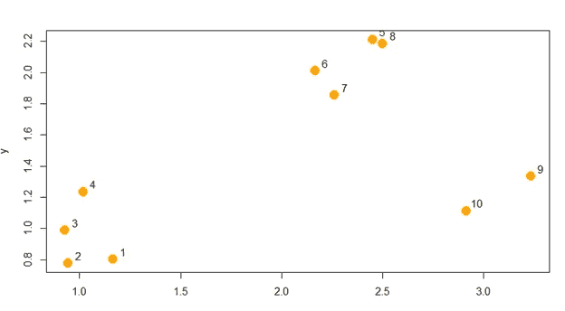
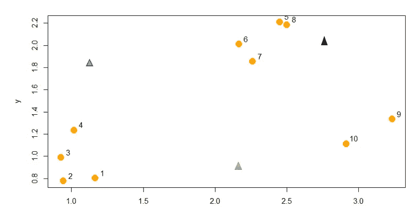
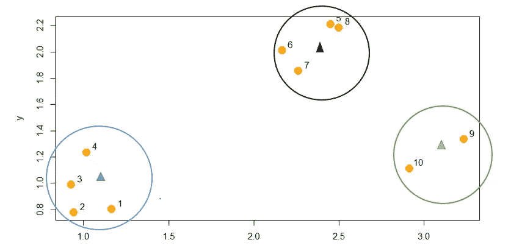
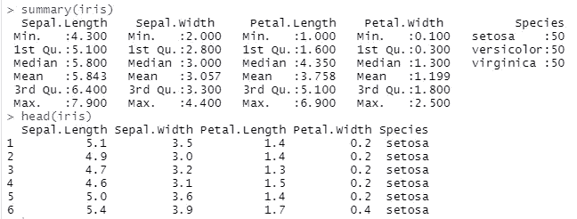
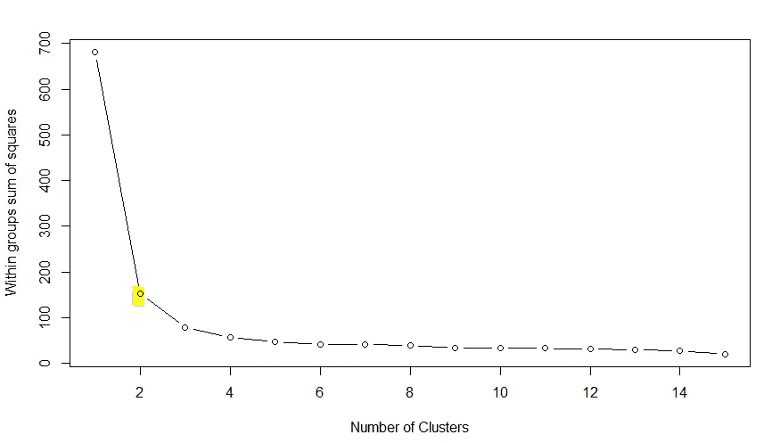
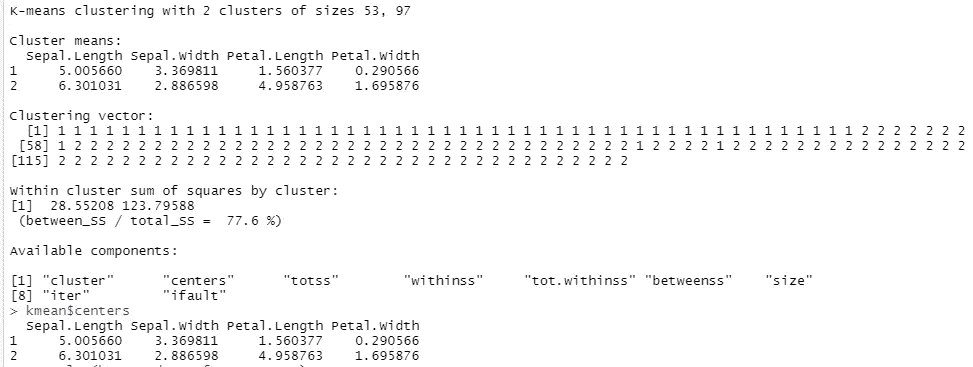
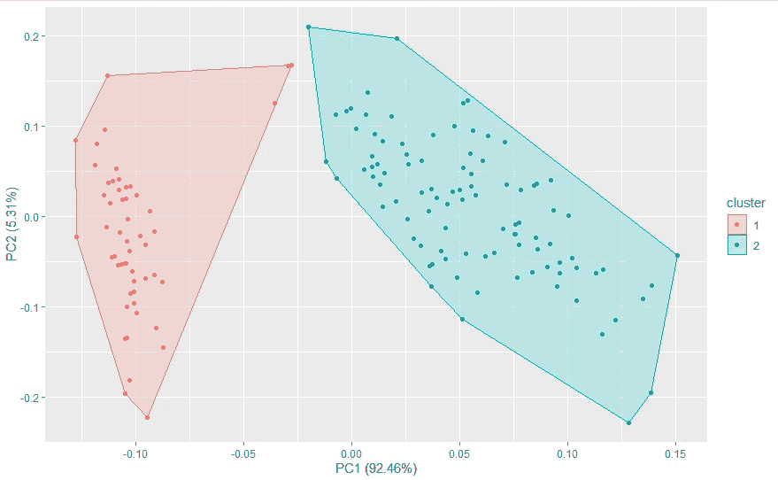
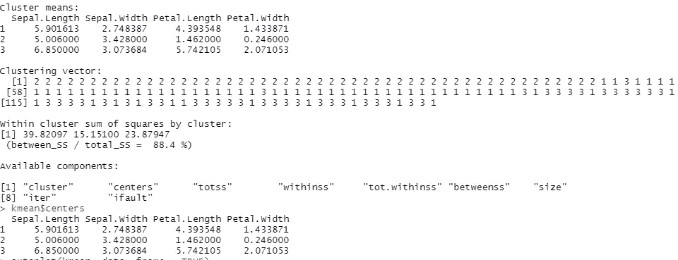
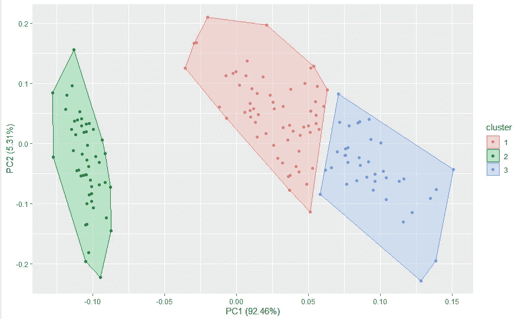

# K-Means 聚类:数据科学 R 中的概念和实现

> 原文：<https://towardsdatascience.com/k-means-clustering-concepts-and-implementation-in-r-for-data-science-32cae6a3ceba?source=collection_archive---------3----------------------->

## 介绍如何理解用 R 实现的 kmeans 并选择最佳的 K

机器学习中的聚类算法是无监督的技术(那些有输入数据但没有标记响应的技术)。他们的目标是绘制数据模式，并根据相似性将数据观察结果分成不同的组。K-Means 聚类是实现成功汇总高维数据的聚类算法的一种方式。

> K-means 聚类将一组观察值划分为固定数量的聚类，这些聚类最初是基于它们的相似特征指定的。


[Vino Li](https://unsplash.com/@vinomamba24?utm_source=unsplash&utm_medium=referral&utm_content=creditCopyText) 在 [Unsplash](https://unsplash.com/collections/1218220/animal-references?utm_source=unsplash&utm_medium=referral&utm_content=creditCopyText) 上拍照

然而，问题出现了，对群体的观察:

1)事物彼此相似是什么意思？

2)我们如何确定事物之间的距离是否足够近，可以归为一组？

回答这两个问题，决定最佳 K，理解 K-means 概念并在 R 中的数据集上实现它是这篇博客的范围。

一旦我们定义了 **a)我们需要的聚类数量，b)定位我们的聚类(质心)的初始猜测，以及 c)距离度量**，我们就可以应用 K-means 来获得聚类质心的最终估计和质心的每个观察的分配。

## **理解算法:**

为了便于理解，让我们假设我们有一个总共有 10 个观察值的数据集。查看数据，我们可以得出结论，数据可以很容易地分为 3 个不同的集群，所以我们用这个。

首先，我们选择我们想要对数据进行分类的聚类数(这是 K-means 中的 K)。这里，让我们决定 K = 3，因为这是可以直观推断的；一会儿我们将讨论确定 K 的技术方法。



样本数据集(图片由作者提供)

下一步是随机决定三个不同的初始数据点，作为我们的聚类或图表上的“质心”，如下图中的彩色三角形所示。然后，我们测量“1”数据点和三个质心之间的距离，并为其指定最接近的质心的颜色。这将被重复，直到所有的数据点都被分配给任何一个质心。



选择随机的 K 形心(图片由作者提供)

接下来，我们计算每个聚类的平均值，它对应于每个质心的数据点。这个平均值现在是每个质心的新位置，我们在图上重新定位它们，如下所示。我们计算每个点与所有质心的距离并相应地给它们着色的部分将再次重复，直到质心的位置不再改变。下面的图表是我们期望得到的，一旦没有更多的变化。



将质心重新定位到它们的聚类点(图片由作者提供)

这就是 K-means 如何基于距离度量将我们的数据集分割成指定数量的聚类。我们在二维图中使用的距离度量是欧几里德距离(x + y 的平方根)。

## 在 R 中实现 K-means:

**第一步:安装相关的包并调用它们的库**

```
install.packages("dplyr")
install.packages("ggplot2")
install.packages("ggfortify")library("ggplot2")
library("dplyr")
library("ggfortify")
```

**第二步:加载并理解数据集**

Iris 是一个内置的数据集，它包含来自 3 种不同类型的鸢尾物种(*鸢尾*、*杂色*和*海滨鸢尾*)的 150 个花朵观察结果。我们将用它来进行算法测试。

```
summary(iris)
head(iris)
```



(图片由作者提供)

**步骤 3:消除目标变量**

由于观察值的分类已经在这个数据集中完成，我们需要从代码中删除目标变量，因为我们希望我们的算法能够自己完成这项工作。为此，我将把 iris 的前四列加载到我的数据框‘data’中。

```
data <- select(iris, c(1:4))
```

> **如何确定 K 用什么值？**

**第四步:肘穴手法**

虽然有许多方法来决定要选择的聚类数，但广泛使用的是 ***肘点法*** (虽然不是很准确，我们将看到为什么)。其思想是通过将每个聚类内的变化相加来评估聚类的质量(跟踪这一点并以不同的起点重新开始)，具有最小变化的参数获胜。肘点法绘制了变异减少与聚类数(K)的关系，肘点是 K 的一个数值，在此之后变异不是很陡，是我们的最佳 K。

我们没有一个内置的函数来衡量我们观察结果的变化程度。但是，有一个 Rpubs 文档为我们创建了一个 wssplot 函数(在组平方和图内)来实现我们的肘点方法。

```
wssplot <- function(data, nc=15, seed=1234){
  wss <- (nrow(data)-1)*sum(apply(data,2,var))
  for (i in 2:nc){
    set.seed(seed)
    wss[i] <- sum(kmeans(data, centers=i)$withinss)}
  plot(1:nc, wss, type="b", xlab="Number of Clusters",
       ylab="Within groups sum of squares")
  wss
}
```

该图显示了 K = 2 时的锐边，表明数据集的最佳聚类数为 2。



WSS 情节(作者图片)

**第五步:实施 K-means**

正如它看起来那样简单，kmeans()只需要我们输入数据帧，并指定 K 来运行。

```
kmean <- kmeans(data, 2)
kmean$centers
```

kmean$clusters 将返回一个范围从 1 到 2 的数字向量，描述哪些观察值属于分类 1 和分类 2。kmean$centers 返回每个质心的位置。例如，聚类 1 具有萼片的平均值。长度= 5.00，萼片宽度= 3.36，花瓣。长度= 1.56，花瓣宽度= 0.29。



(图片由作者提供)

**步骤 6:绘制聚类中的数据点**

尽管这个图看起来很棒，并且已经清楚地将我们的观察结果分成了 2 个组，但是我们已经知道我们的数据集总共有 3 个组。我们的肘点技术在给出正确的 K 值时并不完全准确。因此，根据经验，最好是在肘点周围的 K 值之间迭代，并自己决定最佳的行动方案。

```
autoplot(kmean, data, frame = TRUE)
```



聚类后的数据图表，K = 2(图片由作者提供)

**第七步:K 表示 K = 3**

既然我们已经决定改变 K 并查看数据模式，那么让我们看看结果是如何变化的。

```
kmean <- kmeans(data, 3)
kmean$centers
```



(图片由作者提供)

**步骤 8:绘制新的聚类图**

我们看到 kmean$clusters 现在如何将观察结果分成三个类，kmean$centers 也更新了质心值。下图显示了基于 3 个集群的分组。同样，K 规格取决于我们；确定 K 值的技术可以给我们一个很好的估计。



聚类后的数据图表，K = 3(图片由作者提供)

K-means 是一种有效的机器学习技术，它:

*   易于实施和应用
*   具有很强的可解释性
*   产生比分层聚类更紧密的聚类
*   计算速度很快

然而，通过迭代方法手动选择 *K、依赖于初始聚类以及由于离群值*导致的质心位置不准确是 kmeans 的一些缺点。这篇博文重点解释了 kmeans 的主要概念，讨论了一种确定 K 值的技术，用 R 实现了 kmeans，并强调了它的一些优点和缺点。