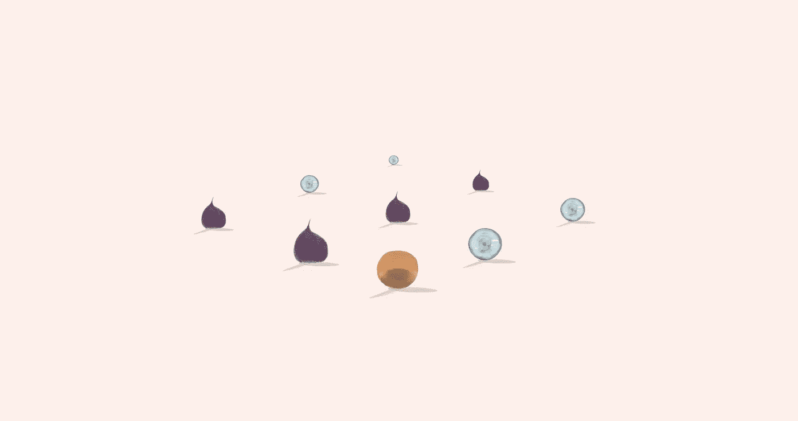
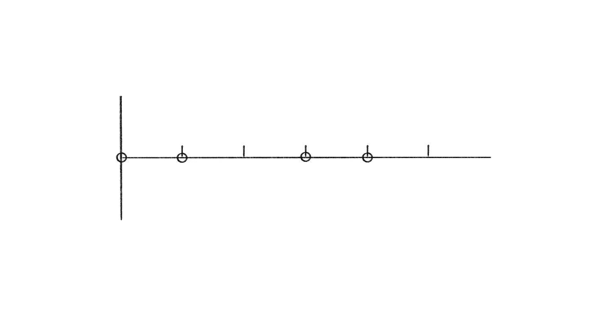
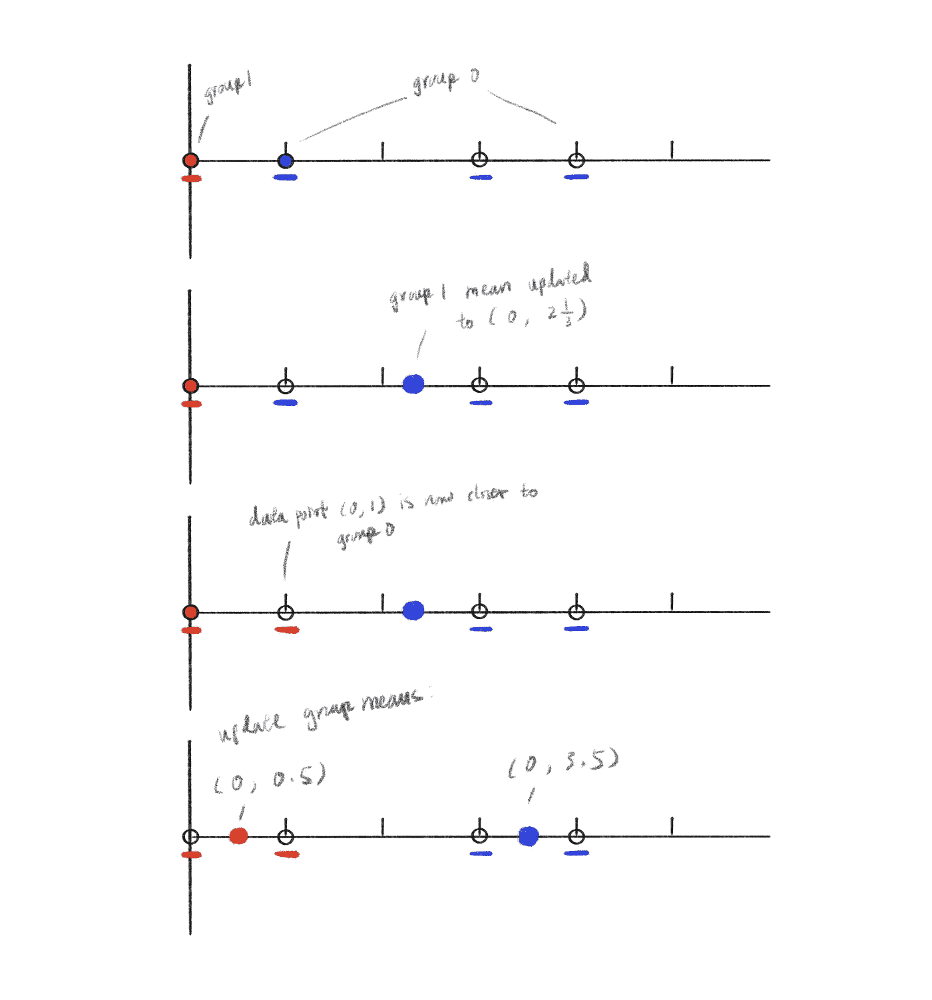
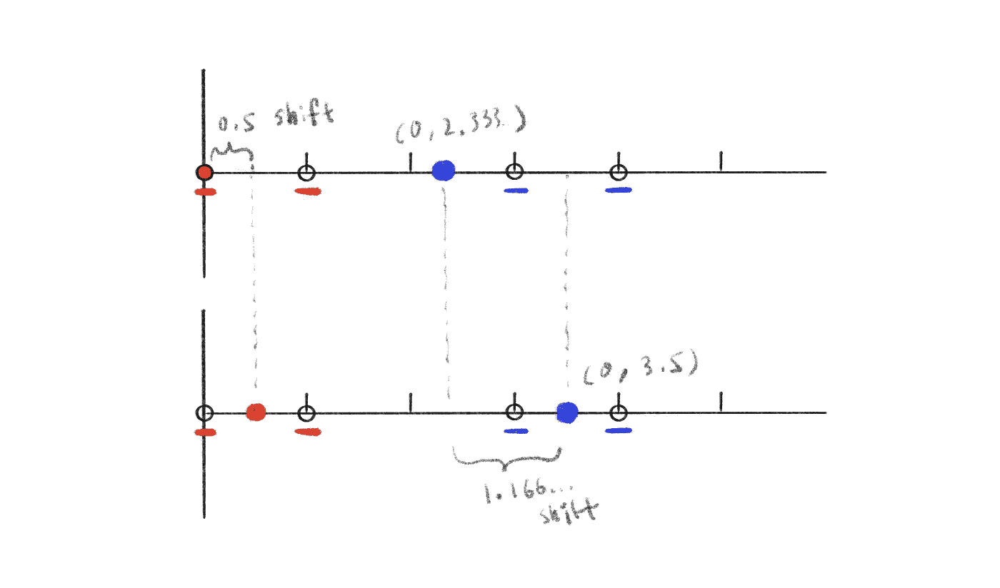

# K-means 聚类:找到我的部落！

> 原文：<https://towardsdatascience.com/k-means-clustering-find-my-tribe-61460d3bc952?source=collection_archive---------30----------------------->

## 它是如何工作的？我怎样才能让它跑得更快？



(图片由作者提供)

K-means 聚类在需要发现大量样本之间关系的数据分析问题中有许多潜在的应用。该技术背后的概念非常简单，因此也非常灵活，它可以单独用于许多可能的配置，或者与其他机器学习技术结合使用。让我们来看看 K-means 聚类是如何工作的，以及一些可能的改进方法。

## 什么是 K-means 聚类？

> 查找隐藏信息

K-means 聚类的核心是一种试图根据某些规则对样本数据进行分类的算法。如果我们的样本数据是实数的向量，最简单的标准是数据之间的距离。

假设我在二维空间中有 4 个样本数据点:

(0, 0), (0, 1), (0, 3), (0, 4)



数据点:(0，0)，(0，1)，(0，3)，(0，4)(图片由作者提供)

还有假设我知道我有两个组，我怎么找到两个组的中心和每个组的成员数据点？

第一步是为每组选择两个起点。在这个例子中，很容易观察，比如说，选择(0，0)作为第一组的起点，选择(0，3)作为第二组的起点。

但是我们不要这样做，因为那样会使这个例子太简单。

假设我实际上选了(0，0)和(0，1)作为起点，(0，0)代表组 0，(0，1)代表组 1。下一步是将四个数据点分配给两组中的每一组。我们通过计算数据点到每个组的距离，并将每个数据点分配到最近的一个组来实现这一点。

从数据点(0，0)开始，它的最近点显然是(0，0)，距离为 0，所以数据点(0，0)被分配到组 0。移动到第二个数据点，(0，1)，它更接近组 1，所以将其分配到组 1。在检查完每个数据点后，我们有:

```
group 0:
    data points = (0, 0)
group 1:
    data points = (0, 1), (0, 3), (0, 4)
```

既然我们已经将数据点分配给了每个组，那么需要更新每个组的平均值。组 0 的平均值保持在(0，0)不变，但是组 1 的平均值现在是:

```
mean of group 1 = [(0, 1) + (0, 3) + (0, 4)] / 3 = (0, 2.333...)
```

我们有了新的团队:

```
group 0:
    mean = (0, 0)
group 1:
    mean = (0, 2.333...)
```

但是现在我们已经更新了组均值，需要重新分配每个组的数据点，以确保它们仍然最接近其组均值:

```
(0, 0): closest to (0, 0)
(0, 1): closest to (0, 0)!!
(0, 3): closest to (0, 2.333...)
(0, 4): closest to (0, 2.333...)
```

请注意，点(0，1)不再最接近组 1 的平均值，因此需要将其重新分配给组 0:

```
group 0:
    data points = (0, 0), (0, 1)
group 1:
    data points = (0, 3), (0, 4)
```

在将数据点分配到组和更新组均值之间交替，我们最终达到稳定状态，其中不再有数据点切换组，这就是我们最终的 K 均值聚类:

```
group 0:
    mean = (0, 0.5)
    data points = (0, 0), (0, 1)
group 1:
    mean = (0, 3.5)
    data points = (0, 3), (0, 4)
```



(图片由作者提供)

## 结构

> 定义算法的结构

从上面的例子中我们可以看出，算法可以分为两个部分，初始化和聚类。让我们来定义算法的过程:

```
import copy
import numpy as np

class KMean:

    def __init__(self, samples):

        self._samples = np.array(samples)
        self._clusters = [-1] * len(samples)
        self._means = None
        self._processed = False

    @property
    def samples(self):
        return self._samples

    @property
    def means(self):
        return self._means

    @means.setter
    def means(self, new):
        self._means = new

    @property
    def clusters(self):
        return self._clusters

    @clusters.setter
    def clusters(self, new):
        self._clusters = new

    def init(self):
        raise ValueError("init not implemented")

    def cluster(self):
        raise ValueError("cluster not implemented")

    @staticmethod
    def _cls_of(func):
        return func.__func__.__qualname__.split('.')[0]

    def process(self):
        if self._processed:
            print("Process already completed")
            return

        print(f"Initializing with {self._cls_of(self.init)}")
        **self.init()**
        print(f"Initial means: {self.means}")
        print(f"Clustering with {self._cls_of(self.cluster)}")
        **self.cluster()**
        print(f"Processing {self.__class__.__name__} complete")
        self._processed = True
```

## 初始化

> 从哪里开始

初始化可能非常简单，所以接下来让我们来研究一下。
最简单的方法是手动输入你想要的起点:

```
class InitInput(KMean):
    def __init__(self, input_means, **kwargs):
        self._input_means = input_means
        super().__init__(**kwargs)

    def init(self):
        self.means = self._input_means
```

测试它:

```
init1 = InitInput(input_means=[[0, 0], [0, 1]],
                  samples=[(0, 0), (0, 1), (0, 3), (0, 4)])
init1.init()
print(init1.means)
"""
[[0, 0], [0, 1]]
"""
```

如果你知道你想从哪里开始或者当你在做研究的时候，这是非常好的。但是，当您的样本量很大，并且不知道数据点是否随机排列时，最好随机选择起始点:

```
class InitForgy(KMean):
    def __init__(self, k, **kwargs):
        self._k = k
        super().__init__(**kwargs)

    def init(self):
        indices = np.random.choice(
            len(self.samples),
            size=self._k,
            replace=False,
        )
        self.means = [copy.deepcopy(self.samples[idx]) for idx in indices]
```

这种方法被称为 Forgy 方法，测试它:

```
init2 = InitForgy(k=2,
                  samples=[(0, 0), (0, 1), (0, 3), (0, 4)])
init2.init()
print(init2.means)
"""
[array([0, 1]), array([0, 3])]
"""
```

## 使聚集

> 如何找到最佳聚类

对样本数据进行聚类包括在将数据点分配到组和更新组均值之间进行交替，最简单的方法是在算法的每次迭代期间，遍历每个点，计算该点到每个组均值的距离，并将数据点分配到最近的组。这就是所谓的劳埃德方法:

```
class ClusterLloyd(KMean):
    def __init__(self, tolerance=0, **kwargs):
        self._tolerance = tolerance

        self._history = []
        super().__init__(**kwargs)

    @property
    def history(self):
        return self._history

    @staticmethod
    def _calc_dist(sample, mean):
        diff = sample - mean
        dist = np.dot(diff, diff)
        return dist

    def _calc_cluster(self, sample):

        **# loop through each cluster to find the closest cluster
        idx = None
        dist = None
        for i, mean in enumerate(self.means):
            cur_dist = self._calc_dist(sample, mean)
            if idx is None or cur_dist < dist:
                idx = i
                dist = cur_dist**

        return idx

    def _calc_shift(self, new_clusters):

        shifted = 0
        for i, c in enumerate(new_clusters):
            if c != self.clusters[i]:
                shifted = shifted + 1

        shift = shifted / len(new_clusters)
        return shift

    def _calc_means(self, new_clusters):

        means_map = {}

        for i, cluster in enumerate(new_clusters):
            if cluster not in means_map:
                means_map[cluster] = [self.samples[i], 1]
            else:
                curr = means_map[cluster]
                curr[0] = curr[0] + self.samples[i]
                curr[1] = curr[1] + 1

        means = copy.deepcopy(self.means)

        for k, v in means_map.items():
            new_mean = v[0] / v[1]
            means[k] = new_mean

        return means

    def _update(self, new_clusters):

        new_means = self._calc_means(new_clusters)
        self._history.append((new_clusters, new_means))

        self.clusters = new_clusters
        self.means = new_means

    def cluster(self):
        self._history.append((self.clusters, self.means))
        while True:
            new_clusters = []
            **# loop through each data point
            for sample in self.samples:
                new_clusters.append(self._calc_cluster(sample))**

            shift = self._calc_shift(new_clusters)
            if shift <= self._tolerance:
                break

            self._update(new_clusters)
```

测试它:

```
class InputLloyd(InitInput, ClusterLloyd):
    passkm1 = InputLloyd(input_means=[[0, 0], [0, 1]],
                 samples=[(0, 0), (0, 1), (0, 3), (0, 4)])
km1.process()
print(f"clusters: {km1.clusters}")
print(f"means: {km1.means}")
"""
Initializing with InitInput
Initial means: [[0, 0], [0, 1]]
Clustering with ClusterLloyd
Processing InputLloyd complete
clusters: [0, 0, 1, 1]
means: [array([0\. , 0.5]), array([0\. , 3.5])]
"""
```

我们发现我们的集群:

```
"""
clusters: [0, 0, 1, 1]
group 0: (0, 0), (0, 1)
group 1: (0, 3), (0, 4)
"""
```

## 三角不等式

> 通过巧妙的观察加速算法

劳埃德的方法很容易理解，但不是最有效的。如果考虑算法的时间复杂度，在聚类过程的每次迭代中，我们需要计算每个数据点到每个聚类均值的距离。如果我们有 N 个数据点和 K 个聚类，那将是:

~O(N * K)

实际上有几种方法可以加快这个过程。

其中一个涉及以下观察:


第 1 组最接近的数据点(0，0)平均值为 2.5(图片由作者提供)

在我们的聚类算法的最后一次迭代中，组 0 的平均值是(0，0.5)，组 1 的平均值是(0，3.5)，点(0，0)到其当前分配的组 0 的距离是 0.5。如果我们已经计算了聚类的距离平均值，在这种情况下，3，我们实际上不需要计算点(0，0)到组 1 的平均值(0，3.5)的距离，就可以知道点(0，0)不可能更接近组 1。

这是为什么呢？如上图的第二部分所示，两个组的距离为 3，而(0，0)到组 0 的距离为 0.5。所以，无论点(0，0)在离 0 组 0.5 的轨道上的什么地方，都不会比离 1 组 2.5 近！

这本质上是三角不等式:

> 三角形的一边总是比其他两边的总和短。

根据这一观察，我们可以更新劳埃德的方法，使其运行得更快:

```
class ClusterElkan1(KMean):
    def __init__(self, tolerance=0, **kwargs):
        self._tolerance = tolerance
        self._mean_maps = []
        self._history = []
        super().__init__(**kwargs)

    @property
    def history(self):
        return self._history

    @property
    def mean_maps(self):
        return self._mean_maps

    @staticmethod
    def _calc_dist(sample, mean):
        diff = np.array(sample) - np.array(mean)
        dist = np.dot(diff, diff)
        # note dist is actually distance squared
        # no need to take the square root
        return dist

    def _calc_cluster(self, sample_idx):

        idx = None
        dist = None
        for i, mean in enumerate(self.means):

            **# check if need to calc dist
            if dist is not None:
                cluster_dist = self.mean_maps[-1][(idx, i)]
                if dist * 4 < cluster_dist:
                    print(f"no need to recalculate dist for sample {sample_idx} with mean {i}")
                    continue**

            sample = self.samples[sample_idx]
            cur_dist = self._calc_dist(sample, mean)
            if dist is None or cur_dist < dist:
                idx = i
                dist = cur_dist

        return idx

    def _calc_shift(self, new_clusters):

        shifted = 0
        for i, c in enumerate(new_clusters):
            if c != self.clusters[i]:
                shifted = shifted + 1

        shift = shifted / len(new_clusters)
        return shift

    def _calc_means(self, new_clusters):

        means_map = {}

        for i, cluster in enumerate(new_clusters):
            if cluster not in means_map:
                means_map[cluster] = [self.samples[i], 1]
            else:
                curr = means_map[cluster]
                curr[0] = curr[0] + self.samples[i]
                curr[1] = curr[1] + 1

        means = copy.deepcopy(self.means)

        for k, v in means_map.items():
            new_mean = v[0] / v[1]
            means[k] = new_mean

        return means

    def _update(self, new_clusters):

        new_means = self._calc_means(new_clusters)
        self.clusters = new_clusters
        self.means = new_means
        self._update_history()

    def _update_mean_map(self):
        # calculate mean distances
        mean_map = {}
        for i, c in enumerate(self.means):
            for j, c_p in enumerate(self.means[i + 1:]):
                dist = self._calc_dist(c, c_p)
                mean_map[(i, j + i + 1)] = dist
                mean_map[(j + i + 1, i)] = dist
        self._mean_maps.append(mean_map)

    def _update_history(self):
        self._history.append((self.clusters, self.means))
        self._update_mean_map()

    def cluster(self):
        self._update_history()
        while True:
            new_clusters = []
            for i in range(len(self.samples)):
                new_clusters.append(self._calc_cluster(i))

            shift = self._calc_shift(new_clusters)
            if shift <= self._tolerance:
                break

            self._update(new_clusters)

class InputElkan1(InitInput, ClusterElkan1):
    pass
```

## 下限上限

> 又一次加速

这很聪明。然而，还有更聪明的方法来改进这个算法。

看看聚类算法的最后两次迭代:



第 1 组均值偏移 0.5，第 2 组均值偏移 1.166…(图片由作者提供)

第 0 组的平均值移动了 0.5，第 1 组的平均值移动了 1.166…

我们如何利用这些信息来避免多余的计算？

嗯，我们知道点(0，0)在移动之前与组 0 均值的距离为 0，如果组 0 均值移动了 0.5，那么点(0，0)和组 0 之间的距离最多为 0.5。

如果我们也知道点(0，0)与组 1 的平均值的距离为 2.333…，那么，在移位之后，点(0，0)与组 1 的平均值的距离至少为 1.166…(2.333 — 1.166)。

如果点(0，0)到组 0 的距离最多为 0.5，而点(0，0)到组 1 的距离至少为 1.166…，那么点(0，0)必须更靠近组 0！不需要计算到组的距离意味着！

加上这一改进，我们有了迄今为止最有效的算法:

```
class ClusterElkan2(KMean):
    def __init__(self, tolerance=0, **kwargs):
        self._tolerance = tolerance
        self._mean_maps = []
        self._history = []

        self._mean_shifts = None
        self._bounds = None

        super().__init__(**kwargs)

    def _setup_cluster(self):
        # the amount of shift of means from previous iteration
        self._mean_shifts = [0] * len(self.means)

        # a list of dict, each dict is bounds (ub for assigned cluster, lb for others) of a sample
        self._bounds = [{j: None for j in range(len(self.means))} for i in range(len(self.samples))]

    @property
    def history(self):
        return self._history

    @property
    def mean_maps(self):
        return self._mean_maps

    @property
    def mean_shifts(self):
        return self._mean_shifts

    @mean_shifts.setter
    def mean_shifts(self, new_shifts):
        self._mean_shifts = new_shifts

    @property
    def bounds(self):
        return self._bounds

    @staticmethod
    def _calc_dist(sample, mean):
        diff = np.array(sample) - np.array(mean)
        dist = np.dot(diff, diff)
        return dist

    def _calc_cluster(self, sample_idx):

        # modify to always start with the previously assigned cluster
        # modify to use lb and ub use one structure
        idx = self.clusters[sample_idx]
        dist = self.bounds[sample_idx][idx] + self.mean_shifts[idx] \
            if idx >= 0 and self.bounds[sample_idx][idx] is not None \
            else None
        if dist is not None:
            self.bounds[sample_idx][idx] = dist
        for i, mean in enumerate(self.means):

            if i != idx:
                # looping through a mean
 **# update lb if needed
                lb = self.bounds[sample_idx][i] - self.mean_shifts[i] \
                    if self.bounds[sample_idx][i] is not None \
                    else None
                if dist is not None and lb is not None:
                    if dist < lb:
                        print(f"no need to recalculate dist for sample {sample_idx} with mean {i} because of lower bound")
                        self.bounds[sample_idx][i] = lb
                        continue**

 **# check mean dist
                if dist is not None:
                    cluster_dist = self.mean_maps[-1][(idx, i)]
                    if dist * 4 < cluster_dist:
                        print(f"no need to recalculate dist for sample {sample_idx} with mean {i} because of mean dist")
                        continue**

                sample = self.samples[sample_idx]
                cur_dist = self._calc_dist(sample, mean)
                self.bounds[sample_idx][i] = cur_dist
                if dist is None or cur_dist < dist:
                    idx = i
                    dist = cur_dist

        return idx

    def _calc_shift(self, new_clusters):

        shifted = 0
        for i, c in enumerate(new_clusters):
            if c != self.clusters[i]:
                shifted = shifted + 1

        shift = shifted / len(new_clusters)
        return shift

    def _calc_means(self, new_clusters):

        means_map = {}

        for i, cluster in enumerate(new_clusters):
            if cluster not in means_map:
                means_map[cluster] = [self.samples[i], 1]
            else:
                curr = means_map[cluster]
                curr[0] = curr[0] + self.samples[i]
                curr[1] = curr[1] + 1

        means = copy.deepcopy(self.means)

        for k, v in means_map.items():
            new_mean = v[0] / v[1]
            means[k] = new_mean

        return means

    def _update(self, new_clusters):

        new_means = self._calc_means(new_clusters)
        self.clusters = new_clusters
        self.mean_shifts = [self._calc_dist(self.means[i], new_means[i]) for i in range(len(self.means))]
        self.means = new_means
        self._update_history()

    def _update_mean_map(self):
        # calculate mean distances
        mean_map = {}
        for i, c in enumerate(self.means):
            for j, c_p in enumerate(self.means[i + 1:]):
                dist = self._calc_dist(c, c_p)
                mean_map[(i, j + i + 1)] = dist
                mean_map[(j + i + 1, i)] = dist
        self._mean_maps.append(mean_map)

    def _update_history(self):
        self._history.append((self.clusters, self.means))
        self._update_mean_map()

    def cluster(self):
        self._setup_cluster()
        self._update_history()
        while True:
            new_clusters = []
            for i in range(len(self.samples)):
                new_clusters.append(self._calc_cluster(i))

            shift = self._calc_shift(new_clusters)
            if shift <= self._tolerance:
                break

            self._update(new_clusters) class InputElkan2(InitInput, ClusterElkan2):
    pass
```

通过这两个改进，我们可以有效地将 K-mean 算法在每次聚类迭代中的时间复杂度从~O(N * K)降低到~O(N)。

## 两种解决方案

> 不保证唯一的解决方案

让我们来看看下面这个问题:

```
data points = (0, 0), (0, 1), (0, 2), (0, 3)
number of clusters = 2
```

这一次，所有四个数据点的间距相等。

让我们以不同的起点将我们的算法应用于它:

```
# starting points [0, 0], [0, 1]
km2 = InputElkan2(input_means=[[0, 0], [0, 1]], samples=[(0, 0), (0, 1), (0, 2), (0, 3)])
km2.process()
print("Solution 1")
print(km2.clusters)
print(km2.means)

# starting points [0, 0], [0, 3]
km3 = InputElkan2(input_means=[[0, 0], [0, 3]], samples=[(0, 0), (0, 1), (0, 2), (0, 3)])
km3.process()
print("Solution 2")
print(km3.clusters)
print(km3.means)
"""
Solution 1
[0, 1, 1, 1]
**[array([0., 0.]), array([0., 2.])]**

Solution 2
[0, 0, 1, 1]
**[array([0\. , 0.5]), array([0\. , 2.5])]**
"""
```

我们得到两种不同的解决方案！

原因很明显，所有 4 个点都是等距的，解之间没有区别:

```
"""
[0, 1, 1, 1]
[0, 0, 1, 1]
[0, 0, 0, 1]
"""
```

那么这意味着什么呢？

对我来说，正确答案是没有一个解是正确的，聚类的个数不是两个，所以只有两个起点是没有办法正确聚类的。

我认为，对于这个特殊的问题，最合理的解决方案是(0，1.5)处的一个群集或者四个群集的每个点都属于它自己的群集。

## 结论

> 一切都还不完美

k-均值聚类是一个有趣的算法，可以非常有效。但是它并不完美，正如上一个例子所表明的那样。我们如何改进我们的算法来处理更复杂的情况？那是下次的故事！