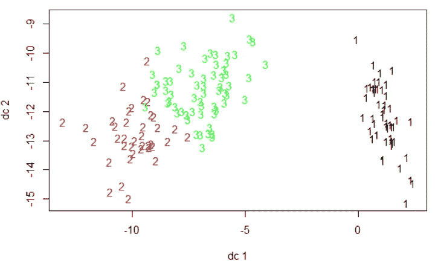

# R 中的 k-均值聚类

> 原文：<https://towardsdatascience.com/k-means-clustering-in-r-feb4a4740aa?source=collection_archive---------9----------------------->


作者的情节

# 介绍

K-均值聚类是机器学习中最流行的无监督学习方法之一。该算法有助于根据元素之间的距离从“n”个元素中识别“k”个可能的组(聚类)。

更详细的解释可能是:算法找出你的数据中每个元素之间的距离，然后找出质心的数量，将元素分配到最近的质心以形成聚类，最终目标是使每个聚类的大小尽可能小。

K-means 可以以多种方式使用。例如，客户细分、保险欺诈检测、文档分类等。

关于 K-means 算法的一个常见问题是它是否能处理非数字数据。简单的回答是否定的，因为算法使用的是观测值之间的距离。但是，有许多算法可以帮助将非数字要素转换为数字要素，这将允许您将 K-means 算法应用于您的数据。例如,“node2vec”模型——一种用于图形表示学习的算法框架——可以将数据转换为嵌入，这种嵌入以后可以用于 K-means。

另一个有趣的事实是，与大多数无监督学习算法不同，您必须对调整参数做出经验决策(或不断尝试不同的参数，直到您达到满意的状态)，您可以以某种方式对 K-means 执行超参数调整。我将在这篇博客中演示如何做到这一点。

# 个案研究

## Loda 数据

在这个案例研究中，我使用了 R 中的“iris”数据集。

```
data("iris")
?iris
```

> Edgar Anderson 的 iris 数据描述
> 这个著名的(Fisher 的或 Anderson 的)iris 数据集分别给出了 3 种 Iris 的 50 朵花的变量萼片长和宽以及花瓣长和宽的厘米测量值。这些物种是刚毛鸢尾、杂色鸢尾和海滨鸢尾。
> 
> 来源
> Fisher，R. A. (1936)分类问题中多重测量的使用。优生学年鉴，7，第二部分，179-188 页。
> 这些数据是由安德森·埃德加(1935)收集的。加斯佩半岛的鸢尾，美国鸢尾协会公报，59，2–5。
> 
> 参考文献
> 《新的 S 语言》。沃兹沃斯&布鲁克斯/科尔。(将 iris3 作为 iris。)


数据预览

在执行 K-means 算法之前，我首先检查了标签，以查看这个数据集中有多少个分类。

```
> levels(iris$Species)
[1] "setosa"     "versicolor" "virginica"
```

然后我把标签从原始数据中分离出来。这样，我们可以将数据视为新的、未标记的数据，用于无监督学习目的。

```
iris1 <- iris[,-5]
iris_label <- iris[,5]
```

由于虹膜数据中的所有变量都是数字，所以我不必做任何数据预处理。我假装以前从未看到过这个虹膜数据，所以我想知道模型的最佳 K 是什么(我在开始时提到的超参数调整)。

## 找到 K

在这一步中，我们需要知道两个术语，“wss”和“肘规则”，以帮助我们找到质心的最佳数量。

**WSS** : *质心内的总距离*。由于 K-means 算法的目标是保持每个聚类的大小尽可能小，因此小的 wss 表示每个数据点都接近其最近的质心，或者说模型返回了良好的结果。

**肘规则/方法** : *用于确定数据集*中聚类数量的试探法。你首先绘制出 wss 分数与 K 数的关系，因为随着 K 数的增加，wss 总会下降；然而，每个 k 值之间的下降幅度会逐渐减小，曲线看起来就像一只蜷曲的手臂。这样一来，你其次需要找出哪个点落在手肘上。

```
# to reproduce the results
# you have to use set.seed()
set.seed(1)
wss<- NULL
for (i in 1:10){
  fit = kmeans(iris1,centers = i)
  wss = c(wss, fit$tot.withinss)
}plot(1:10, wss, type = "o")
```


WSS 对 K


阅读图并应用肘方法

根据上面的图表，我们可以知道 k = 3 可能是答案。如果你还记得，原始数据确实有三个不同的物种。到目前为止，我们做得很好！然而，你必须记住，在现实世界中，数据往往既不完美，也没有标签。这些群体之间的关系比我们这里的要复杂得多。因此您可能会发现多个 K 可以满足您需求。然后，你将不得不一个一个地尝试，研究这些群体，并通过做更深入的研究来证明你的答案。

## 拟合和绘图

然后，我拟合了一个 k = 3 的 K 均值模型，并用“fpc”包绘制了聚类图。

```
fit <- kmeans(iris[,-5], 3)library(fpc)
plotcluster(iris[,-5],fit$cluster,pointsbyclvecd=FALSE)
```



k = 3 时的聚类图

注意:当 pointsbyclvecd = TRUE 时，图形的数据点将由更合理的符号表示，如字母数字。当该参数设置为 FALSE 时，符号将变得不那么“合理”，就像这个博客的特色图片所显示的那样。

## 估价

当您在 R 中应用 K-means 算法时，该函数将帮助您同时生成模型的多个统计数据，包括 TSS、BSS 和我们在上面讨论过的 WSS。

**TSS** :代表总平方和，即数据点与数据整体平均值的总距离。

**BSS** :是每个聚类到数据全局均值的距离之和。

并且， ***TSS = BSS + WSS*** 。

这里，我们可以用另一种方法来评估你适合的模型。由于我一再提到我们希望 WSS 尽可能小，因此，从理论上讲，BSS 与 TSS 的高比率是我们所寻求的。

```
> fit$betweenss/fit$totss
[1] 0.8842753
```

如果你想测试你的模型的准确性，我是这样做的:

```
# First, relabel the data with the cluster numberiris$cluster = fit$clusterfor (i in 1:length(iris$Species)){
  if (iris$cluster[i] == 1){
    iris$label[i] = "setosa"
  } else if (iris$cluster[i] == 3){
    iris$label[i] = "versicolor"
  } else {
    iris$label[i] = "virginica"
  }
}# Second, calculate the accuracy score
> mean(iris$label ==iris$Species)
[1] 0.8933333
```

有时，如果您有多个组，那么很难用 for 循环正确地重新标记数据。或者您只是想浏览来自同一个集群的数据，因为您的原始数据没有标记。您可以根据聚类数对它们进行二次抽样。我认为这也是一种处理你的数据的通用方法。您可以根据需要修改代码。

```
subsample <- list()
for(i in 1:3){
  subsample[[i]]<- iris[fit$cluster==i,]
}> table(subsample[[1]]$Species)
setosa versicolor  virginica 
50          0          0 > table(subsample[[2]]$Species)
setosa versicolor  virginica 
0          2         36 > table(subsample[[3]]$Species)
setosa versicolor  virginica 
0         48         14> 134/150
[1] 0.8933333
```

# 结论

作为最流行的无监督学习算法之一，K-means 可以帮助我们研究和发现未标记数据中的复杂关系，而这些关系很可能被我们忽略。

在这篇博客中，我讨论了在 R 中拟合 K-means 模型，找到最佳 K，并评估该模型。我也谈到了计算标记数据的准确度分数。

***请随时与我联系***[***LinkedIn***](https://www.linkedin.com/in/jinhangjiang/)***。***

# **相关博客**

[***用 R 计算会计分析的样板文件***](/use-r-to-calculate-boilerplate-for-accounting-analysis-f4a5b64e9b0d)

[***线性回归分析中的 R***](/linear-regression-analysis-in-r-fdd59295d4a8)

[***使用 NetworkX、Gephi 和 Node2Vec***](https://medium.com/analytics-vidhya/analyzing-disease-co-occurrence-using-networkx-gephi-and-node2vec-53941da35a0f) 分析疾病共现