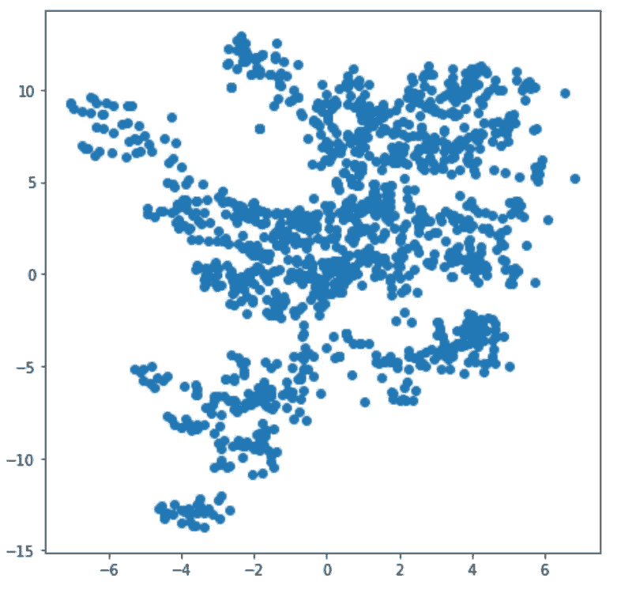
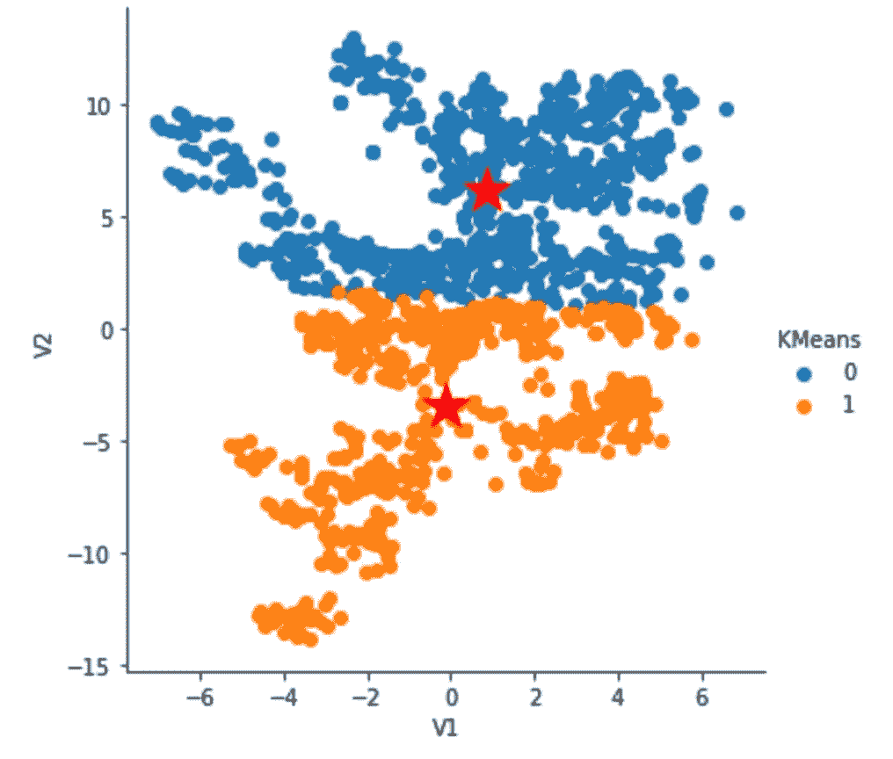
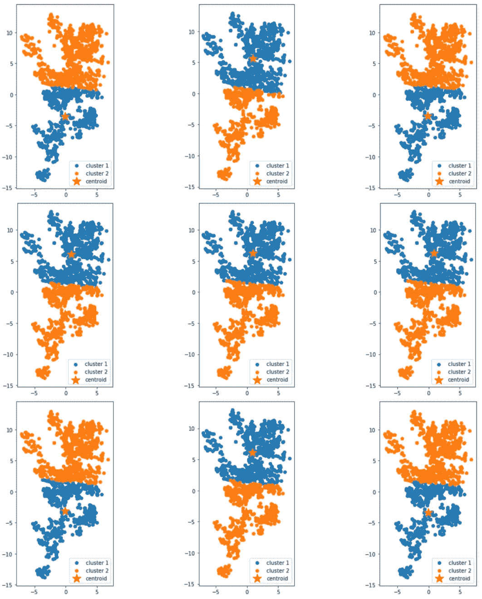
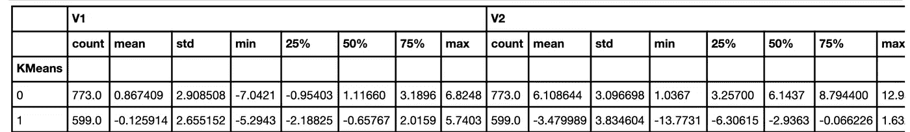
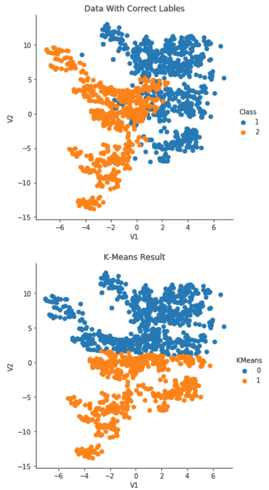

# K-Means 聚类项目:钞票认证

> 原文：<https://towardsdatascience.com/k-means-clustering-project-banknote-authentication-289cfe773873?source=collection_archive---------15----------------------->

## 使用 Python (Pandas，NumPy)收集和评估数据，并使用**scikit**-学习训练 K-Means 模型来检测钞票是真的还是伪造的。

你有没有遇到过这样的情况:当你在超市把钱交给店员时，却发现钱是假的，而你后面有一长串的人在等着结账？或者更尴尬的是，你没有携带其他纸币？我个人曾经经历过这种情况，被认为是一个不道德的小气鬼的尴尬在我脑海里停留了很长时间。这促使我进行这个项目，**建立一个 K-Means 聚类模型来检测一张钞票是真是假**。


照片由 [Ystallonne Alves](https://unsplash.com/@ystallonne?utm_source=medium&utm_medium=referral) 在 [Unsplash](https://unsplash.com?utm_source=medium&utm_medium=referral) 拍摄

## 数据集概述:

> 这个数据集是关于区分真钞和伪钞的。数据是从图像中提取的，这些图像取自真的和伪造的类似钞票的样本。对于数字化，使用通常用于印刷检查的工业相机。最终图像的像素为 400x 400。由于物镜和到所研究物体的距离，获得了分辨率约为 660 dpi 的灰度图像。小波变换工具用于从这些图像中提取特征。(来源:[https://www.openml.org/d/1462](https://www.openml.org/d/1462))

由于我是 ML 世界的初学者，我试图使这个项目尽可能简单，只专注于运行 K-Means 模型和计算结果。因此，出于关注 K-Means 本身的目的，我只挑选了两个变量来建立模型，它们是 V1(小波变换图像的方差)和 V2(小波变换图像的偏斜度)。

好吧，在进入这个项目之前，让我带你看一下这个项目的每一步:

> 步骤 1:收集和评估数据。([全码](https://github.com/YuehHanChen/K-Means_Project_Banknote_Authentication/blob/main/Banknote_Authentication.ipynb))
> 
> 第二步:运行 K 均值。([全码](https://github.com/YuehHanChen/K-Means_Project_Banknote_Authentication/blob/main/Banknote_Authentication.ipynb))
> 
> 第三步:重新运行 K-means 几次，看看我们是否得到类似的结果，这可以看出 K-Means 模型是否稳定。([全码](https://github.com/YuehHanChen/K-Means_Project_Banknote_Authentication/blob/main/Banknote_Authentication.ipynb))
> 
> 步骤 4:分析 K 均值计算结果
> 
> 第五步:计算结果的准确度！([全码](https://github.com/YuehHanChen/K-Means_Project_Banknote_Authentication/blob/main/Banknote_Authentication.ipynb))

我们开始吧！

> 步骤 1:收集和评估数据。



作者图片

构建 K-Means 的第一步是评估该数据集是否适合 K-Means；如果不是，那么我们应该选择其他的聚类模型。看到这个图后，我发现图中的数据分布既不太宽，也不太集中在一个地方，因此值得尝试在这个数据集上计算 K-Means。但是，在球形中没有明显的集群，所以我们应该预计 K-Means 模型在这里不会完美地工作。

> 第二步:运行 K 均值。



作者图片

开始符号是每个集群的质心。这张图看起来很好。

> 第三步:重新运行 K-means 几次，看看我们是否得到类似的结果，这可以确保 K-Means 模型在数据集中是稳定的。

代码的这一部分受到了《T2》这篇著名的 K-Means 文章的作者达布拉的启发。



作者图片

我的第三步是运行 K-Means 几次，因为 K-Means 将随机选择初始位置作为质心，然后它们将根据每个聚类成员的平均距离改变它们的位置，这将被设置为新的质心。因此，我们通常会在每次重新运行 K-Means 时得到不同的结果，但如果结果在许多测试中差异太大，则意味着 K-Means 可能不适合此数据集，因为它不稳定。在这里，运行 9 次 K-Means 后，我们得到的结果非常相似，这意味着这里的 K-Means 是稳定的。

> 步骤 4:分析 K 均值计算结果



作者图片

大约有 600 个数据聚集在组 0 中，大约有 773 个数据聚集在组 1 中。对于第一组，V1 的平均值= ~-0.12，V2 的平均值= ~-3.5。而对于第二组，V1 的平均值为 0.86，V2 的平均值为 6.1。

> 第五步:计算结果的准确度。

首先，让我们用正确的标签和 K 均值结果来可视化数据:



作者图片

我们可以看到，K-均值在 V2 = 1 时倾向于被一条水平线分割，而原始均值在 V1 =0 时倾向于被一条稍微倾斜的垂直线分割。这显示了 K-Means 的一个缺点，即 K-Means 给予较大的聚类更多的权重。(K-Means 中的组 1 倾向于包括在下面位置的较大的聚类。)让我们来计算这个 K-Means 聚类模型的准确性:

```
0.6528081692195478
```

**K 均值结果:该 K 均值模型的准确率为 65.3%。**

不错！由于我在这里没有进行任何数据清洗过程和预分析，所以获得 65.3%的准确率是相当合理的。但是，如果您对优化准确率感兴趣，您可以考虑进行因子分析，以找到最有影响力的变量放入模型中。那么你会得到一个更好的结果！(对于对因子分析感兴趣的读者，我发现 DataCamp 有一篇关于 python 中因子分析的很好的介绍文章。)

感谢您花时间阅读这篇文章。

如果你是想找数据科学实习生的雇主，这是我的 [LinkedIn](https://www.linkedin.com/in/yueh-han-chen/)

如果你也在数据科学/商业分析领域工作，请随时通过 IG( [@jchen_mmm](https://www.instagram.com/jchen_mmm/) )、电子邮件或下面的评论给我任何反馈！