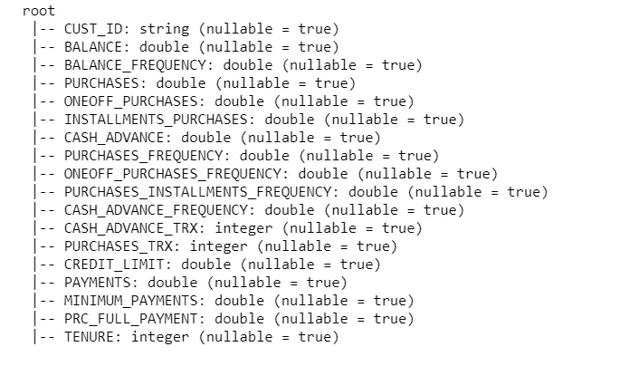
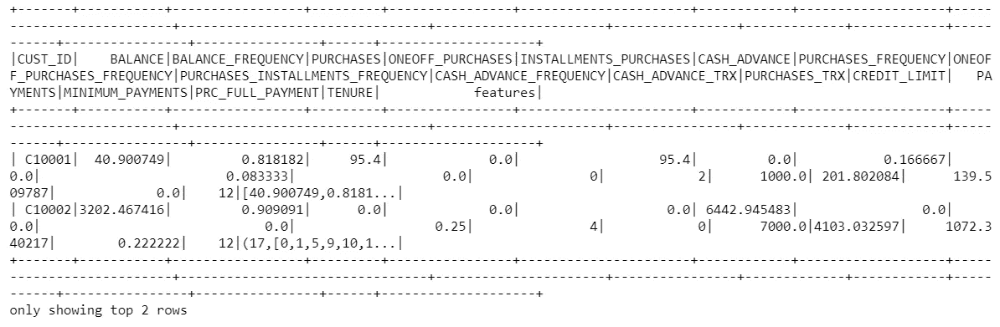
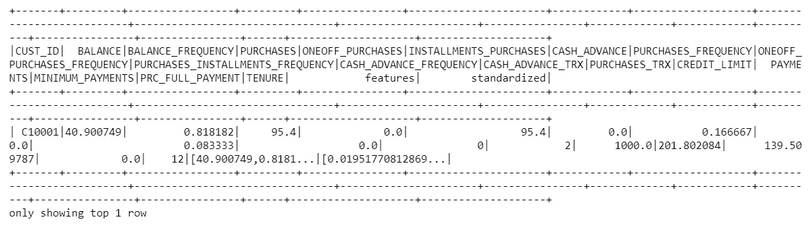
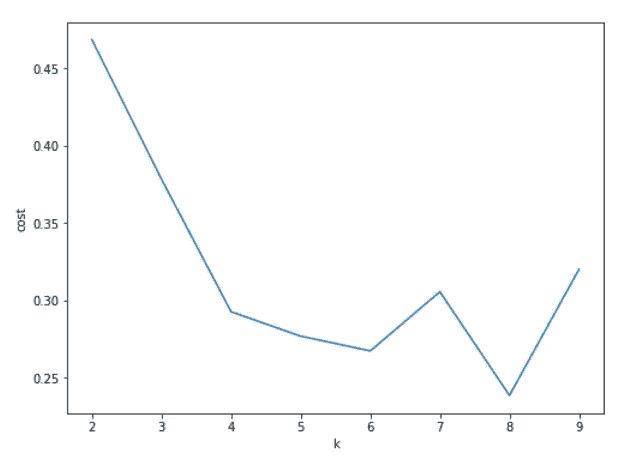

# k 表示在大数据上使用 PySpark 进行聚类

> 原文：<https://towardsdatascience.com/k-means-clustering-using-pyspark-on-big-data-6214beacdc8b?source=collection_archive---------1----------------------->

## parallel K 初学者指南意味着使用 Python & Spark 进行集群


尼克·艾布拉姆斯在 [Unsplash](https://unsplash.com?utm_source=medium&utm_medium=referral) 上拍摄的照片

> 如果你不熟悉 K 均值聚类，我推荐你通读下面这篇文章。本文主要关注数据并行和集群，即 K 表示在大数据上进行集群。

</unsupervised-learning-techniques-using-python-k-means-and-silhouette-score-for-clustering-d6dd1f30b660>  

# 关于聚类

聚类是一种无监督的学习技术，简而言之，您正在处理数据，而没有任何关于目标属性或因变量的信息。聚类的一般思想是在数据中找到一些内在的结构，通常称为相似对象的组。该算法研究数据以识别这些模式或组，使得一个组中的每个成员更接近该组中的另一个成员(较低的群内距离)，而远离不同组中的另一个成员(较高的群间距离)。

# 集群在哪里适用？

你们大多数人一定对现实生活中的这些例子很熟悉:

1.  客户细分——广泛用于目标营销
2.  图像分割—识别景观变化或入侵
3.  推荐引擎

# 背景

k 表示聚类，与平台无关，使用欧几里德距离形式的相似性度量。通常被称为分裂或分割聚类，K 均值的基本思想是从每个数据点开始一个更大的聚类，然后根据用户输入的 K(或聚类的数量)将它们分成更小的组。每个集群都有一个中心，称为质心。给定聚类中质心的总数总是等于 k。该算法迭代地寻找数据点，并将它们分配给最近的聚类。

一旦所有数据点被分配到它们各自的质心(这里代表每个聚类)，质心值被重新计算，并且该过程重复，直到聚类达到**收敛标准。**质心只是每个聚类的新平均值(例如，由平均消费为 100、200、300 以及购物篮大小为 10、15 和 20 的客户 A、B、C 组成的聚类的质心将分别为 200 和 15)。收敛标准是群集的稳定性或紧密性的度量，即任何两次迭代之间的群集内距离不会超过给定的**阈值。**

# PySpark 不一样吗？

在我们讨论为什么是 PySpark 而不是基于 Sklearn 的算法之前，让我们讨论一下 PySpark 中的过程有何不同。使用 PySpark 构建任何聚类算法时，都需要执行一些数据转换。让我们先深入挖掘数据。用于分析的数据可以在[这里](https://www.kaggle.com/arjunbhasin2013/ccdata)找到。

## 数据

该数据集由超过 6 个月的 9K 活跃信用卡持卡人及其交易和账户属性组成。这个想法是为营销策略开发一个客户细分。


由[艾弗里·埃文斯](https://unsplash.com/@averye457?utm_source=medium&utm_medium=referral)在 [Unsplash](https://unsplash.com?utm_source=medium&utm_medium=referral) 上拍摄的照片

## 使用 PySpark

```
from pyspark.sql import SparkSessionspark = SparkSession.builder.appName(‘Clustering using K-Means’).getOrCreate()data_customer=spark.read.csv('CC General.csv', header=True, inferSchema=True)data_customer.printSchema()
```



图一。数据集的架构信息。图片来源——由作者使用 Jupyter 笔记本开发

自我直观的属性可以分为三大类。客户信息(主键为 CUST ID)、账户信息(余额、余额频率、购买、信用额度、使用权等)。)、交易(购买频率、付款、预付现金等。).

```
data_customer=data_customer.na.drop()
```

所有考虑中的属性都是数字或离散数字，因此我们需要使用一个**矢量汇编器将它们转换成特征。**矢量组合器是一个转换器，它将一组特征转换成一个单独的矢量列，通常称为特征数组。这里的特征是列。由于客户 id 是一个不会用于集群的标识符，我们首先使用**提取所需的列。columns** ，将其作为输入传递给 Vector Assembler，然后使用 **transform** ()将输入列转换成一个名为 **a feature** 的向量列。

```
from pyspark.ml.feature import VectorAssembler
data_customer.columnsassemble=VectorAssembler(inputCols=[
 'BALANCE',
 'BALANCE_FREQUENCY',
 'PURCHASES',
 'ONEOFF_PURCHASES',
 'INSTALLMENTS_PURCHASES',
 'CASH_ADVANCE',
 'PURCHASES_FREQUENCY',
 'ONEOFF_PURCHASES_FREQUENCY',
 'PURCHASES_INSTALLMENTS_FREQUENCY',
 'CASH_ADVANCE_FREQUENCY',
 'CASH_ADVANCE_TRX',
 'PURCHASES_TRX',
 'CREDIT_LIMIT',
 'PAYMENTS',
 'MINIMUM_PAYMENTS',
 'PRC_FULL_PAYMENT',
 'TENURE'], outputCol='features')assembled_data=assemble.transform(data_customer)assembled_data.show(2)
```



图二。向量汇编程序的输出。图片来源——由作者使用 Jupyter 笔记本开发

既然所有的列都被转换成一个单一的特征向量，我们需要将数据标准化，使它们达到一个可比较的规模。例如，平衡的范围是 10-1000，而平衡频率的范围是 0-1。欧几里德距离总是受更高尺度上的变量的影响更大，因此将变量横向扩展很重要。

```
from pyspark.ml.feature import StandardScalerscale=StandardScaler(inputCol='features',outputCol='standardized')data_scale=scale.fit(assembled_data)
data_scale_output=data_scale.transform(assembled_data)data_scale_output.show(2)
```



图 3。标准缩放器的输出。图片来源——由作者使用 Jupyter 笔记本开发

现在我们的数据已经标准化了，我们可以开发 K 均值算法了。

[K-means](http://en.wikipedia.org/wiki/K-means_clustering) 是最常用的聚类算法之一，用于将数据分组到预定义数量的聚类中。spark.mllib 包含了一个名为 [kmeans||](http://theory.stanford.edu/~sergei/papers/vldb12-kmpar.pdf) 的 [k-means++](http://en.wikipedia.org/wiki/K-means%2B%2B) 方法的并行化变体。pyspark.ml.clustering 中的 KMeans 函数包括以下参数:

*   ***k*** 是用户指定的聚类数
*   ***maxIterations***是聚类算法停止前的最大迭代次数。请注意，如果簇内距离的变化不超过所提到的ε值，则无论最大迭代次数是多少，迭代都将停止
*   ***初始化模式*** 指定随机初始化质心或通过 k-means||(类似于 K-means ++)初始化
*   ***ε***确定 k-means 预计收敛的距离阈值
*   ***initialModel*** 是用户可以作为输入提供的一组可选的聚类质心。如果使用此参数，算法只运行一次，将点分配到其最近的质心

`**train**` ( *k=4* ， *maxIterations=20* ，*minDivisibleClusterSize = 1.0*， *seed=-1888008604* )为默认值。

```
from pyspark.ml.clustering import KMeans
from pyspark.ml.evaluation import ClusteringEvaluatorsilhouette_score=[]evaluator = ClusteringEvaluator(predictionCol='prediction', featuresCol='standardized', \
                                metricName='silhouette', distanceMeasure='squaredEuclidean')for i in range(2,10):

    KMeans_algo=KMeans(featuresCol='standardized', k=i)

    KMeans_fit=KMeans_algo.fit(data_scale_output)

    output=KMeans_fit.transform(data_scale_output)

    score=evaluator.evaluate(output)

    silhouette_score.append(score)

    print("Silhouette Score:",score)
```

可视化剪影分数。注意以前版本的 K Means 有 computeScore()来计算簇内距离的总和，但在 Spark 3.0.0 中被弃用。使用 ClusteringEvaluator()的剪影分数测量一个聚类中的每个点与相邻聚类中的点的接近程度，从而有助于找出紧凑且间隔良好的聚类。

```
#Visualizing the silhouette scores in a plot
import matplotlib.pyplot as plt
fig, ax = plt.subplots(1,1, figsize =(8,6))
ax.plot(range(2,10),silhouette_score)
ax.set_xlabel(‘k’)
ax.set_ylabel(‘cost’)
```



图 4。由作者使用 Jupyter Notebook 开发的不同 K. Image Credits 值绘制的剪影分数输出

我更喜欢在 K=7 的情况下观察轮廓分数的局部最大值。既然 K 的什么值是好的没有正确答案，我们可以还原到描述性统计和绘图来检查客户的分布。这就是 SkLearn 在文档和 PCA 实现方面更方便的地方。我们中的大多数人更习惯于在 y 轴上用 SSE 而不是轮廓分数来研究肘图，但是 PySpark 有它的优点。

# 为什么是 PySpark？

PySpark 在执行 K 均值聚类时使用了数据并行性(T0)或 T2 结果并行性(T3)的概念。想象一下，你需要为墨尔本的节礼日活动推出有针对性的营销活动，你想接触到 20 万具有不同购买属性的客户。想象一下在您的本地系统上运行 K 均值的多次迭代。对于 K=5，您需要计算的距离度量的数量是 5 x 200K =百万。在满足收敛标准，即 3000 万个距离(欧几里德距离)之前，需要计算 100 万个这样的度量，比如 30 次。你需要大量的计算能力和时间来处理这样的场景。

## 数据并行性

**数据并行**的作用是，通过将数据集划分为更小的分区，从一开始就创建并行。另一方面，结果并行性基于目标集群。假设:

D =记录数量{X1，X2，…，Xn}

k =聚类数

P =处理器数量{P1，P2，…Pm}

C =初始质心{C1，C2，…。Ck}

1.  数据 D 被分配给 P 个处理器。每个处理器处理一组记录(由 spark 配置决定)。初始质心值 C 由这些处理器中的每一个共享
2.  现在每个处理器都有质心信息。处理器计算它们的记录到这些质心的距离，并通过将数据点分配到其最近的质心来形成局部聚类
3.  一旦步骤 2 完成，P 个处理器上的这些集群中的每一个的记录的总数和计数由主进程存储以供将来参考
4.  一旦一次迭代完成，来自处理器的信息被交换，并且主进程计算更新的质心，并且再次在 P 个处理器之间共享它们，即，一个点被分配给 K 个簇，主进程更新质心，并且与处理器重新共享信息
5.  这个过程不断迭代，直到达到收敛。一旦满足收敛标准，主进程收集局部聚类并将它们组合成一个全局聚类

***假设 200，000 条记录分布在 3 个处理器上，每个处理器有大约 70，000 条记录。这就是分布式处理发挥作用的地方，它可以减少数据量，同时确保完整的结果。***

## 结果并行性

在结果排比中说:

D =记录数量{X1，X2，…，Xn}

k =聚类数

P =处理器数量{P1，P2，…Pm}

C =初始质心{C1，C2，…。Ck}

1.  数据 D 被划分到 P 个处理器中，然后在每个处理器中进行排序。每个处理器处理一组记录(由 spark 配置决定)
2.  初始质心值 C 被初始化，并在这些处理器中的每一个上划分/共享(*，即，不同于在所有处理器上共享所有质心值的数据并行性，这里，我们将一个质心值传递给一个处理器*
3.  现在每个处理器都有一个信息质心。计算这些点到这些质心的距离。对于处理器中非常低或非常高的数据点:如果它们更靠近处理器的质心，则将它们分配到该群集，否则，如果它们更靠近属于不同处理器的质心，则将数据点移动到新处理器
4.  重复此过程，直到达到收敛。返回来自处理器 P 的所有本地集群

# 有用的链接

1.  [https://spark.apache.org/docs/latest/mllib-clustering.html](https://spark.apache.org/docs/latest/mllib-clustering.html)
2.  [https://spark . Apache . org/docs/latest/API/python/pyspark . ml lib . html # pyspark . ml lib . clustering . kmeansmodel](https://spark.apache.org/docs/latest/api/python/pyspark.mllib.html#pyspark.mllib.clustering.KMeansModel)
3.  [https://spark . Apache . org/docs/latest/API/python/pyspark . ml . html # pyspark . ml . evaluation . clusteringevaluator](https://spark.apache.org/docs/latest/api/python/pyspark.ml.html#pyspark.ml.evaluation.ClusteringEvaluator)
4.  [https://spark . Apache . org/docs/latest/API/python/_ modules/py spark/ml/evaluation . html](https://spark.apache.org/docs/latest/api/python/_modules/pyspark/ml/evaluation.html)

*关于作者:高级分析专家和管理顾问，帮助公司通过对组织数据的业务、技术和数学的组合找到各种问题的解决方案。一个数据科学爱好者，在这里分享、学习、贡献；可以和我在* [*上联系*](https://www.linkedin.com/in/angel-das-9532bb12a/) *和* [*推特*](https://twitter.com/dasangel07_andy)*；*