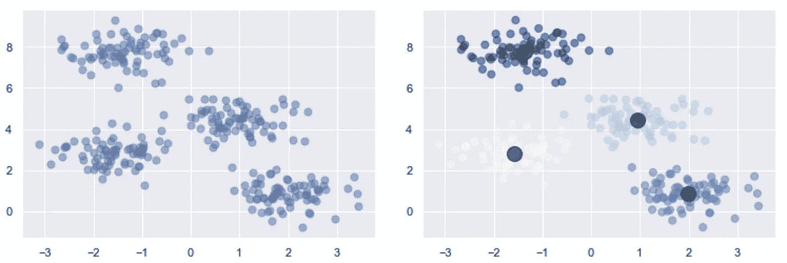
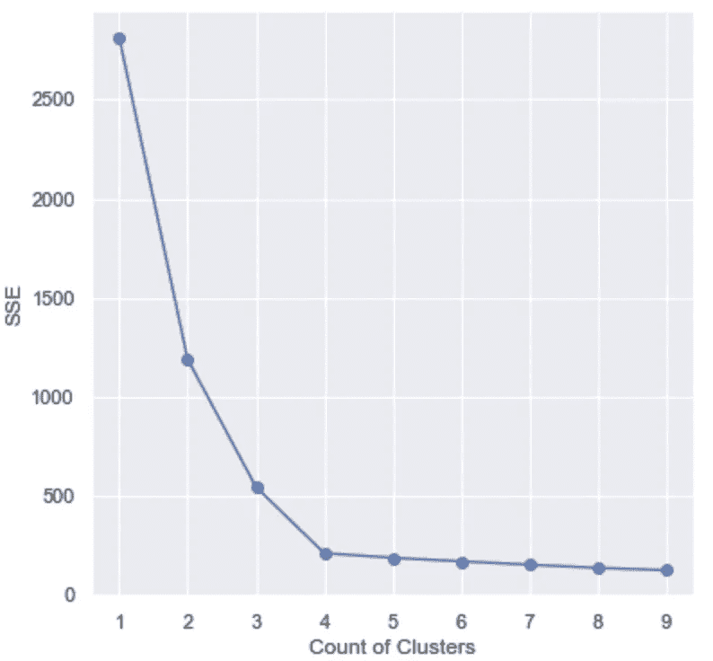

# k 均值解释

> 原文：<https://towardsdatascience.com/k-means-explained-10349949bd10?source=collection_archive---------6----------------------->

## 用 Python 解释和实现 kMeans 算法

图片由来自 [Unsplash](https://unsplash.com/photos/yzS-w6ghcpc) 的 [Kelly Sikkema](https://unsplash.com/@kellysikkema) 拍摄

本文将概述对 k-Means 算法及其使用 sklearn 库的相关 python 实现的概念性理解。K-means 是一种聚类算法，在现实世界中有许多使用案例。该算法生成与数据集相关联的 K 个聚类，它可以用于不同行业的各种场景，包括模式检测、医疗诊断、股票分析、社区检测、市场分割、图像分割等。它通常用于通过将相似的数据点靠近另一个数据点进行分组(聚类)来获得对您正在处理的数据集的直觉。同一组中的数据点彼此接近且相似，而其他组中的数据点则不相似。

**目录**

*   什么是 k 均值聚类
*   算法
*   选择 K
    -弯头法
*   优势
*   不足之处
*   履行
*   摘要
*   资源

# 什么是 k 均值聚类

这是一种无监督的学习算法，本质上意味着该算法从未标记的数据中学习模式。这意味着您可以训练一个模型在任何给定的数据集上创建分类，而不必先标记数据。

该算法背后的直觉是将数据点分成不同的预定义(K)聚类，其中每个聚类中的数据点将只属于该聚类。聚类将由彼此共享相似性的数据组成，这意味着不同聚类中的数据点将彼此不相似。许多其他聚类算法，如高斯混合 EM 算法、k-中值等，与 k-means 具有相同的基本观点。聚类内部的数据点应该靠近该聚类的中心[2]。

左边的图像是一组数据，右边的图像是具有可视化质心的相同数据(图像由作者提供)

# 算法

1.  选择你的 K 值
2.  随机选择 K 个数据点来代表聚类质心
3.  将所有其他数据点指定给其最近的聚类质心
4.  重新定位聚类质心，直到它是聚类中点的平均值
5.  重复步骤 3 和 4，直到每个集群中没有任何变化

# 选择 K

由于该算法要求用户指定要寻找的聚类数 K，并且它不从数据中学习，所以这是使用该算法的最困难的方面之一。很难说给定的 K 值是否不正确。通常，这个值是通过广泛的领域知识和了解 k 的理想值的经验来确定的。如果这不是您当前需求的情况，那么行业中通常使用肘方法来确定 k 的理想值。

**肘法**

elbow 方法使用距离平方和(SSE)来根据数据点与其分配的聚类之间的距离选择 k 的理想值。我们会选择一个 k 值，在这里上证指数开始变平，我们看到一个拐点。当可视化时，这个图形看起来有点像一个肘，因此该方法的名称。

图 2:基于图 1 数据的 elbow 方法的可视化表示。肘点在 4(图片由作者提供)

上图显示`k = 4`可能是一个很好的集群数量选择。有些情况下，图形看起来不像弯头，这使得选择 k 的值非常困难。本文的`Implementation`部分提供了生成上图的代码和该算法的建模组件。

# 优势

*   扩展到大数据
*   总是收敛
*   通常(并非总是)比其他常见的聚类方法(如层次聚类)更快

# 不足之处

*   不平衡数据聚类
*   手动选择 K
*   取决于初始假设
*   高维缩放

# 履行

# 摘要

总之，k-means 是一种无监督学习算法，用于将输入数据划分为不同的预定义聚类。每个聚类将保存与其自身最相似的数据点，而不同聚类中的点将彼此不相似。这个算法最棘手的部分是选择一个理想的 K 值，这可以通过直觉或使用肘方法来完成。elbow 方法使用 SSE 来显示基于数据点与其分配的聚类之间的距离的 K be 的建议值。

# 资源

*   [1][https://towards data science . com/k-means-clustering-algorithm-applications-evaluation-methods-and-deficies-aa 03 e 644 b 48 a](/k-means-clustering-algorithm-applications-evaluation-methods-and-drawbacks-aa03e644b48a)
*   [2][https://www . naftaliharris . com/blog/visualizing-k-means-clustering/](https://www.naftaliharris.com/blog/visualizing-k-means-clustering/)
*   [3][https://sci kit-learn . org/stable/modules/generated/sk learn . cluster . k means . html](https://scikit-learn.org/stable/modules/generated/sklearn.cluster.KMeans.html)
*   [4][https://jakevdp . github . io/python datascience handbook/05.11-k-means . html](https://jakevdp.github.io/PythonDataScienceHandbook/05.11-k-means.html)

这里有一些我写的其他文章，你可能会喜欢:

 [## 马尔可夫链解释道

### 在本文中，我将解释并提供马尔可夫链的 python 实现。这篇文章不会是一篇深刻的…

towardsdatascience.com](/markov-chain-explained-210581d7a4a9)  [## 支持向量机(SVM)解释说

### 用 Python 解释和实现 SVM

towardsdatascience.com](/support-vector-machine-svm-explained-58e59708cae3)  [## 兰登森林解释道

### 决策树和随机森林的理解与实现

towardsdatascience.com](/random-forest-explained-6b4849d56a2f)