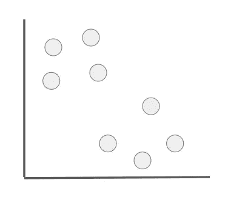
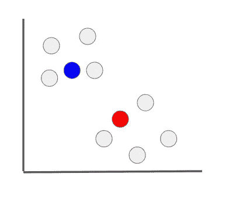
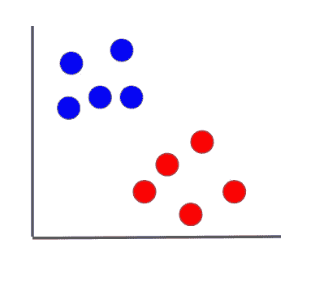
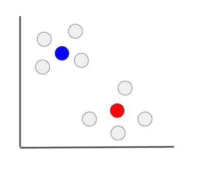
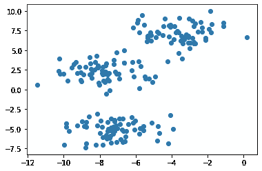
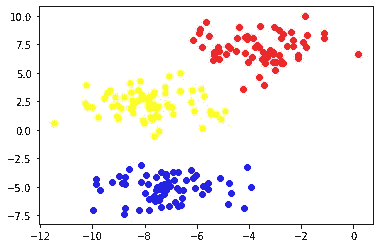
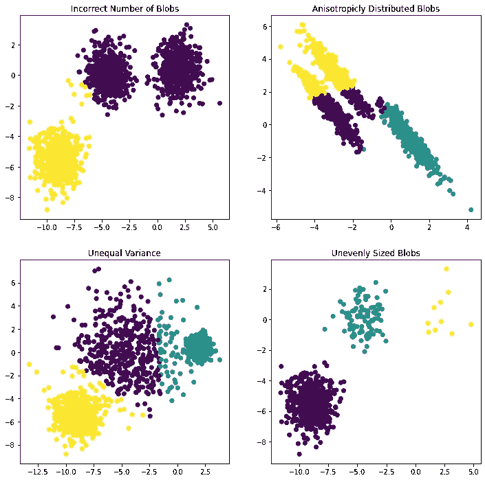

# k-Means-机器学习算法及其在 Python 中的实现

> 原文：<https://towardsdatascience.com/k-means-machine-learning-algorithms-with-implementation-in-python-ac1d48e90239?source=collection_archive---------16----------------------->

## 机器学习算法— 30 天挑战

## 在本文中，我们将研究 K-Means 以及如何使用 Python (Scikit-learn)实现它

在本文中，我们将研究 K-Means，这是您的 ML 算法库中的另一个基本且重要的无监督机器学习算法。

图片来自 [Unsplash](https://unsplash.com/photos/8hgmG03spF4)

我们将从了解它的功能和工作原理开始。我们将不研究数学部分，因为它本身是另一篇文章。然后我们将使用`scikit-learn`来实现它

*   什么是 K-Means
*   它是如何工作的
*   Python 实现
*   K 均值中的假设
*   应用程序
*   结论
*   你能做什么
*   其他 ML 算法

这是我 30 天文章写作挑战的一部分。请随意查看我的新人帖子上的文章:

 [## 让我们在 30 天内发表 30 篇文章

### 在这篇文章中，我将接受挑战，在未来 30 天内写 30 篇与数据科学相关的文章…

nouman10.medium.com](https://nouman10.medium.com/lets-publish-30-articles-in-30-days-a0b8111855bb) 

# 什么是 K-Means

K-Means 是使用最广泛和最简单的无监督聚类算法之一，它根据实例(未标记数据)之间的相似性将它们分配到不同的聚类中。

基于未标记距离之间的距离来计算相似性。K-Means 直观、易于实现、速度快。我过去曾用它通过使用聚类分配作为伪标签来微调模型，用预训练的神经网络进行无监督分类。(如果您想讨论更多内容，请随时联系我们)

# 它是如何工作的

K-Means 的一个缺点是我们必须预先选择聚类数( **k** )。这并不总是已知的，在达到一个合适的值之前，我们必须用不同的值进行实验(也没有标记来检查)。

让我们用一个直观的例子来看看算法是如何工作的。我们将把集群的数量设置为 2。假设我们有一些二维的未标记数据

未标记的二维数据(图片由作者提供)

**第一步:我们需要创建质心(聚类中心)，具有与数据相同的维度。**

通常，为了避免较差的初始聚类，质心被选择为已经存在的数据点之一。但是我们将创建单独的质心来更好地解释这个想法

初始聚类质心(图片由作者提供)

**步骤 2:将聚类分配给数据点**

我们计算每个数据点和聚类质心之间的距离。数据点被分配给最靠近它的聚类质心。通常使用的距离度量是欧几里德距离，其公式如下:

欧几里德距离(图片由作者提供)

集群:

已分配群集(图片由作者提供)

第三步:我们改变聚类中心。

通过取分配给该聚类的数据点的平均值来更新聚类质心。

簇质心轻微移动(图片由作者提供)

**步骤 4:重复步骤 2 和 3，直到集群停止变化**

这就是 KMeans 的工作原理。在此过程中，聚类分配可能会发生变化，因为每次在步骤 3 中都会创建新的聚类质心，而这些新的分配又会改变聚类质心。

如前所述，由于质心的初始选择不理想，KMeans 可能会产生一些非常差的结果。因此，我们必须用不同的初始质心重复这个过程，并选择簇间变化最小的结果

# Python 实现

让我们从在一些虚拟数据上实现 KMeans 开始。我们首先使用`scikit-learn`创建一些虚拟数据，并绘制它。

`make_blobs`函数为我们创建数据。要想得到和我一样的数据，一定要保持上面提到的`random_state`。这将像这样绘制数据:

虚拟数据(图片由作者提供)

如您所见，有三个可见的集群，因为我们已经将其传递给了`make_blobs`函数。但是在真实数据的情况下，可视化可以帮助估计聚类数量的值

现在让我们应用`scikit-learn`中的`KMeans`，用不同的颜色绘制集群分配

我们将从初始化`KMeans`开始，并使其符合我们的数据。然后我们通过预测数据得到我们的聚类分配。为了绘制数据，我们需要计算分配给各个聚类的聚类点。我们通过提取每个聚类分配的索引并从数据中提取来选择数据点。这导致了下面的图:

聚类分配(图片由作者提供)

这是我们可以看到不同颜色的集群的结果

# K 均值中的假设

导致 KMeans 聚类不准确的原因有很多。这些原因包括:

1.  簇的数量不正确
2.  各向异性分布数据(在不同方向上具有不同属性的数据)
3.  不同方差
4.  大小不均匀的斑点

我们将使用来自 sklearn 网站的代码来演示这一点

这将导致以下情节:

作者图片

# 应用程序

*   文档聚类
*   确定犯罪多发地区
*   客户细分，
*   保险欺诈检测
*   公共交通数据分析
*   IT 警报的群集

# 结论

让我们总结一下本文所做的工作:

*   我们从 K-Means 如何工作的一般解释开始
*   然后，我们在一些虚拟数据上用 Python 实现了它，并绘制了结果聚类图
*   然后，我们研究了 KMeans 的一些假设及其应用。

# 您可以做什么:

*   尝试从零开始实现 K-Means。
*   将您的实现与`scikit-learn`中的实现进行比较
*   在各种其他数据集上测试上面的代码。

如果你有任何问题，请随时联系我。请继续关注我，因为我计划在未来讲述更多的机器学习算法

# 其他 ML 算法:

*   线性回归——用 Python 实现的机器学习算法

 [## 线性回归—从 A 到 Z

### 在本文中，我们将从数学上研究线性回归，以及如何使用 Python (Scikit-learn)实现它

medium.com](https://medium.com/mlearning-ai/linear-regression-a-to-z-2ab3d1b7277c) 

*   k-最近邻——机器学习算法及其 Python 实现

 [## k-最近邻-用 Python 实现的 A 到 Z

### 在本文中，我们将从数学上研究 k-最近邻，以及如何使用 Python 实现它…

nouman10.medium.com](https://nouman10.medium.com/k-nearest-neighbors-a-to-z-with-implementation-in-python-74630ffb79a2) 

*   决策树——机器学习算法及其 Python 实现

 [## 决策树——机器学习算法及其 Python 实现

### 在本文中，我们将研究机器学习算法“决策树”以及如何使用 Python 实现它…

nouman10.medium.com](https://nouman10.medium.com/decision-trees-machine-learning-algorithms-with-implementation-in-python-5bc034e67fc8) 

如果您觉得以上内容对您有用，请分享并随时支持我-->

*   [https://www.buymeacoffee.com/nouman10](https://www.buymeacoffee.com/nouman10)