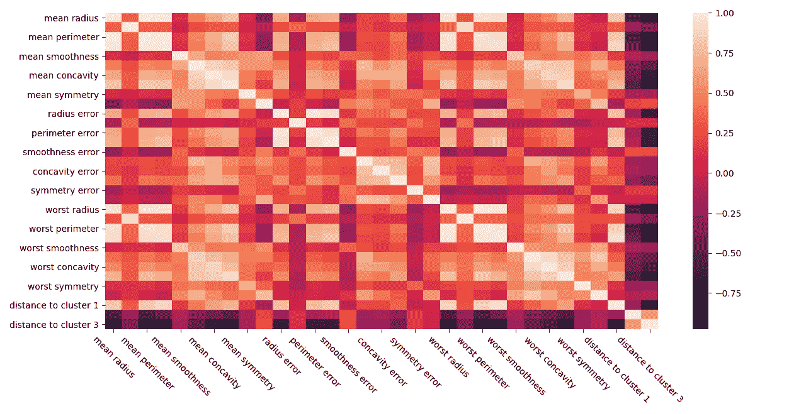
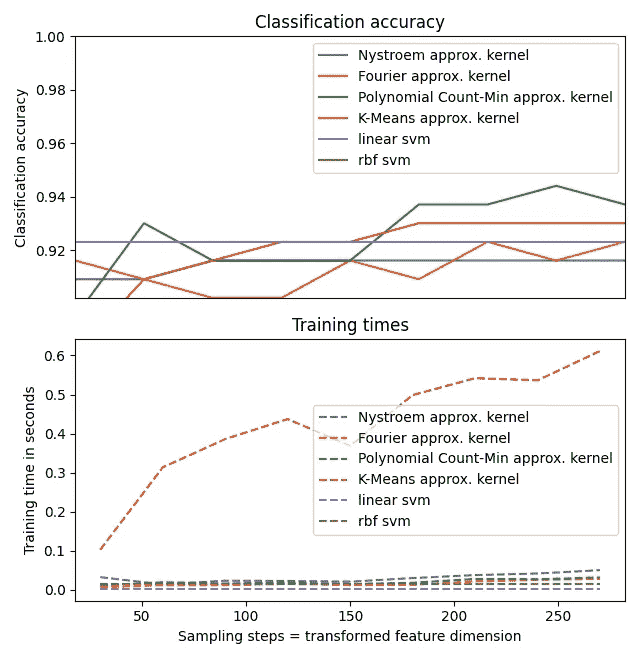

# 意思是为了乐趣和利益的诡计

> 原文：<https://towardsdatascience.com/k-means-tricks-for-fun-and-profit-724996864274?source=collection_archive---------14----------------------->

## K-Means 是一个有趣、简单、非常直观的算法。事实证明，它可以做的不仅仅是集群。

# 序言

这将是一个非常小的帖子，但仍然是一个有趣的帖子。

K-Means 是一个优雅的算法。这很容易理解(制造随机点，反复移动它们以成为一些现有集群的中心)，并且在实践中工作得很好。当我第一次了解它的时候，我记得我很着迷。很优雅。但是，随着时间的推移，这种兴趣逐渐消失，我注意到了许多限制，其中之一是球形簇先验，它的线性性质，我发现在 EDA 场景中特别令人讨厌的是，它不会自己找到最佳的簇数，所以你也需要修改这个参数。然后，几年前，我发现了一些如何使用 K-Means 的巧妙技巧。所以开始了。

# **第一招**

首先，我们需要建立一个基线。我将主要使用乳腺癌数据集，但是您可以使用任何其他数据集。

```
from sklearn.cluster import KMeans
from sklearn.svm import LinearSVC
from sklearn.datasets import load_breast_cancer
from sklearn.model_selection import train_test_splitimport numpy as np X, y = load_breast_cancer(return_X_y=True)X_train, X_test, y_train, y_test = train_test_split(X, y, random_state=17)svm = LinearSVC(random_state=17)
svm.fit(X_train, y_train)
svm.score(X_test, y_test) **# should be ~0.93**
```

那么，是什么让我重新对 K-Means 产生了兴趣呢？

> **K-Means 可以作为新特征的来源。**

你可能会问，怎么做？K-Means 是一种聚类算法，对吧？您可以添加推断聚类作为新的分类特征。

现在，让我们试试这个。

```
# imports from the example abovesvm = LinearSVC(random_state=17)
kmeans = KMeans(n_clusters=3, random_state=17)X_clusters = kmeans.fit_predict(X_train).reshape(-1, 1)svm.fit(np.hstack([X_train, X_clusters]), y_train)
svm.score(np.hstack([X_test, kmeans.predict(X_test) \
   .reshape(-1, 1)]), y_test) **# should be ~0.937**
```


【knowyourmeme.com】来源:T4

这些特征是分类的，但是我们可以要求模型输出到所有质心的距离，从而获得(希望)更多的信息特征。

```
# imports from the example abovesvm = LinearSVC(random_state=17)
kmeans = KMeans(n_clusters=3, random_state=17)X_clusters = kmeans.fit_transform(X_train)
#                       ^^^^^^^^^
#                       Notice the `transform` instead of `predict`
# Scikit-learn supports this method as early as version 0.15svm.fit(np.hstack([X_train, X_clusters]), y_train)
svm.score(np.hstack([X_test, kmeans.transform(X_test)]), y_test)
**# should be ~0.727**
```

等等，怎么了？现有的特征和到质心的距离之间有关联吗？

```
import matplotlib.pyplot as plt
import seaborn as sns
import pandas as pdcolumns = ['mean radius', 'mean texture', 'mean perimeter', 'mean area', 'mean smoothness', 'mean compactness', 'mean concavity', 'mean concave points', 'mean symmetry', 'mean fractal dimension', 'radius error', 'texture error', 'perimeter error', 'area error', 'smoothness error', 'compactness error', 'concavity error', 'concave points error', 'symmetry error', 'fractal dimension error', 'worst radius', 'worst texture', 'worst perimeter', 'worst area', 'worst smoothness', 'worst compactness', 'worst concavity', 'worst concave points', 'worst symmetry', 'worst fractal dimension', **'distance to cluster 1', 'distance to cluster 2', 'distance to cluster 3'**]data = pd.DataFrame.from_records(np.hstack([X_train, X_clusters]), columns=columns)sns.heatmap(data.corr())
plt.xticks(rotation=-45)
plt.show()
```



注意最后 3 列，尤其是最后一列，以及它们在每一行的颜色。来源:帖子作者，见上面代码片段生成。

您可能听说过我们希望数据集中的要素尽可能独立。原因是很多机器学习模型假设这种独立性是为了有更简单的算法。关于这个主题的更多信息可以在[这里](https://datascience.stackexchange.com/questions/24452/in-supervised-learning-why-is-it-bad-to-have-correlated-features)和[这里](/why-exclude-highly-correlated-features-when-building-regression-model-34d77a90ea8e)找到，但它的要点是，在线性模型中有冗余信息会使模型不稳定，反过来，它更有可能搞砸。在许多情况下，我注意到了这个问题，有时甚至是非线性模型，清除数据集的相关特征通常会略微提高模型的性能特征。

回到我们的主题。假设我们的新特征确实与一些现有的特征相关，那么如果我们只使用到聚类均值的距离作为特征，这是否可行呢？

```
# imports from the example abovesvm = LinearSVC(random_state=17)
kmeans = KMeans(n_clusters=3, random_state=17)
X_clusters = kmeans.fit_transform(X_train)svm.fit(X_clusters, y_train)
svm.score(kmeans.transform(X_test), y_test) **# should be ~0.951**
```

好多了。通过这个例子，你可以看到我们可以使用 K-Means 作为降维的方法。干净利落。

到目前为止一切顺利。但是抵抗的部分还没有出现。

# **第二招**

> **K-Means 可以作为内核技巧的替代品**

你没听错。例如，你可以为 K-Means 算法定义比特征更多的质心。

```
# imports from the example abovesvm = LinearSVC(random_state=17)
kmeans = KMeans(n_clusters=250, random_state=17)
X_clusters = kmeans.fit_transform(X_train)svm.fit(X_clusters, y_train)
svm.score(kmeans.transform(X_test), y_test) **# should be ~0.944**
```

嗯，没那么好，但是相当不错。在实践中，这种方法的最大好处是当您拥有大量数据时。此外，在预测性能方面，您的收获可能会有所不同，我曾经用`n_clusters=1000`运行过这种方法，它比只使用几个集群效果更好。

众所周知，支持向量机在大数据集上训练很慢。极其缓慢。去过那里，做过那个。这就是为什么，举例来说，有许多技术可以用少得多的计算资源来近似内核技巧。

顺便说一下，让我们比较一下这个 K-Means 技巧与经典的 SVM 和一些替代的核近似方法的效果。

以下代码的灵感来自于[这](https://scikit-learn.org/stable/auto_examples/miscellaneous/plot_kernel_approximation.html) [两个](https://scikit-learn.org/stable/auto_examples/kernel_approximation/plot_scalable_poly_kernels.html) scikit-learn 示例。

```
import matplotlib.pyplot as pltimport numpy as npfrom time import timefrom sklearn.datasets import load_breast_cancerfrom sklearn.svm import LinearSVC, SVC
from sklearn import pipeline
from sklearn.kernel_approximation import RBFSampler, Nystroem, PolynomialCountSketch
from sklearn.preprocessing import MinMaxScaler, Normalizer
from sklearn.model_selection import train_test_split
from sklearn.cluster import MiniBatchKMeans mm = pipeline.make_pipeline(MinMaxScaler(), Normalizer())X, y = load_breast_cancer(return_X_y=True)
X = mm.fit_transform(X)data_train, data_test, targets_train, targets_test = train_test_split(X, y, random_state=17)
```

我们将测试 scikit-learn 包中可用的 3 种内核近似方法，与 K-Means 技巧相对比，作为基线，我们将有一个线性 SVM 和一个使用内核技巧的 SVM。

```
# Create a classifier: a support vector classifier
kernel_svm = SVC(gamma=.2, random_state=17)
linear_svm = LinearSVC(random_state=17)# create pipeline from kernel approximation and linear svm
feature_map_fourier = RBFSampler(gamma=.2, random_state=17)
feature_map_nystroem = Nystroem(gamma=.2, random_state=17)
feature_map_poly_cm = PolynomialCountSketch(degree=4, random_state=17)
feature_map_kmeans = MiniBatchKMeans(random_state=17)fourier_approx_svm = pipeline.Pipeline([("feature_map", feature_map_fourier), ("svm", LinearSVC(random_state=17))])nystroem_approx_svm = pipeline.Pipeline([("feature_map", feature_map_nystroem), ("svm", LinearSVC(random_state=17))])poly_cm_approx_svm = pipeline.Pipeline([("feature_map", feature_map_poly_cm), ("svm", LinearSVC(random_state=17))])kmeans_approx_svm = pipeline.Pipeline([("feature_map", feature_map_kmeans), ("svm", LinearSVC(random_state=17))])
```

让我们收集每种配置的计时和评分结果。

```
# fit and predict using linear and kernel svm:
kernel_svm_time = time()
kernel_svm.fit(data_train, targets_train)
kernel_svm_score = kernel_svm.score(data_test, targets_test)
kernel_svm_time = time() - kernel_svm_timelinear_svm_time = time()
linear_svm.fit(data_train, targets_train)
linear_svm_score = linear_svm.score(data_test, targets_test)
linear_svm_time = time() - linear_svm_timesample_sizes = 30 * np.arange(1, 10)
fourier_scores = []
nystroem_scores = []
poly_cm_scores = []
kmeans_scores = []fourier_times = []
nystroem_times = []
poly_cm_times = []
kmeans_times = []for D in sample_sizes:
    fourier_approx_svm.set_params(feature_map__n_components=D)
    nystroem_approx_svm.set_params(feature_map__n_components=D)
    poly_cm_approx_svm.set_params(feature_map__n_components=D)
    kmeans_approx_svm.set_params(feature_map__n_clusters=D) start = time()
    nystroem_approx_svm.fit(data_train, targets_train)
    nystroem_times.append(time() - start) start = time()
    fourier_approx_svm.fit(data_train, targets_train)
    fourier_times.append(time() - start) start = time()
    poly_cm_approx_svm.fit(data_train, targets_train)
    poly_cm_times.append(time() - start) start = time()
    kmeans_approx_svm.fit(data_train, targets_train
    kmeans_times.append(time() - start) fourier_score = fourier_approx_svm.score(data_test, targets_test)
    fourier_scores.append(fourier_score) nystroem_score = nystroem_approx_svm.score(data_test, targets_test)
    nystroem_scores.append(nystroem_score) poly_cm_score = poly_cm_approx_svm.score(data_test, targets_test)
    poly_cm_scores.append(poly_cm_score) kmeans_score = kmeans_approx_svm.score(data_test, targets_test)
    kmeans_scores.append(kmeans_score)
```

现在让我们绘制所有收集的结果。

```
plt.figure(figsize=(16, 4))
accuracy = plt.subplot(211)
timescale = plt.subplot(212)accuracy.plot(sample_sizes, nystroem_scores, label="Nystroem approx. kernel")
timescale.plot(sample_sizes, nystroem_times, '--', label='Nystroem approx. kernel')
accuracy.plot(sample_sizes, fourier_scores, label="Fourier approx. kernel")
timescale.plot(sample_sizes, fourier_times, '--', label='Fourier approx. kernel')
accuracy.plot(sample_sizes, poly_cm_scores, label="Polynomial Count-Min approx. kernel")
timescale.plot(sample_sizes, poly_cm_times, '--', label='Polynomial Count-Min approx. kernel')
accuracy.plot(sample_sizes, kmeans_scores, label="K-Means approx. kernel")
timescale.plot(sample_sizes, kmeans_times, '--', label='K-Means approx. kernel')# horizontal lines for exact rbf and linear kernels:
accuracy.plot([sample_sizes[0], sample_sizes[-1]],
[linear_svm_score, linear_svm_score], label="linear svm")
timescale.plot([sample_sizes[0], sample_sizes[-1]], [linear_svm_time, linear_svm_time], '--', label='linear svm')accuracy.plot([sample_sizes[0], sample_sizes[-1]],
[kernel_svm_score, kernel_svm_score], label="rbf svm")
timescale.plot([sample_sizes[0], sample_sizes[-1]], [kernel_svm_time, kernel_svm_time], '--', label='rbf svm')
```

和一些更多的情节调整，使它漂亮。

```
# legends and labels
accuracy.set_title("Classification accuracy")
timescale.set_title("Training times")
accuracy.set_xlim(sample_sizes[0], sample_sizes[-1])
accuracy.set_xticks(())
accuracy.set_ylim(np.min(fourier_scores), 1)
timescale.set_xlabel("Sampling steps = transformed feature dimension")
accuracy.set_ylabel("Classification accuracy")
timescale.set_ylabel("Training time in seconds")
accuracy.legend(loc='best')
timescale.legend(loc='best')
plt.tight_layout()
plt.show()
```



*咩。这一切都是徒劳的吗？来源:*帖子作者，见上面代码片段生成。

你猜怎么着一点也不。即使它是最慢的，K-Means 作为 RBF 核的近似仍然是一个好的选择。我没开玩笑。你可以在 scikit-learn 中使用这种特殊的 K-Means，称为`MiniBatchKMeans`，它是少数支持`.partial_fit`方法的算法之一。将这与也有`.partial_fit`的机器学习模型结合起来，就像`PassiveAggressiveClassifier`一样，可以创建一个非常有趣的解决方案。

注意，`.partial_fit`的妙处是双重的。首先，它使得以核外方式训练算法成为可能，也就是说，使用比 RAM 中所能容纳的更多的数据。其次，根据您的问题类型，如果您原则上(原则上非常非常)不需要切换模型，那么可以在部署模型的地方对其进行额外的培训。那叫在线学习，超级有意思。类似这样的事情是一些中国公司正在做的，一般来说对[广告技术](https://static.googleusercontent.com/media/research.google.com/en//pubs/archive/41159.pdf)非常有用，因为你可以在几秒钟内收到你的广告推荐是对还是错的信息。

你知道吗，这里有一个关于这种方法的小例子。

```
from sklearn.cluster import MiniBatchKMeans
from sklearn.linear_model import PassiveAggressiveClassifier
from sklearn.model_selection import train_test_split
from sklearn.datasets import load_breast_cancerimport numpy as np def batch(iterable, n=1):
    # source: [https://stackoverflow.com/a/8290508/5428334](https://stackoverflow.com/a/8290508/5428334)
    l = len(iterable)
    for ndx in range(0, l, n):
        yield iterable[ndx:min(ndx + n, l)]X, y = load_breast_cancer(return_X_y=True)
X_train, X_test, y_train, y_test = train_test_split(X, y, random_state=17)kmeans = MiniBatchKMeans(n_clusters=100, random_state=17)
# K-Means has a constraint, n_clusters <= n_samples to fit
pac = PassiveAggressiveClassifier(random_state=17)for x, y in zip(batch(X_train, n=100), batch(y_train, n=100)):
    kmeans.partial_fit(x, y)       # fit K-Means a bit
    x_dist = kmeans.transform(x)   # obtain distances
    pac.partial_fit(x_dist, y, classes=[0, 1])
    # learn a bit the classifier, we need to indicate the classes print(pac.score(kmeans.transform(X_test), y_test))
**# 0.909 after 100 samples
# 0.951 after 200 samples
# 0.951 after 300 samples
# 0.944 after 400 samples
# 0.902 after 426 samples**# VSkmeans = MiniBatchKMeans(n_clusters=100, random_state=17)
pac = PassiveAggressiveClassifier(random_state=17)pac.fit(kmeans.fit_transform(X_train), y_train)
pac.score(kmeans.transform(X_test), y_test) **# should be ~0.951**
```

# 收场白

所以你坚持到了最后。希望现在你的 ML 工具集更丰富了。也许你听说过所谓的“没有免费的午餐”定理；基本上，没有银弹，在这种情况下，对于 ML 问题。也许对于下一个项目，这篇文章中概述的方法不会起作用，但是对于接下来的一个项目，它们会起作用。所以你就自己去实验看看吧。如果你需要一个在线学习算法/方法，那么，K-Means 作为一个内核近似，更有可能是你的正确工具。

顺便说一句，还有另一篇博客文章，也是关于 ML 的，正在撰写中。更好的是，在它的许多其他优点中，它描述了一种相当有趣的使用 K-Means 的方法。但是现在没有剧透。敬请关注。

最后，如果你正在读这篇文章，谢谢你！如果你想留下一些反馈或只是有一个问题，HMU 在 Twitter 上，或只是留下评论。

## 一些你可能会感兴趣的链接

*   [关于使用 K-Means 作为特征工程工具的 stackexchange 讨论](https://datascience.stackexchange.com/questions/24324/how-to-use-k-means-outputs-extracted-features-as-svm-inputs)
*   [对 K-Means 的更深入解释](https://jakevdp.github.io/PythonDataScienceHandbook/05.11-k-means.html)
*   [使用 K-Means 进行高效 SVM 的研究论文](http://www.jcomputers.us/vol8/jcp0810-25.pdf)

## 承认

特别感谢 [@dgaponcic](https://twitter.com/dgaponcic) 的风格检查和内容审核，也感谢[@ anisara _ ionela](https://twitter.com/anisoara_ionela)比任何人工智能更彻底地检查了这篇文章的语法。你是最好的❤

**附言**我相信你已经注意到准则中的所有这些`random_state`。如果你想知道我为什么添加这些，那是为了使代码样本可重复。因为教程经常不这样做，这给作者留下了挑选的空间，作者只给出最好的结果，当试图复制这些结果时，读者要么不能，要么要花很多时间。但是要知道，你可以随意改变`random_state`的值，得到非常不同的结果。例如，当使用原始特征和到 3 个质心的距离运行代码片段时，得分为 0.727，随机种子为 41 而不是 17，您可以获得 0.944 的精度得分。所以，是的，`random_state`无论你选择的框架中随机种子是什么，这都是要记住的一个重要方面，尤其是在做研究的时候。

*原载于 2021 年 6 月 19 日*[*https://alexandruburlacu . github . io*](https://alexandruburlacu.github.io/posts/2021-06-18-kmeans-trick)*。*