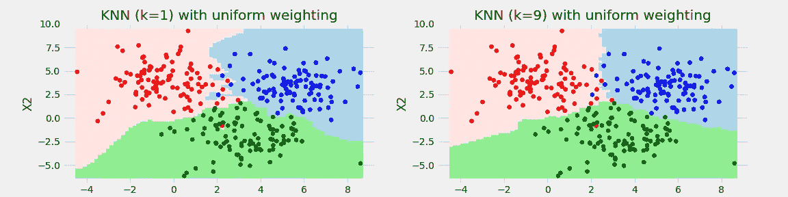
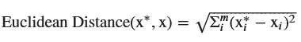
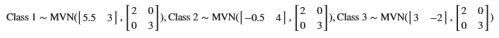
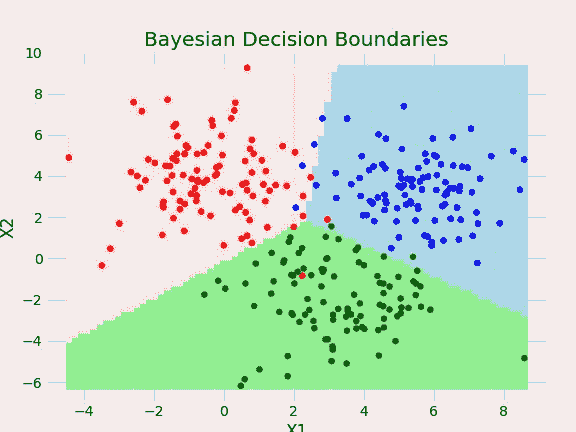
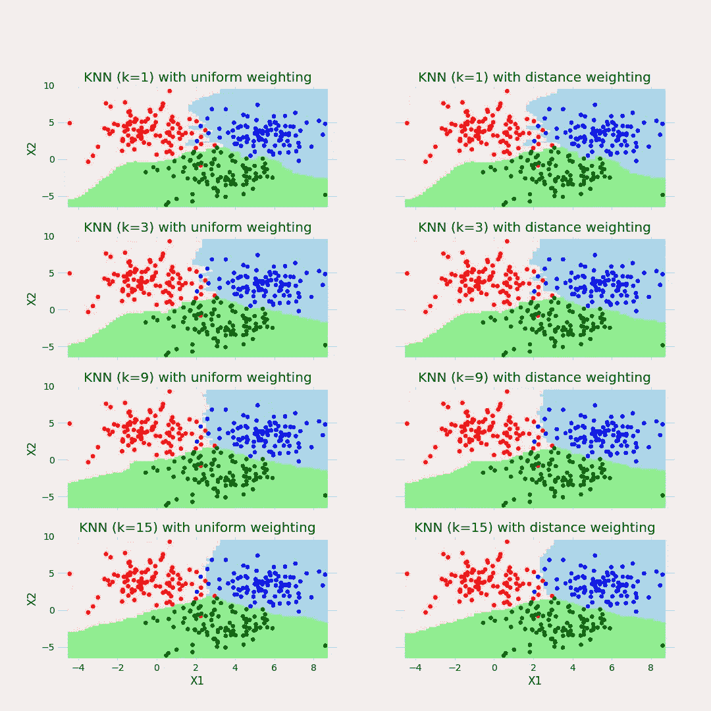
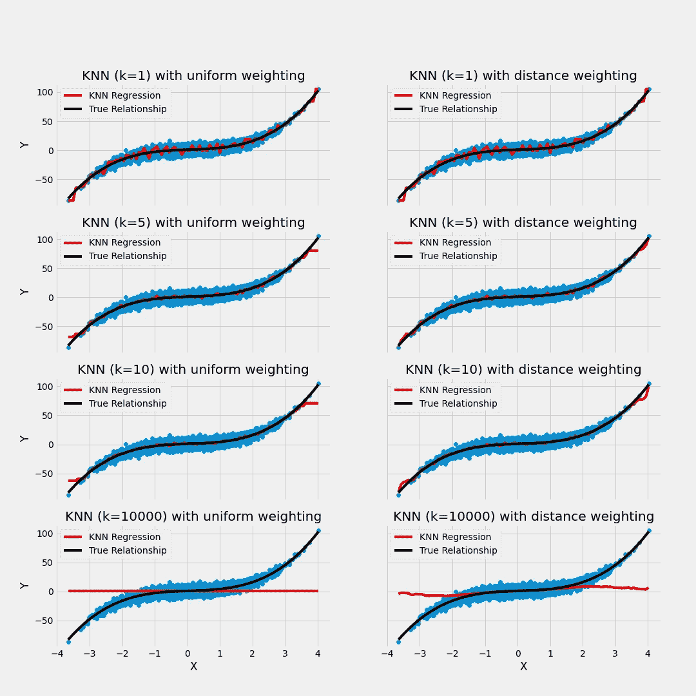
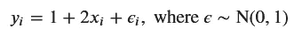
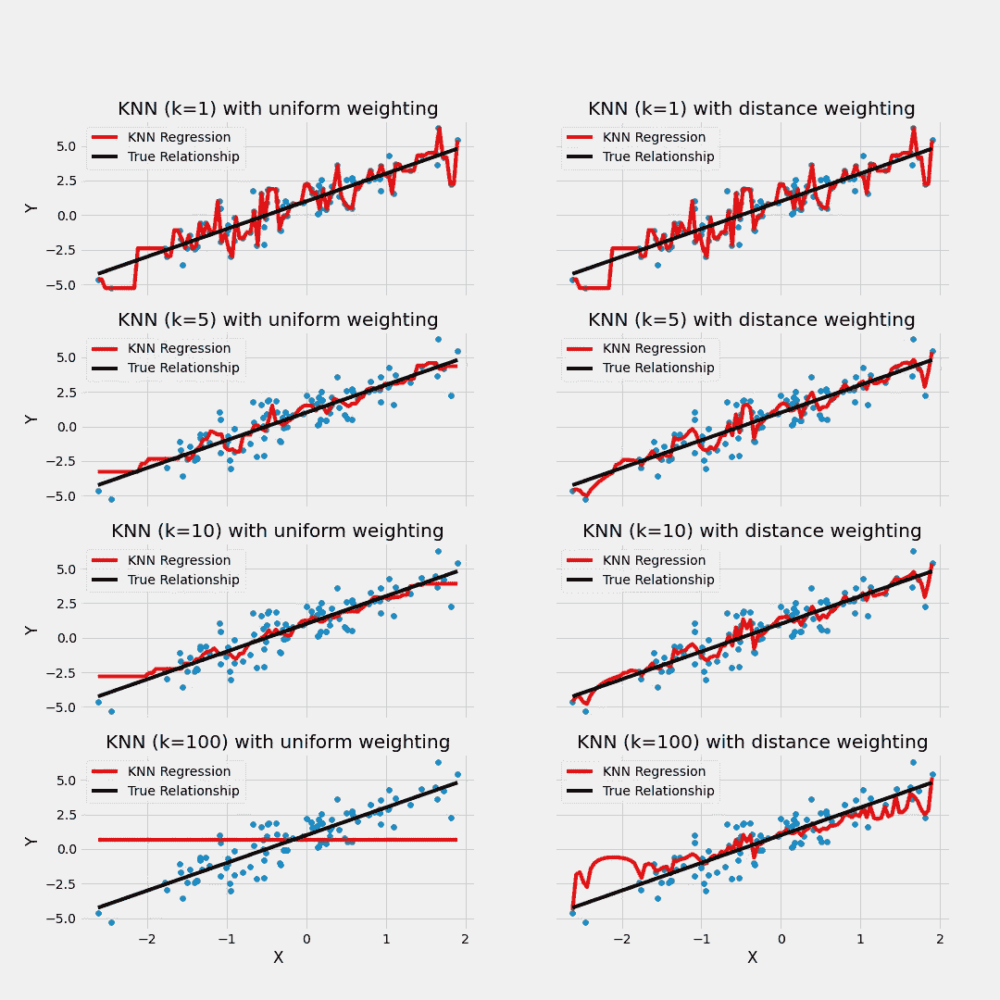

# K-最近邻(K-NN)解释

> 原文：<https://towardsdatascience.com/k-nearest-neighbors-k-nn-explained-8959f97a8632?source=collection_archive---------12----------------------->

K-NN (k=1)对 K-NN (k=9)分类器(所有图像均由作者生成)

## 一个简单但强大的算法背后的直觉

我已经决定创建一个 Python 库，只使用 [NumPy](https://numpy.org/) 和 [SciPy](https://www.scipy.org/) 来实现流行的机器学习算法。目的不是创建一个生产就绪的库，而是以一种易于阅读的方式编写这些算法，并在解释算法如何工作的文章中使用它们。我在项目中的第一步是我的 [PCA 文章](/principal-components-analysis-explained-53f0639b2781)，我现在已经将它合并到项目[回购](https://github.com/jkclem/duct-taped-ml)中。考虑到我现在有多忙，我为下一步采取了一个相对简单的算法；K-最近邻。虽然 K-NN 很简单，但在适当的情况下，它可以有惊人的预测准确性。该类的代码在文章的底部，repo 中包含本文使用的所有代码的文件夹在这里是。

# K-NN 简介

K-NN 是一种简单的算法，可能是学习机器学习的人最先遇到的算法之一。您只需找到最近的 k 个数据点，并使用它们的标签来预测新数据点的标签。这里， ***k*** 是一些小于或等于数据点数的正整数。最佳的 ***k*** 通常通过交叉验证来选择。较低的 ***k 值*** 给出更灵活的模型，而较高的 ***k 值*** 给出更不灵活的模型。 ***k*** 的最优值取决于数据生成过程的灵活程度和你拥有的数据量。

K-NN 是非参数模型。它没有对数据生成过程的模型做任何假设。它不学习任何参数，不像线性模型必须“学习”系数。这给了它一些优于结构化模型的优点和缺点。

K-NN 的中心思想是寻找接近新点的点，并聚集接近点的标签来预测新点。我喜欢这种简单。

## 强项

*   对数据生成过程不做任何假设，因此它可以适应灵活的模型。
*   “训练”模型与保存数据一样快，因为它不需要估计参数。
*   解释和实现都很简单。

**弱点**

*   对数据生成过程不做任何假设，这可能导致在没有足够的训练观测值的情况下过度拟合，或者导致 **k** 值太小。
*   数据集必须存储在模型可以访问的位置，对于大型数据集，这可能会占用大量内存。
*   与参数模型相比，进行预测相对较慢，因为它需要计算到训练数据点的距离，对它们进行排序，检索 **k** 个最近点，然后进行预测。
*   K-NN 是[维数灾难](https://en.wikipedia.org/wiki/Curse_of_dimensionality)的受害者；它在数据点非常分散的高维情况下表现不佳。
*   K-NN 对于在特征空间中展开的观察有困难。
*   K-NN 对异常值很敏感。

上面的一些优点和缺点是一个硬币的两面，例如它的灵活性和“训练”速度，但使用内存高，预测速度慢。也就是说，当我有足够的数据点时，这通常是我在预测问题上尝试的头几个算法，看起来它们可能是非常非线性的。如果有许多维度，我通常使用降维技术，如[主成分分析](/principal-components-analysis-explained-53f0639b2781)，在建模之前找到数据的较低维度表示。

将优点和缺点总结到使用 K-NN 的决策过程中，对于具有许多观察值的非线性函数来说，这是一个很好的选择，而当没有太多数据并且数据生成函数不需要太多灵活性时，这是一个很差的选择。

# K-NN 算法

K-NN 算法非常简单，前五个步骤对于分类和回归都是相同的。

**1。选择 *k* 和加权方法**

选择一个值 ***k*** ，它是为进行预测而检索的最近邻的数量。加权方法的两种选择是均匀加权和反距离加权。使用统一加权时，不考虑新数据点与其最近的 ***k*** 点之间的距离。它们对预测都有同等的影响。使用反距离加权，可以为距离较近的训练示例分配较高的权重。

您通常会尝试交叉验证中的各种 ***k*** 值和加权方法，并选择交叉验证损失最低的 ***k*** 和加权方法。

**2。“训练”K-NN 模型**

如上所述，在这个模型中没有要估计的参数。您只需保存训练数据以进行预测。

**3。传递预测数据**

只需给你的模型传递一个新的数据点来预测。

**4。计算距离**

到目前为止，我说的是“最近的”,但没有定义我的意思。有多种距离度量，我不会一一介绍。我将要介绍的是最常见的一种；欧几里德距离。欧几里得距离就是连接两点的线段的长度。两点之间的欧几里德距离公式如下:

其中 **x*** 是新数据点的特征向量， **x** 是单个训练数据点的特征向量， **m** 是用于预测的特征数。

使用您选择的度量计算新数据点与每个训练数据点之间的距离，并临时保存该距离以供下一步使用。

**5。寻找 K 个最近的邻居**

一旦知道了每个训练观察与新数据点之间的距离，就可以根据它们与新数据点之间的距离对数据点进行排序。然后选择距离最小的 ***k*** 个数据点。在我的实现中，我使用了 [quicksort](https://en.wikipedia.org/wiki/Quicksort) 对距离进行排序。

您现在已经在训练数据中找到了与您的新数据点最近的 ***k*** ，并且可以使用它们的标签进行预测。

6。预测

这是分类和回归的算法步骤的分歧之处。

**回归**

对于回归，你对最近的 ***k*** 训练数据点的标签进行平均，并将其用于最新数据点的预测。如果使用统一加权，这是标签的简单平均值。如果使用反距离加权，则计算训练标注的加权平均值，通过第 I 个最近邻的标注与新数据点的距离的倒数对其进行加权。这使得较近的点对预测标签的影响更大。如果距离为 0，权重将是未定义的，因为不能除以 0。为了在我的实现中解决这个问题，我给出了向距离添加一个小值的选项。这仍然导致距离为 0 的点在预测标注上具有非常大的权重。

**分类**

对于分类，使用训练标签的多数投票(对于二元分类)或多数投票(对于多类)来预测新标签。为了避免 50-50 的投票分裂，最好对*使用奇数。一个类别的投票比例可以解释为新数据点属于该类别的概率。就像在回归的情况下，你可以通过它们距离的倒数来加权每一个 ***k*** 最近邻居的投票，以给予更近的点更多的影响。*

# *演示 K-NN*

*现在我们已经介绍了算法的工作原理，我已经模拟了一个多类预测问题和两个回归问题的一些数据，以展示 K-NN 如何在具有各种值 ***k*** 和加权方法的简单问题中执行。先说分类。*

## *分类演示*

*为了演示用于分类的 K-NN，我模拟了来自 3 个类的 100 个数据点。利用模拟数据，我们可以将不同的模型与实际情况进行比较。每个类都由它自己的二元正态分布参数化。1 类用蓝色表示，2 类用红色表示，3 类用绿色表示。*

**

*同一协方差矩阵，每一类的均值是不同的。这是[线性判别分析](https://en.wikipedia.org/wiki/Linear_discriminant_analysis)的理想情况，但我们只是使用该知识来绘制[贝叶斯分类器](https://en.wikipedia.org/wiki/Bayes_classifier)的边界。*

**

*背景颜色之间的变化表示贝叶斯决策边界。它是线性的，但像素使它看起来参差不齐。我们希望 K-NN 模型尽可能地接近这一点。我训练了八个 K-NN 模型，K 值分别为 1、3、9 和 15，使用的是均匀和反距离加权。他们的决策空间图如下。*

**

*当 **k** 等于 1 并且在较小程度上等于 3 时，K-NN 模型具有过于灵活的决策边界。有一些分配给一个类的特征空间被另一个类包围着，这是没有意义的。具有等于 9 和 15 的 **k** 的模型的决策空间看起来更接近真实的决策边界。*

*这演示了与参数 **k** 的权衡。过低，模型会过于灵活；会超负荷的。反之亦然；a **k** 太高，模型太不灵活，这些都会在回归演示中表现出来。这是[偏差-方差权衡](https://en.wikipedia.org/wiki/Bias%E2%80%93variance_tradeoff)的一个例子。*

## *回归演示*

*为了演示回归的 K-NN，我做了两个场景；一个是 K-NN 表现良好的地方，另一个是表现不佳的地方。前一种情况涉及对具有许多训练观察值的非线性函数使用 K-NN 回归。后者涉及对具有少量训练观察值的线性函数使用 K-NN 回归。在后一种情况下，K-NN 会失败，因为数据点太少，无法填充特征可以采用的值的范围。有了更多的数据，K-NN 回归模型用一个精心选择的 **k** 值可以逼近线性函数以及非线性函数。*

***具有许多观察值的非线性函数***

*为了演示 K-NN 回归，在这种情况下，我模拟了来自标准正态分布的 10，000 次抽取，作为用于预测的特征。然后，我使用下面的等式从模拟特征生成标签。*

**

*因为我们知道真实模型是具有正态分布误差的三次多项式，所以我们知道带有二次和三次项的普通最小二乘回归将是我们对真实模型的最佳估计。在绘制数据和不了解事实真相的情况下，我们可能会得出同样的结论。让我们忽略这一点，专注于 K-NN 回归。*

*接下来，我使用 1、5、10 和 10，000 的 **k** 值拟合八个 K-NN 模型，同时使用均匀和反距离加权。我在数据散点图的顶部绘制了 K-NN 模型与真实数据生成函数的关系。正如您在下面看到的，在 **k** = 1 时，模型会在真实线附近反弹，因为它过度适应训练数据。当 **k** 为 5 时变得更平滑，当 **k** =10 时变得更平滑。当 **k** 等于训练数据中的观察数量时，标签的平均值被预测。如你所见，使用反距离加权有助于模型拟合尾部，数据更稀疏，更好。K-NN 有外推超出训练数据中的值范围的问题，尽管这不是 K-NN 独有的。在由训练数据填充的特征空间中的区域之外进行预测通常是不好的。*

**

*总的来说，K-NN 模型看起来对等于 5 和 10 的 **k** 表现良好，具有反距离加权。我们来看一个 K-NN 表现不佳的案例。*

***具有少量观测值的线性函数***

*为了创建一个 K-NN 回归表现不佳的案例，我只从标准正态分布中抽取了 100 个值作为预测值。数据生成过程如下:*

**

*如您所见，K-NN 模型对于所有尝试的 **k** 的值都是过拟合的，除了当 **k** 等于具有统一权重的观察值的数量时，在这种情况下，它仅预测训练标签的平均值。尽管数据生成过程很简单，但是由于训练样本的数量，K-NN 不能很好地逼近它。*

**

# *结论*

*我希望您现在对 K-NN 的工作原理有了一个很好的了解。此外，我希望我已经在建模时交流了灵活性的好处和缺点，或者称为[偏差-方差权衡](https://en.wikipedia.org/wiki/Bias%E2%80%93variance_tradeoff)。当相对于预测器的数量有许多样本时，K-NN 等灵活的模型可以通过允许模型更自由地拟合数据来帮助提高预测准确性。当数据点很少时，您最好在模型上强加结构。*

# *K-NN 分类代码*