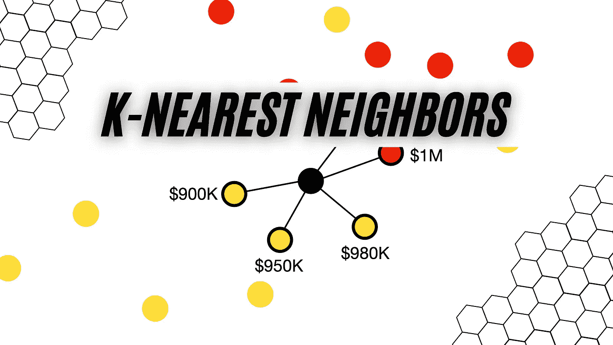
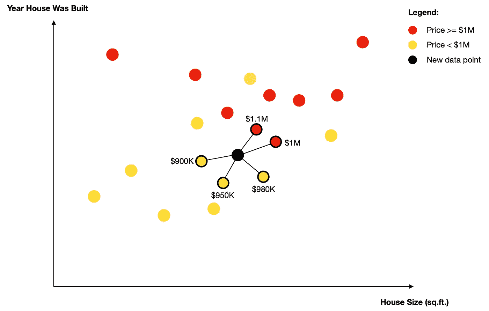
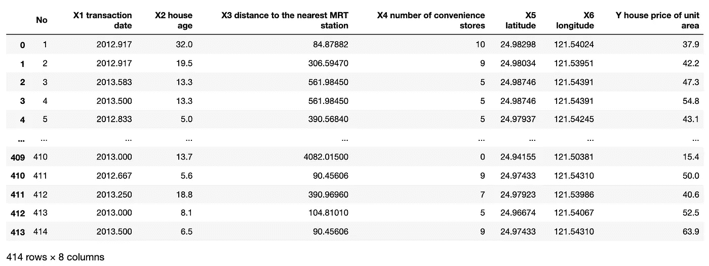
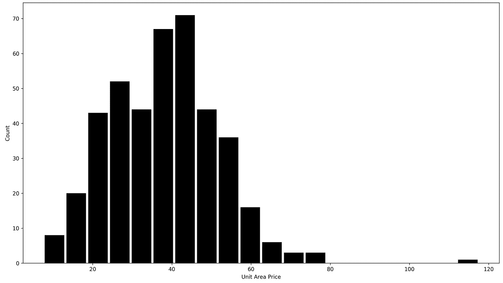
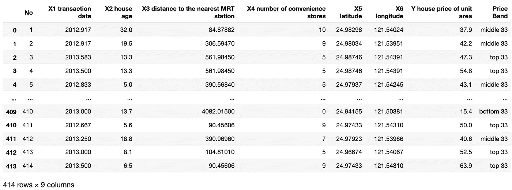
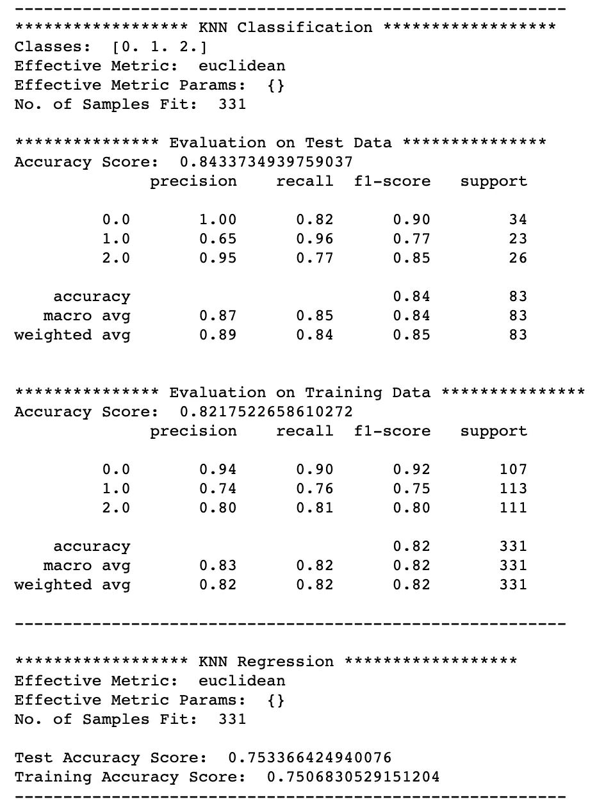
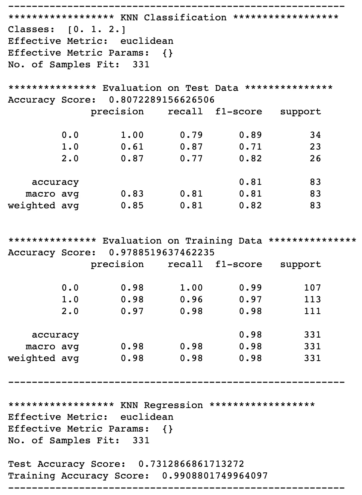
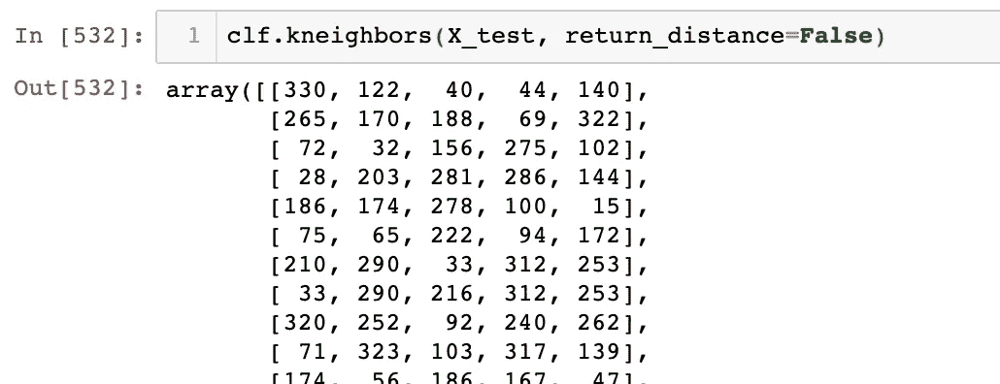
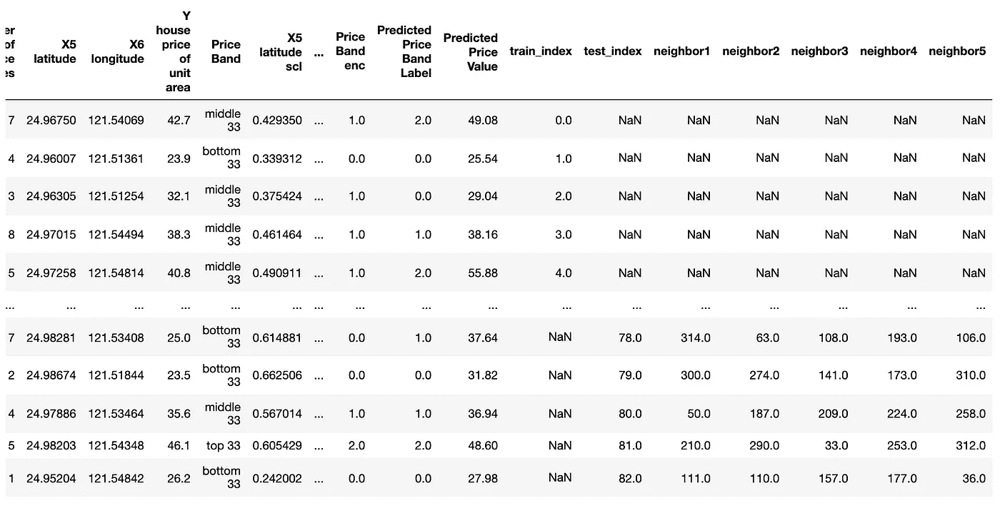

# k-最近邻(kNN)-如何使用监督学习进行质量预测？

> 原文：<https://towardsdatascience.com/k-nearest-neighbors-knn-how-to-make-quality-predictions-with-supervised-learning-d5d2f326c3c2?source=collection_archive---------6----------------------->

## 机器学习

## 使用 kNN 解决回归和分类问题的综合指南

k 近邻(kNN)机器学习算法。图片由[作者](https://solclover.com/)提供。

# **简介**

本文是深入研究不同机器学习算法的系列文章的继续。如果您对数据科学感兴趣，并且希望更好地理解 kNN 算法，或者如果您需要用 Python 构建自己的 ML 模型的指南，请继续阅读。

# **内容**

*   kNN 所属的算法类别
*   kNN 工作原理的直观解释
*   一个完整的 Python 示例，展示了 kNN 在真实数据中的使用

# **kNN 属于哪一类算法？**

有这么多的机器学习算法，可能永远不可能将它们全部收集和分类。然而，我已经尝试对一些最常用的进行了测试，你可以在下面的**交互式**旭日图中找到。确保点击👇在不同的类别上对**进行放大并揭示更多的**。

机器学习算法分类。由[作者](https://solclover.com/)创建的互动图表。

***如果你喜欢数据科学和机器学习*** *，请* [*订阅*](https://solclover.com/subscribe) *每当我发布一个新故事时，你都会收到一封电子邮件。*

从上图可以看出，k-Nearest Neighbors 属于机器学习算法的**监督**分支，这意味着它需要有标签的数据进行训练。

但是，假设你只想找到相似的数据点(即找到邻居)，而不是进行预测。那样的话，就有可能以无监督的方式使用 kNN*(参见 sklearn 的*[*nearest neighbors*](https://scikit-learn.org/stable/modules/generated/sklearn.neighbors.NearestNeighbors.html#sklearn.neighbors.NearestNeighbors)*实现这种无监督的学习器)*。

值得注意的是，kNN 是一种非常灵活的算法，可以用来解决不同类型的问题。因此，在本文中，我将带您了解它在**分类**和**回归**中的用法。

# **kNN 是如何工作的？**

让我们从 kNN 中的“k”开始。由于算法是基于最近的邻居进行预测的，所以我们需要告诉算法我们想要考虑的邻居的确切数量。因此，“k”代表邻居的数量，只是一个我们可以调整的超参数。

现在让我们假设我们选择了 k=5，并且我们有一个包含房屋大小(平方英尺)、房屋建造年份和房价的数据集。我们希望在这些数据上训练 kNN，然后用它来预测我们感兴趣的另一所房子的价格。

运行中的 kNN 算法。图片由[作者](https://solclover.com/)提供。

在上图中，黑色圆圈代表一个新的数据点(我们感兴趣的房子)。因为我们已经设置 k=5，所以该算法找到这个新点的五个最近的邻居。

> 注意，通常使用欧几里德距离，但是一些实现允许替代的距离度量(例如，曼哈顿)。

找到邻域后，根据您是执行分类分析还是回归分析，将会发生以下两种情况之一。

*   **分类:**该算法使用简单多数投票将标签分配给新的数据点。在我们的例子中，大多数由 3 个价格为 100 万美元的邻居组成。因此，新数据点的预测标签是< $1M。
*   **回归:**算法计算所有邻居的平均值。在我们的示例中，这将是:($90 万+ $95 万+ $98 万+$ 100 万+$ 110 万)/5 = $ 98.6 万。所以，房子的预测价格(新数据点)是 986K 美元。

从这个例子中可以看出，kNN 是一个非常直观的算法，很容易解释预测是如何进行的。因此，它与 RandomForest 或 XGBoost 等其他分类和回归算法形成对比。

最后要补充的是，上面的解释说明了使用统一砝码时会发生什么。即，每个邻居在计算中携带相同的权重。但是，在某些情况下(例如，当您有稀疏数据时)，使用基于距离的权重可能是有益的。

距离权重分配的权重与距查询点的距离成反比，这意味着距离数据点较近的相邻要素比距离较远的相邻要素具有更大的权重。

# kNN 在现实生活数据中使用的 Python 示例

现在让我们看一个 Python 例子，这样您就可以看到如何在实践中使用 kNN。

## 设置

我们将使用以下数据和库:

*   [Kaggle 的房价数据](https://www.kaggle.com/quantbruce/real-estate-price-prediction?select=Real+estate.csv)
*   [Scikit-learn library](https://scikit-learn.org/stable/index.html)for
    1)特征缩放([minmax scaler](https://scikit-learn.org/stable/modules/generated/sklearn.preprocessing.MinMaxScaler.html#sklearn.preprocessing.MinMaxScaler))；
    2)分类变量的编码([OrdinalEncoder](https://scikit-learn.org/stable/modules/generated/sklearn.preprocessing.OrdinalEncoder.html))；
    3)执行 kNN 分类([KNeighborsClassifier](https://scikit-learn.org/stable/modules/generated/sklearn.neighbors.KNeighborsClassifier.html#sklearn.neighbors.KNeighborsClassifier.kneighbors))；
    4)进行 kNN 回归([KNeighborsRegressor](https://scikit-learn.org/stable/modules/generated/sklearn.neighbors.KNeighborsRegressor.html#sklearn.neighbors.KNeighborsRegressor))；
    5)模型评估([分类 _ 报告](https://scikit-learn.org/stable/modules/generated/sklearn.metrics.classification_report.html))
*   用于数据可视化的 [Plotly](https://plotly.com/python/) 和 [Matplotlib](https://matplotlib.org/)
*   [熊猫](https://pandas.pydata.org/docs/)和 [NumPy](https://numpy.org/doc/stable/) 进行数据操作

让我们导入所有的库:

接下来，我们下载并接收将在 kNN 模型中使用的数据。
*(来源:*[*https://www . ka ggle . com/quant Bruce/real-estate-price-prediction？select = Real+estate . CSV*](https://www.kaggle.com/quantbruce/real-estate-price-prediction?select=Real+estate.csv)*)*

[Kaggle](https://www.kaggle.com/quantbruce/real-estate-price-prediction?select=Real+estate.csv) 的房价数据。图片由[作者](https://solclover.com/)提供。

我们将在模型中使用以下数据字段:

*   **特征(自变量):**‘X5 纬度’，‘X6 经度’，‘X2 宅龄’
*   **目标(因变量):** 'Y 单位面积房价'*注意，我们将使用原始字段进行回归，并创建一个带状版本用于分类。*

我们的目标是预测给定坐标和年龄的房屋的单位面积价格。但是，首先，让我们创建一个新的变量作为分类模型的目标。下面是‘Y 单位面积房价’的分布:

显示“单位面积 Y 房价”字段分布的直方图。图片由[作者](https://solclover.com/)提供。

我们可以任意选择对我们有意义的波段，例如 0–20、20–40、40–60、60–80 和 80+。但是，这将创建包含不同数量观测值的波段。例如，我们在(40–60)范围内有 171 个观察值，而在(60–80)范围内只有 18 个观察值。

由于 kNN 分类依赖于多数投票，拥有不平衡的数据将使算法很难选择除多数类之外的任何其他类。由于这个原因，我们将创建三个**平衡**波段，而不是将观察值分组为单位面积价格最低的 33%、中间的 33%和最高的 33%。

带有新的“价格范围”字段的房价数据将用于分类。图片由[作者](https://solclover.com/)提供。

最后，在开始训练模型之前，让我们在 3D 图上绘制观察结果以可视化数据。

房屋数据的交互式 3D 散点图。图表作者[作者](https://solclover.com/)。

像这样的可视化效果非常好，因为它们让我们可以立即看到数据中的模式。

绿点(价格区间底部 33%的房屋)分布在更广的区域(经度-纬度方向)，表明它们离中心位置更远，导致价格更低。

同时，蓝色(中间 33%)和红色(顶部 33%)点可以在同一位置找到，但在年龄上有显著差异。蓝色往往更老(因此更便宜)，而红色往往更新(更贵)。

## kNN 分类和回归

下面我提供了一大块代码，它完成了从特征缩放到模型训练和结果生成的所有工作。让我详细说明一下每一步:

**步骤 1——特征缩放**。因为 kNN 依赖于计算点之间的距离，所以确保我们的特征使用一致的比例是很重要的。否则，规模较小的将占主导地位，规模较大的将几乎没有影响。这里我们使用 **MinMaxScaler()** ，它保持底层分布不变，但将比例范围更改为 0 到 1。

此外，我们的分类模型的目标值为['底部 33 '，'中间 33 '，和'顶部 33']。由于 sklearn 的实现要求目标标签为数字，因此我们使用 **OrdinalEncoder()** 将其转换为[0，1，2]。

**步骤 2——训练/测试样本**。我们现在需要将数据分成训练和测试样本，这是在 **train_test_split** 函数的帮助下完成的。

我们还准备了两个独立的目标阵列。“yC”包含基于编码价格带的分类模型的目标，而“yR”包含基于原始房屋单位面积价格的回归模型的目标。

**第三步——模型设置**。在这里，我们建立模型并调整超参数。请注意，我们有两个独立的模型，一个用于分类，另一个用于回归。

正如我们之前所了解到的，它们本质上是相同的，只是在基于之前确定的最近邻计算预测时，在最后部分有所不同。在这种情况下，我们选择 **n_neighbors ("k")** 等于 5，并将权重设置为“统一”，给每个邻居一个相等的权重。

**步骤 4——培训**。我们使用训练数据和它们独特的训练目标阵列来训练这两个模型。

**步骤 5—预测**。模型训练完成后，我们使用它们来预测训练和测试数据的分类标签和回归值。

**第六步** **—绩效总结**。我们生成并打印性能指标来评估我们的模型。

以上代码打印了以下模型结果:

具有统一权重的 kNN 模型结果。图片由[作者](https://solclover.com/)提供。

如您所见，分类模型的性能相当好，测试和训练数据的准确率分别为 0.84 和 0.82。同时，回归模型在两个数据集上都产生了 0.75 的准确度分数(R)。

现在，让我们看看当我们将权重从“统一”改为“距离”时会发生什么，即，给予更近的邻居更高的权重。

> 注意，我们使用完全相同的 Python 代码，除了在两个模型中将 weights='uniform '改为 **weights='distance'** 。

结果如下:

具有距离调整权重的 kNN 模型结果。图片来自[作者](https://solclover.com/)。

我们可以在分类(0.98)和回归(0.99)的**训练**数据上看到模型性能的显著提高。然而，使用基于距离的加权对模型的泛化能力产生了负面影响，在**测试**数据上，分类性能下降到 0.81，回归性能下降到 0.73。

## 奖金代码

有时，我们还想知道训练集中的哪些数据点是我们通过测试集传入的数据点的邻居。您可以使用 **kneighbors()** 方法找出答案，该方法返回到每个“k”邻居的距离和索引。

测试记录的邻居指数(k=5)。图片由[作者](https://solclover.com/)提供。

然而，需要注意的是， **kneighbors()** 方法返回的索引引用了训练数据集中观察值的**索引号。因此，如果您想找到测试数据中第一个观察值的邻居，您需要在**训练数据集**中查找索引为 330、122、40、44 和 140 的记录。不要将该索引与原始数据框中的索引混淆。**

作为存储模型预测和邻居索引的一种方式，我编写了以下代码，将训练和测试数据合并到一个数据框中，同时保留 training_index 编号，以便您可以快速识别每个测试记录的邻居。它还保留预测标签和预测值。

包含模型预测和邻域索引的最终数据框。图片由[作者](https://solclover.com/)提供。

此外，我们现在可以使用上述数据框在 3D 图上绘制我们的模型预测，并直观地将其与原始数据进行比较。

带有模型预测的交互式 3D 散点图。图表作者[作者](https://solclover.com/)。

3D 图直观地证实了我们在模型评估总结中看到的良好结果。

# 结论

当谈到机器学习时，可解释性通常与模型的预测能力一样重要。因此，如果你正在寻找一个易于解释的算法，你可以向你的利益相关者解释，那么 kNN 可能是一个不错的选择。

但是，不要忘记缩放您的要素并尝试不同的超参数组合，因为 k=5 和 weight =“uniform”的默认值可能不适合您的数据。

我希望这篇文章对您有所帮助，并成为您在自己的数据科学之旅中使用的宝贵资源。请不要犹豫，分享你的想法，意见和问题。你的反馈对帮助我写出更好的故事至关重要。

干杯！👏
**索尔·多比拉斯**

***如果你已经花光了这个月的学习预算，下次请记得我。*** *我的个性化链接加入媒介是:*

 [## 通过我的推荐链接加入 Medium 索尔·多比拉斯

### 作为一个媒体会员，你的会员费的一部分会给你阅读的作家，你可以完全接触到每一个故事…

solclover.com](https://solclover.com/membership)  [## CART:清晰而强大的模型的分类和回归树

### CART 算法是如何工作的，如何在 Python 中成功使用？

towardsdatascience.com](/cart-classification-and-regression-trees-for-clean-but-powerful-models-cc89e60b7a85)  [## K-Means 聚类——在 Python 中成功使用的综合指南

### 用真实数据的 Python 演示解释 K-Means 算法

towardsdatascience.com](/k-means-clustering-a-comprehensive-guide-to-its-successful-use-in-python-c3893957667d)  [## 随机森林模型:为什么它们比单一决策树更好？

### 详细解释了随机森林机器学习算法如何工作，是什么使它优于决策树…

towardsdatascience.com](/random-forest-models-why-are-they-better-than-single-decision-trees-70494c29ccd1)