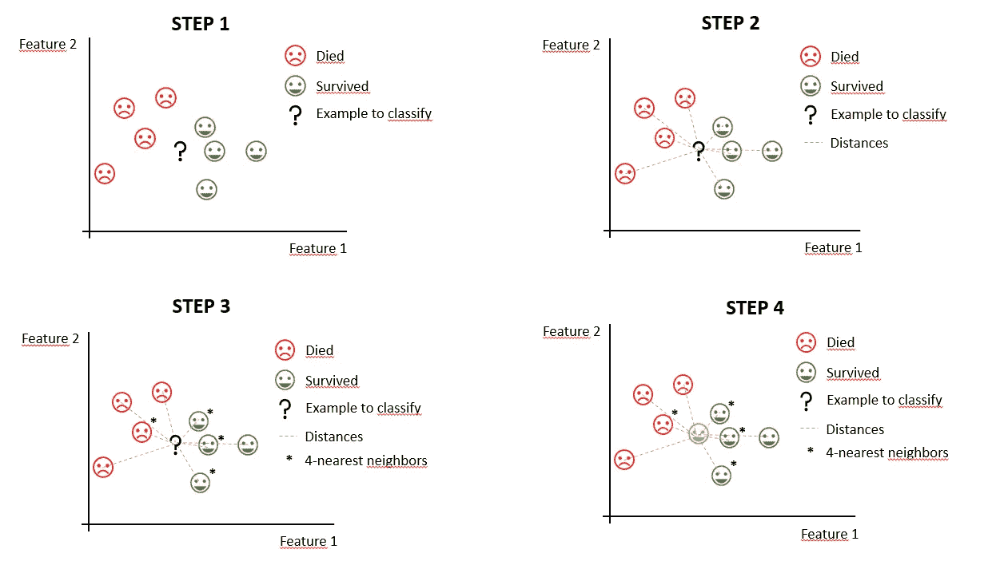
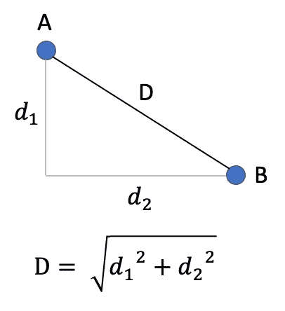

# k 近邻:理论与实践

> 原文：<https://towardsdatascience.com/k-nearest-neighbors-theory-and-practice-7f6f6ee48e56?source=collection_archive---------20----------------------->


照片由艾米丽-乔·苏克利夫在 [Unsplash](https://unsplash.com?utm_source=medium&utm_medium=referral) 上拍摄

## 了解如何使用 KNN，这是最直观的分类和回归算法之一

# 介绍

k-最近邻，也被称为 KNN，可能是最直观的算法之一，它对**分类**和**回归**任务都有效。因为它很容易理解，所以它是比较其他算法的一个很好的基线，特别是在**可解释性**变得越来越重要的今天。

# 直觉

比如说你想卖掉你的房子，需要估算一下价格。你可以看看你最近的 9 个邻居最近买房子的价格，然后计算平均值来估计你自己的房价。您刚刚使用了一个用于**回归**的 KNN 算法。是的，就这么简单。

在**分类**任务中，假设您将 KNN 应用于著名的泰坦尼克号数据集，目标是预测泰坦尼克号乘客是否幸存。你可以找到 4 个与你试图预测的乘客最相似的乘客，然后看看大多数人发生了什么:如果幸存的人比死亡的人多，你就把这个乘客归类为幸存者。

以下是一个示意性示例，帮助您一步一步地想象这是如何发生的:



作者图片

这些例子引出了两个主要问题:

1.  在第一个例子中，很容易定义您的最近邻居，但在第二个例子中，您如何衡量两个乘客有多相似？
2.  为什么第一个示例中有 9 个最近邻，而第二个示例中有 4 个？

嗯，第一个问题是关于定义和计算**距离度量**，第二个问题是关于定义“K-Nearest Neighbors”中 K 的最佳数量**。现在让我们更详细地讨论这些问题。**

# 距离测量

当我们谈论距离时，我们倾向于想到**欧几里德距离，**使用空间坐标:



欧几里德距离-作者图片

在上图中，A 和 B 之间的欧氏距离是 d。

然而，有多种方法可以计算两个物体有多近。例如，在同一个例子中，**曼哈顿距离**将是 *D = d1 + d2* (想想如果这些是街道，你会走多远)。

虽然在这个例子中我们只有二维，但当我们处理数据时，我们通常有更多的维度。然而，所有这些距离度量都适用于多个维度。

然而，有一个警告:当你使用 KNN 时，你绝对需要在计算这些距离之前通过标准化来**缩放你的数据**。否则，你会用完全不同的尺度来测量距离。在我们的泰坦尼克号的例子中，你将使用不同的变量来测量两个乘客之间的距离，例如他们的年龄和他们支付的船票价格，这显然不是同一个尺度。这将赋予倾向于具有更大值的变量更大的权重。

一旦您缩放了数据并选择了距离度量，您就可以计算所有观测值之间的距离(显然您不需要自己计算，KNN 实现已经为您完成了)。

# “K-最近邻”中 K 的最佳个数

好了，一旦您知道如何测量两个观测值的接近程度，您如何决定您将使用多少个邻居来进行估计呢？简单:通过选择在验证集上产生最佳误差度量的值，就像对任何其他超参数一样。

首先选择一个误差度量作为决策标准(例如，RMSE 回归或 AUC 分类)，然后使用网格搜索或您选择的其他方法测试 K 的多个值，看哪个效果最好。

但是，如果你想了解这个选择将如何影响你的算法，请思考一下它如何应用于我们的房价示例:K 越小，你就越忽略远处的邻居，而只关注隔壁的邻居。这应该是好事吧？好吧，但在这种情况下，你也更容易受到你的模型没有考虑到的其他特征的差异的影响:如果你的隔壁邻居有一个更大的房子和一个游泳池怎么办？或者，如果他只是幸运地以一个不为人知的原因以便宜得多的价格买下了他的房子呢？嗯，比你的估计不会很好。通过考虑许多邻居，你最终会消除这种噪音(但也可能最终会考虑离你家太远的房子)。所以这里有一个权衡，可以通过使用[交叉验证](https://en.wikipedia.org/wiki/Cross-validation_(statistics))来解决。

# 如何在实践中使用 KNN

让我们使用 Python 做一个简单的 KNN 分类示例，并尝试估计 Airbnb 住宿的价格是高于还是低于中位数。

这是一个**分类**任务，因为我们不试图估计价格本身，而是价格是高于还是低于中位数(一个**二元结果**)。

作为独立变量，我们有像**位置**(地理坐标)**邻居**和**评论数量**这样的东西。

## 密码

```
**[IN]:**
import pandas as pd
import numpy as np
from sklearn.preprocessing import StandardScaler, LabelBinarizer
from sklearn.model_selection import train_test_split
from sklearn.neighbors import KNeighborsClassifier
from sklearn.metrics import auc, roc_curve, confusion_matrix
```

这里，除了我们将用于任何分类任务的经典库，如 *pandas* 、 *numpy* 和 *sklearn.metrics* ，我们还导入了 *StandardScaler* ，这将使我们能够缩放我们的数据，以及 *KNeighborsClassifier* ，这是使用 KNN 进行分类的 sklearn 模块(对于回归，使用 *KNeighborsRegressor* )。

```
**[IN]:
# Reading data**
df = pd.read_csv("C:/Users/Arthur/Downloads/AB_NYC_20192.csv")**# Transforming categorical variables into binary**
df = pd.concat([
    df,
pd.get_dummies(df[['neighbourhood','neighbourhood_group','room_type']])
], axis=1)df = df.drop(['neighbourhood','neighbourhood_group','room_type'], axis=1)**# Creating our target variable**
df['price_cat'] = df['price'] < df['price'].median()**# Train test split**
X, y = df.drop('price_cat', axis=1), df.price_cat
X_train, X_test, y_train, y_test = train_test_split(
    X, y, test_size=0.33, random_state=42)
```

我们首先重新计算我们的数据，然后我们得到一些分类变量，并把它们转换成二进制。然后我们创建我们的目标变量(低于中值价格/不低于中值价格),最后我们进行训练/测试分割。

现在让我们尝试第一个模型，使用地理坐标(不按比例缩放)，以便仅根据地理位置找到最近的邻居。

```
**[IN]:**
**# Fit & predict**
neigh = KNeighborsClassifier(n_neighbors=50)
neigh.fit(X_train[['latitude','longitude']], y_train)
y_pred = neigh.predict(X_test[['latitude','longitude']])**# Evaluation**
fpr, tpr, thresholds = roc_curve(y_test, y_pred, pos_label=True)
auc_score = round(auc(fpr, tpr), 2)
threshold = 0.5
print("AUC: {}".format(auc_score))**[OUT]:** AUC: 0.72
```

正如您所看到的，我们使用 50 作为邻居的数量:这是一个任意的选择，稍后我们将回到这一点。

如果你不知道，AUC 是分类任务的质量指标，越接近 1 越好。0.72 的 AUC 是可以的，但不是很好。让我们通过向我们的模型添加更多的变量来尝试改进它，这一次，缩放它们。

```
**[IN]:**
categorical_variables = [
    col for col in df if col.startswith('neighbourhood') or col.startswith('room_type')
]
variables = [
    'latitude', 'longitude',
    'number_of_reviews', 'reviews_per_month'
]variables.extend(categorical_variables)
scaler = StandardScaler().fit(X_train[variables])
X_train_norm = np.nan_to_num(scaler.transform(X_train[variables]))
X_test_norm = np.nan_to_num(scaler.transform(X_test[variables]))**# Fit & predict**
neigh = KNeighborsClassifier(n_neighbors=50)
neigh.fit(X_train_norm, y_train)
y_pred = neigh.predict(X_test_norm)**# Evaluation**
fpr, tpr, thresholds = roc_curve(y_test, y_pred, pos_label=True)
auc_score = round(auc(fpr, tpr), 2)
print("AUC: {}".format(auc_score))**[OUT]:**
AUC: 0.82
```

如你所见，我们的 AUC 显著提高，基本上是通过添加那些新功能，这些新功能明显添加了许多关于合并的相关信息。

然而，我们没有改变 KNN 分类器中的任何参数。

让我们来看看对于不同的距离度量和不同的 K 值，分数会如何表现:

```
**[IN]:**
for dist in ['manhattan', 'euclidean']:
    print("Distance metric: {}".format(dist))
    for k in [2, 4, 10, 50, 100, 500]:
        # Fit & predict
        neigh = KNeighborsClassifier(n_neighbors=k, metric=dist)
        neigh.fit(X_train_norm, y_train)
        y_pred = neigh.predict(X_test_norm) # Evaluation
        fpr, tpr, thresholds = roc_curve(y_test, y_pred,        pos_label=True)
        auc_score = round(auc(fpr, tpr), 2)
        print("For K = {}, AUC: {}".format(k, auc_score))**[OUT]:** Distance metric: manhattan
For K = 2, AUC: 0.77
For K = 4, AUC: 0.8
For K = 10, AUC: 0.83
For K = 50, AUC: 0.82
For K = 100, AUC: 0.82
For K = 500, AUC: 0.81Distance metric: euclidean
For K = 2, AUC: 0.77
For K = 4, AUC: 0.8
For K = 10, AUC: 0.83
For K = 50, AUC: 0.82
For K = 100, AUC: 0.82
For K = 500, AUC: 0.81
```

首先，我们可以看到距离度量对我们的度量没有影响。

我们还可以看到，尽管 K 似乎对我们用例的 AUC 没有很大的影响，但它的最佳值在 10 左右。

根据上面的结果，下一步可能是尝试 10 左右的其他值，如 8 或 12，看看我们是否可以微调得更多一点，但这不太可能产生更好的结果。进行这种分析的另一种方法是在折线图上绘制 AUC 与 K 的关系，以观察 AUC 在多个 K 值下的表现。

## 额外参数

关于 scikit-learn 的 KNN 实现，您应该知道其他一些参数。您应该将它们添加到 *KNeighborsClassifier* 或 *KNeighborsRegressor* 中(更多信息，请查看[文档](https://scikit-learn.org/stable/modules/generated/sklearn.neighbors.KNeighborsClassifier.html) ) *。*

*   *度量*:这是选择要使用的**距离度量**的参数。我们试过“欧几里得”和“曼哈顿”。如果你专门处理**地理坐标**和整个**大面积**，“哈弗辛”可能是个不错的选择，因为它会考虑到地球的曲率。在处理一个小区域的时候，这样的城市，大概不会有太大的区别。当处理分类变量时，尝试使用“汉明”距离。
*   *权重*:该参数将决定如何对每个邻居的结果进行加权。将其设置为“距离”实际上会根据邻居到感兴趣的观察值的距离对目标变量进行加权:**邻居越靠近**，**其值对我们的估计的影响**越大。

# 结论

正如你所注意到的，KNN 有一些优势:

*   这很容易解释，当你必须向高层管理人员“推销”你的模型时，这很好
*   这是一个**非参数**算法，这意味着我们不必对我们的数据及其分布做任何假设。

T21 的一些缺点是:

*   KNN 不能处理**缺失值**的事实(强迫你输入一些估计值)
*   虽然它相对较快，但对于大型数据集，它会变得很快

如果你想巩固你的知识，我建议尝试自己实现算法，从零开始(计算距离，寻找最近的邻居等。).这应该不难做到，而且可以成为一种强有力的学习经历。

如果你喜欢这篇文章，你可能也会喜欢这些:

</still-using-the-same-old-hypothesis-tests-for-data-science-67a9913ce9b8> [## 还在用同样的旧假设检验数据科学吗？

towardsdatascience.com](/still-using-the-same-old-hypothesis-tests-for-data-science-67a9913ce9b8) </support-vector-machine-theory-and-practice-13c2cbef1980>  

> 如果你想进一步讨论，请随时在 LinkedIn 上联系我，这将是我的荣幸(老实说)。