# k-最近邻解释道

> 原文：<https://towardsdatascience.com/k-nearest-neighbours-explained-52c910c035c5?source=collection_archive---------18----------------------->

## 数据科学基础

## 了解这种受监督的机器学习算法是如何工作的

布鲁克·拉克在 [Unsplash](https://unsplash.com?utm_source=medium&utm_medium=referral) 拍摄的照片

k-最近邻(KNN 从这里开始)是一种直观且易于理解的机器学习算法。这篇文章简要介绍了 KNN。我们将首先通过一个简单的例子学习算法在概念上如何工作，然后用 Python 从头开始实现算法，以巩固概念知识。

# 📗 1.算法如何工作的摘要

## 📍1.1 培训

训练过程非常简单快捷。在训练期间，模型存储哪些特征组合对应于训练数据中的哪个目标。换句话说，它只是记忆训练数据。

## 📍 1.2.预言；预测；预告

所有的艰苦工作都发生在预测过程中。为了预测一个示例的目标，该算法经历以下步骤:

1️⃣找到 k-最近的训练例子(即邻居)。
2️⃣在 k 个最近的邻居中分配典型的目标值。这意味着分类的最常见目标类和回归的平均目标值。

正如你现在看到的，这个算法的名字泄露了它所做的事情的要点。这里有一种方式来思考 KNN 是如何工作的。训练示例就像一个查找表。当我们有一个新的示例要预测时，我们会找到与这个新示例最相似的 k 个训练示例，并基于这些相似训练示例的典型值进行预测。很直观很好理解吧？

现在，让我们将刚刚学到的知识应用到一个简单的例子中。

## 📍 1.3.例子

假设我们有以下训练数据集，它有三个特征: *x1* 到 *x3* 和一个二进制标签: *y.*

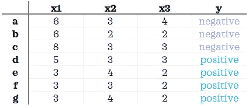

我们有一个如下的测试数据集:

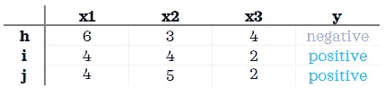

我们将使用欧几里德距离(一种流行的距离度量)来寻找最近的邻居，并设置 k=2。现在，让我们预测测试示例 *h* 的类。

**1️⃣找到它到所有训练样本的欧几里德距离。** 首先，让我们找出它到*的距离一*，第一个训练例子:

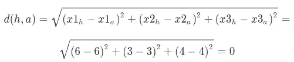

由于两者具有相同的特征值，其到 *a* 的距离为 0。现在，让我们计算它到下一个例子 *b* 的距离:

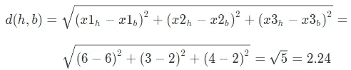

其到 *b* 的距离为 2.24。如果我们对其余的训练示例重复相同的计算，我们将得到以下距离:

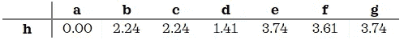

**2️⃣找到它的 k 个最近邻居(即具有最短距离的训练例子)。** 我们可以看到最近的两个邻居是 *a* 和 *d* 。

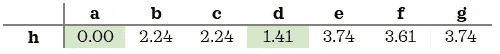

**3️⃣在其 k 个最近的邻居中找到最常见的标签。** 如果我们看训练数据，会发现 *a* 和 *d* 都属于*负*类。因此预测 *h* 为*负*，因为 2 个最近邻中最常见的类是*负*。

现在，让我们为其他两个测试示例找到 k 个最近邻:

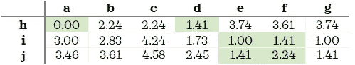

*i* 和 *j* 都离 *e* 和 *f* 最近。由于 *e* 和 *f* 之间的公共类为*正，t* he 模型预测测试实例 *i* 和 *j* 为*正*。

直观地理解特征尺度和 k 值的含义是有用的。
◼️ **特征比例:**虽然例子中的特征一开始没有相等的比例，但它们非常接近。想象特征 *x3* 大 10 倍:

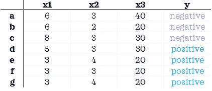

对于每个示例，距离和 k-最近邻都会发生变化:

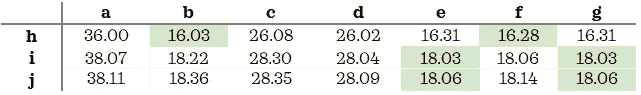

比例越高的要素在距离计算中的权重越大。这几乎就像特征比例暗示了距离计算中每个特征的权重。因此，如果你想让你的特征做出同等的贡献，在建模之前将它们放在相同的比例上是很重要的。

◼️:在我们的例子中，我们将 k 设置为 2。但是如果我们把 k 改成 7 会怎么样呢？

我们在训练数据集中有 7 个例子，最常见的类是*正*。k=7 时，模型会将任何记录预测为*阳性，*为训练数据中的多数类。下图右侧的光谱代表了这种情况:

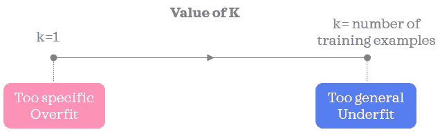

作者图片

当 k 太小时，模型可以检测到数据中非常细微的模式，并且易于过拟合，而 k 太大会导致模型过于一般化，易于欠拟合。找到 k 的最佳值需要试错学习方法。找到最佳 k 的一种方法是从随机搜索开始，在大范围内随机测试 k 的一组值，然后在更窄的有希望的值范围内进行网格搜索。

如果 k = 1，训练数据中没有重复的特征组合，你认为训练精度会是多少？答案是 100%准确的，因为每个都是自己最近的邻居。

我们现在将把我们在本节中学到的内容翻译成代码。

# 💻 2.Python 中的简单实现

让我们导入库并创建相同的玩具数据集:

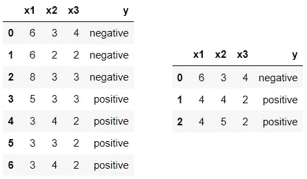

训练在左边，测试在右边

我们创建一个`KNNClassifier`，拟合它并做出预测:

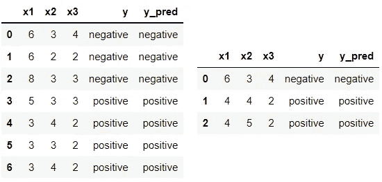

列车在右侧，试验在左侧

耶，我们刚刚用 Python 从头开始构建了一个非常简单的 KNN 分类器。虽然我们在这篇文章中关注的是分类，但是创建 KNN 回归器是很简单的。要创建一个回归变量，在上面的代码中，将第 1 行中的`KNNClassifier`重命名为`KNNRegressor` ，并将第 29 行改为:`y.append(np.mean(targets))`。

为了保持代码简单易读，上面的代码包含潜在的冗余步骤(例如求平方根)和非优化代码(例如存储所有邻居)。为了更好地理解算法，我们自己实现了算法。实际上，最好使用更优化的算法，比如来自 *sklearn* 的算法。

希瑟·巴恩斯在 [Unsplash](https://unsplash.com?utm_source=medium&utm_medium=referral) 上的照片

*您想访问更多这样的内容吗？媒体会员可以无限制地访问媒体上的任何文章。如果您使用* [*我的推荐链接*](https://zluvsand.medium.com/membership)*成为会员，您的一部分会费将直接用于支持我。*

在这篇文章中，我们已经涵盖了 KNN 的基础知识。感谢您阅读我的文章。如果你感兴趣，这里有我其他一些帖子的链接:
◼️️ [比较随机森林和梯度推进](/comparing-random-forest-and-gradient-boosting-d7236b429c15)
◼️️ [决策树是如何构建的？](/how-are-decision-trees-built-a8e5af57ce8?source=your_stories_page-------------------------------------)
◼️️ [管道，ColumnTransformer 和 FeatureUnion 说明](/pipeline-columntransformer-and-featureunion-explained-f5491f815f?source=your_stories_page-------------------------------------)t26】◼️️[feature union，ColumnTransformer &管道用于预处理文本数据](/featureunion-columntransformer-pipeline-for-preprocessing-text-data-9dcb233dbcb6)

再见🏃 💨