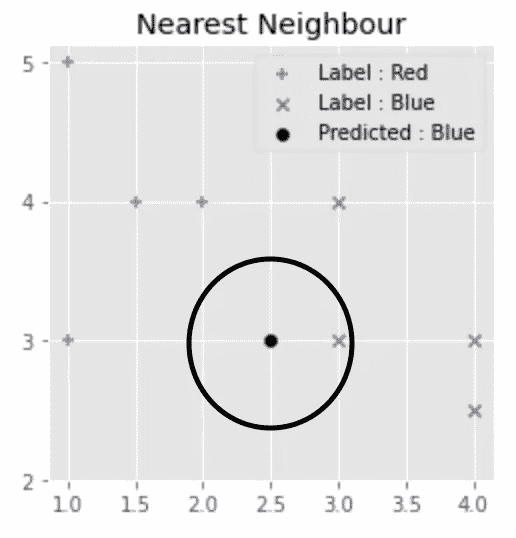
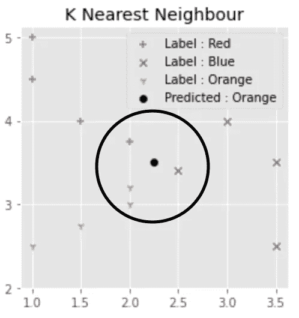

# k 最近的邻居解释说

> 原文：<https://towardsdatascience.com/k-nearest-neighbours-explained-7c49853633b6?source=collection_archive---------30----------------------->

## 使用 sklearn 库理解 KNN 算法及其在 Python 中的实现


图片来自:[https://unsplash.com/photos/lW25Zxpkln8](https://unsplash.com/photos/lW25Zxpkln8)

在这篇文章中，我将给出一个概述，实现，缺点和与 K 最近邻算法相关的资源。监督学习是机器学习的一个子部分，通常与基于分类和回归的问题相关联。监督学习意味着您正在使用带标签的数据集训练模型。k 近邻(KNN)属于监督学习范畴，是机器学习的核心算法之一。这是一个被广泛使用的简单而有效的非参数的懒惰学习者分类算法的例子。

*   懒惰学习者意味着它不从训练数据中学习判别函数，而是记忆训练数据
*   非参数意味着算法对数据的分布不做任何假设。

KNN 算法根据未分类数据点与其他可用数据点的接近度和相似度对其进行分类。该算法的基本假设是可以在彼此附近找到相似的数据点。它通常用于解决各种行业中的问题，因为它易于使用，适用于分类和回归问题，并且它生成的结果易于解释。

# 该算法

k 代表最近邻居的数量。当 K = 1 时，该算法称为最近邻算法。这是最简单的情况，给定一个未标记的位置 X，算法可以通过找到离 X 最近的标记点并将其指定为标记来预测其标记。



在这种情况下，未标记的黑点 X 将根据标记点的最近接近度被预测为蓝点(图片由作者提供)

该算法的工作原理如下:

```
1) Choose the number of K and a distance metric used to calculate        the proximity
2) Find the K nearest neighbours of the point we want to classify
3) Assign the point a label by majority vote
```



在未标记的黑点附近，橙色点的数量大于蓝色和红色点的数量。因此，该算法将预测这是一个橙色标签(图片由作者提供)

# K 的右值

K 的选择对模型至关重要，如果选择不正确，会导致模型过拟合/欠拟合。太小的 K 值将导致数据中的噪声对预测有很大影响，然而太大的 K 值将使其计算代价昂贵。

选择最佳 K 值的行业标准是取 N 的平方根，其中 N 是样本总数。当然，对这一点不能全信，因为它因问题而异。

您可以试验不同的 K 值及其相关的精度。确定 KNN 模型准确性的常见做法是使用混淆矩阵、交叉验证或 F1 分数。

# 优点和缺点

下面，我列出了使用 KNN 算法的一些优点和缺点。

**优势**

1.  简单直观—算法非常容易理解和实施
2.  基于内存的方法—允许 it 部门立即适应新的培训数据
3.  各种距离度量——用户可以灵活地使用最适合其应用的距离度量(欧几里得距离、闵可夫斯基距离、曼哈顿距离等)。)

**劣势**

1.  计算复杂性-随着训练数据的增加，计算速度会迅速降低
2.  在不平衡数据上表现不佳-当模型正在接受训练的大部分数据代表 1 个标签时，该标签被预测的可能性很高
3.  K 的最佳值-如果选择不正确，模型将与数据拟合不足或过拟合

# 履行

# 摘要

总之，这篇文章概述了 kNN 是一个懒惰的学习者和非参数算法。它的工作原理是根据未标记点与所有其他最近的标记点的接近程度，为未标记点分配一个标签。它的主要缺点是计算效率很低，很难选择 k 的“正确”值。然而，该算法的优点是它适用于不同的邻近度计算，非常直观，并且是一种基于内存的方法。

# 资源

*   [https://sci kit-learn . org/stable/modules/generated/sk learn . neighbors . kneighborsclassifier . html # sk learn . neighbors . kneighborsclassifier](https://scikit-learn.org/stable/modules/generated/sklearn.neighbors.KNeighborsClassifier.html#sklearn.neighbors.KNeighborsClassifier)

如果你喜欢这本书，那么看看我的其他作品。

[](/markov-chain-explained-210581d7a4a9) [## 马尔可夫链解释道

### 在本文中，我将解释并提供马尔可夫链的 python 实现。这篇文章不会是一篇深刻的…

towardsdatascience.com](/markov-chain-explained-210581d7a4a9) [](/link-prediction-recommendation-engines-with-node2vec-c97c429351a8) [## 使用 Node2Vec 的链接预测推荐引擎

### 使用节点嵌入进行链路预测

towardsdatascience.com](/link-prediction-recommendation-engines-with-node2vec-c97c429351a8) [](/word2vec-explained-49c52b4ccb71) [## Word2Vec 解释道

### 解释 Word2Vec 的直观性&用 Python 实现它

towardsdatascience.com](/word2vec-explained-49c52b4ccb71) [](/recommendation-systems-explained-a42fc60591ed) [## 推荐系统解释

### 用 Python 解释和实现基于内容的协同过滤和混合推荐系统

towardsdatascience.com](/recommendation-systems-explained-a42fc60591ed) [](https://medium.com/nerd-for-tech/monte-carlo-method-explained-8635edf2cf58) [## 蒙特卡罗方法解释

### 在这篇文章中，我将向你介绍、解释和实现蒙特卡罗方法。这种模拟方法是一种…

medium.com](https://medium.com/nerd-for-tech/monte-carlo-method-explained-8635edf2cf58)