# 国际歌迷眼中的韩国流行音乐

> 原文：<https://towardsdatascience.com/k-pop-in-the-eye-of-international-fan-7fe51dbdb712?source=collection_archive---------8----------------------->

## 韩国流行音乐调查数据分析

乔尔·穆尼斯在 [Unsplash](https://unsplash.com?utm_source=medium&utm_medium=referral) 上拍摄的照片

尽管韩国流行音乐产业已经发展了 20 年，但在过去的几年里，它在国内和国际上都经历了显著的增长。毫无疑问，该行业在促进韩国经济增长方面发挥着至关重要的作用。

该行业的显著增长也导致了全球众多粉丝的显著增长。虽然对于一个外国人来说学习韩语并不容易，但这并不是国际粉丝学习韩国语言和文化的界限。

> 为了了解国际观众，特别是西方观众眼中的韩国流行音乐产业，我根据 Saanjana Rraman 在 2019 年 2 月进行的[调查](https://figshare.com/articles/dataset/KPOP_DATA_xlsx/12095901)对韩国流行音乐的受欢迎程度和观众进行了分析。

您还可以找到我为支持本文而创建的 [Tableau Public](https://public.tableau.com/profile/monica.indrawan#!/vizhome/K-popDataVisualization/Dashboard2?publish=yes) 可视化仪表板。仅供参考，这是我的第一个数据分析项目，所以请随时给我任何意见和反馈。事不宜迟，请欣赏这篇文章。快乐阅读！

照片由 [Hiu Yan Chelsia Choi](https://unsplash.com/@hiholdmyhand?utm_source=medium&utm_medium=referral) 在 [Unsplash](https://unsplash.com?utm_source=medium&utm_medium=referral) 上拍摄

# 数据清理

与通常的数据分析管道一样，在进行任何分析之前，我们必须做的第一件事是清理数据。在这里，我使用 Python 作为编程语言。我清理数据的方法基本如下:

*   将每个列名转换成可读性更好的版本
*   通过将文本格式的答案分成几个类别来清理它们
*   使用一键编码方法将多个答案转换成二进制变量

> 如果你很好奇想知道更多关于数据清理是怎么做的，请参考这本 [Google Colab 笔记本](https://github.com/monicaindrawan/kpop_survey_analysis/blob/main/kpop_data_cleaning.ipynb) *。*

# 人口统计分析

首先，我们将看到调查对象的人口统计。

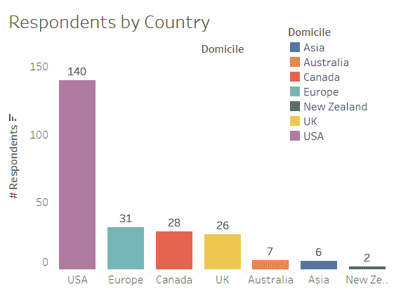

按国家分列的受访者。图片作者。

本次调查有 240 名受访者，其中 140 人来自美国。紧随美国之后，有 31 名欧洲受访者和 28 名加拿大受访者。

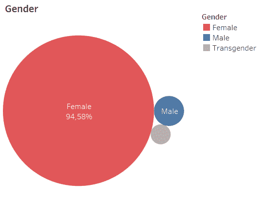

性别比例。图片作者。

至于性别，女性受访者以 94.58%的比例主导调查结果。与此同时，所有跨性别受访者共有 4 人来自美国。

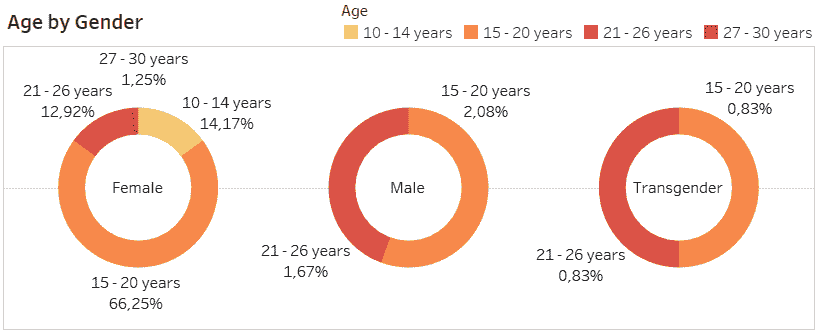

按性别划分的年龄。图片作者。

另一方面，大多数受访者的年龄在 15 岁至 20 岁之间，在所有性别中共占 69.16%。

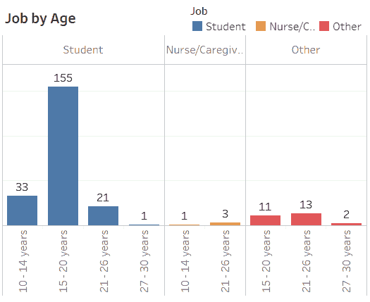

按年龄划分的工作。图片由 Autor 提供。

至于职业，大部分是学生其次是护士或者护理员。至于学生，以 15-20 岁年龄段为主。

# 按年份划分的受欢迎程度

在我们深入分析之前，让我们先看看受访者对韩国流行音乐的熟悉程度。根据下面的图表，我们可以看到很大一部分受访者是在 3 到 4 年前，即 2016 年左右开始了解韩国流行音乐的。

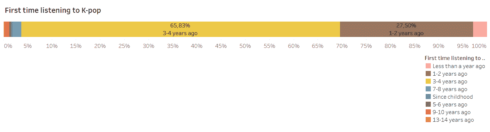

第一次接触韩国流行音乐。图片作者。

这一观点也得到了当年制作 K-pop 反应视频的多家西方 youtube 频道的支持。例如，React channel 制作的一个[视频](https://www.youtube.com/watch?v=-ttDePTDRi0)显示，BTS 的音乐视频打破了 K-pop 团体 24 小时内观看次数最多的记录，K-pop 专辑一周内销量最多的记录，以及 Billboard Top 200 中排名最高的专辑。

# 按国家分列的受欢迎程度

> 那么，根据这个调查，最喜欢的 K-pop 组合是什么呢？

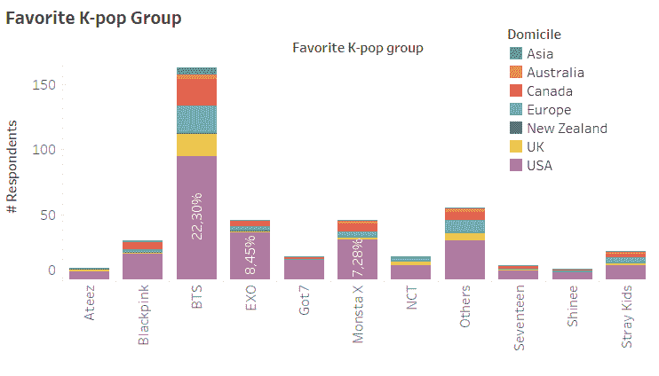

最喜欢的 K-Pop 组合。图片作者。

事实证明，BTS 是所有国家中最受欢迎的 K-pop 组合，美国是受访者人数最多的国家。

不同于互联网上的趋势显示 Blackpink 总是与 BTS 竞争打破最快视频达到数百万次的记录，事实证明 MONSTA X 和 EXO 是第二大最受欢迎的 K-pop 组合，然后是 Blackpink。

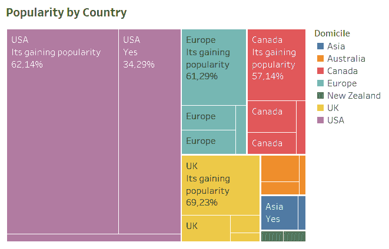

按国家划分的受欢迎程度。图片作者。

我们还可以看到，韩国流行音乐在美国和亚洲产生了巨大的影响，而它在欧洲、加拿大、英国和澳大利亚仍在增长。

# K-pop 是一个昂贵的爱好吗？

在韩国流行音乐行业，merch 和音乐本身一样重要。各种各样的商品可以以荧光棒的形式出现在相册中。

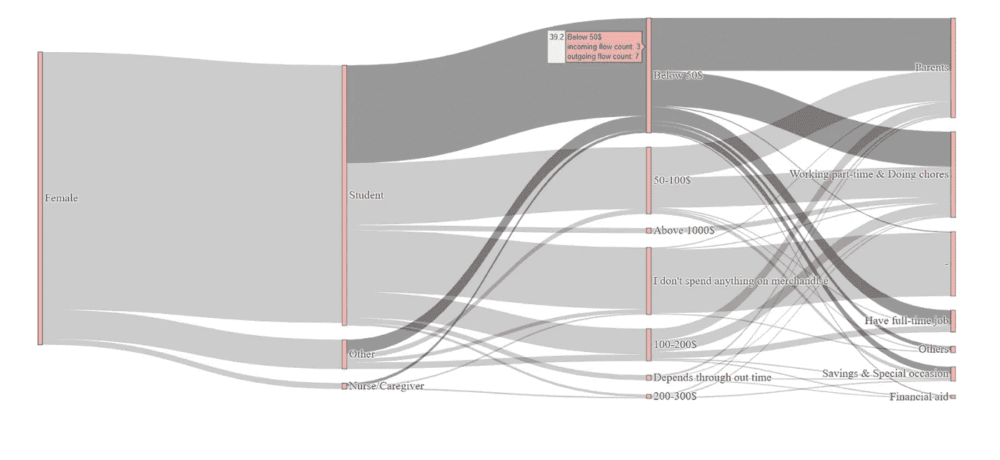

女性 Merch 美元消费桑基图表。图片作者。

调查结果显示，大部分受访者的职业是学生，尤其是女性，主要花费在购买他们喜欢的团体商品和音乐会门票上的费用低于 50 美元。

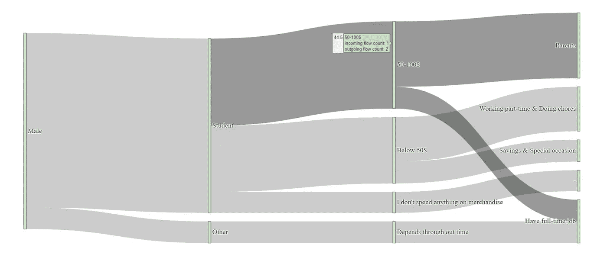

男性 Merch 美元支出桑基图表。图片作者。

相反，对于男性来说，他们花的钱大约是 50 到 100 美元。这笔钱多是从父母那里或者打工兼职得来的。特别是对于男性来说，花费低于 50 美元的人从兼职工作和储蓄中获利，而不是从父母那里。

# 韩国流行音乐视频

> 韩国流行音乐总是与复杂的视频和令人难忘的视觉效果联系在一起。由于视频的独特性，观众可以自由地对艺术家的作品做出自己的推测。

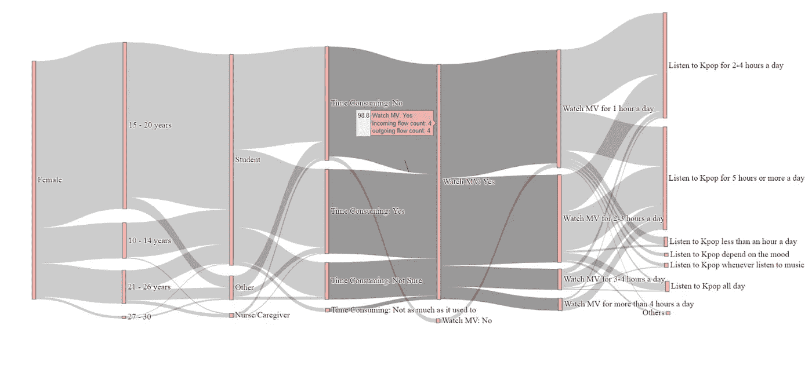

女表 MV 桑基图表。图片作者。

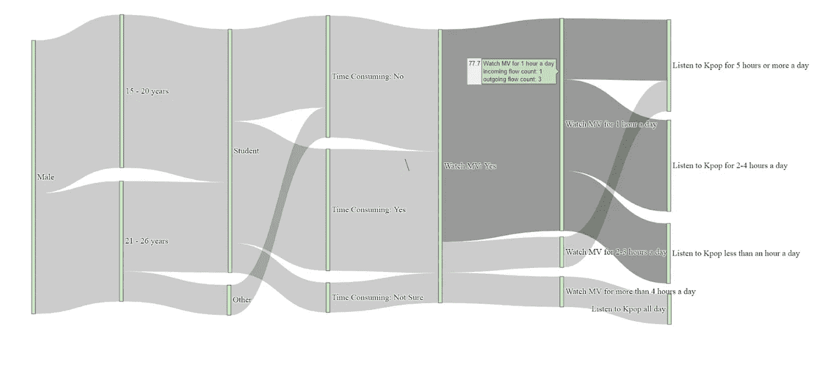

男表 MV 桑基图表。图片作者。

与上述事实一致，可以看出几乎所有的受访者都观看 K-pop 音乐视频，大多数人每天花 1 小时观看视频。

# K-pop 很费时间吗？

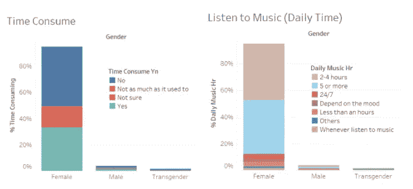

韩国流行音乐耗时吗？图片作者。

大约 48%的受访者不认为 K-pop 很费时间，少数人声称他们没有很好的时间管理。紧随其后，有 35%的受访者认为韩国流行音乐很费时间。

另一方面，听 2-4 小时的人(44.16%)和听 5 小时或以上的人(41.67%)之间没有显著差异。

# 最后的话

这些照片由 [Unsplash](https://unsplash.com?utm_source=medium&utm_medium=referral) 上的[梅拉尼](https://unsplash.com/@0_astrea?utm_source=medium&utm_medium=referral)拍摄

最后，这是本文的结尾。希望它能给你有帮助的见解或关于韩国流行有趣的事实。

如果你有任何问题或者只是想和我进一步聊天，请在 [LinkedIn](https://www.linkedin.com/in/monicaindrawan/) 上打电话给我！

> 你可以在这里找到我在这个项目中使用的所有代码。

# 参考

[figshare.com/articles/dataset/KPOP_DATA_xlsx/12095901](https://figshare.com/articles/dataset/KPOP_DATA_xlsx/12095901)

[www.youtube.com/watch?v=-ttDePTDRi0](http://www.youtube.com/watch?v=-ttDePTDRi0)

[f stoppers . com/composite/why-do-kpop-music-videos-look-so-good-comparated-American-music-videos-492870 #:~:text = The % 20 basic % 20 answer % 20 is % 20 that，lighting % 2C % 20 depth % 2C % 20 and % 20 composition。&text = It % 20 can % 20 be % 20 of % 20 shapes % 2C % 20 lines % 2C % 20 or % 20 colors](https://fstoppers.com/composite/why-do-kpop-music-videos-look-so-good-compared-american-music-videos-492870#:~:text=The%20basic%20answer%20is%20that,lighting%2C%20depth%2C%20and%20composition.&text=It%20can%20be%20of%20shapes%2C%20lines%2C%20or%20colors)。

[rollingstoneindia.com/art-korean-music-videos/](https://rollingstoneindia.com/art-korean-music-videos/)