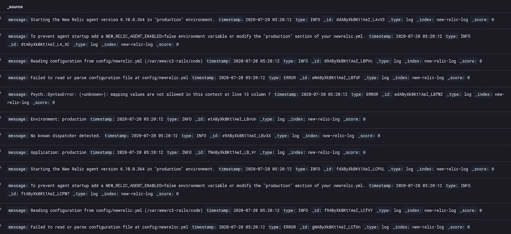

# 使用 Python 和 Elasticsearch 简化仪表板

> 原文：<https://towardsdatascience.com/kafka-elasticsearch-kibana-and-python-e6e72598c1f3?source=collection_archive---------11----------------------->

## 使用 python、elasticsearch、apache Kafka 和 Kibana 构建强大的仪表盘

流处理是一个非常强大的数据处理范例，它帮助我们以连续流的形式处理大量的数据点和记录，并允许我们实现实时处理速度。

> ***阿帕奇卡夫卡*** 对于数据流来说是一个极其强大的工具。它具有高度的可扩展性和可靠性。[1]
> 
> ***Elasticsearch*** 是基于亮氨酸库的搜索引擎。它提供了一个分布式的全文搜索引擎，带有 HTTP web 接口和无模式的 JSON 文档。[2]
> 
> Kibana 是可视化我们的弹性搜索数据库/索引内容的优秀工具。它帮助我们非常快速地构建仪表板。[3]
> 
> Python 是每个人都喜欢的语言，因为它非常容易使用。

在这篇博客中，我们将看到如何利用上面的堆栈的力量，从真实数据中创建一个仪表板。

为了模拟一个流数据源，我们将使用一个包含随机系统日志的日志文件，我们将把这个信息推送到一个 ***kafka*** 主题。图 1 给出了整个系统的架构

图 1:我们的流处理管道的架构图

让我们从我们的 ***卡夫卡*** 制片人代码开始。让我们称这个为 ***Producer.py.*** 在这个文件中，我们将执行以下操作→加载日志文件的内容并解析它，将数据推送到一个 ***kafka*** 主题，供我们的另一个 python 程序使用，该程序将这些信息推送到***elastic search***。Kafka 生产者代码块如下面的代码片段所示(图 2)。生成器对象是在构造函数调用中创建的。 ***产生*** 方法获取一条消息，将其转换为 ***json*** 并将其推送到指定的 ***kafka*** 主题

图 2: Kafka 生产者代码块

对于这个程序，我使用的是**confluent _ Kafka***python 包。 **Github 链接→**[***https://github.com/confluentinc/confluent-kafka-python***](https://github.com/confluentinc/confluent-kafka-python)*

*在为日志文件编写解析器之前，让我们先看一下日志文件。下面的图 3 显示了日志文件中的一些行。*

**

*图 3:日志文件内容*

*下面给出了解析日志并以 python 字典格式返回消息的代码块(图 4)。在检查日志文件时，我们注意到日志消息有以下类型→ ***["信息"、"错误"、"严重"、"警告"]*** 。这些信息将有助于在 ***Kibana*** 仪表盘上对我们的数据进行分类。*

**

*图 4:我们日志文件的解析器*

*图 4 中的解析器类相当简单。我们有几个函数来加载日志文件，并使用 ***iter*** 函数返回每一行。*

*一旦我们有了我们的日志文件解析器和 ***kafka*** 生成器，我们就可以继续将日志消息发送到我们的 ***kafka*** 主题。这些信息将会被消费者收集起来，并推送到***elastic search***。图 5 显示了我们如何调用方法将消息推入 kafka 主题。*

**

*图 5:调用我们的解析器方法和生产者方法的主函数*

*在运行主函数时，日志文件的内容被推送到 ***kafka*** 主题，并由另一端的消费者接收。下面的图 6 给出了输出。*

**

*图 6:日志生产者代码的输出*

*接下来，我们将继续编写将所有这些信息推送到***elastic search***上的部分，然后继续在 ***Kibana 上创建仪表板。****

*为了用 python 连接到 **Elasticsearch** ，我们将使用 python 的官方 Elasticsearch 库→[***https://elasticsearch-py.readthedocs.io/en/v7.13.0/***](https://elasticsearch-py.readthedocs.io/en/v7.13.0/)*

*在图 7 中，我们有一个名为 **Elastic** 的类，在这里我们连接到在端口 ***9200*** 上运行的***Elastic search***实例。对于这个实验，我们使用一个***docker-compose***文件，其中包含了对***elastic search***和**kibana*服务的配置。这个实验的 GitHub repo 中有***docker-compose***文件(博客末尾的链接)。一个简单的***docker-compose up***应该启动我们的***elastic search***和 ***kibana*** 实例。**

**

*图 7:连接到 elasticsearch 实例并推送数据的类*

****Elasticsearch*** 用来存储数据的数据结构称为 ***倒排索引*** 。它具有快速识别每个单词的能力。因此，我们能够以实时速度执行搜索和查询。在我们的实验中，索引的名称是***【new-relic-log】****

*图 8 中给出了 Kafka 消费者块，我们将使用它来读取来自 ***kafka*** 主题的消息，生产者将所有日志消息发送到该主题。***read _ messages***方法让我们不断地轮询主题并寻找消息。*

**

*图 8:卡夫卡消费区*

*一旦我们有了来自消费者的消息，我们可以调用 ***Elastic*** 类中的***push _ to _ index***方法将消息推送到 Elasticsearch，如图 9 所示*

**

*图 9:向 elastic 发送数据*

*下面的图 10 显示了图 9 中命令的输出。写响应显示了我们将数据传输到 elasticsearch 的细节，包括索引细节和结果。*

**

*图 10: Elasticsearch 数据推送输出*

*现在让我们看看数据是如何出现在 Elasticsearch 上的。为了访问我们的索引，我们将直接转到我们的 ***Kibana*** 仪表盘。确保您的 Kibana 和 Elasticsearch 容器运行正常。前往[**http://localhost:5601**](http://localhost:5601)*←*这是我的本地机器上运行 ***Kibana*** 的端口。 ***基巴纳*** 的主屏幕如下图 11 所示*

**

*图 11:基巴纳主屏幕*

*现在检查数据是否正确地进入我们的 ***新遗迹日志*** 索引，点击 ***发现*** 按钮(左手边面板上的第二个按钮)，如图 12 所示。从下拉菜单中选择索引为***new-relic-log***，您应该会看到 python 发送的所有日志消息都显示在屏幕中央(图 13)*

**

*图 12:发现按钮和索引选择*

**

*图 13:在 Kibana 上注销*

*为了过滤掉仅仅是 ***INFO*** 日志或者是 ***ERROR*** 日志，我们可以使用顶部的搜索栏，它为我们提供了许多过滤数据点的选项。 ***信息*** 日志过滤示例见下图 14*

**

*图 14:过滤的信息日志*

*现在，为了使我们的数据可视化并将其放在一个真实的仪表板上，我们必须准备一些图表。让我们从折线图开始。该折线图将汇总不同日志类型的计数并显示。*

*点击 ***可视化*** 按钮，在左侧面板的 ***发现*** 按钮的正下方(图 15)。*

**

*图 15:可视化选项卡*

*点击 ***新建可视化*** 按钮，会出现多种不同类型的图表选项(图 16)。对于这个例子，我们将使用折线图*

**

*图 16:图表选项*

*选择了首选图表类型后，系统将提示您选择要从中读取数据的索引。这里，我们将选择新遗迹日志索引(图 17)*

**

*图 17:可视化的索引选择*

*现在，我们将为折线图创建设置。在 ***Y 轴*** 上，我们将参数选择为 ***计数。*** 在 X 轴上我们将选择参数作为 ***时间戳*** 。Kibana 还为我们提供了一个选项，可以在不同的键之间在同一 X 轴上分割图表。在我们的例子中，我们将可视化计数***INFO****日志和***ERROR****日志在同一图表上。设置分别如图 18(a、b)和 19 所示。最终图表如图 20 所示。如您所见，我们对两种日志类型的时间戳进行了聚合。***

******

***图 18 (a): X 轴***

******

***图 18 (b):拆分系列选项***

******

***图 19 : Y 轴***

******

***图 20:信息日志类型和错误日志类型的计数。***

***我们还创建了一个饼图来获得两种不同日志类型的总数(图 21)。要创建饼图，只需选择可视化屏幕上的饼图选项，而不是折线图选项。***

******

***图 21:日志类型计数的饼图***

***现在，我们将创建我们的第一个基巴纳仪表盘。这一步再简单不过了。***

***点击 ***仪表板上 ***正下方的*** 按钮，可视化*** 按钮。点击**顶部的*添加*按钮→选择图表，完成。您已经准备好了您的仪表板(图 22)*****

**

*图 22:仪表板*

*我希望这篇博客有助于简要介绍我们如何利用这些开源工具来构建健壮的数据流管道。*

*Github 项目链接→[***https://github.com/AbhishekBose/kafka-es***](https://github.com/AbhishekBose/kafka-es)*

****参考文献:****

*[1][https://en.wikipedia.org/wiki/Apache_Kafka](https://en.wikipedia.org/wiki/Apache_Kafka)*

*[https://www.elastic.co/](https://www.elastic.co/)*

*[https://www.elastic.co/what-is/kibana](https://www.elastic.co/what-is/kibana)*