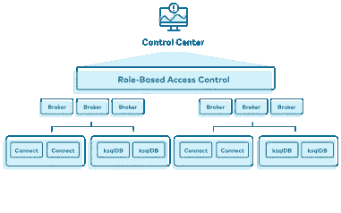
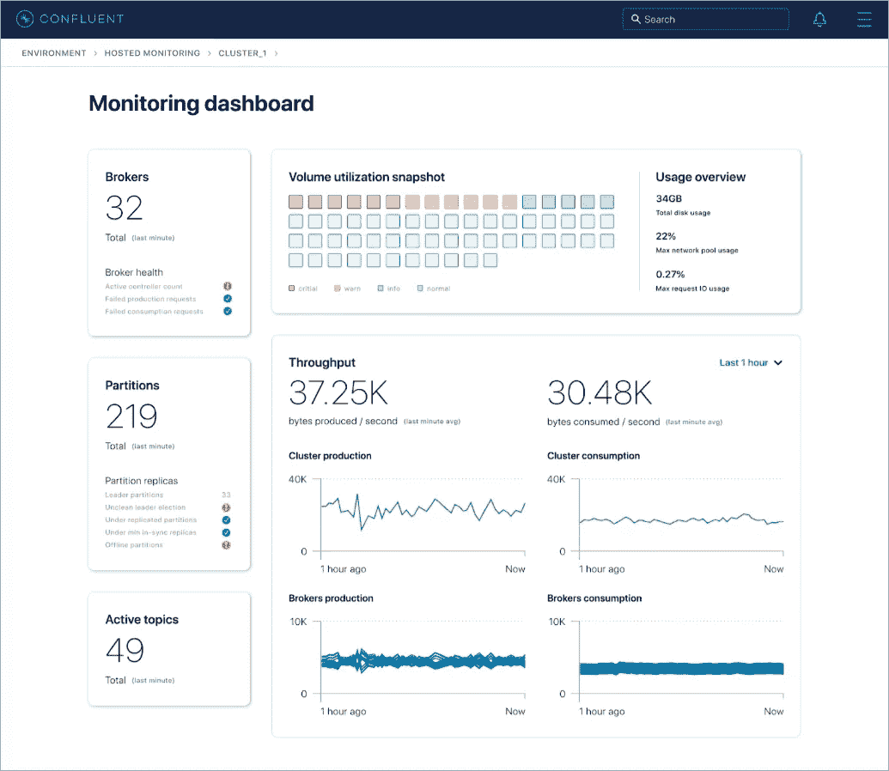
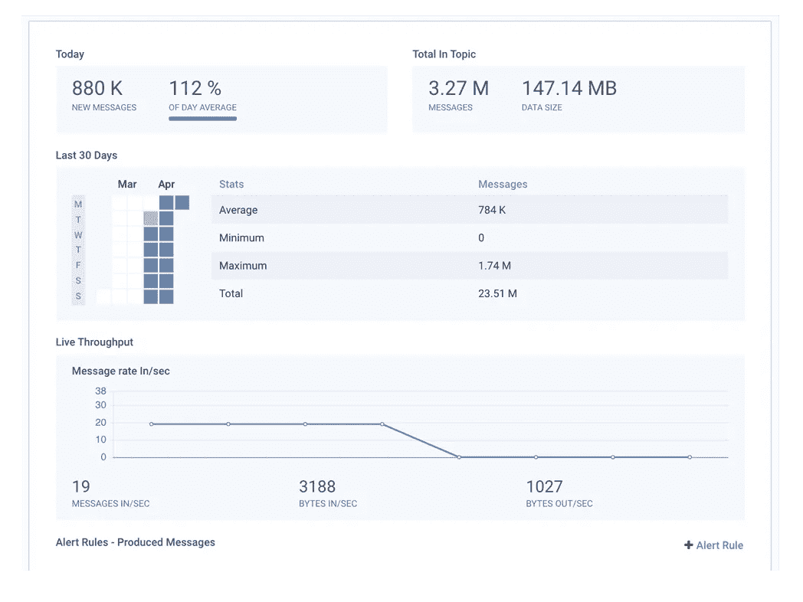
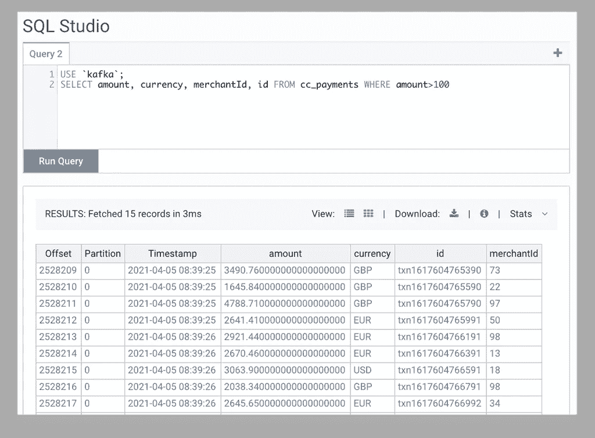
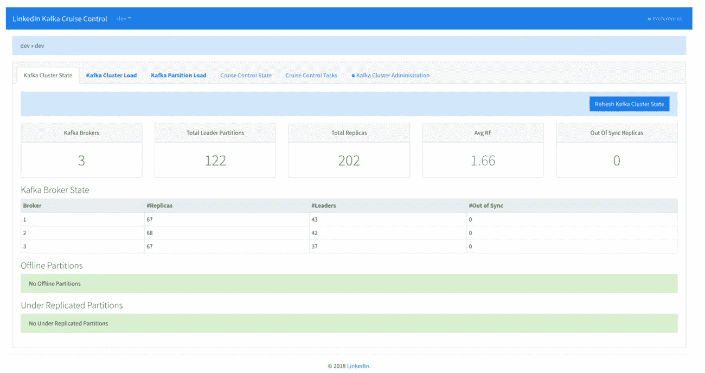
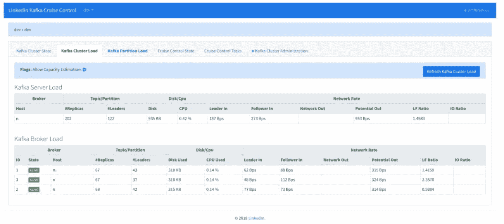
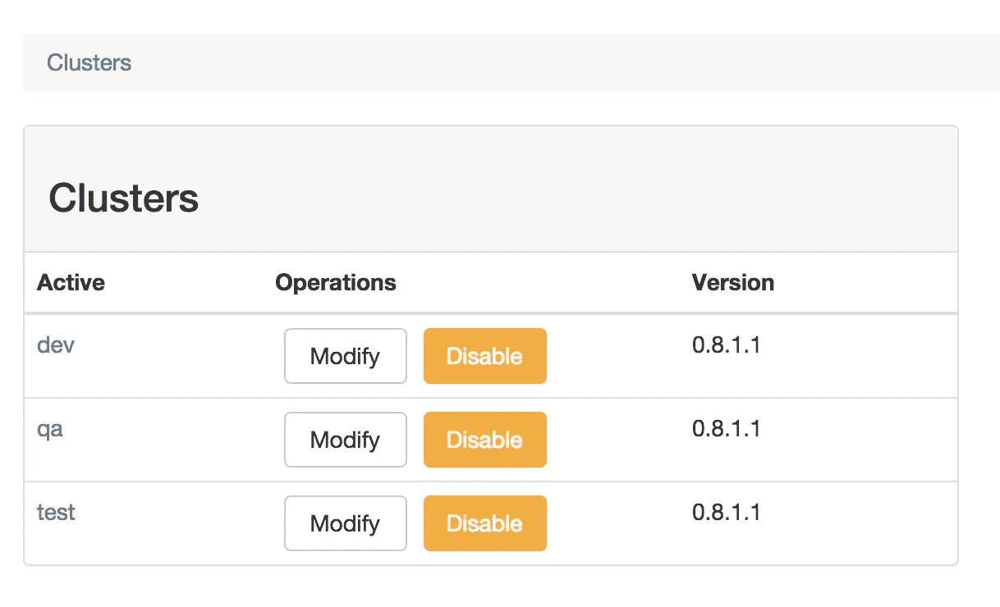
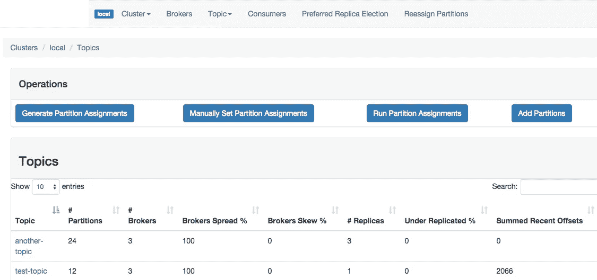
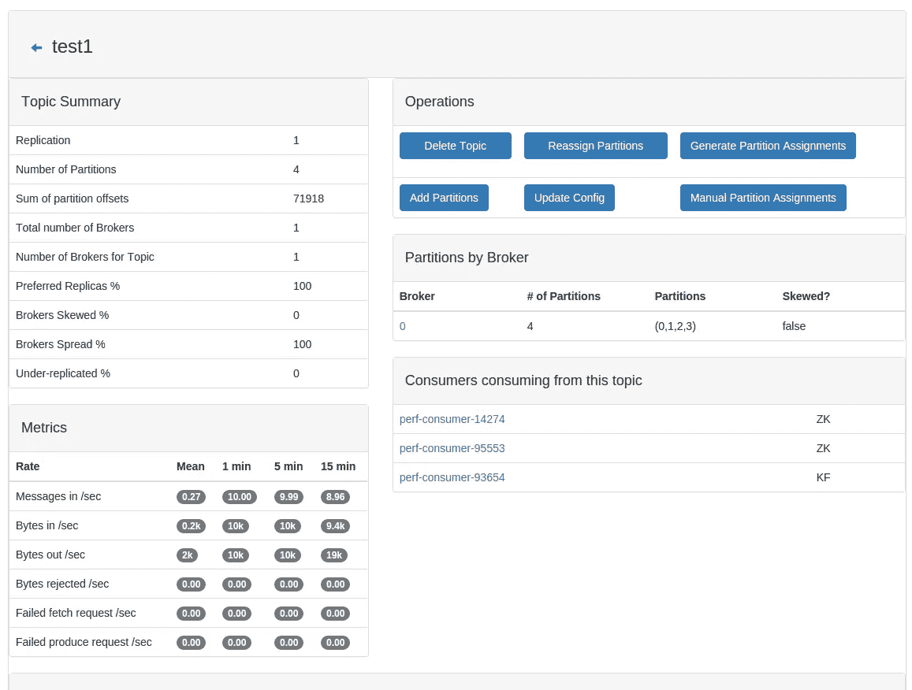

# Kafka UI 监控工具(2021 年更新)

> 原文：<https://towardsdatascience.com/kafka-monitoring-tools-704de5878030?source=collection_archive---------7----------------------->

## 探索 Apache Kafka 集群的一些最强大的 UI 监控工具

克里斯·利维拉尼在 Unsplash[上的照片](https://unsplash.com/s/photos/monitoring?utm_source=unsplash&utm_medium=referral&utm_content=creditCopyText)

## 介绍

Apache Kafka 是增长最快的产品之一，已被全球许多公司广泛采用。如果您在生产中使用 Kafka，能够监控和管理集群是非常重要的。

本文包含 Apache Kafka 集群最流行和最强大的监控工具的更新列表。您还可以找到我在几年前写的一篇文章中提出的旧的建议列表。

</overview-of-ui-monitoring-tools-for-apache-kafka-clusters-9ca516c165bd>  

具体来说，在本文中，我们将介绍以下工具和服务，它们可以帮助您跨组织管理和监控 Kafka 集群的健康状况:

*   汇合控制中心和健康+
*   镜头
*   辛夫拉监视器(前卡夫卡监视器)
*   巡航控制
*   CMAK(前卡夫卡经理人)

## 汇合控制中心和健康+

来源:[合流网站](https://www.confluent.io/product/confluent-platform/gui-driven-management-and-monitoring/)

[汇合控制中心](https://docs.confluent.io/platform/current/control-center/index.html)是一个基于 web 的工具，它提供了一个便于集群监控和管理的用户界面。具体来说，您可以快速访问集群健康状况的概述，访问和观察消息、主题和模式注册服务，以及执行`ksql`查询。

从技术上来说，该工具受到收集生产者和消费者指标数据的组件、用于移动收集的指标的 Kafka 和用于分析流指标的控制中心应用服务器的损害。

[**【convergent Health+】**](https://docs.confluent.io/platform/current/health-plus/index.html)是另一个可以用来管理和监控融合平台的工具(实际上是在融合平台 6.2 版本中引入的)。

*汇流控制中心健康+监控仪表盘—来源:* [*汇流网站*](https://docs.confluent.io/platform/current/health-plus/index.html#id1)

具体来说，Health +可以帮助您配置基于规则的智能警报，您可以在特定端点(如电子邮件或 Slack)上接收通知。此外，您可以查看如上图所示的所有收集的指标，并将 Health+与其他监控工具(如 Prometheus)集成。

## 镜头

Lenses 提供了一个完整的 Kafka UI 工具，使开发人员和工程师能够监控 Kafka 基础设施的健康状况以及应用程序的性能。此外，该工具可用于实时配置警报，从而以有效的方式促进事件管理。

镜头监控工具—来源:[镜头网站](https://docs.confluent.io/platform/current/health-plus/index.html#health-pricing)

Lenses Tool 还允许通过一个直观的用户界面进行故障排除，该用户界面允许您使用 SQL 查询 Kafka。

来源:[镜片网站](https://docs.confluent.io/platform/current/health-plus/index.html#health-pricing)

你可以在他们的[官网](https://lenses.io/product/pricing/)看到更多关于镜片定价的细节。

## 辛夫拉监视器(前卡夫卡监视器)

[Xinfra Monitor](https://github.com/linkedin/kafka-monitor) 是 LinkedIn 开发的开源工具，用于在 Kafka 集群上配置和执行长期运行的系统测试。它帮助开发人员和管理员捕获通常很少观察到或者只有在很长一段时间后才能观察到的错误或退化。

此外，它还帮助您使用端到端管道来监控集群，这些管道收集端到端延迟、服务可用性、生产者和消费者可用性、消息丢失率等指标。

## 巡航控制

[Cruise Control](https://github.com/linkedin/cruise-control) ，是另一个 LinkedIn 开源工具，帮助大规模运行 Kafka 集群，旨在解决可扩展性问题，如经纪人死亡和工作负载平衡。

Kafka 集群状态—来源: [LinkedIn 工程博客](https://engineering.linkedin.com/blog/2019/02/introducing-kafka-cruise-control-frontend)

具体来说，该工具允许您监控和跟踪资源利用情况，查询集群状态并观察分区、副本和分布。此外，您还可以监控异常检测、配置警报和自我修复流程以及重新平衡。

此外，您还可以执行传统管理，如添加或删除代理、调整复制因子、重新平衡集群、修复离线副本以及触发首选领导者选举。

*巡航控制计算的 Kafka 集群负载—* 来源: [LinkedIn 工程博客](https://engineering.linkedin.com/blog/2019/02/introducing-kafka-cruise-control-frontend)

## CMAK(前卡夫卡经理人)

[CMAK(Apache Kafka 的集群管理器)](https://github.com/yahoo/CMAK)是一个帮助您管理 Kafka 集群的开源工具。

具体来说，该工具可以帮助您管理各种集群，如果您想要监视不同环境中的集群，这是非常方便的，如下所示。

CMAK 的集群管理—来源: [GitHub](https://github.com/yahoo/CMAK#cmak-cluster-manager-for-apache-kafka-previously-known-as-kafka-manager)

此外，CMAK 可以帮助您检查集群的状态，包括主题、消费者、偏移量、代理、副本和分区分布。

CMAK 话题列表—来源: [GitHub](https://github.com/yahoo/CMAK#cmak-cluster-manager-for-apache-kafka-previously-known-as-kafka-manager)

此外，该工具可以帮助您通过交互式用户界面删除主题、重新分配分区、调整分区号、更新主题配置和执行手动分区分配。

CMAK 的主题视图—来源: [GitHub](https://github.com/yahoo/CMAK#cmak-cluster-manager-for-apache-kafka-previously-known-as-kafka-manager)

该工具可以相当容易地进行配置——有关如何启动和运行的更多详细信息，请参考相关的[文档部分](https://github.com/yahoo/CMAK#configuration)。

## 最后的想法

在本文中，我们介绍了最常用的监控工具，这些工具可以用来有效地控制和管理 Apache Kafka 集群。

就我个人而言，我相信 Confluent——卡夫卡的最初创造者——提供了市场上最好的工具，但也有一定的成本。这意味着您可能负担不起这个特定监控服务的许可费用，因此您需要考虑本文中涉及的其他选项。请注意，Health+工具有一个免费层—有关其定价的更多详细信息，请参考 [Confluent 的文档](https://docs.confluent.io/platform/current/health-plus/index.html#health-pricing)。

第二个最好的选择可能是镜头，这也需要付费许可证，但成本可能要低得多。如果你买不起许可证，那么 LinkedIn Cruise Control 和 CMAK 是足够好的解决方案，当涉及到集群管理和监控时，它们肯定会让你的生活更轻松。

[**成为会员**](https://gmyrianthous.medium.com/membership) **阅读介质上的每一个故事。你的会员费直接支持我和你看的其他作家。**

**你可能也会喜欢**

</kafka-no-longer-requires-zookeeper-ebfbf3862104>  <https://betterprogramming.pub/how-to-fetch-specific-messages-in-apache-kafka-4133dad0b4b8>  <https://python.plainenglish.io/how-to-programmatically-create-topics-in-kafka-using-python-d8a22590ecde> 