# Kaggle 竞赛-为 AUC 为 0.94 的慈善机构寻找捐赠者

> 原文：<https://towardsdatascience.com/kaggle-competition-finding-donors-for-a-charity-with-an-auc-of-0-94-491202a77638?source=collection_archive---------24----------------------->

> 使用 Python 来验证随机森林、梯度增强和 XGBoost(使用 AUC)的性能，并构建最终模型来预测慈善机构的潜在捐赠者。

马库斯·温克勒在 [Unsplash](https://unsplash.com?utm_source=medium&utm_medium=referral) 上的照片

# 项目概述

该项目将采用 3 种监督算法，包括**随机森林、梯度推进和 XGBoost，**使用 1994 年美国人口普查数据准确模拟个人收入。然后，我将从初步结果中选择最佳候选算法，并进一步优化该算法以最佳地模拟数据。这个实现的目标是构建一个模型，准确预测一个人的收入是否超过 50，000 美元。这种任务可能出现在非营利机构中，这些机构依靠捐赠生存。了解个人的收入可以帮助非营利组织更好地了解需要多少捐赠，或者他们是否应该伸出援手。虽然很难直接从公共来源确定一个人的一般收入等级，但我们可以从其他公开的特征中推断出这个值。Kaggle 竞赛链接在这里。

 [## Udacity ML 慈善比赛

### 寻找慈善捐助者

www.kaggle.com](https://www.kaggle.com/c/udacity-mlcharity-competition/overview) 

# 数据集概述

这个项目的数据集来自 [UCI 机器学习库](https://archive.ics.uci.edu/ml/datasets/Census+Income)。Ron Kohavi 和 Barry Becker 在发表文章“提高朴素贝叶斯分类器的准确性:决策树混合”后捐赠了数据集。你可以在网上找到罗恩·科哈维的文章。

# 问题陈述

一家慈善机构想知道谁有可能捐款。作为一名数据科学家，我可以利用这个数据集和受监督的机器学习算法来预测慈善机构的潜在捐赠者。

# 过程

(在此查看[完整代码](https://github.com/YuehHanChen/Finding_donors_for_a_charity/blob/main/Finding_Donors_For_A_Charity.ipynb))

> *第一步。评估*
> 
> *第二步。预处理*
> 
> *第三步。计算简单预测器的性能*
> 
> *第四步。选择 3 个合适的候选模型*
> 
> *第五步。创建训练和预测管道*
> 
> *步骤六。初始模型评估和挑选最佳模型*
> 
> *第七步。模型调谐*
> 
> *第八步。预处理来自 Kaggle* 的测试数据
> 
> 比赛结果

注意:这篇文章并不是要解释每一行代码，而是项目中最重要的部分。因此，您可能会发现一些部分只是结果的描述。如果你对代码本身感兴趣，请在这里勾选****。****

**现在，让我们开始吧！**

# ***第一步。评估***

**在使用一些基本的评估函数后，我得到了这样的信息:这个数据集有 14 列，45222 行，0 个缺失值。**

**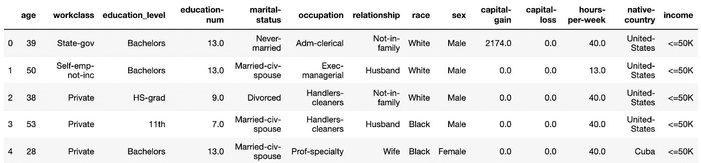**

****最后一列，收入，是目标变量。**作者照片**

**功能说明:**

*   ****年龄**:连续。**
*   ****工作类别**:私人，自我雇佣非公司，自我雇佣公司，联邦政府，地方政府，州政府，无薪，从未工作。**
*   ****教育**:学士、部分大学、11 年级、HS-grad、Prof-school、Assoc-acdm、Assoc-voc、9 年级、7-8 年级、12 年级、硕士、1-4 年级、10 年级、博士、5-6 年级、学前教育。**
*   ****教育编号**:连续。**
*   **婚姻状况:已婚配偶、离婚、未婚、分居、丧偶、无配偶、无配偶。**
*   **职业:技术支持、工艺修理、其他服务、销售、行政管理、专业教授、清洁工、机器操作员、行政文员、农业渔业、运输搬运、私人服务、保安服务、武装部队。**
*   ****关系**:妻子、亲生子女、丈夫、非家庭成员、其他亲属、未婚。**
*   **种族:黑人、白人、亚洲太平洋岛民、美洲印第安人、爱斯基摩人、其他。**
*   ****性别**:女，男。**
*   ****资本收益**:持续。**
*   ****资本损失**:持续。**
*   ****每周小时数**:连续。**
*   ****:美国、柬埔寨、英国、波多黎各、加拿大、德国、美国外围地区(关岛-USVI 等)、印度、日本、希腊、韩国、中国、古巴、伊朗、洪都拉斯、菲律宾、意大利、波兰、牙买加、越南、墨西哥、葡萄牙、爱尔兰、法国、多米尼加共和国、老挝、厄瓜多尔、台湾、海地、哥伦比亚、匈牙利、危地马拉、尼加拉瓜、苏格兰、泰国、南斯拉夫、萨尔瓦多、特立尼达和多巴哥&多巴哥、秘鲁、香港、荷兰。****

## ****参见分布****

********

****作者照片****

****正如我们所看到的，年龄、资本收益和资本损失的分布是向右倾斜的，所以稍后，我将使用[对数](https://en.wikipedia.org/wiki/Data_transformation_(statistics))变换对它们进行变换。****

****评估报告:****

*   ******年龄、资本损失、资本收益向右倾斜******
*   ******所有数字特征都应被标准化******
*   ******目标变量应该映射到 1 和 0******
*   ******所有分类特征都应该被一次性编码******

# *****第二步。预处理*****

> ****预处理 1: **年龄，资本损失，资本收益偏右。******

****在进行对数变换后，它们变成了****

****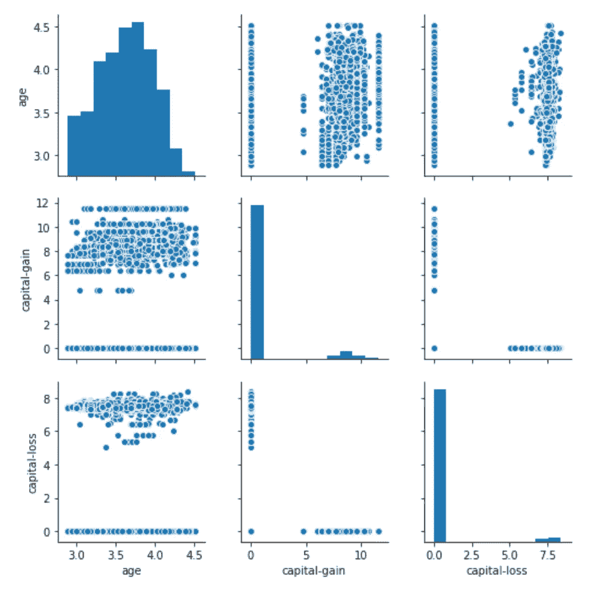****

****作者照片****

****我们可以看到，他们变得更加集中，现在的时代更好，资本收益和资本损失稍微好一些。****

> ****预处理 2: **所有数字特征都应该被规范化******

****使用 Sklearn 的 MinMaxScaler 对所有数值特征进行归一化后，数据范围将在 1 到 0 之间。****

****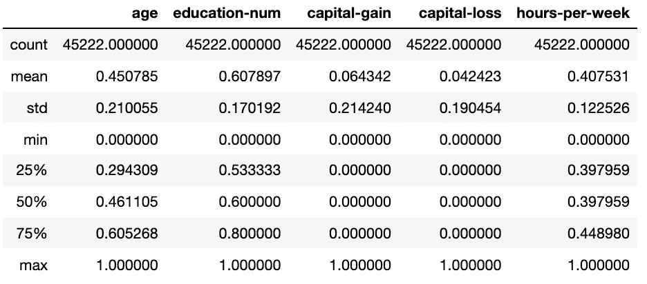****

****作者照片****

> ****预处理 3: **目标变量应该映射成 1 和 0******

****对于目标变量收入，我使用了。映射函数将' > 50K '映射到 1 和'<=50K’ to 0\. And the result looks like this****

****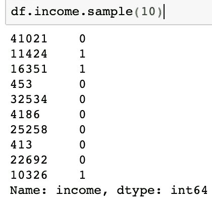****

****All the values become either 1 or 0\. Photo by author****

> ****Preprocessing 4: **,所有分类特征都应该一键编码。******

****在最后一个数据预处理步骤中，我使用 pd.get_dummies()对分类变量进行一次性编码。****

****比如说。最初，“工作类别”变量有几个类别，包括私有、自雇员非公司、自雇员公司、联邦政府、地方政府、州政府、无薪和从未工作。这是“工作类”被一键编码后的样子。****

****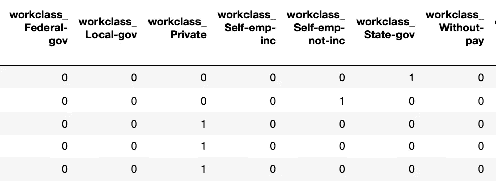****

****One-hot 编码将一个列分成多个列，其中每个类别都有自己的列。如果那一行是 state_gov，就像第 1 行一样，那么 state_gov 的单元格中就会有 1—作者的照片。****

# *****第三步。计算简单预测器的性能*****

****生成一个简单的预测器旨在显示一个没有任何智能的基础模型会是什么样子。因此，当你把你的报告提交给经理时，他们会把它与你的模型进行比较，看看它们是否真的增加了价值。****

****在现实世界中，理想情况下，你的基本模型要么是前一个模型的结果，要么是基于你希望改进的研究论文。当没有基准模型集时，你可以从获得比随机选择更好的结果开始。****

****这里，我设置了一个简单的预测器，它总是预测‘1’(也就是说，这个个体赚了超过 50k)。该模型将没有真否定(TN)或假否定(FN)，因为我没有做出任何否定(“0”值)预测。因此，在这种情况下，我们的准确性变得与我们的精度相同(真阳性/(真阳性+假阳性))，因为我们用值“1”做出的每个预测都应该为“0”，但都变成了假阳性；因此，在这种情况下，我们的分母是我们拥有的记录总数。****

****在这场比赛中，我们将通过 ROC 曲线下的面积 **AUC** 来判断。因此，我将计算 AUC 和准确性，以在整个项目中验证模型。****

****对于天真预测者的准确性，由于我们有 11001 个真阳性和 44445 个全阳性，我们将得到 0.24**的准确性**。****

****AUC 是通过将所有预测结果(每个点属于阳性和阴性的概率)投影到一维线中来计算的。然后我们计算那条线上几个点的真阳性率和假阳性率。然后，它将所有这些点绘制成 2D 图表，你可以计算曲线下的面积。****

****所以，在这种情况下，由于所有的点都被预测为正，所以它们都聚集在线的右侧。当它计算中间或左侧的任何点时，它将获得 1 的真阳性率，因为所有真阳性都被正确分类，而假阳性率为 1，因为所有阴性点都被错误分类。并且很少有点具有(真阳性率，假阳性率)= (0，0)，因为它在线的左侧。****

****所以当我们把许多(1，1)和(0，0)绘制成 2D 图时，我们会发现三角形面积等于 1/2，因为 1*1*1/2 = **1/2** 。****

****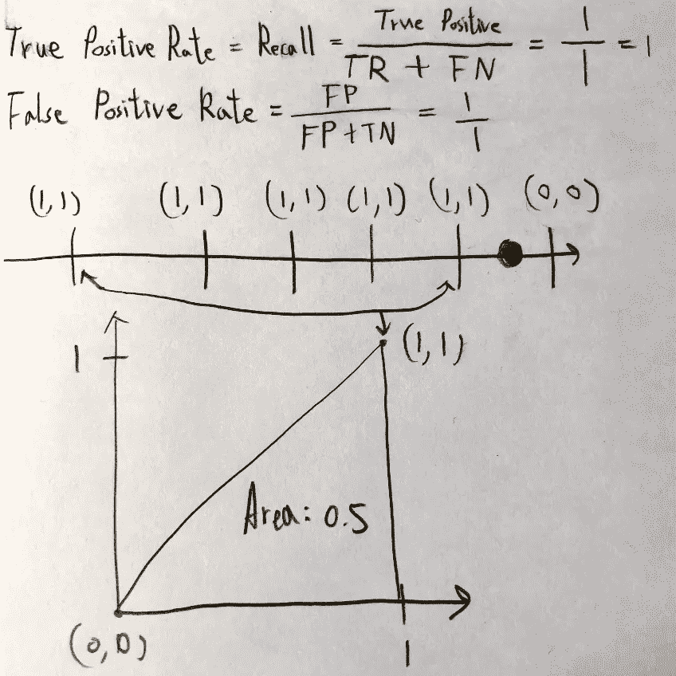****

****作者照片****

****简单预测的总结:****

> ******精度= 0.2475******
> 
> ******曲线下面积= 0.5******

****稍后，我们可以将这些数字与我们将采用的模型的 AUC 和准确性进行比较，以查看这些模型是否真的增加了价值。****

# *****第四步。选择 3 个合适的候选模型*****

****我列出了三种监督学习模型，包括随机森林、梯度推进和 XGBoost。对于每个选择的模型，我将回答以下问题:****

> ****该模型的优点是什么？****
> 
> ****模型的弱点是什么？****

## ******随机森林******

1.  ****模型的优势是什么；什么时候表现好？****

*   ****随机森林被认为是一种高度准确和稳健的方法，因为有大量的决策树参与了这一过程。****
*   ****它不会遭受过拟合问题。主要原因是它采用了所有预测的平均值，这抵消了偏差。****
*   ****该算法可用于分类和回归问题。****
*   ****资源:([https://www . data camp . com/community/tutorials/random-forests-classifier-python](https://www.datacamp.com/community/tutorials/random-forests-classifier-python))****

****2.模型的弱点是什么；什么时候表现差？****

*   ****随机森林生成预测很慢，因为它有多个决策树。每当它做出预测时，森林中的所有树都必须预测相同的给定输入，然后对其进行投票。整个过程非常耗时。****
*   ****与决策树相比，该模型很难解释，在决策树中，您可以通过遵循树中的路径来轻松做出决定。****
*   ****资源:([https://www . data camp . com/community/tutorials/random-forests-classifier-python](https://www.datacamp.com/community/tutorials/random-forests-classifier-python))****

## ****梯度推进树****

1.  ****模型的优势是什么；什么时候表现好？****

*   ****分类和回归任务都非常高效****
*   ****可以处理混合类型的特征，并且不需要预处理([https://towardsdatascience . com/gradient-boosted-decision-trees-explained-9259 BD 8205 af](/gradient-boosted-decision-trees-explained-9259bd8205af)****

****2.模型的弱点是什么；什么时候表现差？****

*   ****GBDT 训练通常需要更长的时间，因为树是按顺序建立的。([https://corporatefinanciinstitute . com/resources/knowledge/other/boosting/](https://corporatefinanceinstitute.com/resources/knowledge/other/boosting/))****
*   ****需要仔细调整超参数****
*   ****如果使用太多的树，可能会过拟合(n_estimators)****
*   ****对异常值敏感([https://towards data science . com/gradient-boosted-decision-trees-explained-9259 BD 8205 af](/gradient-boosted-decision-trees-explained-9259bd8205af))****

## ****XGBoost****

1.  ****模型的优势是什么；什么时候表现好？****

*   ****速度和性能:它最初是用 C++编写的，比其他集成分类器要快得多。****
*   ****适用于大型数据集:因为核心 XGBoost 算法是可并行化的，所以它可以利用多核计算机的能力。它还可以在 GPU 上和计算机网络上并行化，这使得在大型数据集上进行训练变得可行。****
*   ****它可以用于选择重要的特征。****
*   ****需要较少的特征工程(不需要标准化数据，也可以很好地处理缺失值)****
*   ****始终优于其他算法方法:它在各种机器学习基准数据集上表现出更好的性能。****
*   ****各种各样的调优参数:XGBoost 内部有用于交叉验证、正则化、用户定义的目标函数、缺失值、树参数、Sklearn 兼容 API 等的参数。****
*   ****离群值影响最小。****
*   ****当数据混合了数字和分类特征或者只有数字特征时，它表现良好。****

****2.模型的弱点是什么；什么时候表现差？****

*   ****如果参数调整不当，可能会过度拟合。****
*   ****因为有太多的超参数，所以更难调整。****
*   ****不适合用 XGBoost 的时候:图像识别，计算机视觉，自然语言处理，理解问题。****
*   ****根据你对数据的了解，是什么让这个模型成为这个问题的一个很好的候选？****
*   ****XGBoost 是 Kaggle 比赛中的常胜将军。****
*   ****它支持分类和回归问题。****

# *****第五步。创建训练和预测管道*****

****这条管道将做五件事:训练**，预测，记录训练/预测时间，计算准确性，以及计算 AUC。******

****代码如下:****

# *****第六步。初始模型评估和挑选最佳模型*****

****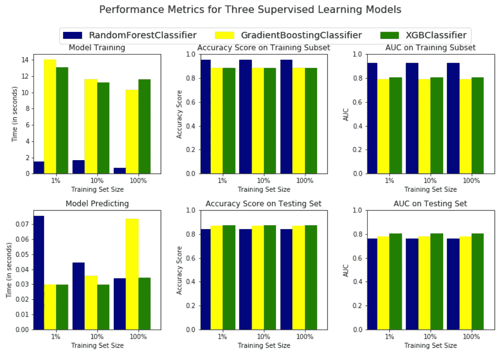****

****作者照片****

## ****XGBoost 是最好的模型****

1.  ****我们可以看到，随机森林有点过拟合，因为它有一个高训练分数，但相对较低的测试分数。相比之下，XGBoost 表现最好，因为它获得了最高的测试分数，而且训练分数和测试分数几乎相同，这意味着它既没有欠拟合也没有过拟合。****
2.  ****虽然 XGBoost 在训练时间上花费了最多的时间，但它只需要 12 秒，所以在这个数据集中是可以接受的。****
3.  ****XGBoost 比朴素预测器表现得更好，精确度为 0.2475，AUC 为 0.5。未经优化的 XGBoost 已经达到了 0.85 的精确度和 0.8 的 AUC。****

## ****用通俗的语言描述 XGBoost****

****想象一下，让一群高中生解决一组大学水平的数学问题。每个高中生都有一定程度的数学知识，但没有一个人在数学方面有惊人的天赋或糟糕的表现。学生轮流做题，老师做完题会给他们打分。此外，老师会告诉下一个学生前一个学生做错了什么问题，这样他们就会更注意那些问题。重复这个过程，直到每个学生都回答了问题。最后，老师更相信高分学生给出的答案，不太相信低分学生给出的答案，她自己回答问题。XGBoost 是老师。XGBoost 就是这么训练的。
下次其他大学水平的题给老师的时候，她就用这套记忆来答题，XGBoost 就是这么预测的。****

# *****第七步。模型调整*****

****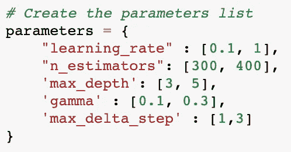****

****作者照片****

****这里，所有可能的参数集是 2⁵ = 32。所以，如果我使用网格搜索，它会运行 32 次来找到最好的一个。由于它将使用 300 或 400 个估值器进行测试，所以运行 32 次可能需要很长时间。****

****因此，我使用了[随机搜索](https://scikit-learn.org/stable/modules/generated/sklearn.model_selection.RandomizedSearchCV.html)来寻找最佳的一组超参数，这将随机选择一组超参数进行测试。因此，它不能保证找到最好的，但它运行得更快。这是结果:****

****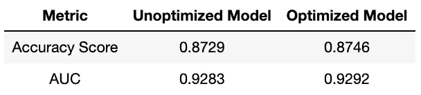****

****作者照片****

****我们可以看到准确性和 AUC 都有所增加。****

# *****第八步。预处理来自 Kaggle* 的测试数据****

****为了正确地预处理测试集，我们必须遵循我们用于预处理训练集的相同过程，包括**转换** **年龄、资本损失、资本收益、归一化所有数字特征，以及一次性编码所有分类特征。******

****但是在这之前，我们必须先看看这个测试集是否有缺失值。****

****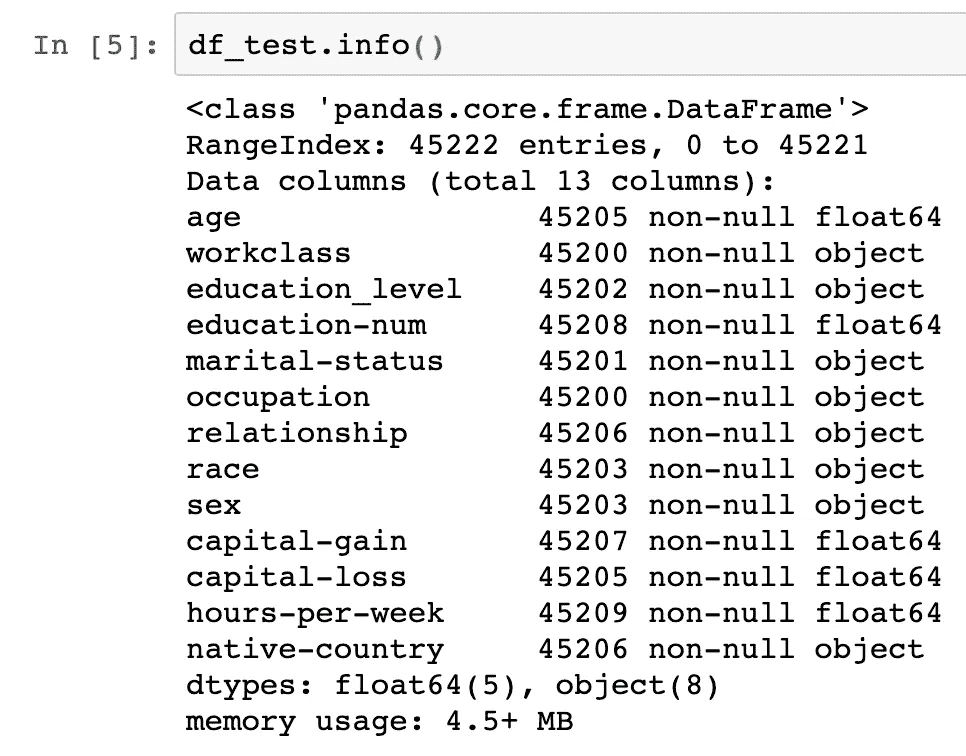****

****作者照片****

****正如我们所看到的，几乎每一列都有自己缺失的值，所以这里我考虑三种情况。首先，如果数字数据是倾斜的，那么我将使用来自训练集的同一列的中值来填充缺失的值。其次，如果数值数据大致呈正态分布，那么我将使用训练集中同一列的平均值来填充缺失值。最后一种情况是分类值。然后，我将使用在训练集中的相同列中出现最多的模式或类别来填充缺少的值。在填充缺失值后，我进行了与训练集相同的预处理过程。****

****在对数据进行预处理后，我将它们放入优化的 XGBoost 模型中，这是比赛结果。****

# ******Kaggle 比赛结果******

****在 212 支队伍中，我排在第 30 位！****

****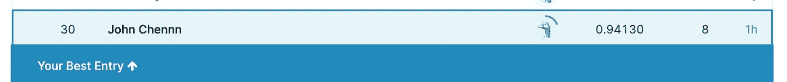****

****作者照片****

****谢谢你看完！如果你对这个项目的完整代码感兴趣，请查看 [my Github](https://github.com/YuehHanChen/Finding_donors_for_a_charity/blob/main/Finding_Donors_For_A_Charity.ipynb) 。另外，我喜欢反馈。如果有什么不清楚的地方或者应该做得更好的地方，请联系我。下面是我的 [LinkedIn](https://www.linkedin.com/in/yueh-han-chen/)****