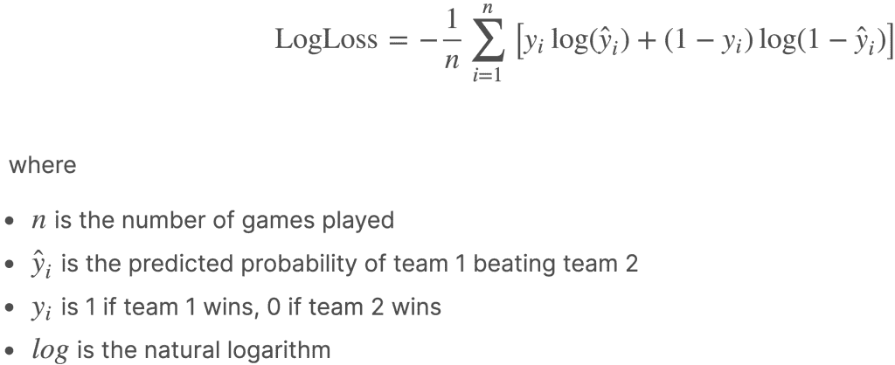
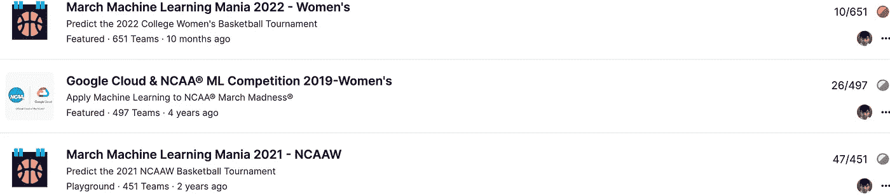

# 使用机器学习预测三月疯狂

> 原文：<https://towardsdatascience.com/kaggle-march-madness-silver-medal-for-two-consecutive-years-6207ff63b86c?source=collection_archive---------23----------------------->

## 我是如何连续几年在卡格尔疯狂三月比赛中获得一枚单人金牌和两枚单人银牌的

# 整篇文章简而言之:

一个主要利用各队的队伍等级和形态来预测三月疯狂游戏胜负的梯度助推机。

图片来自[本·好时在 Unsplash](https://unsplash.com/photos/5nk3wSFUWZc)

*疯狂三月是最大的年度大学生体育赛事，每年创收 10 亿美元。Kaggle 是世界上最大的数据科学家社区，拥有超过 1000 万用户。这篇文章解释了我的机器学习模型如何在 Kaggle 举办的三月疯狂预测大赛上连续几年获得* ***一个单人金奖和两个单人银奖*** *。*

# 问题设置:

NCAAW 疯狂三月是一年一度的淘汰制大学女子篮球锦标赛，由 64 支球队组成。我们的问题是尽可能准确地预测每场可能比赛的结果概率(即 1 队击败 2 队的概率)。这些预测是在 64 支队伍确定之后，在比赛开始之前做出的。卡格勒根据他们的预测准确性在公共排行榜上排名，每天更新一次。因此，卡格勒观看比赛时知道他们的模型预测的是什么！具体而言，根据下面表示的对数损失函数来评估 Kagglers 的预测:

来源:图片来自 [Kaggle 三月机器学习狂潮 2021 页](https://www.kaggle.com/c/ncaaw-march-mania-2021/overview/evaluation)

在最完美的情况下，百分百自信和正确是零分。相比之下，100%的自信和错误会受到无限的惩罚。例如，假设我们预测团队 1 击败团队 2 的概率为 80%，而我们的竞争对手预测为 90%。如果 1 队**赢了**，我们得到的处罚将比我们的竞争对手得到的**略多**。但是如果 1 队**输了**(即爆冷结果)，我们得到的处罚将**明显小于我们的竞争对手**。

# 输入功能:

我们用来预测概率的特征主要是团队等级和形式。更多的功能和适当的细节将很快在下面提供！

**团队评分:**我们试图在比赛前用这个功能来衡量一个团队的实力。

**表格特征:**我们试图用这个特征来衡量一支球队在锦标赛中变得有多强。这种形式的特点是衡量比赛时一支队伍所代表的最强队伍的实力(即形式)。例如，[亚利桑那爆冷击败康涅狄格](https://www.ncaa.com/video/basketball-women/2021-04-04/wbk-arizona-uconn-highlights-2021-tournament)，可以说是 2021 年锦标赛中最大的爆冷。这是三号种子(亚利桑那州)在最后四场比赛中击败一号种子(康涅狄格大学)。然而，第三个种子预计不会进入四强。粉笔模型预计第三种子将在甜蜜的 16 强中被第二种子击败，并预计只有第一种子留在最后四强。因此，这不是一场典型的三号种子对一号种子的比赛，这是一场**变强的三号种子取代一号种子**对一号种子的比赛。因此，与典型情况相比，第三种子有更好的机会击败第一种子。

# 方法:

上面解释的特征成为我们的梯度推进机器的输入特征。假设理解[最小二乘回归](https://www.mathsisfun.com/data/least-squares-regression.html)，梯度推进机(GBM)可以直观地理解为一组序列回归。第一棵树相当于使用所有输入要素的简单回归，第二棵树是对第一棵树返回的残差的回归(同样使用所有输入要素)。我们逐步执行此操作，直到完成手动设置的树数。GBM 的具体解释可以在[这里](/gradient-boosted-trees-for-classification-one-of-the-best-machine-learning-algorithms-35245dab03f2)找到。

# 评估结果:

正如前面提到的和下面显示的，我们的模型在 2022 年的 NCAAW 三月疯狂卡格尔比赛中赢得了一枚单人金牌。我们的模特在 2019 年和 2021 年获得了个人银牌(2020 年的比赛因新冠肺炎而取消)。

来源:[图片来自 Kaggle 上的 kaito 510](https://www.kaggle.com/kaito510/competitions?tab=completed)