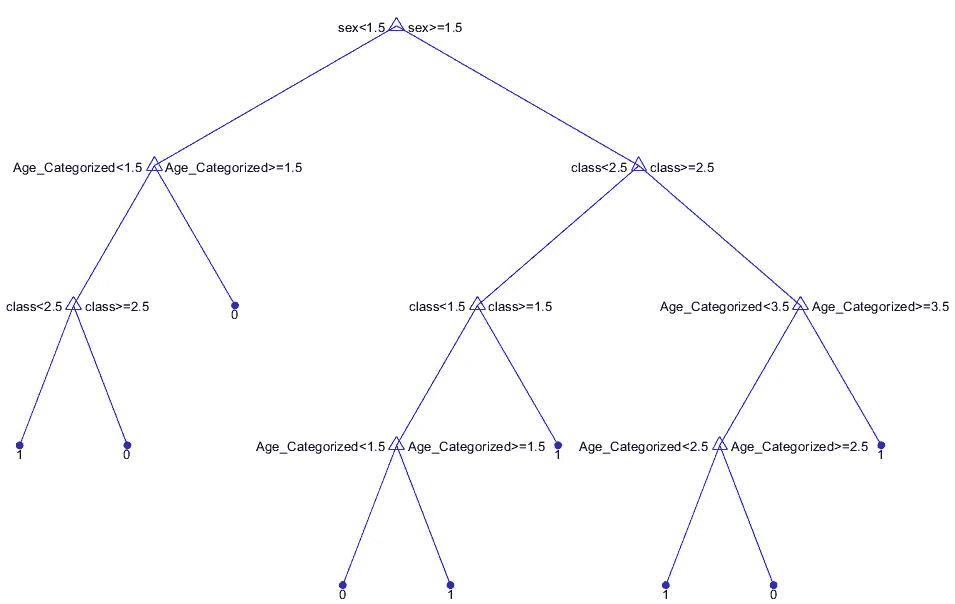

# ka ggle——在 MATLAB 中预测泰坦尼克号挑战的存活率

> 原文：<https://towardsdatascience.com/kaggle-predict-survival-on-the-titanic-challenge-in-matlab-56f6ad3bab78?source=collection_archive---------15----------------------->

## 在本教程中，我将演示如何使用 MATLAB 来解决这个流行的机器学习挑战


1912 年 4 月 10 日，F.G.O .斯图尔特拍摄的皇家邮轮泰坦尼克号驶离南安普敦的照片，[公共领域](https://commons.wikimedia.org/wiki/RMS_Titanic#/media/File:Titanic_in_color.png)

这个 [Kaggle](https://www.kaggle.com/c/titanic/overview) 挑战的目标是创建一个机器学习模型，它能够预测泰坦尼克号上乘客的生存，给出他们的特征，如年龄，性别，票价，船票等级等。

本教程的大纲如下:

1.  数据分析
2.  特征工程
3.  模型拟合
4.  对测试集的预测
5.  结论
6.  未来方向

> **为什么选择 MATLAB？**
> 
> 在过去的几个月里，我探索了 MATLAB 中的机器学习工具箱，以解决各种任务，如回归、聚类、PCA 等。我喜欢它的模块化界面，每个功能都有很好的示例文档，这变得非常方便。因此，在这篇文章中，我分享了我的一些发现，希望对学术界有所帮助。

*让我们开始…*

# 1.探索性数据分析

读取数据集

```
>> Titanic_table = readtable('train.csv');
>> Titanic_data = (table2cell(Titanic_table));
```

列车组有 891 个乘客条目和 12 列。

现在，让我们看看我们的数据。 [**head**](https://www.mathworks.com/help/matlab/ref/table.head.html) 函数显示表格的顶行，类似于 Pandas 中的。

```
>> head(Titanic_table)
```


“幸存”列是我们需要预测的二元目标变量；其中 0-未幸存，1-幸存。

预测变量，即特征如下-

*   Pclass:机票等级
*   性
*   年龄
*   SibSp:兄弟姐妹、配偶以及乘客的数量
*   Parch:父母、孩子以及乘客的数量
*   机票:机票号码
*   票价
*   客舱:客舱号
*   装船:装船港

“Pclass”变量表示社会经济地位。它有 3 个可能的值“1”、“2”、“3”，分别代表上层、中层和下层。

> 训练集中乘客的生存概率约为 **38 %**

现在，让我们根据不同的特征来想象生存-


*   男性乘客 577 人，女性乘客 314 人。
*   与男性的 **18.90 %** 相比，女性的生存概率更高，为 **74.20 %**


*   我们看到，机票等级越高的乘客生还的可能性越大。


*   儿童的存活率非常高，而 65 岁以上的人的存活率下降到 10 %左右(T21)。
*   最初的统计数据与我们的直觉相符，即我们的战略肯定是首先拯救妇女和儿童的生命。

# 2.特征工程

为了转换' ***性别*** *'* 特征，我使用了 [**grp2idx**](https://www.mathworks.com/help/stats/grp2idx.html) 将分类值'男性'和'女性'分别转换为数字索引' 1 '和' 2 '。

“**年龄**特征的转换有两个步骤-

*   填补缺失条目-

```
% Check number of missing entries in the 'age' feature>> sum(isnan(age))
ans = 
     177
```

我们将用所有其他乘客的 ***平均*** 年龄来估算“年龄”特征中的缺失条目。即 29.61 年。我们还可以用其他一些方法来处理这些缺失的条目，这将在第 6 节中讨论。

*   分类到箱子里-

MATLAB 提供了一个 [**离散化**](https://www.mathworks.com/help/matlab/ref/double.discretize.html) 方法，可以用来将数据分组到 bin 或类别中。我用这种方法将年龄分为以下四个年龄组——“15 岁以下”、“15-30 岁”、“30-65 岁”和“65 岁以上”。

# 3.模型拟合

我们将看到 4 个分类器，即-

*   逻辑回归
*   决策树
*   k 最近邻
*   随机森林

让我们从… 开始

## 逻辑回归

在 MATLAB 中，我们可以使用 [**fitglm**](https://www.mathworks.com/help/stats/fitglm.html) 方法实现一个逻辑回归模型。

## 决策树

[**fitctree**](https://www.mathworks.com/help/stats/fitctree.html)**函数为给定的一组预测器和响应变量返回拟合的二元分类决策树。我们可以使用 view 方法来可视化我们的决策树，从而提供一个简单的解释。**

****

**修剪决策树是对抗过度拟合的有效策略。我已经使用了 [**cvloss**](https://www.mathworks.com/help/stats/classificationtree.cvloss.html) 函数来寻找‘最佳级别’进行修剪。 [**修剪**](https://www.mathworks.com/help/stats/classificationtree.prune.html) 函数返回修剪到该级别的树。**

## **k 个最近邻居**

**[**classificationknn . fit**](https://www.mathworks.com/help/stats/classificationknn.fit.html)**函数用于拟合一个*k*-最近邻分类器。****

********

*   ****我已经执行了一次搜索，以找到邻居的最佳数量(N)。****
*   ****上图显示 N=17 给出了最低的交叉验证损失。因此，我们可以选择 N=17。然而，对于 N=5 和 N=11，我们得到类似的损失。因此，我们可以用 N=5、11 和 17 进行实验，记住模型的复杂性和大 N 值过拟合的可能性。****
*   ****MATLAB 有一系列距离度量可供选择。例如，“城市街区”、“切比雪夫”、“汉明”等。默认值是“欧几里德”距离度量。****

## ****随机森林分类器****

****单个决策树往往会过度拟合。随机森林方法是一种装袋方法，在这种方法中，根据 bootstrap 样本拟合的深度树被组合起来，以产生具有较低方差的输出。****

****我们将使用 [**TreeBagger**](http://mathworks.com/help/stats/treebagger.html) 类来实现一个随机森林分类器。****

********

*   ****上图显示了当我们增加考虑中的树的数量时的袋外分类误差。这允许我们选择最优数量的决策树来创建集成。****
*   ****我们可以使用*OOBPermutedPredictorDeltaError**属性来可视化每个特性的重要性。*****

**********

*****我们模型的训练精度如下-*****

*   *****逻辑回归分析:78.34 %*****
*   *****决策树:80.47 %*****
*   *****k 最近邻:79.80 %*****
*   *****随机森林:78.11 %*****

*****我们看到，在这种情况下，修剪后的决策树给出了最高的准确性，但是它容易过度拟合。让我们在测试集上找出准确度。*****

# *****4.生成测试预测*****

*****测试集包括 418 个乘客条目和 11 列，没有“幸存”变量，我们将使用训练好的模型进行预测。*****

```
***>> head(Titanic_table_test)***
```

**********

*****我们对测试数据集应用相同的特征工程步骤，并通过上述模型对其进行反馈，以生成预测。最后，我们创建一个. csv 文件提交给 Kaggle。[片段](https://gist.github.com/953f29d900194fe01c7eefc57a5d5bee.git)展示了一个相同的例子。*****

*****决策树在测试集上给出了最高的准确率 **78.947 %** 。*****

# *****5.结论*****

*****我们在 MATLAB 中看到了解决机器学习任务的一步一步的过程，从可视化数据集中的模式开始，选择和设计特征，训练多个分类器，到使用训练好的模型执行预测。*****

*****一些观察-*****

*   *****增加“年龄”特征中的箱数导致过度拟合。*****
*   *****增加一个计算为(票价/机票频率)的新特征并没有显著提高测试精度。*****

> *****代码可用于未来开发[此处](https://github.com/Abhishek0697/Kaggle---Predict-survival-on-the-Titanic-challenge-in-MATLAB)。*****

# *****6.进一步探索*****

*   *****可以应用其他策略来处理“年龄”特征中的**缺失条目**，例如使用*中值*年龄，或者*家庭关系*。例如，孩子的年龄可以近似为(父亲的年龄-25 岁)。*****
*   *****包含更多的特性组合自然是我期待分析的下一步。*****
*   *****人们可以根据最初的数据统计和直觉来设计新的特性。[这里的](https://www.kaggle.com/cdeotte/titanic-wcg-xgboost-0-84688/notebook)是一个读起来很有意思的分析。*****
*   *****由于我们有多个模型，模型集合值得一试。*****

*****Kaggle 社区讨论了许多这样的想法。这本[笔记本](https://www.kaggle.com/pliptor/how-am-i-doing-with-my-score/report)对此做了很好的总结。*****