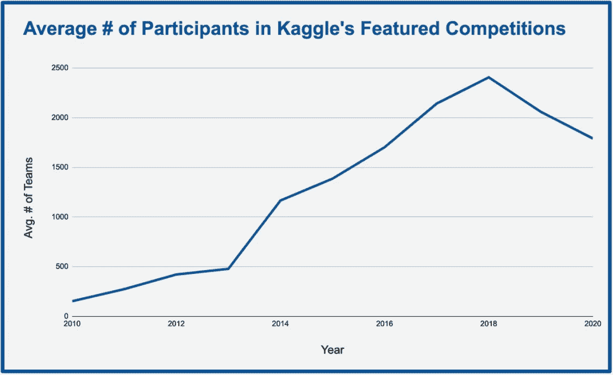
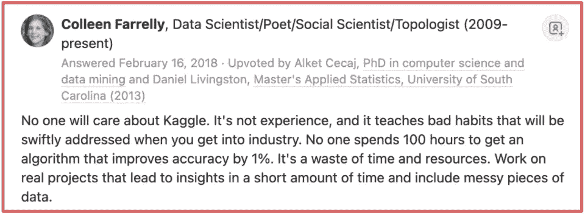
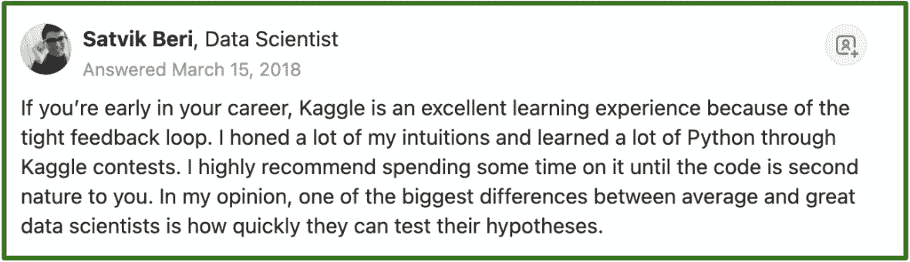

# Kaggle 与真实世界

> 原文：<https://towardsdatascience.com/kaggle-vs-the-real-world-974af9bdc58d?source=collection_archive---------47----------------------->

照片由[像素](https://www.pexels.com/photo/battle-black-board-board-game-277092/?utm_content=attributionCopyText&utm_medium=referral&utm_source=pexels)的[皮克斯拜](https://www.pexels.com/@pixabay?utm_content=attributionCopyText&utm_medium=referral&utm_source=pexels)拍摄

## 数据科学竞赛如何进行？

随着数据科学变得越来越普及，新手和专业人士都纷纷涌向在线竞赛，以获得技能，争夺奖项，并充实自己的简历。

以 Kaggle 为例，这是一个数据科学的在线社区，已经举办了十多年的比赛。自 2010 年创办以来，Kaggle 特色比赛的平均参赛队伍数量从不足 500 支增长到 2000 支左右。

图片作者。从 [Kaggle](https://www.kaggle.com/competitions) 获取的数据。数字是近似值。

这种兴趣的急剧上升引出了一个问题——这些竞赛有多大价值，与解决现实世界中的问题相比如何？正如数据科学中经常出现的情况一样，你会发现这些问题不缺不同的答案，这取决于你问的是谁。

例如，看看下面 [Quora 问题](https://www.quora.com/As-a-budding-Data-Scientist-should-I-invest-my-time-participating-in-Kaggle-or-working-on-interesting-side-projects-Which-will-be-more-beneficial-for-my-career)的几个答案:**作为一名崭露头角的数据科学家，我是否应该投入时间参与 ka ggle…**

图片作者。截图来自 [Quora](https://www.quora.com/As-a-budding-Data-Scientist-should-I-invest-my-time-participating-in-Kaggle-or-working-on-interesting-side-projects-Which-will-be-more-beneficial-for-my-career) 。

图片作者。截图来自 [Quora](https://www.quora.com/As-a-budding-Data-Scientist-should-I-invest-my-time-participating-in-Kaggle-or-working-on-interesting-side-projects-Which-will-be-more-beneficial-for-my-career) 。

两种截然不同的观点。显然这里有一些细微的差别，所以让我们试着解开它。

在这篇文章中，我将通过在数据科学项目的每个主要阶段比较 Kaggle 和真实世界来深入讨论。

# 阶段 1:定义问题

任何数据科学任务的第一步都是弄清楚要解决什么组织或业务问题，以及如何用数据对问题建模。对于机器学习，这意味着识别问题的类型(有监督/无监督)，选择目标变量(如果有监督)，并确定模型将如何用于驱动结果。

**在现实世界中**:这通常是数据科学中最困难也是最重要的阶段。为什么？因为如果你弄错了，你的模型再精确也没用。例如:

*   如果电子邮件渠道不能为你的企业带来任何收入，预测给客户发邮件的最佳时间是没有用的。
*   如果你没有相关的销售或营销策略来利用这些信息，识别关键的客户群是没有用的。
*   如果不管你做什么，那些顾客都会买同样多的东西，那么预测有最高购买倾向的顾客是没有用的。

如果没有对业务环境和组织现实的正确理解，数据科学家就不太可能确定正确的问题或这些问题的最佳解决方案。

**在 Kaggle 上:**别人替你做了这件事。每个竞赛都有详细的问题描述和评估部分。直接前进到 GO 并收集 200 美元。

照片由[苏西·黑兹伍德](https://www.pexels.com/@suzyhazelwood?utm_content=attributionCopyText&utm_medium=referral&utm_source=pexels)从[派克斯](https://www.pexels.com/photo/gray-car-die-cast-model-1249650/?utm_content=attributionCopyText&utm_medium=referral&utm_source=pexels)拍摄

# 第二阶段:数据工程

没有数据，就没有数据科学。没有干净的数据，只有糟糕的数据科学。因此，数据科学生命周期中的一个关键阶段是寻找、清理和组织解决问题所需的数据。

**在现实世界中**:构建和维护有用的数据湖和特征库需要花费很多心思。如果没有坚实的基础，集成新的数据源、构建机器学习问题以及将模型投入生产将变得非常困难。捷径会让你付出代价，因为它们会导致必须支付的错误和技术债务。

**关于 Kaggle:** 这取决于竞争对手，但数据工程的大部分工作通常会为你完成。每场比赛都会给你提供一些数据，所以你永远不会从头开始。

另一方面，Kaggle 确实为数据科学家提供了大量需要解决的数据工程问题，包括:

*   处理可能带来内存问题的大型数据集
*   必须以深思熟虑的方式将多个数据源结合在一起
*   围绕在哪个环境中处理数据做出决策(本地还是在 Kaggle 平台上)

数据科学家至少应该知道这些技能，如果不是非常熟悉的话。数据工程越先进越好。

虽然 Kaggle 提供了充分的机会来实践这些技能，但它并不总是激励最佳实践。Kaggle 参与者不会像在现实世界中那样为糟糕的代码“买单”。

 [## 在家开始练习 SQL 的 4 个步骤

### 下载 MySQL 自己做

towardsdatascience.com](/4-steps-to-start-practicing-sql-at-home-cb771beeca20) 

# 阶段 3:特征工程

在解决问题和构建数据后，数据科学家通常会接受功能工程的任务，即获取有用的数据点，帮助模型做出更好的预测。

**在现实世界中**:如果你试图在你的组织中建立第一个模型来解决一个问题，你通常会想要限制你花费在特性工程上的时间。毕竟，当你仍然需要证明“好”其实就是好的时候，你并不想过度投资于“完美”。

另一方面，如果你正试图击败你的组织已经在使用的复杂的“冠军模型”,花更多的时间来获取数据和构建更好的功能可能是值得的。

还值得注意的是，在现实世界的数据科学中，有时理解哪些因素在驱动您的模型比设计产生小增量收益的功能更重要。

**在 Kaggle 上:**功能工程通常在你如何在排行榜上排名中扮演非常重要的角色。因为你经常与数千名其他数据科学家竞争，所以每一个增量都很重要。

虽然这通常不能反映真实世界，但它确实能帮助你发展两项非常重要的技能。首先，它训练你的大脑批判性地思考什么因素可能预示着一个特定的问题。这是一个重要的技能集，可能在现实世界中具有最长的寿命(换句话说，它可能是机器学习自动化的最后阶段之一)。第二，它迫使你做更多的数据工程，因为它要求你实际构建你所想象的特性。

来自[派克斯](https://www.pexels.com/photo/two-women-standing-beside-brown-board-on-wall-3184296/?utm_content=attributionCopyText&utm_medium=referral&utm_source=pexels)的[派克斯](https://www.pexels.com/@fauxels?utm_content=attributionCopyText&utm_medium=referral&utm_source=pexels)的照片

# 阶段 4:建模和验证

这一阶段包括选择您要使用的模型，决定哪些功能可以进行最终切割，并建立一个验证方案以确保您以稳健的方式测量结果。

**在现实世界中**:选择合适的型号基于很多因素，包括:

*   模型需要有多“可解释”？
*   您正在处理什么类型的数据？
*   模型表现如何？
*   将该模型投入生产有多容易？

验证至关重要。如果不了解您的模型执行得有多好，您就无法 1)了解哪些增量变化实际上改进了您的模型，以及 2)确定您的模型是否会在现实世界中增加价值。

Kaggle 上的**:**ka ggler 最关心的是选择性能良好、能够处理他们正在处理的数据量的模型。

验证可能是 Kaggle 最能反映真实世界的地方。成功的 Kagglers 善于建立验证方案，在本地产生与在公共和私人排行榜上相同的结果。如果没有别的，Kaggle 教你如何在现实世界中建立健壮的模型验证。

 [## 为 DIY 数据科学家辩护

### 教会自己如何解决问题很酷

towardsdatascience.com](/in-defense-of-the-diy-data-scientist-620713c6a43a) 

# **第五阶段:**模型实施

最后，但肯定的是，肯定不是最不重要的:将你的模型投入生产。这个阶段成败在此一举。如果没有使模型可用的代码或业务流程，就没有价值。

**在现实世界中**:对于频繁运行的模型，您必须构建最终的数据管道和基础设施，以便定期做出一致且可测量的预测。对于运行频率较低的模型，技术方面的“生产”可能较少，但仍然有一个关键的需求，即确定如何将模型结果集成到业务流程中，以做出更好的决策。

这基本上是免费的。作为一名卡格勒，你不必考虑你的模型在未来会被如何使用。您唯一需要担心的实现是提交您的代码，并确保它按照预期在排行榜上得分。

# 摘要

现在应该很清楚，Kaggle 与真实世界的数据科学不同。它几乎没有提供问题定义或模型实现方面的经验，而这些往往是机器学习最难的部分。它也不要求参与者编写干净的代码或遵循数据工程最佳实践。

然而，还应该清楚的是，Kaggle 可以为各个层次的数据科学家提供巨大的价值。操纵数据、管理内存限制、构建功能、设计强大的验证、选择模型，这些都是核心的、重要的数据科学技能，可以通过竞争来学习和磨练。

最后，**我的回答是一个响亮的“是”**。作为初露头角的数据科学家，你绝对应该将 Kaggle 作为学习和实践数据科学的众多工具之一。只要确保你意识到它的一些局限性。

***P.S. →如果你想了解更多关于 SQL、Python、数据科学的知识，订阅我的*** [***免费邮件列表***](https://subscribe.to/everythingdata) ***。***