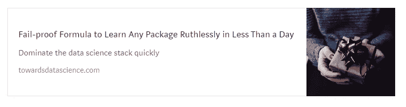
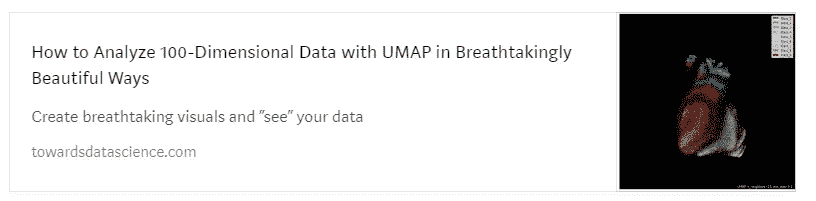

# 2021 年使用 Optuna 调整 LightGBM 超参数的 Kaggler 指南

> 原文：<https://towardsdatascience.com/kagglers-guide-to-lightgbm-hyperparameter-tuning-with-optuna-in-2021-ed048d9838b5?source=collection_archive---------0----------------------->

## 充分发挥 LightGBM 型号的性能

关于 LightGBM 超参数以及如何使用 Optuna 调整它们的综合教程。

**照片由** [**Pixabay**](https://www.pexels.com/@pixabay?utm_content=attributionCopyText&utm_medium=referral&utm_source=pexels) **上的** [**像素组成。**](https://www.pexels.com/photo/silhouette-of-person-holding-sparkler-digital-wallpaepr-266429/?utm_content=attributionCopyText&utm_medium=referral&utm_source=pexels) **除特别注明外，所有图片均为作者所有。**

# 介绍

在上一篇文章中，我们讨论了 LightGBM 的基础知识，并创建了几乎在各个方面都胜过 XGBoost 的 LGBM 模型。本文关注任何机器学习项目的最后一个阶段——超参数调优(如果我们省略模型集成的话)。

首先，我们将看看最重要的 LGBM 超参数，按其影响程度和区域分组。然后，我们将看到一个使用 Optuna(下一代贝叶斯超参数调优框架)调优 LGBM 参数的实践示例。

最重要的是，我们将以类似于顶级 Kagglers 调整他们的 LGBM 模型的方式来实现这一点，这些模型取得了令人印象深刻的结果。

> 如果你是 LGBM 的新手，我强烈建议你阅读文章的第一部分。虽然我将简要解释 Optuna 是如何工作的，但我也建议阅读我关于它的单独文章,以便更好地理解这篇文章。

 [## 你错过了 LightGBM。它在各个方面都击败了 XGBoost

### 编辑描述

towardsdatascience.com](/how-to-beat-the-heck-out-of-xgboost-with-lightgbm-comprehensive-tutorial-5eba52195997)  [## 为什么 Kaggle 的所有人都痴迷于 Optuna 进行超参数调优？

### 编辑描述

towardsdatascience.com](/why-is-everyone-at-kaggle-obsessed-with-optuna-for-hyperparameter-tuning-7608fdca337c) 

> 点击这里获取 Kaggle 上的文章[的笔记本。](https://www.kaggle.com/bextuychiev/lgbm-optuna-hyperparameter-tuning-w-understanding/edit)

# 最重要参数概述

通常，大多数基于树的模型的超参数可以分为 4 类:

1.  影响决策树的结构和学习的参数
2.  影响训练速度的参数
3.  更高精度的参数
4.  对抗过度拟合的参数

大多数时候，这些类别有很多重叠，提高一个类别的效率可能会降低另一个类别的效率。这就是为什么手动调整它们是一个巨大的错误，应该避免。

如果给定足够好的参数网格，像 Optuna 这样的框架可以自动找到这些类别之间的“中间值”。

 [## 通过我的推荐链接加入 Medium-BEXGBoost

### 获得独家访问我的所有⚡premium⚡内容和所有媒体没有限制。支持我的工作，给我买一个…

ibexorigin.medium.com](https://ibexorigin.medium.com/membership) 

获得由强大的 AI-Alpha 信号选择和总结的最佳和最新的 ML 和 AI 论文:

 [## 阿尔法信号|机器学习的极品。艾总结的。

### 留在循环中，不用花无数时间浏览下一个突破；我们的算法识别…

alphasignal.ai](https://alphasignal.ai/?referrer=Bex) 

# 控制树结构的超参数

> 如果你不熟悉决策树，可以看看 StatQuest 制作的这个传奇视频[。](https://www.youtube.com/watch?v=_L39rN6gz7Y)

在 LGBM 中，控制树结构最重要的参数是`num_leaves`。顾名思义，它控制单个树中决策叶的数量。树的决策叶是“实际决策”发生的节点。

接下来是`max_depth`。`max_depth`越高，树的层次就越多，这使得树更加复杂，容易过度拟合。太低，你会吃不饱。尽管这听起来很难，但这是最容易调整的参数——只需选择 3 到 12 之间的值(这个范围在 Kaggle 上对任何数据集都适用)。

一旦确定了`max_depth`，调整`num_leaves`也很容易。LGBM 文档中给出了一个简单的公式——对`num_leaves`的最大限制应该是`2^(max_depth)`。这意味着`num_leaves`的最佳值在(2^3，2^12)或(8，4096)的范围内。

然而，`num_leaves`对 LGBM 学习的影响大于`max_depth`。这意味着您需要指定一个更保守的搜索范围，比如(20，3000)——这是我经常做的。

树的另一个重要结构参数是`min_data_in_leaf`。它的大小也与你是否过度节食有关。简单地说，`min_data_in_leaf`指定了一个叶中符合决策标准的最小观察值数量。

例如，如果决策叶检查一个特征是否大于 13，比如说，将`min_data_in_leaf`设置为 100 意味着只有当至少 100 个训练观察大于 13 时，我们才想要评估这个叶。这是我外行话中的要点。

`min_data_in_leaf`的最佳值取决于训练样本的数量和`num_leaves`。对于大型数据集，以百或千为单位设置一个值。

查看 LGBM 文档的本节了解更多详情。

# 超参数提高精确度

获得更高准确度的一个常见策略是使用许多决策树并降低学习率。换句话说，在 LGBM 中找到`n_estimators`和`learning_rate`的最佳组合。

`n_estimators`控制决策树的数量，而`learning_rate`是梯度下降的步长参数。

像 LGBM 这样的集成在迭代中构建树，每个新树都用于纠正以前树的“错误”。这种方法快速而强大，但容易过度拟合。

这就是为什么梯度增强集成有一个控制学习速度的`learning_rate`参数。典型值在 0.01 和 0.3 之间，但也可能超过这些值，特别是接近 0。

因此，这两个参数(`n_estimators`和`learning_rate`)的最佳设置是使用许多提前停止的树，并为`learning_rate`设置一个较低的值。我们稍后会看到一个例子。

您也可以将`max_bin`增加到默认值(255)以上，但同样存在过度拟合的风险。

查看 LGBM 文档的本节了解更多详情。

# 更多超参数来控制过度拟合

LGBM 也有重要的正则化参数。

`lambda_l1`和`lambda_l2`指定 L1 或 L2 正则化，像 XGBoost 的`reg_lambda`和`reg_alpha`。这些参数的最佳值更难调整，因为它们的大小与过度拟合没有直接关系。然而，对于两者来说，一个好的搜索范围是(0，100)。

接下来我们有`min_gain_to_split`，类似 XGBoost 的`gamma`。保守的搜索范围是(0，15)。它可以用作大参数网格中的额外正则化。

最后，我们有`bagging_fraction`和`feature_fraction`。`bagging_fraction`取(0，1)内的一个值，并指定用于训练每棵树的训练样本的百分比(与 XGBoost 中的`subsample`完全一样)。要使用该参数，还需要将`bagging_freq`设置为一个整数值，这里解释[为](https://lightgbm.readthedocs.io/en/latest/Parameters.html#:~:text=frequency%20for%20bagging)。

`feature_fraction`指定训练每棵树时要采样的特征的百分比。所以，它也取(0，1)之间的一个值。

我们已经讨论了影响过拟合的其他参数(`max_depth`、`num_leaves`等)。)在前面的章节中。

# 在 Optuna 中创建搜索网格

Optuna 中的优化过程需要一个名为 *objective* 的函数:

*   包括要作为字典搜索的参数网格
*   创建一个模型来尝试超参数组合集
*   用单个候选集将模型拟合到数据
*   使用此模型生成预测
*   根据用户定义的指标对预测进行评分并返回

下面是它在代码中的样子:

在上面的`objective`函数中，我们还没有指定网格。

这是可选的，但我们正在交叉验证中进行培训。这确保了每个超参数候选集在完整数据上得到训练，并得到更稳健的评估。它也使我们能够使用早期停止。在最后一行，我们返回 CV 分数的平均值，这是我们想要优化的。

现在让我们专注于创建网格。我们将包括今天介绍的超参数及其推荐的搜索范围:

> 如果你不理解上面的网格或者`trial`物体，可以看看我在 Optuna 上的[文章](/why-is-everyone-at-kaggle-obsessed-with-optuna-for-hyperparameter-tuning-7608fdca337c)。

# 创建 Optuna 研究并运行试验

是时候开始搜索了。下面是完整的目标函数供参考:

对于这个网格，我还添加了来自 Optuna 的`integration`模块的`LightGBMPruningCallback`。这个回调类很方便——它可以在对数据进行训练之前检测出没有希望的超参数集，从而显著减少搜索时间。

您应该将它传递给 LGBM 的`callbacks`下的`fit`方法，并设置`trial`对象和您用作参数的评估指标。

现在，让我们创建研究并运行一些试验:

搜索完成后，调用`best_value`和`bast_params`属性，会得到类似这样的输出:

# 结论

就是这样！你现在是 LGBM 的专业用户。如果你实现了这两篇文章中学到的东西，相信我，你已经比很多用 LightGBM 的 Kagglers 强了。

那是因为你对这个库的工作方式，它的参数代表什么有了更深的理解，并且熟练地调优了它们。这种类型的库基础知识总是比没有一点理解的猖獗的代码重用要好。

要从 *pro* 过渡到 *master* ，我建议花点时间在[文档](https://lightgbm.readthedocs.io/en/latest/index.html)上。感谢您的阅读！

# 您可能也会感兴趣…

 [## 厌倦了陈词滥调的数据集？以下是来自所有领域的 18 个令人敬畏的选择

### 编辑描述

towardsdatascience.com](/tired-of-cliché-datasets-here-are-18-awesome-alternatives-from-all-domains-196913161ec9)  [## 喜欢 3Blue1Brown 动画？了解如何在 10 分钟内用 Python 创建自己的

### 编辑描述

towardsdatascience.com](/love-3blue1brown-animations-learn-how-to-create-your-own-in-python-in-10-minutes-8e0430cf3a6d)