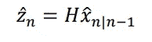
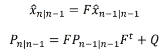
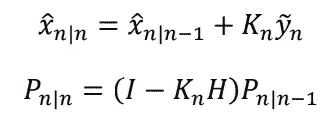
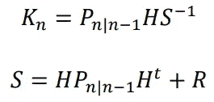
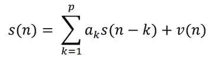
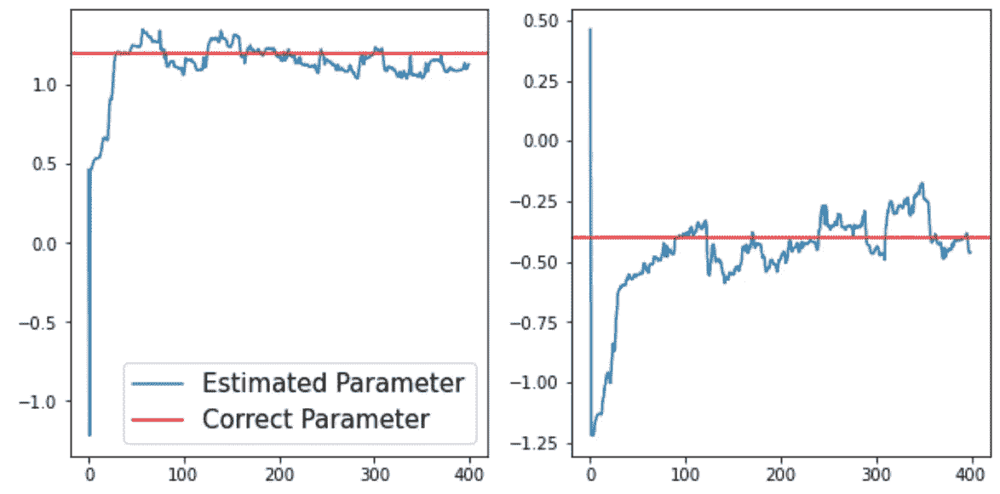
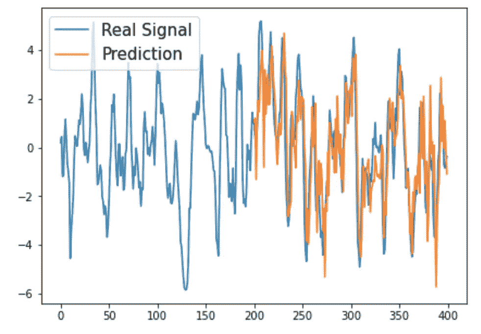
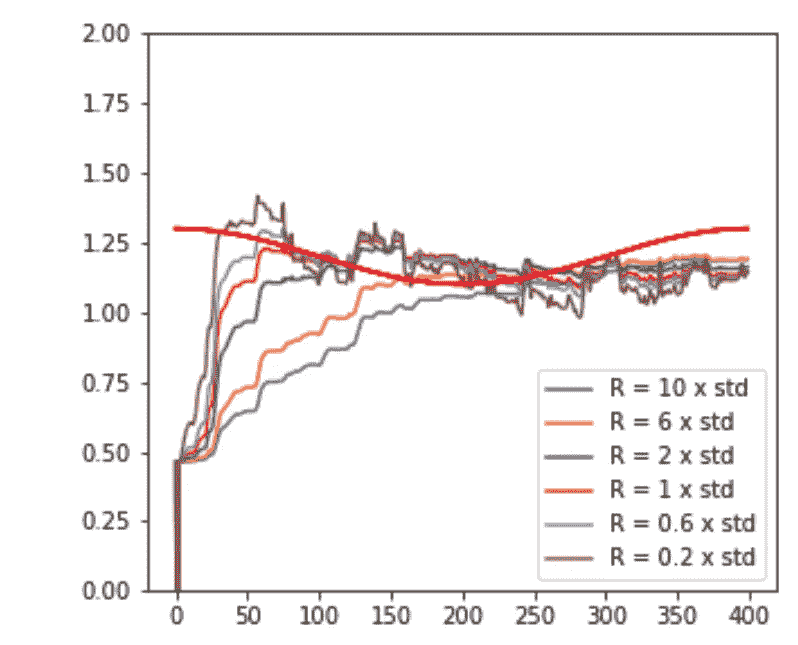

# 卡尔曼滤波:简单介绍

> 原文：<https://towardsdatascience.com/kalman-filtering-a-simple-introduction-df9a84307add?source=collection_archive---------9----------------------->

## 一个机器学习必须知道

## 高斯噪声下线性系统的最优在线学习算法

戈罗登科夫在[摄影站](https://www.shutterstock.com/image-photo/industry-40-two-engineers-standing-talking-1821601769)拍摄的照片

**如果动态系统是线性的且带有高斯噪声，则隐藏状态的最优估计器是卡尔曼滤波器。**

这种在线学习算法是机器学习世界基础的一部分。在理解粒子过滤器等更复杂的主题之前，很好地理解它是很重要的。

在本文中，我将从卡尔曼滤波器的一个示例应用开始，然后我将描述算法本身，我将把它应用于一些简单的合成数据，最后，我将展示卡尔曼滤波器失败的地方。

# 应用示例

在工程领域，卡尔曼滤波器是减少传感器信号噪声的最常见模型之一。正如我们将会发现的，当数据中的噪声大致为高斯型时，这些模型非常有用。

尽管卡尔曼滤波器是一种强大的降噪工具，但它还可以有更多用途，下面是一个例子:

假设我们有一个喷气发动机，它的一个部件上有一条疲劳裂纹。我们正试图用这种部件上的应力传感器来监控裂纹长度。

让我们假设我们在每一种情况下都有裂缝的测量值。我们还假设裂纹长度随应力线性增长(实际上根据巴黎定律，实际上是裂纹扩展速率的对数随应力强度因子的对数线性增长)。

卡尔曼滤波器涉及以下变量:

*   z:观察变量(我们试图预测的)
*   x:隐藏状态变量(我们用来预测 Z 的变量，理想情况下与 Z 成线性关系)

在我们的例子中，观察变量是裂纹长度。我们隐藏的状态变量是压力。由于我们假设**两者之间存在线性关系**，并且如果我们假设噪声是高斯噪声，**最佳估计器是卡尔曼滤波器！**

# 卡尔曼滤波器

卡尔曼滤波器是一种在线学习算法。随着新数据的到来，该模型会按顺序更新其对权重的估计。记录方程式中下标的符号。当前时间步长被表示为 n(我们想要对其进行预测的时间步长)。

## 以前的状态

卡尔曼滤波器的最终目标是通过对隐藏状态变量 x 进行最佳估计来预测观察变量 Z 的下一次观察。然后，可以通过使用 x 对其进行重构来预测 Z 的下一次观察。

观察变量 Z 的估计由隐藏状态 x 的线性变换 H 给出。下标 n 表示当前时间步长。Xn|n-1 表示给定直到 n-1 的数据时在时间步长 n 的隐藏状态 X 的估计。

根据时间步长 n 处 Z 的估计值，我们可以用公式表示新息:

新息 Y 是下一个观察状态的预测和下一个状态的真实观察之间的差。

为了估计隐藏状态 X，卡尔曼滤波器假设从隐藏状态到观察变量的转换具有高斯噪声。在喷气发动机的例子中，测量装置可能由于裂纹长度的不准确测量而给系统增加噪声。这些误差被假定为高斯误差。

因此，每次新的观察值出现时，模型都会估计隐藏状态 X，并继续估计不确定性 p。它们一起参数化了观察变量估计值的概率密度函数。下一时间步的预测观测值将是最大似然估计值(平均值)。

第一个等式显示了给定前一隐藏状态时对隐藏状态的估计。f 是从前一状态估计到当前状态估计的转换函数。

第二个方程是不确定性 p 的更新估计，这是协方差矩阵，它是前一个状态的协方差矩阵的函数。

## **状态更新方程**

到目前为止，我们已经公式化了给定数据直到前一时间步的状态(状态 n|n-1)。给定我们在时间步长 n(STATE n | n)接收到的新数据点，我们想要为新状态制定一个更新。

通过最小化均方误差，可以导出时间步长 n 的隐藏状态 X 和协方差 P 的最佳更新。

其中:

第一个等式是给定所有数据的隐藏状态 n 的更新。更新的 X 由权重的先前估计加上增益项乘以新息给出。这与递归最小二乘(RLS)在线学习算法中的更新结构相同。

时间步长 n 处的卡尔曼增益 K 由不确定性 P 的先前估计、线性函数 H 和新息协方差 s 的倒数给出

有了这些方程，我们现在可以实现我们自己的卡尔曼滤波器。

# 示例实现

将使用简单的自回归时间序列数据。卡尔曼滤波器将被实现并用于估计隐藏状态 X，然后预测 z 的下一个观测值。

上面看到的自回归时间序列的阶数将设为 2。v(n)表示添加到系统中的白噪声。使用随机初始化的权重 a，自回归时间序列通过将前两个点乘以权重来生成新点。

作者图片

以上是对隐藏状态 x 的估计。真实值显示为红色，卡尔曼估计显示为蓝色。如你所见，模型很快收敛到隐藏状态的近似值。由于加到信号中的高斯噪声，该模型从未完美地估计它。

作者图片

经过 200 次左右的观测后，模型可以准确地估计出未来的观测变量 Z。卡尔曼滤波器和其他在线学习算法最令人印象深刻的是它们的收敛速度。

# 当卡尔曼滤波器失效时

到目前为止，我们假设隐藏状态和观察状态之间的关系是线性的，我们看到这个模型工作得相当好。但是当我们把这种关系变成非线性关系时会发生什么。

作者图片

这些是隐藏状态 X 之一的卡尔曼滤波器的估计，该隐藏状态 X 以正弦波的形式随时间变化。该模型未能生成隐藏状态 x 的良好估计。此外，预测似乎落后于真实值。

在前面看到的方程中，有两个超参数我没有提到。q 是过程噪声协方差，R 是测量噪声方差。通过调整 R，我们可以使模型更快地适应隐藏状态的变化。调整 Q 允许控制模型对过程噪声的敏感程度。

即使调整了这些超参数，您也可以看到模型滞后于隐藏状态变量的变化，从而使其预测不太好。卡尔曼滤波器是线性系统的最佳算法，但是当隐藏状态变量和观察变量之间存在非线性关系时，这些模型往往表现不佳。

# 结论

卡尔曼滤波器非常强大，广泛用于各种领域，尤其是工程应用中的信号处理。

在上一篇文章中，我描述了一种最简单的在线学习算法，递归最小二乘(RLS)算法。卡尔曼滤波器将 RLS 算法向前推进了一步，它假设系统中存在高斯噪声。预测时，卡尔曼滤波器估计隐藏状态的均值和协方差。该算法实质上是在预测点周围构建一个分布，其平均值是最大似然估计值。

我们知道，当系统是非线性的时候，这个模型就失效了。然而，在现实生活中，大多数系统都是非线性的。在以后的文章中，我将探索在线学习中的非线性系统，以及该领域中最强大的模型之一:**粒子过滤器**。

# 感谢阅读

如果你喜欢的话，可以考虑 [**关注我**](https://medium.com/@diegounzuetaruedas) 来获得更多像这样的文章！

如果您想访问 medium 上成千上万只对会员开放的故事，请考虑使用我的推荐链接注册:

[https://diegounzuetaruedas.medium.com/membership](https://diegounzuetaruedas.medium.com/membership)