# 卡普兰-迈耶曲线解释道

> 原文：<https://towardsdatascience.com/kaplan-meier-curve-explained-9c78a681faca?source=collection_archive---------9----------------------->

## 数据科学基础

## 学习如何在 Python 中从头开始构建 KM 曲线以及其他两种方法

Kaplan-Meier 曲线是一种流行的生存分析工具，它有助于在数据不完整的情况下理解生存概率。在本帖中，我们将学习如何从头开始构建 Kaplan-Meier 曲线以获得更好的理解，然后看看使用 Python 中的生存分析库构建它的两种方法。


Ravi Roshan 在 [Unsplash](https://unsplash.com?utm_source=medium&utm_medium=referral) 上拍摄的照片

# 0.数据

让我们想象一下，我们有从 2020 年 9 月到 2021 年 6 月收集的数据，用于一项临床研究，以了解癌症患者的生存期。以下是参与这项假设研究的人的时间表:

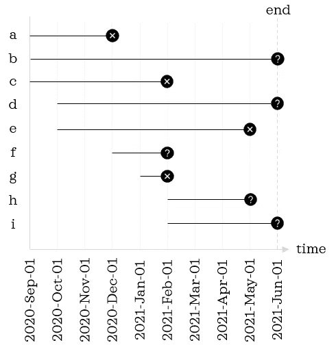

左边的字母是参与者的唯一标识符|作者图片

我们将假想研究的数据集保持在较小的范围内，以便更容易密切监控该过程。黑色实心圆圈表示记录的最后一个数据条目。圆圈内的叉表示记录有事件(即死亡)，而问号表示记录没有事件。更具体地说，有三种可能的情况。

1.  **发生事件:**在研究期间发生事件(如记录 *a* 和 *c*
2.  **无事件:**在研究结束时无事件(如记录 b 和 d)。
3.  **无事件:**在终点前退出研究，且在参与研究时未发生事件(如记录 *f* 和 *h* )。

第二类和第三类记录被称为删截记录，更确切地说是右删截记录，因为我们对事件的信息不完整。

在上图中，我们看到横轴上有一个*日历时间*。现在，我们需要将*日历时间*转换为*存活时间*，*相对于研究登记日期测量的* *持续时间*。*存活时间*在我们稍后将要熟悉的 Python 库中通常被称为*持续时间*；因此，从这里开始，我们将互换使用这些术语。

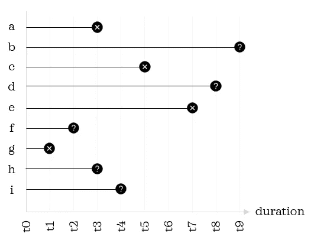

作者图片

使用下面的脚本，让我们导入我们需要的库，并为 9 条记录创建一个包含*持续时间*和*事件*的小数据帧:

```
# Data manipulation
import numpy as np
import pandas as pd
from string import ascii_lowercase# Visualisation
import matplotlib.pyplot as plt
import seaborn as sns
sns.set(style='dark', context='talk')# Kaplan-Meier curve
from lifelines import KaplanMeierFitter 
from sksurv.nonparametric import kaplan_meier_estimator# Create a toy dataframe
df = pd.DataFrame(data={'duration': [3,9,5,8,7,2,1,3,4],
                        'event': [1,0,1,0,1,0,1,0,0]}, 
                  index=list(ascii_lowercase[:9]))
df
```

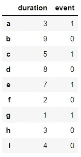

事件栏:0 表示审查，1 表示有事件

# 1.我们自己从零开始建造

现在让我们熟悉一下概念知识。卡普兰-迈耶曲线是卡普兰-迈耶估计量的直观表示，它做出以下假设:

1.  **审查:**经过审查的观察和未经审查的观察有着相同的生存前景。
2.  **研究进入时间:**在研究早期和后期招募的观测值的存活概率相同。
3.  **事件时间:**事件在规定的时间发生

卡普兰-迈耶估计量由以下公式定义:

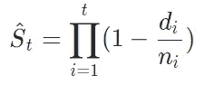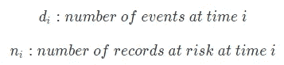

有了这个公式，我们就可以求出给定时刻的生存概率。无论 *i* 从 1 还是 0 开始都没有区别，因为 0 时刻的生存概率是 1。如果我们仔细观察这个公式，我们会注意到括号内的内容是捕获*存活比例(即 1-死亡比例)*。

让我们用这个公式找出前三个持续时间的生存概率:


在研究进行一个月后，我们有 9 名参与者处于危险中，一名参与者已经死亡。因此，d1 = 1，n1 = 9。

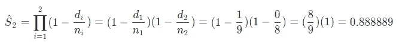

在研究的两个月后，我们有 8 名参与者处于危险中，没有人死亡。因此，d2 = 0，n = 8。如你所见，当持续时间没有事件时，生存概率与前一个持续时间相同。因此，如果一个持续时间没有事件，我们可以跳过计算，使用前一个生存时间的生存概率。

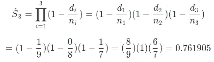

在研究的第三个月，我们有 7 个记录处于危险中，1 个死亡，存活概率下降到 0.76。这个等式现在变得越来越长，越来越繁琐。我们可以将公式改写为以下更简单的形式:

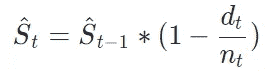

使用这个公式，计算更加简洁:

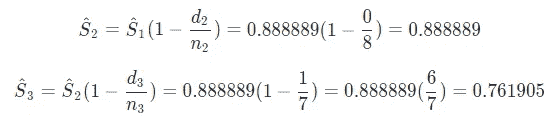

这三个例子说明了概率是如何估计的。与其重复计算其余部分，不如让我们将逻辑转换成 Python 脚本，并计算所有持续时间的生存概率:

```
# Prepare unique durations in ascending order
durations = df.sort_values('duration')['duration'].unique()# Initialise the table
columns = ['duration', 'n_at_risk', 'n_events', 
           'survival_probability']
km = pd.DataFrame(columns=columns, dtype=np.number)
km = km.append(pd.DataFrame([[0, df.shape[0], 0, 1]], 
                            columns=columns))# Calculate survival probability for each duration
for i, t in enumerate(durations):
    n = np.sum(df['duration']>=t)
    d = np.sum((df['duration']==t) & (df['event']==1))
    s = (1 - d / n) * km.loc[i, 'survival_probability']
    km = km.append(pd.DataFrame([[t, n, d, s]], 
                                index=[i+1],
                                columns=columns))
km
```

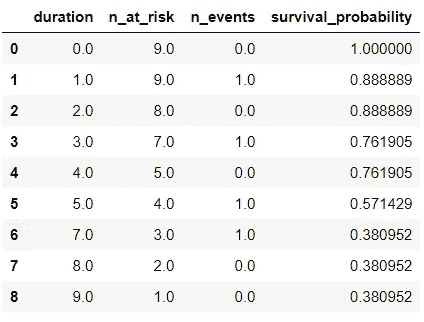

卡普兰-迈耶曲线需要*生存概率*和*持续时间*栏。现在让我们绘制曲线，因为我们已经准备好了输入。

```
plt.figure(figsize=(8,4))
sns.lineplot(data=km, x='duration', y='survival_probability', 
             drawstyle='steps-post')
plt.ylim(0,1.1) 
plt.title("Kaplan-Meier curve");
```

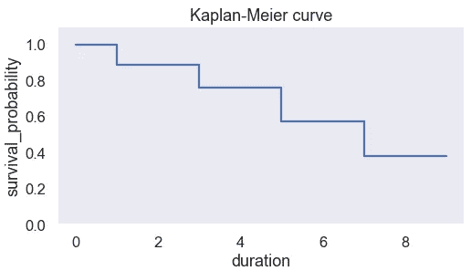

瞧，我们刚刚自己绘制了曲线。从零开始构建曲线有望帮助你理解潜在的逻辑。已经学会了如何自己构建曲线，让我们来学习绘制卡普兰-迈耶曲线的更实用的方法。我们将熟悉两个提供现成解决方案的库。

# 2.使用生命线

Lifeline 是 Python 中一个易于使用的生存分析库。卡普兰-迈耶曲线可使用`KaplanMeierFitter`对象绘制成几条线:

```
kmf = KaplanMeierFitter() 
kmf.fit(df['duration'], df['event'])plt.figure(figsize=(8,4))
kmf.plot()
plt.title("Kaplan-Meier curve");
```

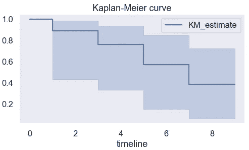

从拟合的对象中，我们还可以通过访问`survival_function_`属性来查看生存概率:

```
kmf.survival_function_
```

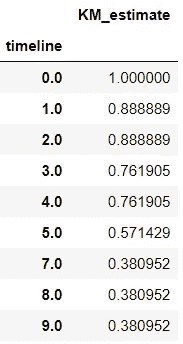

我们还可以提取事件表，它类似于我们在*第 1 节*中构建的一个表。

```
kmf.event_table
```

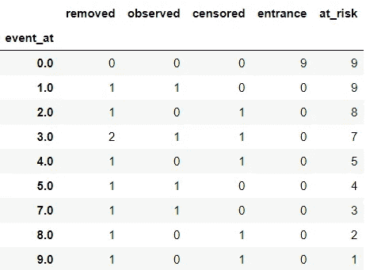

列'*'观察'*与第 1 节表格中的列*' n _ 事件'*相同。此外，两个表中的“风险”和“n 风险”列是相同的。

有了*生命线*，绘制曲线和检查估计器的细节变得很容易。

# 3.使用 scikit-survival

另一个有用的生存分析库是 *scikit-survival* 。顾名思义，它与 *scikit-learn* 协调工作。利用`kaplan_meier_estimator()`可以得到*持续时间*和*生存概率*。一旦我们有了曲线所需的输入，我们可以使用任何可视化库来绘制它。由于我们在第 1 节中使用了 *seaborn* ，我们将看看使用 *matplotlib* 绘图的另一种方法:

```
duration, survival_probability = kaplan_meier_estimator(df['event']==1, df['duration'])
plt.figure(figsize=(8,4))
plt.step(x=duration, y=survival_probability, where="post")
plt.ylim(0,1.1)
plt.xlabel("Survival time (months)")
plt.ylabel("Survival probability")
plt.title("Kaplan-Meier curve");
```

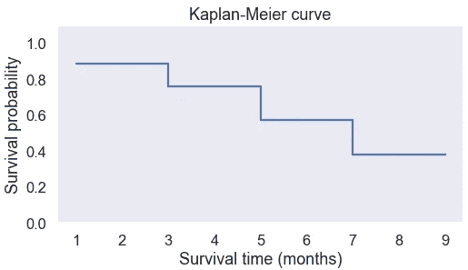

至此，您已经学习了为卡普兰-迈耶曲线准备输入的基本逻辑，并熟悉了绘制曲线的几种不同方法！


[Bruce Hong](https://unsplash.com/@hongqi?utm_source=medium&utm_medium=referral) 在 [Unsplash](https://unsplash.com?utm_source=medium&utm_medium=referral) 上的照片

您想要访问更多这样的内容吗？媒体会员可以无限制地访问媒体上的任何文章。如果你使用 [*我的推荐链接*](https://zluvsand.medium.com/membership)*成为会员，你的一部分会费会直接去支持我。*

感谢您阅读这篇文章。如果你感兴趣，这里有我的一些其他帖子的链接:
◼️ [ROC 曲线解释](/roc-curve-explained-50acab4f7bd8)
◼️ [有用的 IPython 魔法命令](/useful-ipython-magic-commands-245e6c024711)
◼️ [从零开始学习 Python 的 5 个技巧](/5-tips-to-learn-python-from-zero-e4f6a9106558)
◼️ [用这些技巧组织你的 Jupyter 笔记本](/organise-your-jupyter-notebook-with-these-tips-d164d5dcd51f)
◼️️ [在熊猫中编写 5 个常见的 SQL 查询](/writing-5-common-sql-queries-in-pandas-90b52f17ad76)

再见🏃💨