# kats:Python 中分析时间序列数据的通用框架

> 原文：<https://towardsdatascience.com/kats-a-generalizable-framework-to-analyze-time-series-data-in-python-3c8d21efe057?source=collection_archive---------4----------------------->

## 预测、检测变化点、异常，并获得时间序列中的关键统计数据

# 动机

时间序列分析是数据科学中的一个有用领域，它允许您了解关键统计数据、检测回归、异常和预测未来趋势。

然而，这些时间序列技术通常由不同的库实现。有没有一种方法可以让你在一个库中获得所有这些技术？这就是 Kats 派上用场的时候。

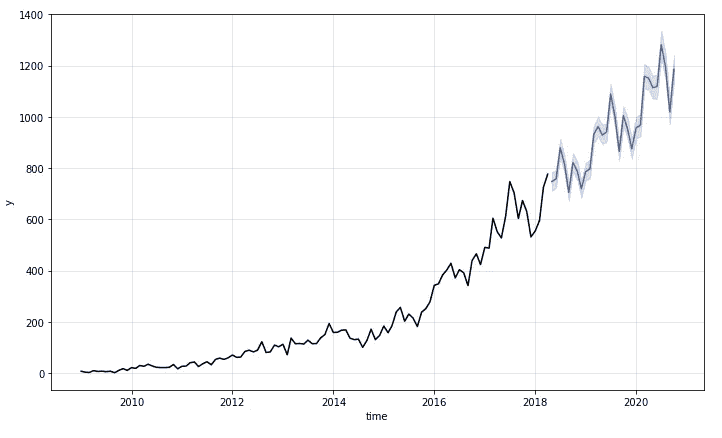

作者图片

# 什么是 Kats？

[Kats](https://facebookresearch.github.io/Kats/) 是一个轻量级的、易于使用的、通用的框架，用 Python 来执行时间序列分析，由脸书研究院开发。您可以将 Kats 视为 Python 中时间序列分析的一站式商店。

要安装 Kats，请键入:

```
pip install --upgrade pip
pip install kats==0.1 ax-platform==0.2.3 statsmodels==0.12.2
```

为了了解 Kats 做了什么，我们将使用这个框架来分析 Kaggle 上的 [StackOverflow 问题计数](https://www.kaggle.com/aishu200023/stackindex)数据。从下载数据和读取数据开始。

现在我们来分析一下与 Python 相关的 StackOverflow 问题计数。数据被分成一个训练集和一个测试集来评估预测。

# 将数据转换成时间序列

首先构建一个时间序列对象。我们使用`time_col_name='month'`来指定时间列。

要绘制数据，调用`plot`方法:

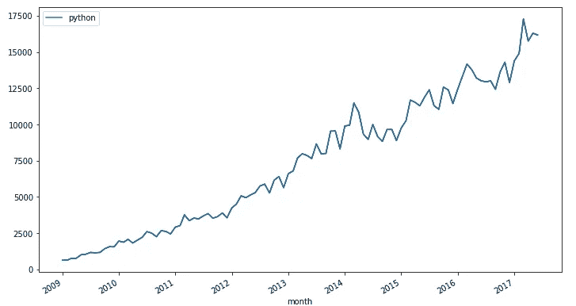

作者图片

酷！看起来关于 Python 的问题数量逐年上升。我们能预测它未来 30 天的趋势吗？是的，我们可以和 Kats 一起做。

# 预测

Kats 目前支持以下 10 种预测模型:

*   线性的
*   二次的
*   ARIMA
*   萨里玛
*   霍尔特-温特斯
*   先知
*   AR-Net
*   LSTM
*   希腊字母的第八字
*   增值转销公司

让我们试试这些模型中的两个。

## 脸书先知

首先使用 Prophet 模型进行预测:

可视化预测:

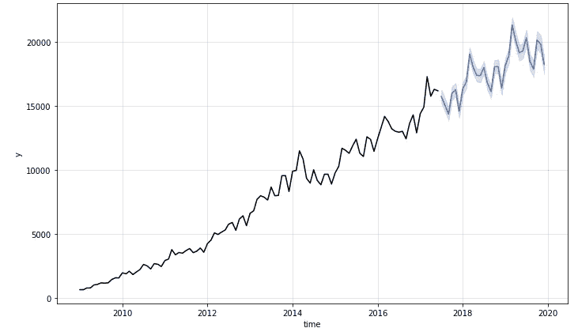

作者图片

酷！让我们通过与测试数据进行比较来评估预测。

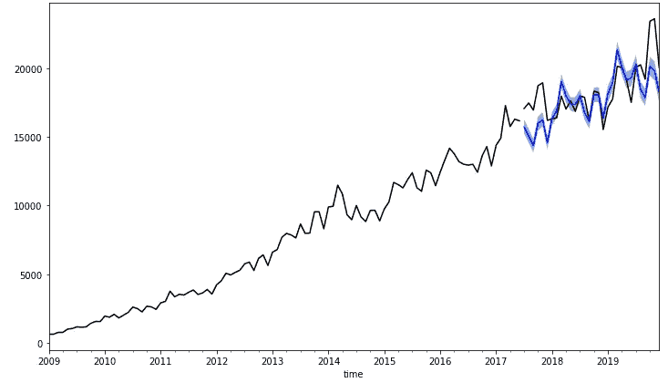

作者图片

预报似乎很好地遵循了观测结果！

## 霍尔特-温特斯

我们将尝试的下一个模型是 Holt-Winters。霍尔特-温特斯法是一种捕捉季节性的方法。下面是如何使用霍尔特温特斯方法与 Kats。

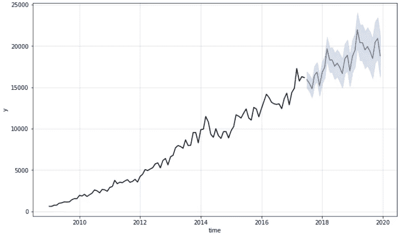

作者图片

找到所有 Kats 的模型的 API[在这里](https://facebookresearch.github.io/Kats/api/kats.models.html)。

# 检测变化点

你是否曾经希望精确地指出你的时间序列中发生统计意义上的显著变化的时间？

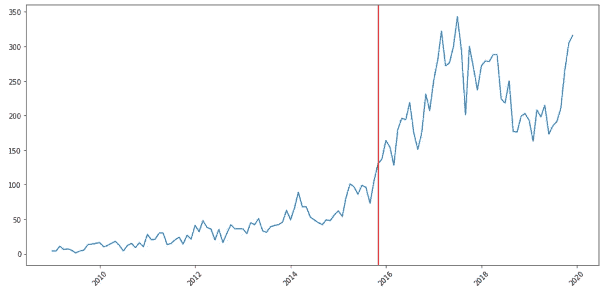

作者图片

Kats 允许您使用 CUSUM 算法来检测变化点。Cusum 是一种检测时间序列中均值上移/下移的方法。

让我们看看如何检测 Kats 中的变化点。

```
The change point is on 2013-02-01 00:00:00
```

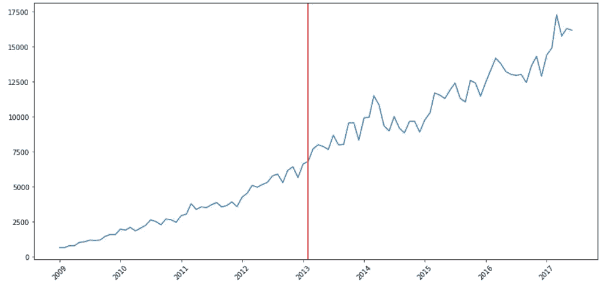

作者图片

酷！我们来试着检测一下 StackOverflow 的问题计数的其他类别的变化点。

首先创建一个函数来检测主题提供的变化点。

**机器学习:**

```
The change point is on 2015-12-01 00:00:00
```

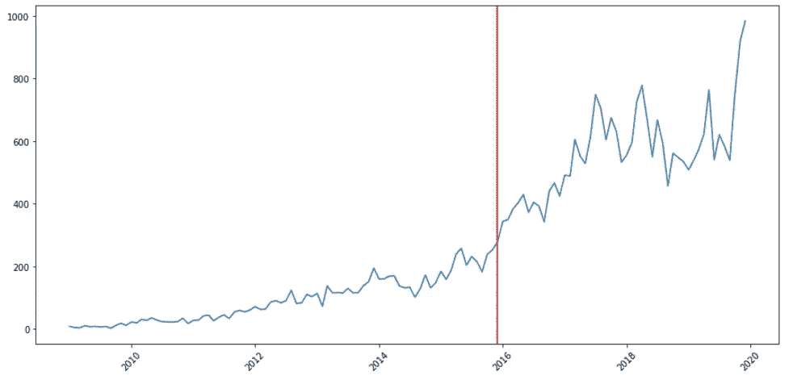

作者图片

**神经网络:**

```
The change point is on 2015-11-01 00:00:00
```

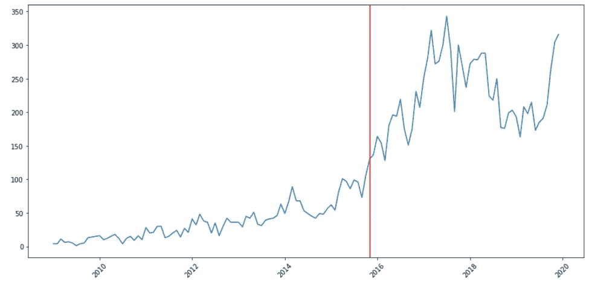

作者图片

**深度学习:**

```
The change point is on 2016-09-01 00:00:00
```

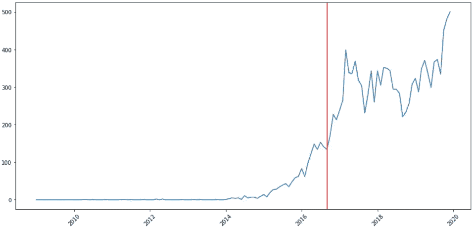

作者图片

**Jupyter:**

```
The change point is on 2015-07-01 00:00:00
```

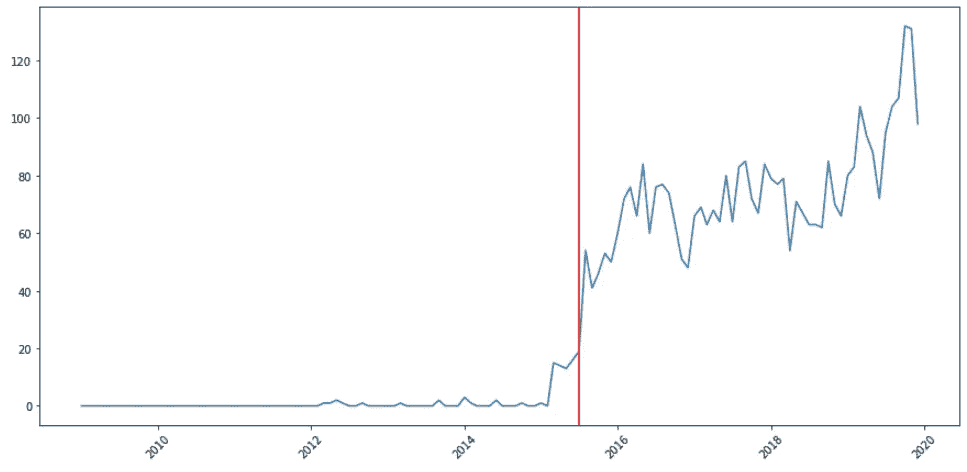

作者图片

**情节地:**

```
The change point is on 2016-02-01 00:00:00
```

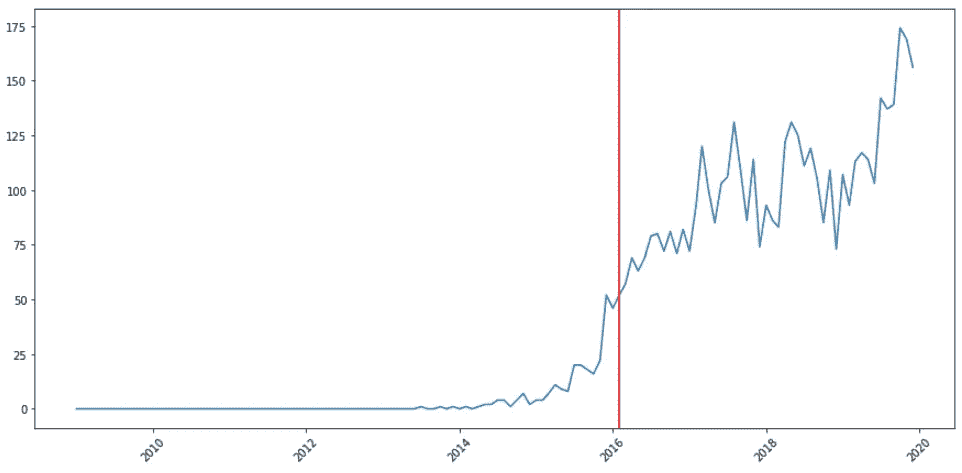

作者图片

你看到一般的模式了吗？StackOverflow 上与数据科学、机器学习和深度学习相关的类别的问题计数方式的转变似乎是在 2015-2016 年左右！

这段时间周围发生了什么吸引开发者注意的事情？如果你有这个问题的答案，请在评论中发表。

# 离群点检测

当你看 NLP 的时间序列时，你看到了什么？

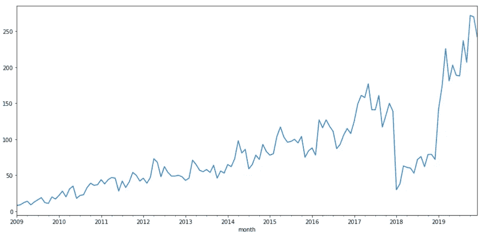

作者图片

是的，你说得对。从 2018 年到 2019 年，NLP 的问题数量有所下降。

问题数量的下降是一个异常值。检测异常值是很重要的，因为它们会给下游处理带来问题。

然而，通过查看数据来发现异常值并不总是高效和容易的。幸运的是，Kats 还允许您检测时间序列中的异常值！

用 Kats 检测异常值只需要 2 行代码。

```
The outliers range from 2018-01-01 00:00:00 to 2019-03-01 00:00:00
```

酷！结果证实了我们从上面的图中看到的。

# 时间序列特征

除了时间序列的统计数据之外，您可能还有其他感兴趣的特征，如线性度、趋势强度、季节性强度、季节性参数等。

Kats 允许您通过`TsFeatures`找到关于时间序列特性的重要信息:

厉害！

# 结论

恭喜你！您刚刚学习了如何使用 Kats 来预测、检测变化点、检测异常值和提取时间序列特征。希望这篇文章能给你解决有趣问题的动力，从你的时间序列中提取有价值的信息。

请在此随意使用源代码:

<https://github.com/khuyentran1401/Data-science/blob/master/time_series/kats_examples/kats.ipynb>  

我喜欢写一些基本的数据科学概念，并尝试不同的算法和数据科学工具。你可以在 [LinkedIn](https://www.linkedin.com/in/khuyen-tran-1ab926151/) 和 [Twitter](https://twitter.com/KhuyenTran16) 上联系我。

如果你想查看我写的所有文章的代码，请点击这里。在 Medium 上关注我，了解我的最新数据科学文章，例如:

</supercharge-your-python-string-with-textblob-2d9c08a8da05>  </3-tools-to-track-and-visualize-the-execution-of-your-python-code-666a153e435e> [## 3 个跟踪和可视化 Python 代码执行的工具

towardsdatascience.com](/3-tools-to-track-and-visualize-the-execution-of-your-python-code-666a153e435e) </introduction-to-schema-a-python-libary-to-validate-your-data-c6d99e06d56a>  </human-learn-create-rules-by-drawing-on-the-dataset-bcbca229f00> 