# kedro——可再生数据科学项目的 Python 框架

> 原文：<https://towardsdatascience.com/kedro-a-python-framework-for-reproducible-data-science-project-4d44977d4f04?source=collection_archive---------0----------------------->

## 使用 Kedro 创建可维护的模块化数据科学管道

# 动机

您是否曾经将数据传递给一系列函数和类，却不知道输出是什么样的？

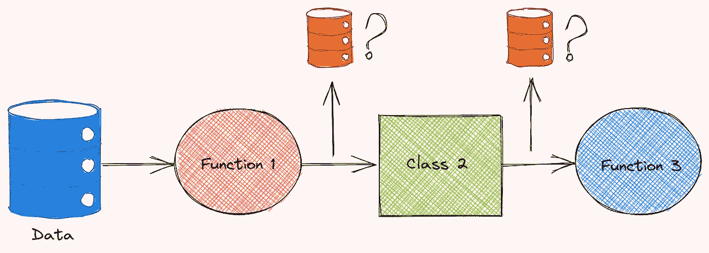

作者图片

您可以尝试保存数据，然后在 Jupyter 笔记本中检查数据，以确保输出与您预期的一致。这种方法可行，但是很麻烦。

另一个常见问题是，当查看包含创建和执行函数的代码的 Python 脚本时，很难理解函数之间的关系。

随着项目的发展，你的代码看起来更加复杂，更加难以理解。

如果您能像下面这样可视化不同函数的输入和输出是如何连接的，那不是更好吗？

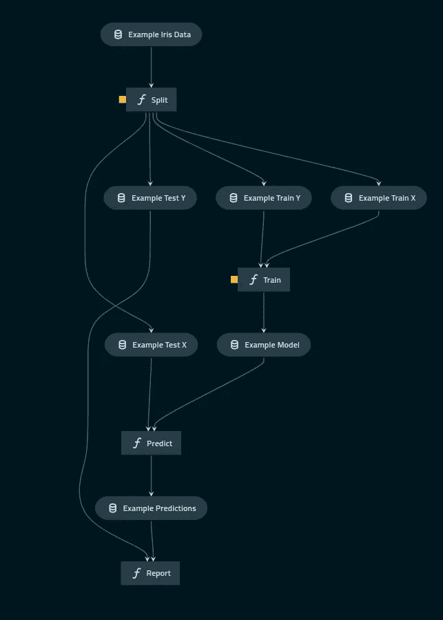

作者图片

这就是 Kedro 派上用场的时候。

# 凯卓是什么？

Kedro 是一个开源的 Python 框架，用于创建可复制的、可维护的、模块化的数据科学代码。它从软件工程最佳实践中借用概念，并将它们应用于机器学习代码。

Kedro 允许您:

1.  从千篇一律的模板中创建数据科学
2.  创建数据科学管道
3.  切开管道
4.  模块化管道
5.  通过 YAML 文件配置您的数据和参数
6.  在 Jupyter 笔记本中轻松分析节点的输出
7.  可视化您的管道
8.  为您的项目创建文档

在本文中，我将逐一介绍这些特性，并解释它们如何对您的数据科学项目有所帮助。

要安装 Kedro，请键入:

```
pip install kedro
```

# 建立一个数据科学项目

## 从千篇一律的模板中创建数据科学

您是否考虑过如何构建您的数据科学项目，使其符合逻辑并合理标准化？如果能在一行代码中创建一个定义良好的标准项目结构不是很好吗？

使用 Kedro 可以轻松做到这一点。安装 Kedro 后，您可以使用以下命令创建一个新的空项目:

```
$ kedro new
```

在完成一系列问题后，将创建一个新项目，其结构如下:

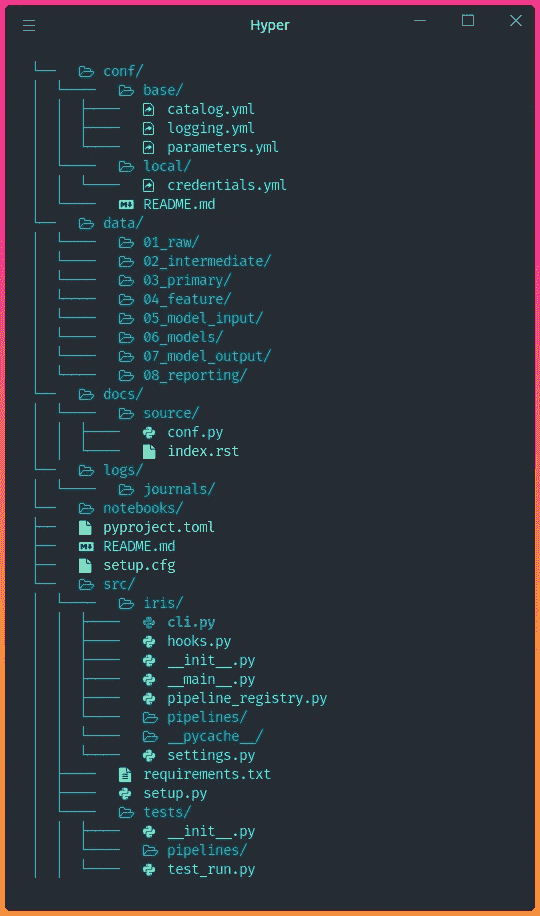

作者图片

如果我们从更高的层次来看项目结构，我们可以看到有 5 个主要目录:

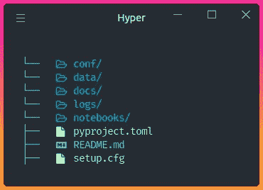

作者图片

*   `conf`:存储配置文件
*   `data`:存储数据
*   `docs`:存储项目文档
*   `logs`:存储日志文件
*   `notebooks`:储存 Jupyter 笔记本
*   `src`:存储主代码

## 安装依赖项

Kedro 在使用之前需要一些基本的依赖项。这些依赖关系在`src/requirements.txt`中指定。要安装这些依赖项，请键入:

```
$ kedro install
```

运行管道所需的所有依赖项都将安装在您的环境中。

既然我们学习了如何建立一个数据科学项目，那么让我们来理解如何用 Kedro 创建一个管道。

# 创建管道

要创建新管道，请键入:

```
$ kedro pipeline create <NAME>
```

由于数据科学项目通常有两个步骤:数据处理和模型训练，我们将创建一个名为`data_engineer`的管道和一个名为`data_science`的管道:

```
$ kedro pipeline create data_engineering
$ kedro pipeline create data_science
```

这两个管道目录将被创建在`src/project_name`下:

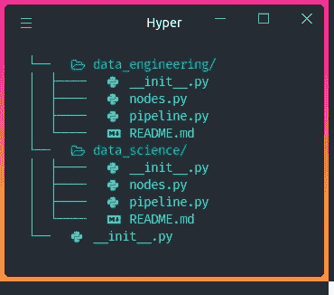

作者图片

每个管道由 4 个文件组成:

*   `__init__.py`
*   `README.md`:指定管道信息
*   `node.py`:包含节点
*   `pipeline.py`:包含管道

## 结节

管道由多个节点组成。每个节点都是一个 Python 函数。

对于每个节点，都有输入和输出:

节点`get_classes`的可视化:

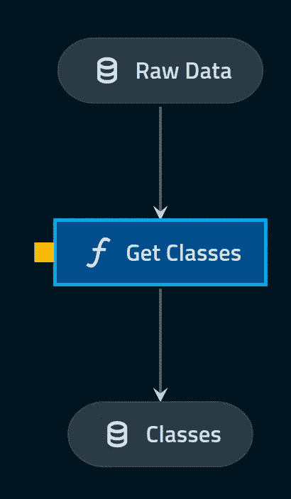

作者图片

可以使用`None`、字符串、字符串列表或字典来指定每个节点的输入和输出。注意，这些字符串是**抽象名称，而不是真实值**。

名字为什么有用？如果我们知道每个函数的输入和输出的名称，我们可以通过调用它的名称来轻松地获取特定的输入或输出。因此，在你的代码中有更少的模糊性。

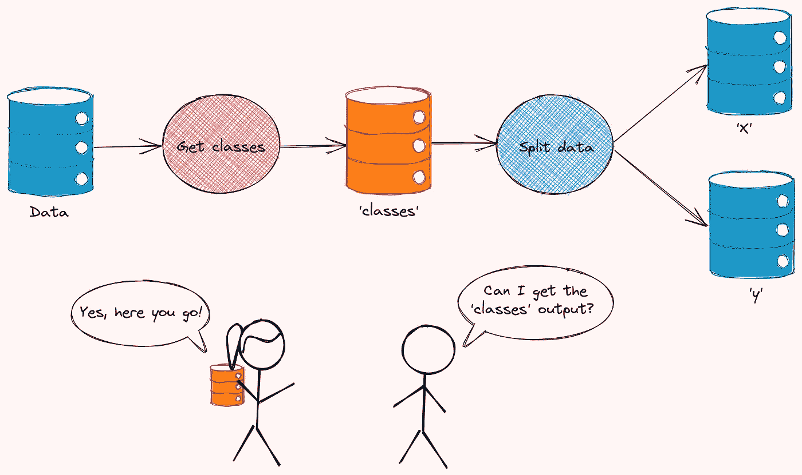

作者图片

你可以在这里找到所有节点定义语法。

## 管道

管道由一系列节点组成。它将一个节点的输出连接到另一个节点的输入。

例如，在下面的代码中，`'classes'`(函数`get_classes`的输出)和`'encoded_data'`(函数`encode_categorical_columns`的输出)被用作函数`split_data`的输入。

数据目录位于`conf/base/catalog.yml`下。

上方管道的可视化:

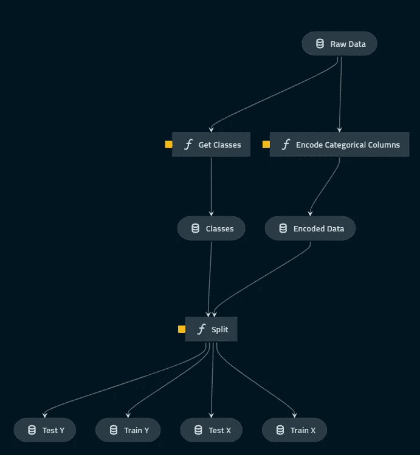

作者图片

# 注册并运行管道

现在我们有了节点和管道，让我们在文件`src/project_name/pipeline_registry.py`中注册这些管道:

注册管道后，我们可以使用以下命令运行这些管道:

```
$ kedro run
```

如果您只想运行一个特定的管道，将`--pipeline=<NAME>`添加到命令`kedro run`中:

```
$ kedro run --pipeline=de
```

酷！

## 切开管道

如果您希望只运行管道的一部分，可以对管道进行切片。切割管线的四个选项是:

*   `--from-nodes`:从某些节点开始运行管道
*   `--to-nodes`:运行管道，直到到达某些节点
*   `--from-inputs`:从产生特定输入的节点开始运行管道
*   `--to-outputs`:运行流水线，直到到达产生一定输出的节点

举个例子，

```
$ kedro run --to-nodes=encode_categorical_columns
```

…允许您运行管道，直到到达节点`encode_categorical_columns`。

## 模块化管道

有时，您可能希望**为不同的目的重用同一个管道**。Kedro 允许您创建模块化管道，这些管道是隔离的，可以重用。

例如，您可以编写一个名为“烹饪管道”的管道，而不是编写两个单独的管道“烹饪午餐管道”和“烹饪晚餐管道”。

然后，通过用新值切换“烹饪管道”的输入和输出，将“烹饪管道”转换为“烹饪肉类管道”和“烹饪蔬菜管道”。

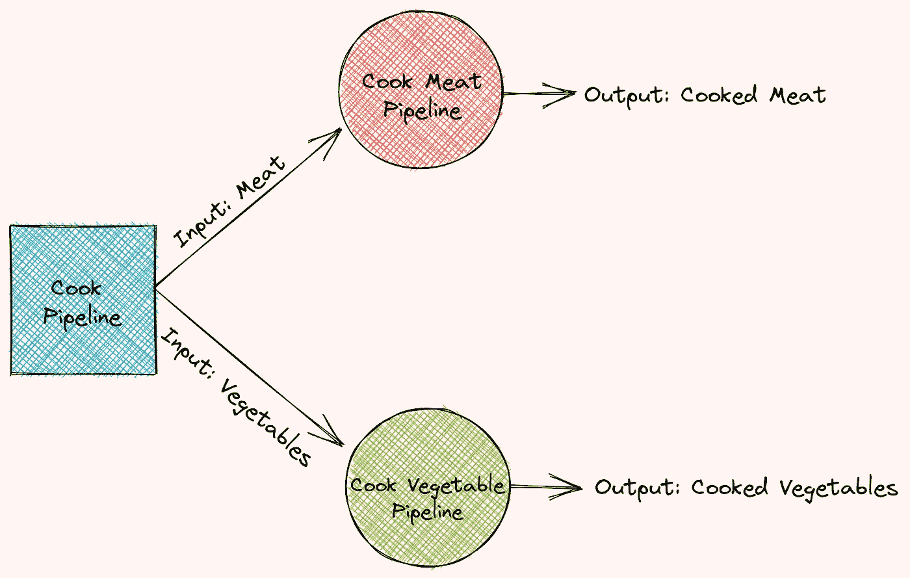

作者图片

模块化管道很好，因为它们是可移植的，更容易开发、测试和维护。在这里找到关于如何模块化你的 Kedro 管道[的说明。](https://kedro.readthedocs.io/en/stable/06_nodes_and_pipelines/03_modular_pipelines.html)

# 通过 YAML 文件配置您的参数和数据

## 因素

Kedro 还允许您使用 YAML 文件指定函数的参数。这非常好，因为您可以从一个文件中查看所有参数，而无需深入源代码。

要用配置文件配置您的项目，首先将用于`data_engineering`管道的参数放入`conf/base/parameters/data_engineering.yml`文件中。

现在，从管道访问参数很简单。我们所需要做的就是在我们想要访问的参数名称前添加`params:`。

在下面的例子中，我们使用`params:test_data_ratio`从配置文件中访问参数`test_data_ratio`。

## 数据目录

现在你可能想知道:我们如何从管道中访问数据？

Kedro 允许你用数据目录加载和保存数据。数据目录位于`conf/base/catalog.yml`下。

数据目录是一个配置文件，允许您**指定数据类型，以及数据保存的位置**。

例如，为了保存来自`encode_categorical_columns`节点的`encoded_data`输出，

…我们可以将名称`encoded_data`插入到`conf/base/catalog.yml`文件中。在`encoded_data`下，我们指定数据集的类型及其位置。

`pandas.CSVDataSet`告诉 Kedro 我们想将`encoded_data`保存为 CSV 格式，并用熊猫加载。Kedro 还支持其他数据集类型，如 pickle、parquet、excel、plot、Spark、SQL 等。在这里找到 Kedro 支持[的所有数据集。](https://kedro.readthedocs.io/en/stable/05_data/01_data_catalog.html)

使用数据目录来管理数据的加载和保存非常好，因为您可以指定:

*   每个文件的位置
*   数据是如何保存和加载的

…只编辑一个文件。下次当您忘记数据集的位置时，可以查看这个配置文件来查找它们的信息。

# 从 Jupyter 笔记本中加载数据目录和参数

## 加载数据目录

你是否曾经想要快速检查 Jupyter 笔记本上某个函数的输出？通常，您需要首先保存数据:

…然后将其载入 Jupyter 笔记本:

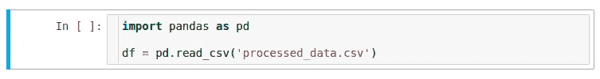

作者图片

使用 Kedro，保存和加载数据不需要额外的代码。要启动 Kedro 的 Jupyter 会话，请键入:

```
$ kedro jupyter notebook
```

在运行产生在`catalog.yml`文件中指定的输出`encoded_data`的流水线之后，

…我们可以使用`catalog.load`轻松地将数据加载到笔记本电脑中:

如果要指定如何保存和加载输出`encoded_data`，在`encoded_data`下添加`load_args`和`save_args`。

请注意，上述配置相当于:

## 负载参数

`src/base`内的所有参数也可以通过`context.params`轻松加载。

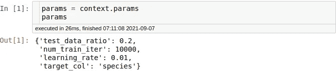

作者图片

## 运行管道

有时，您可能想要试验新的 Python 函数，并在笔记本中观察它们的输出。幸运的是，Kedro 允许您在笔记本内部运行一个管道:

为了快速测试，您还可以将 Jupyter 笔记本中的功能转换成 Kedro 节点。

# 可视化您的管道

如果您对管道的结构感到困惑，可以使用 kedro-viz 可视化整个管道。从安装 kedro-viz 开始:

```
pip install kedro-viz
```

然后键入:

```
$ kedro viz
```

…可视化您的管道。一个网站将在您的浏览器中自动打开。您应该会看到类似下面的内容:

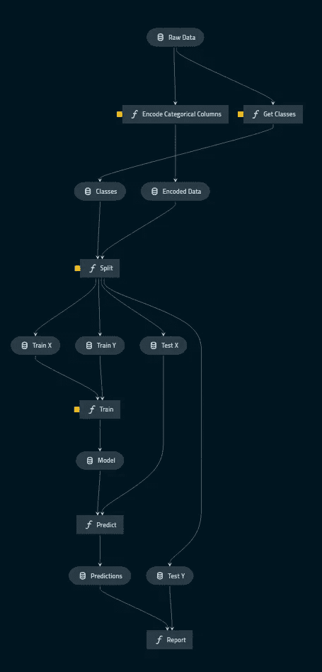

作者图片

可视化捕捉数据集和节点之间的关系。单击一个节点将为您提供关于该节点的更多信息，如其参数、输入、输出、文件路径和代码。

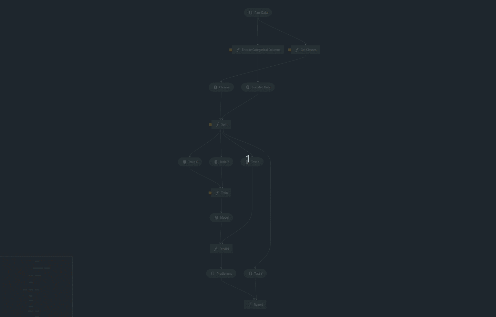

作者 GIF

# 为项目创建文档

记录您的项目使您的团队更容易理解您的项目以及如何使用您的代码。Kedro 使您可以轻松地基于项目的代码结构创建文档，并包含代码中定义的任何文档字符串。

要为您的项目创建文档，请键入:

```
$ kedro build-docs
```

并且您的项目的文档将会在`docs/build/html`下自动创建！您可以通过打开`docs/build/html/index.html`或运行以下命令来浏览文档:

```
$ kedro build-docs --open
```

…在构建后自动打开文档。

您的文档应该类似于下图:

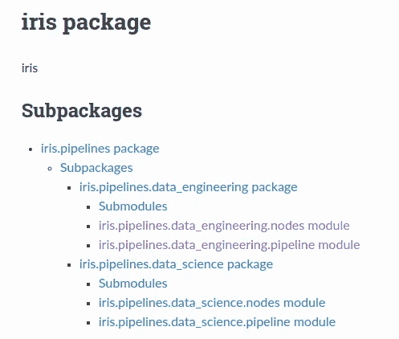

作者图片

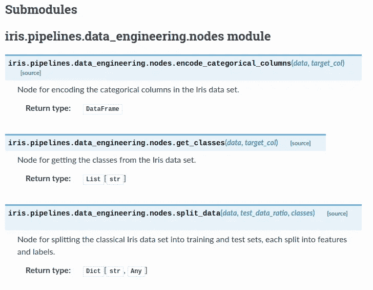

作者图片

# 结论

恭喜你！您刚刚学习了如何使用 Kedro 创建可重复和可维护的数据科学项目。学习 Kedro 可能需要一点时间，但是一旦用 Kedro 建立了数据科学，您会发现维护和更新您的项目不再那么困难。

我希望这篇文章能给你在现有或未来的数据科学项目中使用 Kedro 的动力。

本文中演示项目的源代码可以在这里找到:

<https://github.com/khuyentran1401/kedro_demo>  

我喜欢写一些基本的数据科学概念，并尝试不同的算法和数据科学工具。你可以通过 [LinkedIn](https://www.linkedin.com/in/khuyen-tran-1ab926151/) 和 [Twitter](https://twitter.com/KhuyenTran16) 与我联系。

如果你想查看我写的所有文章的代码，请点击这里。在 Medium 上关注我，了解我的最新数据科学文章，例如:

</introduction-to-schema-a-python-libary-to-validate-your-data-c6d99e06d56a>  </introduction-to-dvc-data-version-control-tool-for-machine-learning-projects-7cb49c229fe0>  </pytest-for-data-scientists-2990319e55e6>  </introduction-to-weight-biases-track-and-visualize-your-machine-learning-experiments-in-3-lines-9c9553b0f99d> 