# Kedro 手把手:建立自己的人口统计图谱。角。2:建筑足迹分类

> 原文：<https://towardsdatascience.com/kedro-hands-on-build-your-own-demographics-atlas-pt-2-building-footprints-classification-8c48060e5c1a?source=collection_archive---------40----------------------->

## 如何使用 OpenStreetMap 和带有 kedro pipeline 的开放政府数据构建自己的简单人口地图集

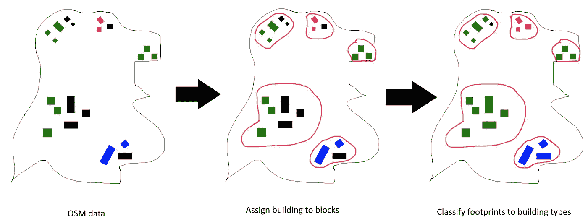

简而言之，建立分类管道。作者图片

[**第一部分——数据收集和准备**](/kedro-hands-on-build-your-own-demographics-atlas-pt-1-16f2cb6676d5#9d25)

[**第二部分—建筑足迹分类**](/kedro-hands-on-build-your-own-demographics-atlas-pt-2-building-footprints-classification-8c48060e5c1a)

本系列试图使用 kedro pipeline 构建一个端到端的数据产品:从收集数据、预处理到报告和可视化结果。虽然这个项目关注的是德国，但是这些方法也可以用来为世界上的其他地方创建一个简单的人口地图集。

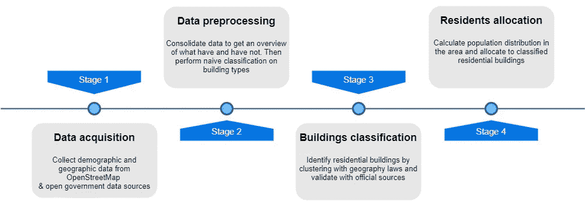

项目流程图——4 条管道。作者图片

本文讨论的是第三条管线***(建筑物 _ 分类)*。首先，我们将介绍在处理来自 OSM 的建筑物足迹数据时的两个挑战: ***完整性*** 和 ***正确性*** 。然后，我们将浏览试图解决**正确性**挑战的模块(将正确的建筑类型分配给占地面积)。该过程可以总结为 4 个步骤:**

1.  **为聚类生成**附加特征**(总面积、矩形、多边形旋转函数、邻近距离矩阵)**
2.  **使用 HDBSCAN 算法基于邻近度将足迹分组到**构建模块中****
3.  **将**托布勒地理定律**应用到**中，为足迹**分配类型**

> ***GitHub 链接到项目(工作进行中)***

**<https://github.com/o0oBluePhoenixo0o/CheapAtlas> ** 

# **目录**

**[1 完整性和正确性](#c134)
[— 3.1 完整性](#9f15)
[— 3.2 正确性&托布勒定律](#466c)
[2 建筑足迹分类流水线](#5ad5)
[— 2.1 生成建筑特征](#1d50)
[— 2.2 用 HDBSCAN 进行建筑块分割](#29e9)
[— 2.3 建筑类型分类— XGBoost](#6383)
[3 综述](#e430)**

# **1 完整性和正确性**

**由于 OSM (OpenStreetMap)是一个 VGI 平台(志愿者地理信息)，社区自愿跟踪和标记建筑物。因此，这导致了两大挑战:**

1.  ****完整性——该位置的建筑足迹数量完全包含在数据中****
2.  ****正确性——准确的建筑类型被正确标记****

> **这个系列，重点是**“正确”。**因此，我们将**而不是**在介绍之后过多地进入**【完整性】****

**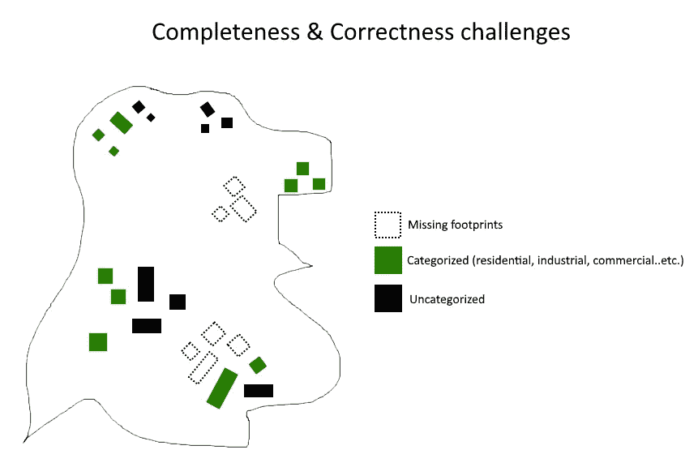**

**两大挑战。作者图片**

## **1.1 完整性**

**2017 年，[麦吉尔研究](https://journals.plos.org/plosone/article?id=10.1371/journal.pone.0180698)比较了 OSM 和官方政府数据的完整性，并得出结论，OSM 的数据在全球范围内完成了 83%(大部分西方国家的街道网络都已完全绘制)。**

**然而，建筑物足迹完整性评估是另一回事。该领域的研究有几种类型:从将 OSM 与官方政府地理数据进行比较[1，2]到用深度学习从卫星/无人机图像中提取足迹[3](如 [SpaceNet 1 & 2](https://spacenet.ai/spacenet-buildings-dataset-v1/) 建筑检测竞赛)。但是如上所述，本文**不会在这个时间点**讨论这个挑战的解决方案。**

> **kedro pipeline(或任何机器学习工作流)的好处是，您可以在以后通过修补节点和管道来重新面对这一挑战**

**在 Medium 上，如果您在搜索框中输入“*建筑足迹*”，会有很多教程和讨论。[亚当·范·艾顿](https://medium.com/u/a5a78eaee501?source=post_page-----8c48060e5c1a--------------------------------)、[托德·斯塔维什](https://medium.com/u/2d2820731ad3?source=post_page-----8c48060e5c1a--------------------------------)在 SpaceNet challenge 上的一些著名文章。同样来自 [Romain Candy](https://medium.com/u/f4746d32109f?source=post_page-----8c48060e5c1a--------------------------------) 和 [Lucas Suryana](https://medium.com/u/10aa14045a3a?source=post_page-----8c48060e5c1a--------------------------------) 关于构建有效的“足迹检测器”。**

**<https://medium.com/the-downlinq/building-extraction-with-yolt2-and-spacenet-data-a926f9ffac4f>  <https://medium.com/the-downlinq/spacenet-winning-implementations-and-new-imagery-release-55f738e14253>  <https://medium.com/picterra/how-to-make-a-building-footprint-detector-768045a15bcc>  <https://medium.com/@lucaselbert/building-footprint-extraction-in-a-dense-area-with-maskrcnn-jakarta-indonesia-3bc529d141b5>  

## 1.2 正确性与托布勒定律

来自 OSM 的建筑足迹由社区自愿标记。在某些地区，标签率可以达到 100%,但在其他地区，许多建筑没有标签。从我们的第二条管道 **(** [***数据 _ 准备***](/kedro-hands-on-build-your-own-demographics-atlas-pt-1-16f2cb6676d5#babd) **)** 的“幼稚分类”来看，仍然有巨大的脚印被设定为“待分类”

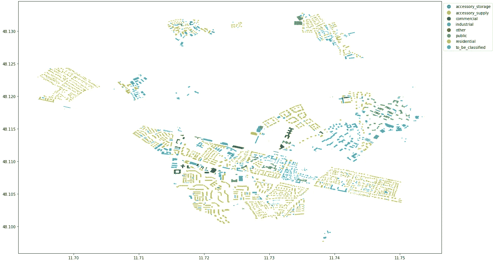

第二条管道的结果:仍然有多个未标记的建筑。作者形象

根据托布勒的地理第一定律[7]，“一切事物都与其他事物相关，但近处的事物比远处的事物更相关。”这是空间相关性和空间自相关基本概念的基础。

> “彼此靠近的建筑通常属于同一类型”

将这一点转化为与我们面临的挑战相关的东西，我们可以说，彼此靠近的建筑往往属于同一类型。因此，可以有把握地假设街区的建筑足迹与有很高的相似性。

# 2 建筑足迹分类管道


简而言之，构建分类管道。作者形象

这条管道的过程可以概括为 4 个步骤:

1.  为聚类生成**附加特征**(总面积、矩形、多边形旋转函数、邻近距离矩阵)
2.  使用 HDBSCAN 算法将足迹分组到**构造块中**
3.  使用三个特征将足迹分类为建筑类型:**形状、大小和建筑块**。比较多个机器学习算法的结果。

与之前的管道相同，上面的每一步都将被转换成节点然后插入带有输入的主管道。由于我们将遍历**德国(~10k 个直辖市)**的每个区域，所以没有必要定义“输出”。每个节点被设计为扫描输入文件夹中的建筑物数据，直接在文件上执行操作，并独立地将输出保存到“输出路径”。

从 [*数据 _ 准备*](/kedro-hands-on-build-your-own-demographics-atlas-pt-1-16f2cb6676d5#babd) 部分了解到，许多城市的住宅建筑足迹为 0(近 2000 个城市的官方数据与 OSM 的数据相差 100%)

为了弥补“分类”足迹数据太少的区域，我决定从市级(约 1 万个组)到区级(400 个组)聚合数据集。

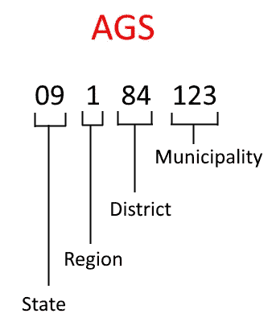

AGS 关键字(市政关键字)的含义。作者图片

函数来聚合并获取地区级的建筑占地面积数据。作者图片

## 2.1 生成建筑足迹功能

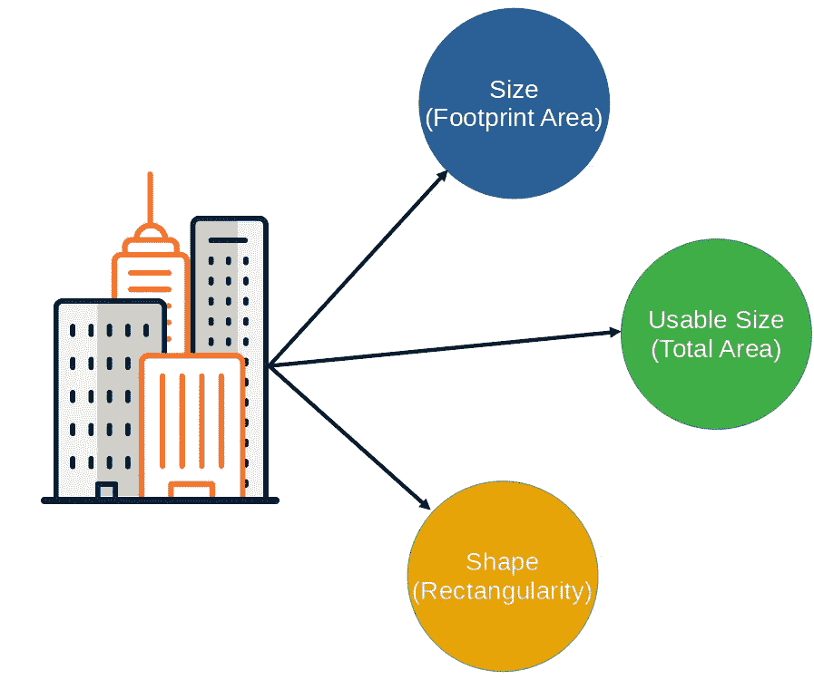

建筑占地面积的特征。作者图片

为了准备建筑分类任务，我们需要从现有构件生成其他要素:

**2.1.1 尺寸**

表面区域基本上是**足迹多边形区域**。在之前的第二个管道*数据准备中，*来自 GeoFabrik&transition API 的整合数据集让我们对我们可以从 OSM 收获的东西有了一个总体的了解。其中一个组成部分是**几何**——它是构建建筑足迹多边形形状的点的集合。利用这一点，我们可以计算出所有可用建筑面积的大小。

**2.1.2 可用尺寸**

我们可以利用的另一个组件是“building_levels”。我们可以通过以下方式计算总可用大小:

> **可用面积=建筑 _ 层数*** **面积(表面积)**

**2.1.3 形状**

在形态分析中，测量建筑物形状的标准方法是使用轮廓线多边形的矩形度。计算矩形的标准方法是获得**大小(足迹面积)**与其**最小边界框(MBB)** 的面积之比

> **矩形=尺寸/ MMB**

## 2.2 用(H)DBSCAN 进行构件分段

在论文[“城市街区中基于邻近度的建筑物分组”](https://www.researchgate.net/publication/271901065_Proximity-based_grouping_of_buildings_in_urban_blocks_A_comparison_of_four_algorithms)中，作者使用了两种不同的方法来评估将建筑物分组到城市街区中的四种算法。其结论是，DBSCAN(基于密度的带噪声应用空间聚类)和 ASCDT(基于 Delaunay 三角剖分的自适应空间聚类算法)表现最好，并且它们的复杂程度不难实现。因此，在这个项目中，我实现了**hdb scan**——DBS can 的扩展版本，用于对我们在 OSM 的建筑足迹进行聚类。

**2.2.1 不使用 K-means 的理由**

想到聚类，k-means 通常会马上弹出 ***第一个答案*** 。就像算法本身一样，k-means 的设计目的是最小化方差。

> K-means 被认为是聚类的标准算法；然而，这并不意味着所有的聚类问题都可以很好地使用它

由于数据是纬度，经度格式==> **非线性**，最坏的情况是 k-means 永远不会收敛(即使有哈弗线距离)。为了避免这个问题，我们应该使用一种能够处理任意距离函数的算法，特别是测地距离函数，如层次聚类、PAM、CLARA、OPTICS 和 DBSCAN。[5]

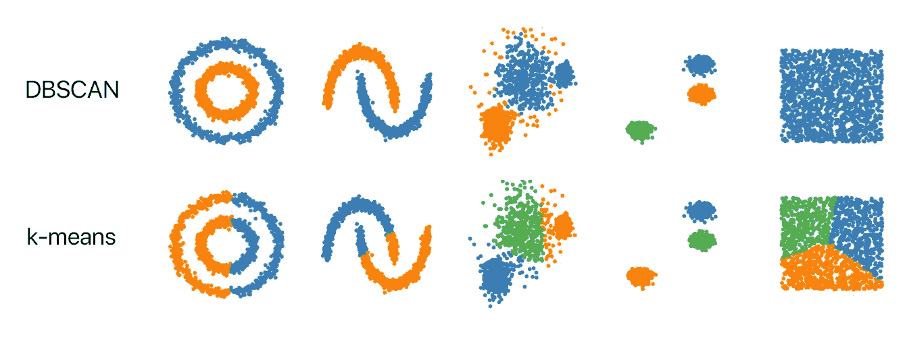

k-means vs DBS can by[NHS ipster](https://github.com/NSHipster/DBSCAN)

2.2.2 HDBSCAN

HDBSCAN 是由 Campello、Moulavi 和 Sander 开发的聚类算法[6]。它扩展了 DBSCAN，将它转换成一个层次聚类算法，然后使用一种技术来提取一个基于平面聚类的稳定聚类。因为形成的簇不是基于半径的，所以它们可以是非圆形的格式。因此，考虑到轮廓线边界不是圆形，它更适合地理分析。这是我们将用于对建筑足迹进行分组的算法。

> 因为形成的簇不是基于半径的，所以它们可以是非圆形的格式。因此，考虑到轮廓线边界不是圆形，它更适合地理分析。

另一本更好理解 HDBSCAN 的好书是佩佩·贝尔巴

</understanding-hdbscan-and-density-based-clustering-121dbee1320e>  

我们应该关注 HDBSCAN 的 3 个主要参数:

```
**min_cluster_size** = minimum number of footprints that can be assigned to a "block"

**cluster_selection_epsilon** = same as the epsilon metric for DBSCAN, Two points are considered neighbors if the distance between the two points is below the threshold epsilon.**min_samples** = The minimum number of neighbors a given point should have in order to be classified as a core point. **It’s important to note that the point itself is included in the minimum number of samples.**
```

除此之外，我们还需要为邻近矩阵设置度量。因为我们处理的是地理空间数据，而不是欧几里德距离，所以最好使用[哈弗辛距离](https://en.wikipedia.org/wiki/Haversine_formula)，它测量给定纬度和经度的球体上两点之间的*距离*:

```
**metric** = ’haversine’, # haversine distance on earth surface
```

我们将遵循文献[4]中的 *ε* = 3(足迹之间的距离为 3 米)和 *MinPts* = 2

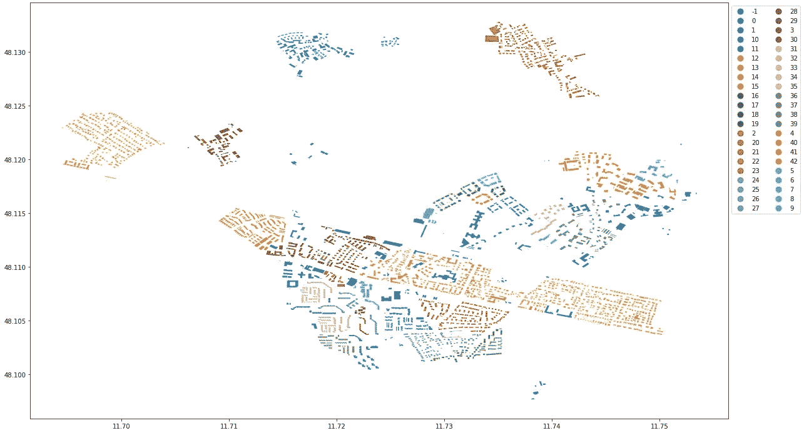

市政建设的基石。作者图片

当在 kedro 中运行节点时，它从市一级收集数据，为每个区执行 HDBSCAN，并将输出保存在 04_feature 文件夹中。

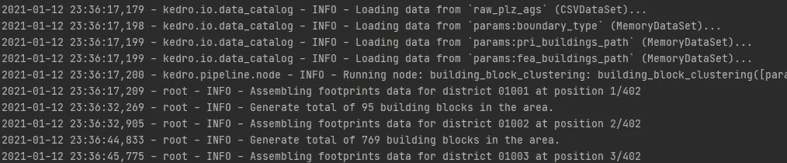

## 2.3 建筑类型分类— XGBoost

现在我们已经创建了足够的建筑足迹特征，让我们为建筑类型构建一个分类器。与之前相同，此节点将遍历 building data 文件夹，基于区级数据训练机器学习模型，并最终将模型应用于未分类的足迹。我们将使用的 3 个特征是**形状(矩形)、大小(表面积)和构建模块(来自 HDBSCAN)** 。

为了选择哪种算法来建立机器学习模型，我拿出了 10 个超过 50k 足迹/区的区，并在其上训练不同的模型。

> 因为我们只关心“住宅”类型。问题从多类分类(多种类型的足迹)转换为非住宅与**住宅**

比较指出使用 **XGBoost** 会产生最好的结果:

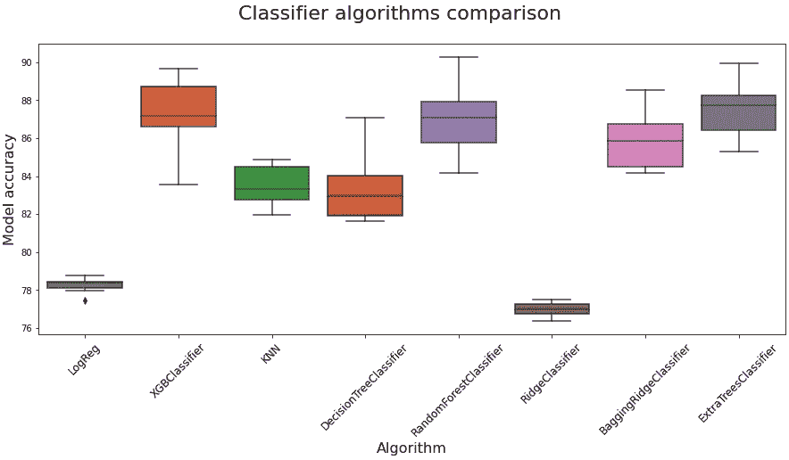

足迹超过 50，000 的 10 个区的分类模型比较。作者图片

运行模拟和创建图表的代码如下。然而，这部分是在**笔记本**中完成的，并没有放到 kedro pipeline 的最终生产中。

对于参数，您可以尝试优化每个地区的参数，但由于我们正在对 400 多个地区进行培训和应用模型，因此我决定使用基本参数。

Vishal Morde 在 XGBoost 上的一篇精彩帖子

</https-medium-com-vishalmorde-xgboost-algorithm-long-she-may-rein-edd9f99be63d>  

还测试了具有和不具有“构建块”功能的 XGBoost 分类器，以显示不准确性的差异。

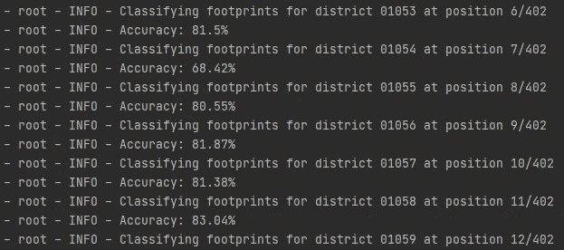

不带“building_block”特性的 XGBoost

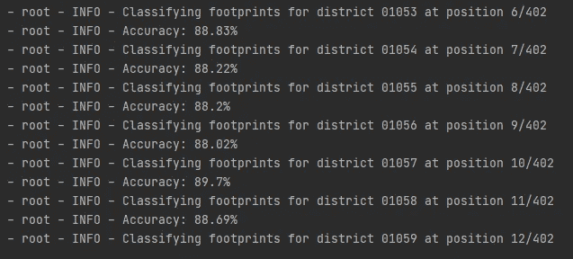

以“building_block”为特性的 XGBoost

该步骤使我们能够以高置信度将更多的“待分类”足迹分类到住宅中。从这两张图可以看出对比。执行 XGBoost 后,“蓝色”图例(待分类)的面积急剧下降。


在 XGBoost 分类器之前。作者图片

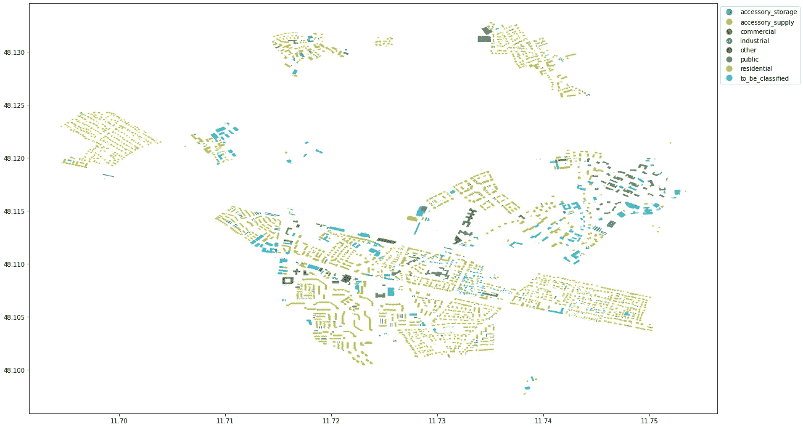

在 XGBoost 分类器之后。作者图片

# 3 总结

在本文中，我已经引导您完成了第三条管道 ***建筑分类*** ，它将建筑分组为街区，并将足迹分类为住宅类型。现在，一旦我们完成了从第一条到第三条管道的运行，数据集就可以与人口统计数据集成了。在下一篇文章中，最终的 pipeline***residents _ allocation***将把人们“分配”到住宅建筑中，并将结果可视化，这样我们就可以得到完整的人口统计图集。

感谢阅读！如果你能留下回复，我会很高兴，我们可以进一步讨论这个话题。

# 参考

[1] Helbich，m .和 Christof Amelunxen (2012 年)。*OpenStreetMap 和专有地理数据的位置精度的比较空间分析*。[在线]研究之门。可从以下网址获取:[https://www . research gate . net/publication/267857078 _ Comparative _ Spatial _ Analysis _ of _ Positional _ Accuracy _ of _ OpenStreetMap _ and _ Proprietary _ Geodata](https://www.researchgate.net/publication/267857078_Comparative_Spatial_Analysis_of_Positional_Accuracy_of_OpenStreetMap_and_Proprietary_Geodata)【2020 年 12 月 29 日获取】。

‌[2] Brovelli，文学硕士，Minghini，文学硕士，Molinari，文学硕士和 Zamboni，G. (2016)。通过自动同源对检测评估 OPENSTREETMAP 建筑物图层的位置精度:方法和实例研究。*国际摄影测量、遥感和空间信息科学档案馆*，【在线】XLI-B2，第 615–620 页。可在:[https://re.public.polimi.it/handle/11311/1009698](https://re.public.polimi.it/handle/11311/1009698)【2020 年 12 月 29 日获取】。

[3]刘，刘平，刘，刘，石，杨，徐，张，杨(2019)。通过空间剩余初始卷积神经网络从高分辨率图像提取建筑物足迹。*遥感*，【在线】11(7)，第 830 页。可在:[https://www.mdpi.com/2072-4292/11/7/830](https://www.mdpi.com/2072-4292/11/7/830)【2020 年 12 月 29 日获取】。

[4]‌sinan·切廷卡亚、梅利赫·巴萨拉纳和伯格哈特(2015 年)。*基于邻近度的城市街区建筑物分组:四种算法的比较*。[在线]研究之门。可在:[https://www . researchgate . net/publication/271901065 _ Proximity-based _ grouping _ of _ buildings _ in _ urban _ blocks _ A _ comparison _ of _ four _ algorithms](https://www.researchgate.net/publication/271901065_Proximity-based_grouping_of_buildings_in_urban_blocks_A_comparison_of_four_algorithms)【2021 年 1 月 2 日访问】。

[5]埃斯特，M. (2019)。*一种基于密度的算法，用于在带有噪声的大型空间数据库中发现聚类*。[在线]Psu.edu。在:[https://citeseerx.ist.psu.edu/viewdoc/summary?发售 doi = 10 . 1 . 1 . 121 . 9220](https://citeseerx.ist.psu.edu/viewdoc/summary?doi=10.1.1.121.9220)【2021 年 1 月 2 日获取】。

[6]麦金尼斯、希利和阿斯特尔斯(2017 年)。hdbscan:基于层次密度的聚类。[在线]研究之门。可从以下网址获得:[https://www . research gate . net/publication/315508524 _ hdb scan _ hierarchy _ density _ based _ clustering](https://www.researchgate.net/publication/315508524_hdbscan_Hierarchical_density_based_clustering)【2021 年 1 月 6 日获取】。

[7]t . w . ‌r(1970)。模拟底特律地区城市发展的电脑电影。*经济地理*，【在线】46 期，第 234–240 页。可用时间:[https://www.jstor.org/stable/143141?origin=crossref&seq = 1](https://www.jstor.org/stable/143141?origin=crossref&seq=1)【2021 年 1 月 14 日获取】。

[8]范，齐普夫，a .和傅青(2014)。*基于城市形态分析的 OpenStreetMap 上建筑类型的估计*。[在线]研究之门。可从以下网址获取:[https://www . research gate . net/publication/278196777 _ Estimation _ of _ Building _ Types _ on _ OpenStreetMap _ Based _ on _ Urban _ Morphology _ Analysis](https://www.researchgate.net/publication/278196777_Estimation_of_Building_Types_on_OpenStreetMap_Based_on_Urban_Morphology_Analysis)【2021 年 1 月 14 日获取】。

‌**