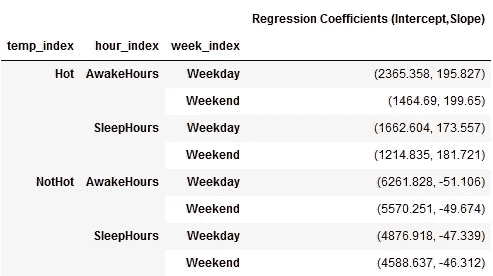
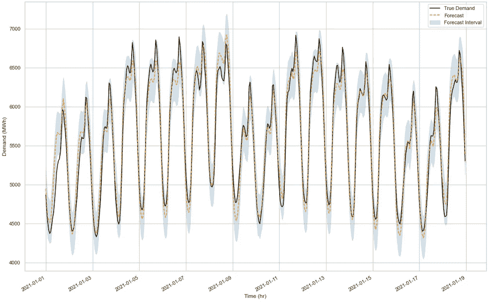

# 保持简单，保持线性:时间序列的线性回归模型

> 原文：<https://towardsdatascience.com/keep-it-simple-keep-it-linear-a-linear-regression-model-for-time-series-5dbc83d89fc3?source=collection_archive---------11----------------------->

## [入门](https://towardsdatascience.com/tagged/getting-started)

## 预测多伦多电力需求数据的简单线性回归模型

# 介绍

电力需求预测对于运营电力市场和/或受电力市场影响的任何组织都至关重要。电力储存技术没有跟上当前的生产水平，任何剩余的电力都被浪费掉，甚至亏本出售。因此，这些组织必须做出准确的预测。为了实现这一点，从传统的(S)ARIMA(X)到更先进的递归神经网络，有大量的时间序列预测技术可用。(S)ARIMA(X)模型不能处理多重季节性，而 LSTMs 和神经网络具有很高的准确性，但更难解释。

在本文中，我将使用简单的线性回归模型来预测多伦多的电力需求。线性模型非常容易解释，包括构建置信区间在内的一些统计分析可以轻松完成。

影响电力消耗的因素有几个，我在以前的文章中已经提供了详细的分析。也就是说，这里提供了理解当前文章所需的所有信息。

<https://medium.com/analytics-vidhya/from-lockdown-to-daylight-savings-hidden-insights-from-electricity-demand-data-in-toronto-eff585aada66>  

## **数据来源**

> 独立电力系统运营商(IESO)是一个非营利组织，负责运营安大略省的电力市场。从 2003 年到现在的每小时数据，可以在他们的[网站](http://reports.ieso.ca/public/DemandZonal/)上找到。为了便于分析，我使用了一个简单的网络抓取代码来提取最近几年(2017 年至今)的每小时数据。我们还将使用从[天气统计](https://toronto.weatherstats.ca/download.html)中提取的每小时温度数据。

# 探索性数据分析

从上述来源收集和组织数据并提取附加特征，我们获得了以下数据框，其中包含 2017 年 1 月 1 日至 2021 年 1 月 18 日的 35496 个小时点。


图 1:具有 11 个特征的最终数据帧

*   ***时间戳:*** 当天的日期和时间
*   ***温度* ( C) *:*** 多伦多气象站记录的温度
*   ***需求*(MWh)*:***IESO 记录的每小时电力需求
*   ***年份:*** 记载分的年份
*   ***月:*** 记载分的月份
*   ***dayofweek:*** 用数字表示的一周中的某一天(0-星期日，1-星期一…)
*   ***日:*** 一年中的某一天
*   ***小时:*** 一天中的小时
*   ***temp_index:*** 【热】如果温度>15°C，否则“不热”
*   ***hour_index:*** 早上 7 点到晚上 10 点之间的“觉醒时间”，否则为“睡眠时间”
*   ***week_index:*** 对工作日和周末进行分类
*   ***dst _ index:***【DST】如果使用夏令时，则为“DST”，否则为“NoDST”

与平日相比，周末和公共假日期间的电力需求相对较低。因此，为了这个分析的目的，我将把假日视为周末。

## **处理缺失值**

需求数据中没有缺失点(IESO 维护得非常好)，而温度列中有大约 0.02%的数据缺失。因为我们处理的是每小时的数据，而温度的变化在几个小时内并不显著，所以我们可以用前一个小时的值来填充缺失的数据。用专业术语来说，这叫做向前填充。

## **可视化数据**

预期温度和需求之间的关系是合理的。空调系统使用的增加往往会增加夏季的需求，而供暖系统的使用会增加冬季的需求。在多伦多，大部分供暖需求是通过使用天然气锅炉来满足的，因此冬季的电力需求峰值比夏季小。这种温度和需求行为(2017 年至今)如下图所示。


图 2:温度和需求的散点图

我们已经可以想象通过从上图中分离大约 15°C 的温度来拟合两个线性模型。但是，在此之前，让我们看看影响需求的其他一些因素。


图 3:基于各种因素的温度与需求

我们可以观察到，温度高于 15°C 时，需求与温度呈正相关，低于 15°C 时，需求与温度呈轻度负相关。我们还可以根据一天中的具体时间水平拆分需求，如图 3 右上角的图所示。这是有道理的，因为我们预计上午 7 点到晚上 10 点的需求会更高。无论是工作日还是周末，睡眠时间(晚上 11 点至早上 6 点)的需求都会很小。


图 4:八个类别的温度与需求

因此，我们可以将温度与需求曲线分为八类，如上所示，基于三种划分:(工作日/周末、醒着时间/睡觉时间、热/不热)。在每个类别中几乎可以观察到线性趋势，相关系数的值如下所示。


图 5:第八类的相关系数

因此，我们将电力需求预测问题简化为八个线性回归问题，同时将温度、一天中的时间、一周中的日期和季节考虑在内。

> 在从事这个项目时，我了解到文献中的这种方法被称为线性模型树[ [source](https://medium.com/convoy-tech/the-best-of-both-worlds-linear-model-trees-7c9ce139767d) ]，是决策树和线性回归的结合。在某种意义上，它类似于决策树回归，我们将数据分成几组，但不是选择平均值作为每个类别的预测值，而是运行线性回归。

# 预测模型

我们将数据分为训练集(2017–2020)和测试集(2021)。我们用三年的数据来预测 2021 年前 18 天的电力需求。我们从基线模型开始，其中预测值只是上一年(2020 年)的值。

> 在接下来的所有预测图中，我将使用黑色实线表示真实需求，橙色虚线表示预测，蓝色阴影区域表示 95%的预测区间。

## 模型 1:基线模型


图 6:2021 年基线模型预测

基线模型的预测非常差，均方根误差(RMSE)为 520 MWh。从图 6 中我们可以看到，1 月 1 日的性能相当好，但是随着时间的推移，性能越来越差。这是因为元旦是一个公共假日，预测也是相似的。除此之外，在 2020 年和 2021 年初，工作日和周末不在同一天。我们知道周末期间的需求明显低于平日。因此，稍微好一点的模型(基线模型 II)可以通过改变日期以匹配周末来实现。

## 模式 2:基线模式二


图 7:2021 年基线模型 II 预测

在这个模型中，我们可以看到预测明显优于基线模型，RMSE 为 348 兆瓦时。该模型考虑了工作日和周末需求的差异。虽然这个模型比基线模型好，但我们可以用简单的线性回归模型获得更高的性能。

## 模型 3:线性回归(8)

如上所述，我们将建立八个线性模型，每个类别一个。具体来说，使用岭回归，每个模型的系数如下所示。



图 8:线性回归(8)系数

Hot (temp_index)的斜率始终为正，而 NotHot 的斜率始终为负。这是由于正相关和负相关的性质。截距在工作日明显更高，而斜率在周末更高。这表明工作日的耗电量更高，但周末对温度的依赖性更高。一个潜在的解释可能是周末期间家用空调的使用率较高。


图 9:2021 年的线性回归(8)模型预测

该型号的 RMSE 约为 344 MWh，仅略好于基准型号 II。与基线模型 II 相比，该模型更好地捕捉到了总体趋势，但未能捕捉到每日峰值。这是有意义的，因为对于一天中的一个小时，我们只给了模型两个类别；(早上七时至晚上十时)及(晚上十一时至早上六时)。从模型的角度来看，高峰可能在早上 7 点到晚上 10 点之间。从供应商的角度来看，捕捉高峰时段尤为重要。因此，为了改进模型，我们可以将一天中的一个小时分成两个以上的类别。

在下一个模型中，我们使用五个这样的类别，即清晨(12 am 到 6 am)、早晨(6 am 到 10 am)、中午(10 am 到 3 pm)、晚上(3pm 到 8 pm)和夜晚(8 pm 到 12 am)。

## 模型 4:线性回归(20)


图 10:一天中五类时间的温度与需求

温度与需求散点图如上所示。同样，我们可以根据热/不热、工作日/周末以及一天中的五个类别来划分这些数据。因此，我们现在有 2*5*2 = 20 个部分，在每个类别中，我们将拟合一个线性模型(山脊)。

Pandas *groupby* 是我最喜欢的 Python 操作之一。使用 *groupby* 操作运行岭回归并获得 20 组系数是极其容易的。为此，我们首先定义一个函数，该函数接收训练数据，重排行并返回回归系数。然后我们使用 groupby 操作，后面跟着*应用*函数，如下图所示。

```
**def** Ridge_model(data):
    """
    Based on the provided data, this function returns the 
    coefficients of the ridge regression.

    input: the training data
    output: ridge regression coefficients
    """
    data = data.sample(frac=1,random_state=42)
    x = data['temperature'].values.reshape(-1,1)
    y = data['demand'].values.reshape(-1,1)
    model = Ridge().fit(x, y)
    **return** (round(model.intercept_,3),round(model.coef_,3))data_17_20.groupby(['temp_index','hour_index_1','week_index']).apply(Ridge_model)display(pd.DataFrame(ridge_coef_2,columns=['Regression Coefficients (Intercept,Slope)']))
```


图 11:线性回归(20)系数


图 12:2021 年的线性回归(20)模型预测

就 RMSE (222 兆瓦时)而言，其性能优于之前的任何型号。它现在能够捕捉每日峰值以及整体趋势。

有没有更好的模式？当然有。如果我们使用 24 个类别，一个小时一个类别，而不是五个类别呢？使用 24 个类别，我们最终得到 2*24*2 = 96 个模型。

## 模型 5:线性回归(96)

我们现在用 96 个线性模型来模拟电力需求。按照与前面模型类似的方法，我们可以获得 96 组岭回归系数。为了简洁起见，下面只给出了系数的一个例子。如需完整的表格，请随意使用我在 GitHub repo 中提供的代码。


图 13:线性回归(96)系数


图 14:2021 年的线性回归(96)模型预测

这种型号的 RMSE 大约为 140 兆瓦时。在上图中，我们可以观察预测，以完美地捕捉每小时的模式和每天的趋势。

## 模型 6:二次多项式回归(96)

在某些类别中，我们看到了与线性行为的轻微偏差。在这些情况下，高阶多项式会更适合。在本节中，我将使用二阶多项式来拟合温度和需求数据。


图 15:计数在 96 个类别中的分布

我们在 96 个类别中的每个类别中至少有 100 个数据点，平均值约为 365，我们正在拟合每个类别中的简单二次多项式回归。这应该消除任何过度拟合的担忧。



图 16:2021 年多项式回归 2 (96)模型预测

该型号的 RMSE 为 136 MWh，仅比线性(96)型号略高。

## **车型对比**


图 17:本文中所有模型的比较

预测 RMSE 从 519 减少到 136 兆瓦时。在百分比误差方面，我们将其从 9.25%降低到 2.42%。我还提供了计算时间，以表明在这个时代训练 96 个线性模型只需要几分之一秒。

多项式次数 2 (96)是一个人能达到的最佳性能吗？绝对不行。这仅仅是一个线性模型(在 1，x，x 中是线性的),误差约为 2.4%。使用更复杂的技术，如 SARIMAX(带外源输入的季节性自回归综合移动平均)、脸书预言家、XGBoost、RNN(递归神经网络)和 LSTM(长短期记忆)来预测需求，可以提高性能。

## 重新访问预测间隔

作为从业者，预测的实际值并不包含太多的信息。他们理解任何时间序列预测中包含的不确定性，因此对他们来说，查看预测区间比实际预测更有意义。95%的预测区间告诉我们，大约 95%的时间预测值都落在这个范围内。此处显示的代码片段用于计算预测的预测间隔。

```
**def** pred_interval(prediction,test_data,test_predictions,alpha=0.95):
    """
    Obtain the prediction interval for each of the prediction
    Input: single prediction, entire test data, test set predictions
    Output: Prediction intervals and the actual prediction
    """
    y_test = test_data['demand']
    test_predictions = np.array(test_predictions) *# Calculate the sum of squares of the residuals*
    err = np.sum(np.square((y_test - test_predictions)))*#* *Estimate the standard error* 
    std = np.sqrt((1 / (y_test.shape[0] - 2)) * err)

    *# Compute the z-score*
    z = stats.norm.ppf(1 - (1-alpha)/2) *# Calculate the interval*
    interval = z*std
    **return** [prediction-interval,prediction,prediction+interval
```


图 18:最佳模型的 2021 年预测区间

基于这些预测区间，从业者可以确定电力生产的速率。对他们来说，这个情节激发了快乐，而不是实际的预测。

## 结论

在本文中，我们使用线性模型来预测多伦多的电力需求。有几种模型可以提供更好的性能，但使用线性模型的优势在于:

*   我们根据领域知识(如温度、一天中的时间、工作日/周末等)来划分类别。因此，在每个类别中解释这些回归模型是非常容易的。
*   线性模型训练起来更快。如前所述，训练 96 个线性模型的 CPU 时间仅为 0.2 秒左右。由于训练时间如此之短，因此可以实时建模、部署和重新训练。
*   线性模型不需要像神经网络或 SARIMAX 那样多的数据来训练。后一种模型也消耗大量时间来调整超参数。
*   这里介绍的线性模型考虑了每年和每天的季节性。年度季节性是通过温度和热/不热类别获得的，而每日季节性取决于在一天中的小时选择的类别数量(2、5 或 24)。

令人印象深刻的是，简单的线性回归可以提供可解释的良好结果。希望你们从这篇文章中学到了很多。所有的分析都是用 Python 完成的，相关的代码可以在我的 [GitHub repo](https://github.com/srpraveen97/Electrical_Demand_Toronto) 中找到。请在这里分享你的想法，或者在 [LinkedIn](https://www.linkedin.com/in/srpraveen97) 上与我联系。

感谢阅读！

# 参考

1.  【https://ieso.ca/en/Power-Data/Data-Directory 
2.  基于加拿大环境和气候变化数据
3.  [https://www.timeanddate.com](https://www.timeanddate.com/)
4.  时间序列分析 [Nptel](https://nptel.ac.in/courses/103/106/103106123/)
5.  时间序列分析和建模 [AIEngineering](https://www.youtube.co/watch?v=-r7wB9DJtiU&list=PL3N9eeOlCrP5cK0QRQxeJd6GrQvhAtpBK)