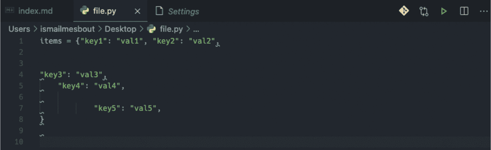
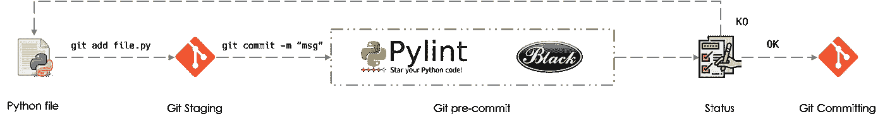
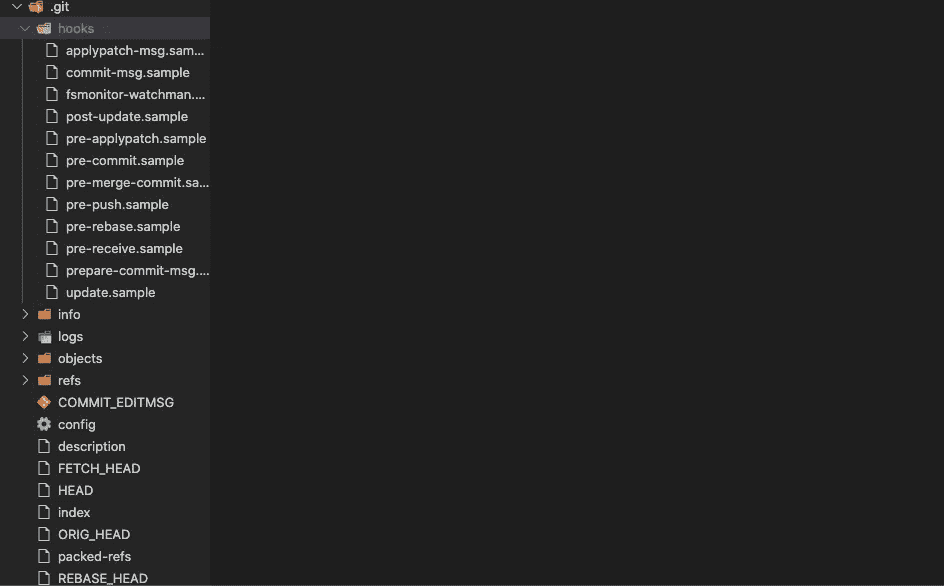
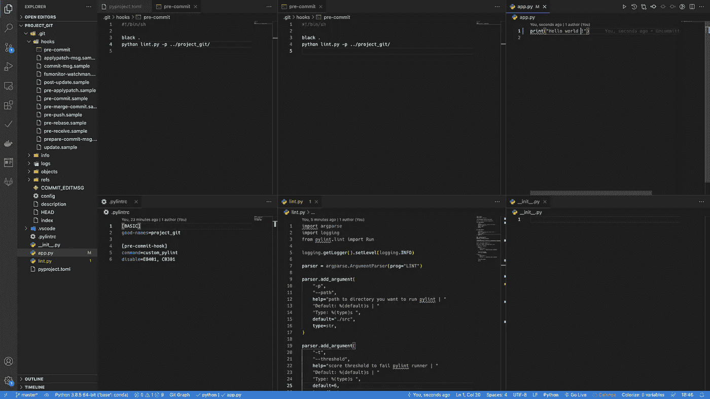
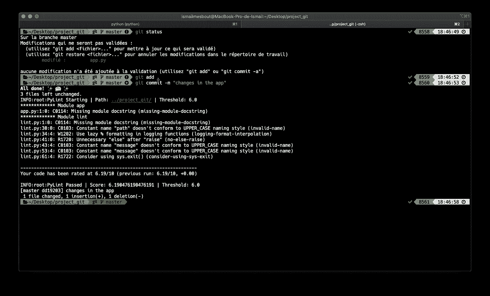

# 使用 Black & Pylint & Git Hooks 和预提交保持代码干净

> 原文：<https://towardsdatascience.com/keep-your-code-clean-using-black-pylint-git-hooks-pre-commit-baf6991f7376?source=collection_archive---------3----------------------->


图片来自 Pexels 公司的 Pixabay

## 合作开发不可或缺的工具

编码可能是一项非常困难的任务，尤其是在与不同的开发人员一起工作的项目中。团队中的每个成员都有自己的编码方式，这会导致非常异构的脚本。
这就是为什么拥有一个类似的**代码格式化程序**和**代码摘要**以便让 git 提交更干净是很重要的。这可以在分段和提交阶段之间或在 CI/CD 链期间执行。

在本文中，我们将看到如何使用 git 挂钩作为预提交步骤来实现这一点。

# 目录

总结如下:

1.  黑色
2.  Pylint
3.  作为 Git Hooks 的预提交

# 黑色

[Black](https://pypi.org/project/black/) 是故意限制样式配置的 python 代码格式化程序。它让你的代码更清晰，这样你就可以更专注于内容。由于 diffs 尽可能小，所以代码审查也更有效。

可以使用以下命令行安装:

```
pip install black
```

您可以通过键入以下内容在任何 python 文件上运行 black:

```
Black pathtofile.py
```



作者形象

可以使用文件 **pyproject.toml** 略微配置黑色，该文件应放在项目的根中。以下是此文件的示例:

```
[tool.black]
line-length = 88
target-version = [‘py36’, ‘py37’, ‘py38’]
include = ‘\.pyi?$’
exclude = '''
/(
  \.toml
  |\.sh
  |\.git
  |\.ini
  |Dockerfile
  |Jenkinfile
)/
'''
```

例如，我们可以选择代码行的长度，还可以设置哪些文件不应该格式化的扩展。

# Pylint

[pyrint](https://pypi.org/project/pylint/)是一个“Python 静态代码分析工具”，用于评估已开发脚本的质量。它会引导团队采用相同的标准。

可以使用以下命令行安装 Pylint:

```
pip install pylint
```

要评估给定脚本的编码质量，可以运行:

```
pylint pathtofile.py
```

**NB** :为了在整个项目中运行 pylint，您的存储库应该包括一个 *__init__。py* 文件。

与 Black 一样，Pylint 也可以使用文件**进行配置。pyrintc**也放置在项目的根上

```
[MASTER]
jobs=4 #number of processes to use[BASIC]
good-names=nameOfYourProject #names to be considered ok[pre-commit-hook]
command=custom_pylint
disable=E0401, C0301
```

有关配置的更多详细信息，请参见[页面](https://github.com/kubeflow/examples/blob/master/.pylintrc)。

# 作为 Git Hooks 的预提交

Git 挂钩是在运行 git 操作时启动的已定义脚本。
挂钩有两种类型:

*   **客户端挂钩**:提交合并后运行
*   **服务器端挂钩:**在网络操作上运行，例如在推送提交之后

在本文中，我们将重点关注客户端工作流，这些工作流可以用下图来描述:



作者形象

在 git 存储库中，钩子放在**中。git/hooks/** 。例如，通过将以下代码行添加到 Json 设置中，可以在 VSCode 中可视化它们:

```
"files.exclude": {
     "**/.git": false
}
```



作者图片

## 预提交的设置

要将提交前操作添加到存储库中，请执行以下操作:

*1。在文件夹中创建文件***。git/hooks/* 。名称中不应包含任何扩展名。*

**2。在文件*中添加 bash 命令。在我们的案例中:*

```
*#!/bin/shblack .
python lint.py -p ../projectName/*
```

*第一行应用黑色格式化程序，第二行对项目的每个 python 文件应用林挺。你可以从这个[链接](https://doedotdev.medium.com/pylint-static-code-analysis-python-script-with-adjustable-threshold-b0d6d2c8647b`)下载 lint.py 文件:*

```
*import argparse
import logging
from pylint.lint import Run

logging.getLogger().setLevel(logging.INFO)

parser = argparse.ArgumentParser(prog="LINT")

parser.add_argument('-p',
                    '--path',
                    help='path to directory you want to run pylint | '
                         'Default: %(default)s | '
                         'Type: %(type)s ',
                    default='./src',
                    type=str)

parser.add_argument('-t',
                    '--threshold',
                    help='score threshold to fail pylint runner | '
                         'Default: %(default)s | '
                         'Type: %(type)s ',
                    default=**7**,
                    type=float)

args = parser.parse_args()
path = str(args.path)
threshold = float(args.threshold)

logging.info('PyLint Starting | '
             'Path: {} | '
             'Threshold: {} '.format(path, threshold))

results = Run([path], do_exit=False)

final_score = results.linter.stats['global_note']

if final_score < threshold:

    message = ('PyLint Failed | '
               'Score: {} | '
               'Threshold: {} '.format(final_score, threshold))

    logging.error(message)
    raise Exception(message)

else:
    message = ('PyLint Passed | '
               'Score: {} | '
               'Threshold: {} '.format(final_score, threshold))

    logging.info(message)

    exit(0)*
```

***注意**:阈值默认设置为 7。如果 pylint 分数低于这个数字，提交将会失败，您必须在再次提交之前清理您的脚本。*

**3。通过运行以下 bash 命令使其可执行*:*

```
*chmod +x .git/hooks/pre-commit*
```

*这样做之后，每次提交项目之前，都会格式化皮林特的布莱克和林挺。
我们考虑以下应用程序进行说明:*

**

*作者图片*

*当提交新的变更时，我们会得到以下结果:*

**

*作者图片*

## *共享棉绒和格式化程序*

*既然您已经将 black 设置为格式化程序，将 pylint 设置为 linter，那么您肯定希望您的团队拥有相同的配置。
要做到这一点，您可以使用下面的 bash 文件，该文件将被放在您的项目的根目录下，并在克隆存储库之后由您团队的每个成员运行:*

```
*#!/bin/bashecho $"#/bin/sh\nblack .\npython lint.py -p ../projectName/'> .git/hooks/pre-commit
chmod +x .git/hooks/pre-commit*
```

# *结论*

*预提交是非常强大的工具，可以保持代码格式良好，并在团队成员中标准化开发方法。同样，除了林挺和格式化之外，它们还可以包括其他检查。
在本文中，我们使用了一种调用已安装的 Python 库的经典方法，您也可以使用 python **模块** [**预提交**](https://pre-commit.com/) ，其中包括对其 GitHub 库的许多检查和调用。这是非常有效的，但可能很难设置，特别是当面对**代理**过滤器时。*