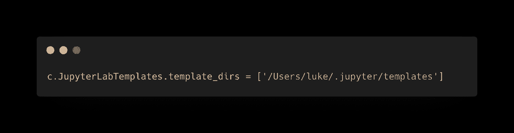
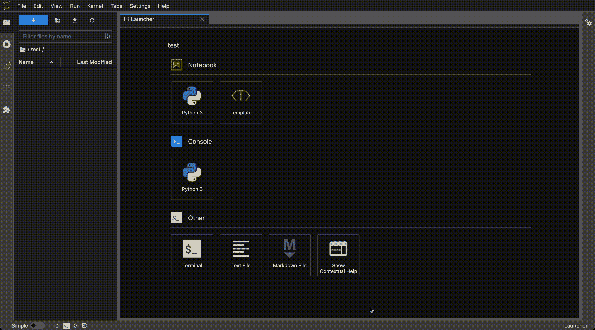

# 让您的笔记本与 JupyterLab 模板保持一致

> 原文：<https://towardsdatascience.com/keep-your-notebooks-consistent-with-jupyterlab-templates-69f72ee25de5?source=collection_archive---------16----------------------->

## 比复制粘贴更好的解决方案


照片由 [Natasya Chen](https://unsplash.com/@natasyachen?utm_source=medium&utm_medium=referral) 在 [Unsplash](https://unsplash.com?utm_source=medium&utm_medium=referral) 上拍摄

我每天大部分时间都在 JupyterLab 工作，我创建的每个笔记本都有相似的结构。与复制和粘贴笔记本不同，`[JupyterLab Templates](https://github.com/jpmorganchase/jupyterlab_templates)`扩展是一个允许你创建可重复使用的笔记本的解决方案。

这篇短文将概述如何安装和设置这个扩展。

# 装置

通过`pip`安装`jupyterlab_templates`包:

```
pip install jupyterlab_templates
```

然后安装

```
jupyter labextension install jupyterlab_templates
```

并启用扩展

```
jupyter serverextension enable --py jupyterlab_templates
```

现在我们只需要设置模板目录

# 设置模板目录

创建一个目录来存储您的笔记本。例如，我的模板存储在这里:

```
~/.jupyter/templates
```

创建以下文件(如果尚不存在)

```
~/.jupyter/jupyter_notebook_config.py
```

将下面一行添加到该文件中。这将告诉 jupyterLab 模板目录的完整路径。这必须是完整路径，不要使用`~`简写



作者图片

*   **template_dirs** →存储模板的目录列表。这些路径的任何*子目录*中的每个`.ipynb`文件都将是一个模板。父目录中的文件将被忽略

> *** *重要**** 模板需要在 template_dirs 目录的子目录下。父目录中的文件将被忽略

每个子目录中可以有多个笔记本。作为一个例子，这里是我的目录树。

```
├──.jupyter
   └── templates
       └── analysis
           ├── analysis-template.ipynb
           └── test-template.ipynb
```

# 创建模板笔记本

现在一切都设置好了，您可以开始制作可重复使用的笔记本了。这是我的`analysis-template.ipynb`笔记本

# 模板在运行

现在，当您启动 jupyterLab 时，您可以像这样访问您的模板:



作者 GIF

## 笔记本样本

你可能已经注意到这个包带有一个`Sample.ipynb`。出于好奇，以下命令将显示该文件在 macOS 上的位置:

```
locate Sample.ipynb
```

在我的机器上，它位于以下位置:

```
/Users/luke/miniforge3/lib/python3.9/site-packages/jupyterlab_templates/templates/jupyterlab_templates/Sample.ipynb
```

# 结论

我过去曾尝试过其他笔记本模板解决方案，但它们都很难设置，而且令人困惑。这是我找到的最简单的解决方法。

在我看来，唯一缺少的特性是提示用户立即重命名新创建的笔记本。

我希望这篇文章有助于保持你的个人笔记本，或者你的团队的笔记本的一致性。

# 相关职位

[](/how-to-connect-to-jupyterlab-remotely-9180b57c45bb) [## 如何远程连接到 JupyterLab

towardsdatascience.com](/how-to-connect-to-jupyterlab-remotely-9180b57c45bb) [](https://betterprogramming.pub/how-to-use-miniconda-with-python-and-jupyterlab-5ce07845e818) [## 如何将 Miniconda 与 Python 和 JupyterLab 结合使用

### 从头开始设置极简 Python 环境

better 编程. pub](https://betterprogramming.pub/how-to-use-miniconda-with-python-and-jupyterlab-5ce07845e818) [](https://betterprogramming.pub/how-to-scale-your-analysis-to-handle-very-large-datasets-in-python-5ab4a84a52dc) [## 如何在 Python 中缩放您的分析以处理非常大的数据集

### 熊猫、NumPy、Xarray 和 lists 的例子

better 编程. pub](https://betterprogramming.pub/how-to-scale-your-analysis-to-handle-very-large-datasets-in-python-5ab4a84a52dc) 

*感谢阅读和支持媒体作者*

[](https://lukegloege.medium.com/membership) [## 通过我的推荐链接加入 Medium—Luke Gloege 博士

### 作为一个媒体会员，你的会员费的一部分会给你阅读的作家，你可以完全接触到每一个故事…

lukegloege.medium.com](https://lukegloege.medium.com/membership)