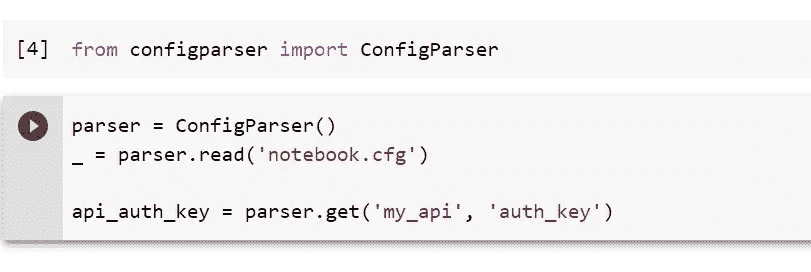
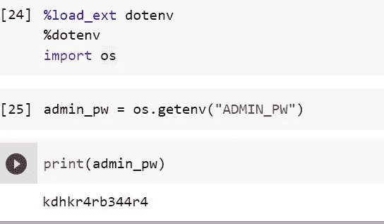
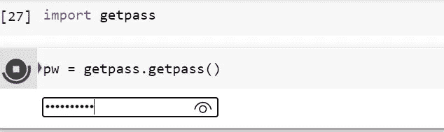
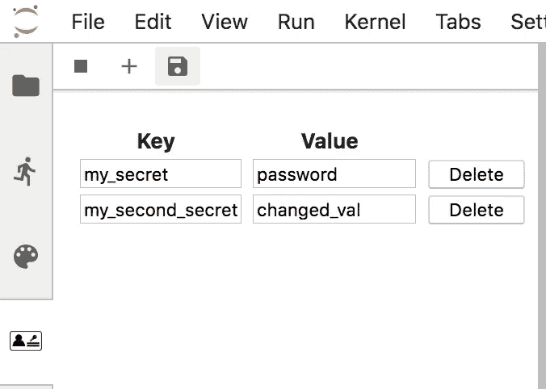
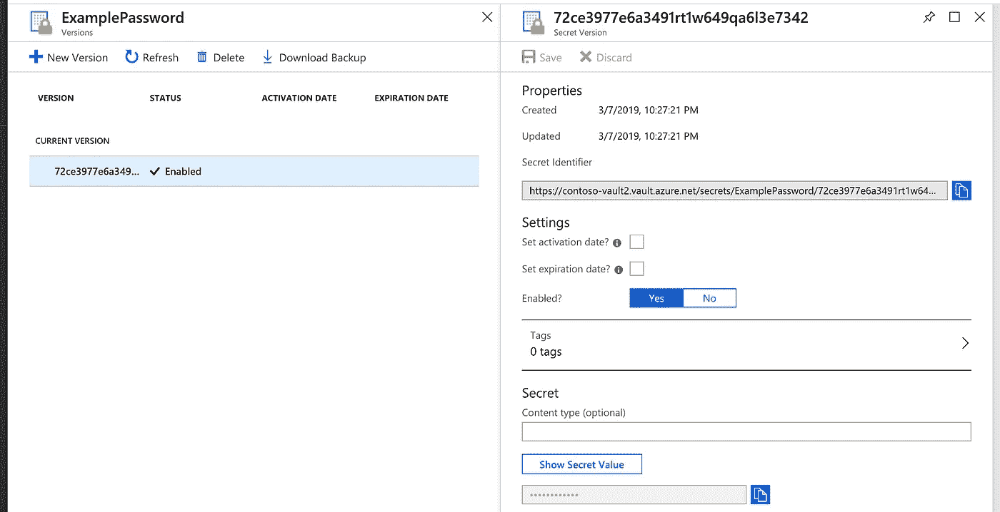

# 在 Jupyter 笔记本中安全保存凭证

> 原文：<https://towardsdatascience.com/keeping-credentials-safe-in-jupyter-notebooks-fbd215a8e311?source=collection_archive---------5----------------------->

Jupyter 笔记本广泛应用于数据科学中，用于模型的快速原型制作和交互式演示。但是在使用的时候应该如何安全的存储密码、证书和密钥呢？

我将快速浏览一下可用的解决方案，以帮助您保护凭据的安全。


马库斯·温克勒在 [Unsplash](https://unsplash.com?utm_source=medium&utm_medium=referral) 上的照片

# **为什么不应该“直接输入”凭证呢？**

我在我的个人项目中经常使用 Jupyter 笔记本，最近我遇到了一个相当常见的情况，如果一个人没有在床上有安全意识的一侧醒来，可能会以非常糟糕的结局结束。我需要连接到 Bing API 来抓取图片，这是微软 Azure 提供的一项付费服务。你基本上是用一个属于你的秘密认证密钥连接的，根据你对 API 服务的使用情况来收费。

> 如果您只是在其中一个单元格中键入密钥并运行它，即使您有在连接激活后删除它的意图，也有可能忘记它并将其签入 GitHub，或者稍后发送给某人。

但是把凭证更新到 GitHub 有什么问题呢？

问题是**恶意机器人不断地抓取**回购文件，寻找任何意外推送的秘密。*即使您在推送后立即修复了它，您也是不安全的* —有可能它已经被清除，或者提交历史可能仍然包含您的错误。一旦你的凭证被窃取，它们可能会被用来窃取你的数据，获取其他服务的访问权限，或者在一夜之间在云计算服务上积累巨额账单。大公司也犯了这个错误:2017 年，[黑客获得了优步私人 GitHub](https://bdtechtalks.com/2017/11/27/uber-data-breach) 回购的访问权限，该回购存储了明文密码，导致 5700 万用户数据泄露。

***注来自《走向数据科学》的编辑:*** *虽然我们允许独立作者根据我们的* [*规则和指导方针*](/questions-96667b06af5) *发表文章，但我们不认可每个作者的贡献。你不应该在没有寻求专业建议的情况下依赖一个作者的作品。详见我们的* [*读者术语*](/readers-terms-b5d780a700a4) *。*

# **Jupyter 笔记本有什么特别之处？**

在正常的剧本中，情况要简单一点。当然，您也不应该硬编码您的凭证，但是您可以更容易地将它们分开。最简单、最方便的解决方案是**在项目的根目录下创建一个配置文件**，在本地存储这些值，并确保**将它添加到*中。gitignore 文件*** 避免不小心上传。对于 Python 项目，此配置文件可以是便于数据存储的任何格式:

*   名为 config.py 或类似的 python 脚本
*   JSON 文件
*   一份 YAML 档案
*   INI 文件

我推荐这篇关于如何使用上述配置文件类型的文章。

> 当然，这是为个人/小项目，在一个大公司请使用专业的密钥保管服务。

对于 Jupyter 笔记本来说，配置文件方法变得非常麻烦。

它们的要点是拥有可移植的代码，你可以快速地设置、运行、更改、共享和携带。这意味着您还需要随身携带配置文件，并确保保留一个文件夹结构，以便您的所有导入工作。如果你使用的是在线 [Jupyter Notebook](https://jupyter.org) 或 [Google Colab](https://colab.research.google.com/) 这样的浏览器环境，这种情况就更糟了，因为在这种环境下很难找到文件夹。


照片由 [Paulius Dragunas](https://unsplash.com/@paulius005?utm_source=medium&utm_medium=referral) 在 [Unsplash](https://unsplash.com?utm_source=medium&utm_medium=referral) 上拍摄

# **Jupyter 笔记本电脑解决方案**

没有完美的解决方案，但根据您的情况，有一些折衷方案。

## 1.配置文件

如果你不介意在本地存储一个配置文件，并在需要的时候携带它们，最不痛苦的是使用 **JupyterLab 而不是 Jupyter Notebook** 。这是因为 JupyterLab 在边栏中有一个文件浏览器，所以你可以轻松地查看和访问像配置文件这样的文件。

> 请记住将您的配置文件添加到您的`. gitignore `文件中，以避免签入它们！

您可以为非笔记本脚本创建任何 YAML 或 JSON 配置文件，如上所述，但我最喜欢的方法是:

*   ***1.a*** [***配置解析器***](https://pypi.org/project/configparser/)***:***

您可以创建一个名为“notebook.cfg”的文件，例如，使用以下语法:

```
[my_api]auth_key: shjdkh2648979379egkfgkss
```

然后，将凭据加载为:



使用 ConfigParser 的凭据

*   ***1 . b***[**Dotenv**](https://pypi.org/project/python-dotenv/)

您可以创建一个。env 文件，dotenv 会将这些文件加载到环境变量中。语法类似于 Bash。

```
# Development settingsDOMAIN=example.orgADMIN_EMAIL=admin@${DOMAIN}ROOT_URL=${DOMAIN}/appADMIN_PW = kdhkr4rb344r4
```

您可以按如下方式加载:



Dotenv 的凭据

我更喜欢 Dotenv 方法，因为它更容易共享。如果你把笔记本送给别人，他们要做的就是设置自己的环境变量。

## **2。** [**GetPass —交互输入**](https://docs.python.org/3/library/getpass.html)

GetPass 让你**在一个专门为秘密设计的互动单元中键入你的密码**。当你输入时，你的输入是隐藏的**，不会被打印出来，并且**也不会被保存**。每次重新运行单元时，您都必须重新键入您的密码。这是最有用的，如果你有很少的秘密或非常简单的秘密，你可以记住并快速输入。**



使用 Getpass 的凭据

## **3。JupyterLab 的凭据存储扩展**

JupyterLab 允许您将键值对输入到自己的凭证存储中，该凭证存储来自一个扩展。这些都保存在一个名为*的文件中。credentialstore* ，AES 加密(非常安全)，所以只有登录 JupyterLab 才能访问凭证。但是，一定要将它添加到您的`. gitignore `文件中。

您可以将它用作:

```
import kernel_connector as kckc.get_credential("my_secret")
```

更多信息，请看[这个由扩展作者](/the-jupyterlab-credential-store-9cc3a0b9356)写的帖子。



JupyterLab 凭证商店。这个 JupyterLab 扩展让你的… |作者弗兰克·齐克特|走向数据科学

注意，在 JupyterLab 的新版本中，原来的扩展被破坏了，但是如果你搜索 *@ccorbin/credentialstore* ，就会有一个固定的版本。

## **4。** [**钥匙圈—使用您系统的钥匙圈**](https://pypi.org/project/keyring/)

Keyring 与您的**操作系统钥匙串管理器**集成，因此您可以从 macOS 钥匙串、Windows 凭证锁或其他第三方服务中访问任何密码。这使得您的凭证与代码完全分离，没有意外签入的配置文件。

您可以将它用作:

```
import keyringkeyring.get_keyring()keyring.get_password("system", "username")
```

## 5.**基于云的密钥库**

这是之前所有解决方案中最复杂的，也是唯一会让你花钱的。云服务不是免费的，但是你通常可以获得免费试用，并且存储一些秘密不会花费你太多。这也是最专业和安全的方法，因为没有任何东西存储在本地。由于认证的开销，我并不真正建议小型项目使用这种方法，但是如果您进行大量协作，它可以提供您正在寻找的解决方案。

*   [Azure Key Vault](https://azure.microsoft.com/en-us/services/key-vault)——0.03 美元/万笔交易
*   [AWS 秘密管理器](https://aws.amazon.com/blogs/aws/aws-secrets-manager-store-distribute-and-rotate-credentials-securely/)——0.40 美元/月/秘密+每 10，000 次 API 调用 0.05 美元



[Azure Quickstart —使用 Azure portal | Microsoft Docs 从密钥库中设置和检索密码](https://docs.microsoft.com/en-us/azure/key-vault/secrets/quick-create-portal)

# 仅此而已！

希望你找到了自己喜欢的方法，保持安全！

资源:

*   [https://bdtechtalks.com/2017/11/27/uber-data-breach/](https://bdtechtalks.com/2017/11/27/uber-data-breach/)
*   [https://dadoverflow . com/2019/08/09/how-do-you-hide-secrets-in-jupyter-notebooks/](https://dadoverflow.com/2019/08/09/how-do-you-hide-secrets-in-jupyter-notebooks/)
*   [https://veekaybee.github.io/2020/02/25/secrets/](https://veekaybee.github.io/2020/02/25/secrets/)
*   [https://towards data science . com/the-jupyterlab-credential-store-9cc 3a 0b 9356)](/the-jupyterlab-credential-store-9cc3a0b9356))
*   [https://martin-thoma.com/configuration-files-in-python](https://martin-thoma.com/configuration-files-in-python)