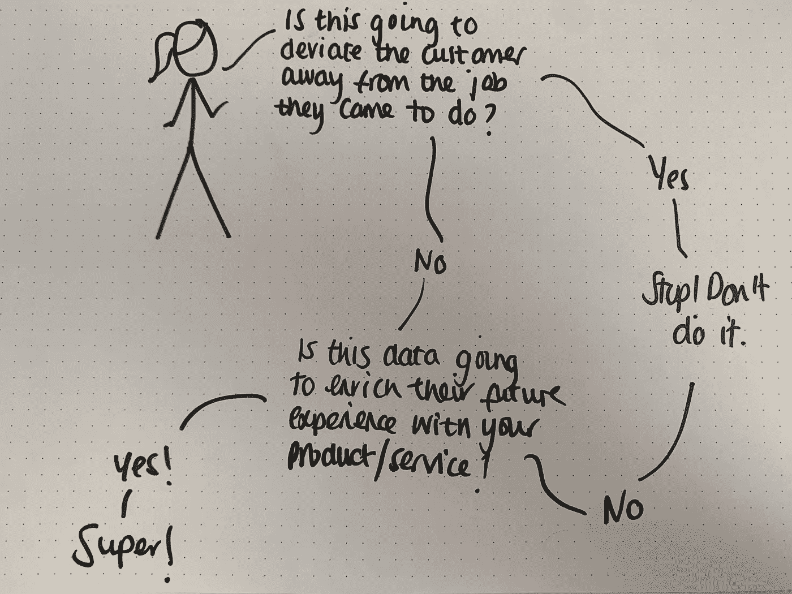

# 保持(数据)表象

> 原文：<https://towardsdatascience.com/keeping-up-data-appearances-e5225d7620b0?source=collection_archive---------41----------------------->

## 数据是为客户创造价值的燃料，它的应用非常广泛。

照片来自[约书亚·索蒂诺](https://unsplash.com/@sortino)拍摄的 [Unsplash](https://unsplash.com/photos/LqKhnDzSF-8)

让东西保持有序，让东西看起来整洁，熨烫你自 2020 年 2 月以来就没有穿过的超级褶皱的衬衫，这些都是我们在日常生活中做的事情。那么，我们为什么要区别对待我们的数据呢？

在转换角色以专注于数据之后，自然地，我从来没有花这么多时间去思考这个问题。我以前写过关于数据信息的文章，那时我对“数据”的兴趣被激起了。今天，我分享一些关于以数据为中心的想法。我正在探索一些元素，所以希望它会有用，不管你在公司里扮演什么角色。在这篇文章中，我将关注:

1.  收集/使用数据的五个为什么
2.  沉迷于你的数据，而不是你的模型
3.  数据效用——让它变得有意义

## 维护对象数据维护对象问题

总有东西在收集数据；苹果追踪你的脚步，Spotify 记录你在 30 秒或更长时间内听(或不听)了什么，Nest 计算出你的家庭/外出模式，Starling 看到你在咖啡上花了多少钱…

这些例子都带来了有益的结果，无论是行为的改变——像“Chanade，你今天达到了创纪录的步数”,还是学习在你的日常混音中为你播放更多你喜欢的音乐。虽然这些都很棒，但有很多东西是在收集数据的地方发生的，但它只是坐在那里积灰，有点像我目前的手提箱。许多团队收集数据很快，但是做一些事情却很慢，尤其是一些有意义的事情。然而另一方面，你有团队来使数据可用，所以团队可以创造一些伟大的东西，无论是支持业务团队还是客户，使他们的下一次体验比以往任何时候都更好，因为它与他们当时的时间和他们要做的工作相关。

Zara 是另一个为了客户利益而使用数据的例子。Zara 多年来的发展令人印象深刻，顾客是它的核心。每天，来自 96 个国家的 2，259 家店铺的团队成员都会反馈顾客的习惯，然后设计团队会根据这些习惯进行改进；这包括高销量商品和退货——这使得 Zara 能够从设计和生产的角度快速行动，例如，这可能导致停止一种风格，或改变尺寸。

另一个做好事的时尚强国是 ASOS。通过利用退货数据、客户评论和一个名为“你的详细信息”的小功能，我发现他们正在做的一些事情很有用。在数字化购买时非常有用，而且以我的经验来看，总是相当准确。

不久前我看了这部电影，但《摇钱树》是一部很棒的电影，展示了“数字”产品之外的应用。在 Moneyball 中，有一个棒球队雇佣了一名分析师，他专注于一组数据特征，以告知他们与谁比赛，以及他们与谁签约/交换。这些数据被用来预测获胜的球队，长话短说，我们成功地战胜了球探团队的“总是这样做，这些数据是行不通的”行为。这是现在常见的行为，显示了数据在预测许多行业中的作用有多广。

## 使用数据的五个为什么

如果您的团队不能回答为什么要收集/使用 5x 的数据，那么他们根本就不应该收集这些数据。为了让这一过程更有条理，你可以为你的袖手旁观团队制定一些明确的原则——不管他们在公司的哪个部门。这可以避免人们在与数据隐私团队打交道时经常陷入的怪圈。原则应该用简单的英语表达，并且有意义。当客户与你的产品和服务互动时，他们应该总是丰富客户的体验。

我最近一直在思考这个问题，敏捷宣言感觉是写这些的好方法。这是我对收集数据的原则的想法。

*   让它成为体验的一部分 ***胜过*** 为你的客户创造更多的努力。
*   关注最少的可行数据开始 ***而不是*** 试着去想你可能想要的一切。
*   演示数据在原型 ***中的使用，而不是*** 提供列表。
*   带着你的隐私/安全人员踏上一次 ***超过*** 的旅程，一直请求许可。

回到这四个原则，团队成员以客户为中心，问自己几个问题:

作者图片

当你在处理数据隐私或监管等问题时，所有这些都会让你的生活变得更轻松，以支持你收集/使用某些东西的原因，并确保它是道德的——这应该是你考虑的一部分，永远如此。如果这些数据被用来做 X，你会高兴吗？

说到收集数据，我们可以采取精益的方法。有一些很好的例子，公司收集最少量的可行数据，让你注册他们的产品或服务。然后，随着你不断回头，他们会逐渐积累他们想知道的东西，以便更好地使用他们的产品/服务。Adobe 在这方面做得很好，重点放在帐户恢复上。你完成了最低要求，你就可以进去了，然后再进去的时候，他们会给你更多的优惠。这是 MVD 开始运行。从这里开始总是好的，随着时间的推移显示价值和规模，否则您将花费数周时间让团队批准一切，数周时间考虑如何处理所有这些，而较少时间为您的客户快速创造小价值。关注一小部分用例，少即是多。一直都是。

## 沉迷于你的数据，而不是你的模型

许多技术人员痴迷于模型，而不是数据。问题是数据是释放价值的东西，模型是达到目的的手段。

> “数据把模型当早餐吃”……就像“文化把策略当早餐吃”一样🥞

当我想到它的时候，有点像做三明治。让我们假设模型是面包。它烤得很好，总是有改进的空间，但总的来说，这是一个可爱的面包，沃伯顿家庭会感到自豪。然后数据，我们假设那是填充。对我个人来说，如果切达干酪不够成熟，我就不好了。

所以，你去冰箱(像谷歌云平台一样的数据存储)，它几乎到处都是，你找不到奶酪，黄油就在后面，你有一些洋葱酸辣酱，但它过期了。这听起来有点像你的公司存储数据的方式。数据存储的重要性经常被遗忘。这是高绩效数据团队的基础，能够快速创造价值，并在此基础上不断迭代。你如何存储数据真的很重要。云提供商已经分离了存储和处理，并做了大量工作来给人们提供认真对待数据存储的工具。这是一门手艺，欣赏这些人，投资他们。

当公司看到旅程数据的价值时，在建模方面的投资不是问题，但如果它像“男人抽屉”一样储存，你会让你的团队生活更艰难，并产生不必要的努力。成为数据存储的阿尔迪中岛——你带着两样东西进来，带着门廊的欢迎垫、一支蜡烛和一套新锅离开。有组织的数据可以为团队带来灵感，创造创新产品。

最后，在实践中，你的模型建立起来了，你已经发货了，太棒了——但这还不是结束。它要么做得很好，但表现不如现有的，要么是一个全新的领域，表现不如所有人想象的那么好。很多人假设模型就是问题。你好，你看到数据情况了吗？！认真对待你的数据。

## 数据效用——让它变得有意义

太多时候，公司与我互动的方式就像他们与佩德罗·小马、丽贝卡·兔子、爷爷狗和佐伊·斑马(粉红猪小妹的粉丝都知道)互动的方式一样。这就好像他们认为我们在同一时间、同一渠道都有相同的工作要做。

有一些事情让我觉得*很棒，我喜欢你的风格，请多收集和使用我的数据。*

处女酒——我买了一箱，现在我每周都收到打八折的电子邮件和/或短信，我从来没有接受过，但我也没有想过退订。反馈循环，方法的改变在哪里？🗑

majestic——我去商店买了 6 瓶，爱上了 mix six。我是会员，但我什么也没有得到。什么都没有。🤷🏻‍♀️

芒果——我在浏览时看到了一款完全符合我的马甲。出于兴趣，我使用了大小特征。它可以帮助你找到你需要的尺码。其中一部分是预先填好的，我的年龄、身高、体重——很有用。他们通过 iOS 获取数据——我对此很满意，这支持了我的工作并节省了我的时间。🙏

经典的例子，但恐怕不是一般的例子。网飞。抱歉，我已经看了 100 多部电视剧了，为什么我还能看到他们的辉煌？为什么他们不在一个小区域，就像你已经看过所有这些东西或者至少给我一个我已经看过他们的信号，拜托。🤦🏻‍♀️

玉兰油有一个皮肤顾问，它使用人工智能、自拍和一些问题来确定适合你的产品。它节省了时间，增加了正确的机会，还有点意思。🧖‍♀️

# 关于你下一步可以做什么的一些想法💭

在我们所处的地方，团队的使命是让你的生活更轻松，或者通过使用人工智能来丰富你的客户体验。你很乐意开着自己的无人驾驶汽车去商店，或者观看网飞推荐的节目，或者因为 Apple Watch 告诉你而呼吸，所以加入进来，寻找机会，让这项技术让你的日常生活变得更轻松，或者让你的客户体验好 10 倍。数据正在改变我们的思维方式、处事方式以及更好地为客户服务的方式。不要被落下。

*   你收集的东西很重要，但是你需要明白你为什么要收集它。如果您能回答为什么是 5x，那么当您来记录并与隐私团队讨论时，您将有一个坚实的愿景。
*   数据及其应用释放价值。它使你在竞争格局中脱颖而出，或者对玉兰油来说，是你的下一个基础。
*   关注数据的整洁性、可用性和可用性，而不仅仅是闪亮的模型，对于您从使用数据中获得的价值至关重要，从您想要的开始。

与客户和他们试图做的工作保持一致，可以保持相关性，或者在新进入者的情况下，可以导致整个行业的混乱。数据对此至关重要，尤其是在下面的定价示例中。

网飞痴迷于了解客户在做什么，而百视达则过于专注于 15%的收入来自滞纳金(70%的利润)，而没有停下来看看发生了什么。公司需要更广泛地考虑数据，而不仅仅是跟踪客户在你的网站上做了什么，并开发能够使你成为行业领导者的产品，并通过商业模式创新保持相关性。有时候短期的损失换来长期的收获是有必要有所突破的。