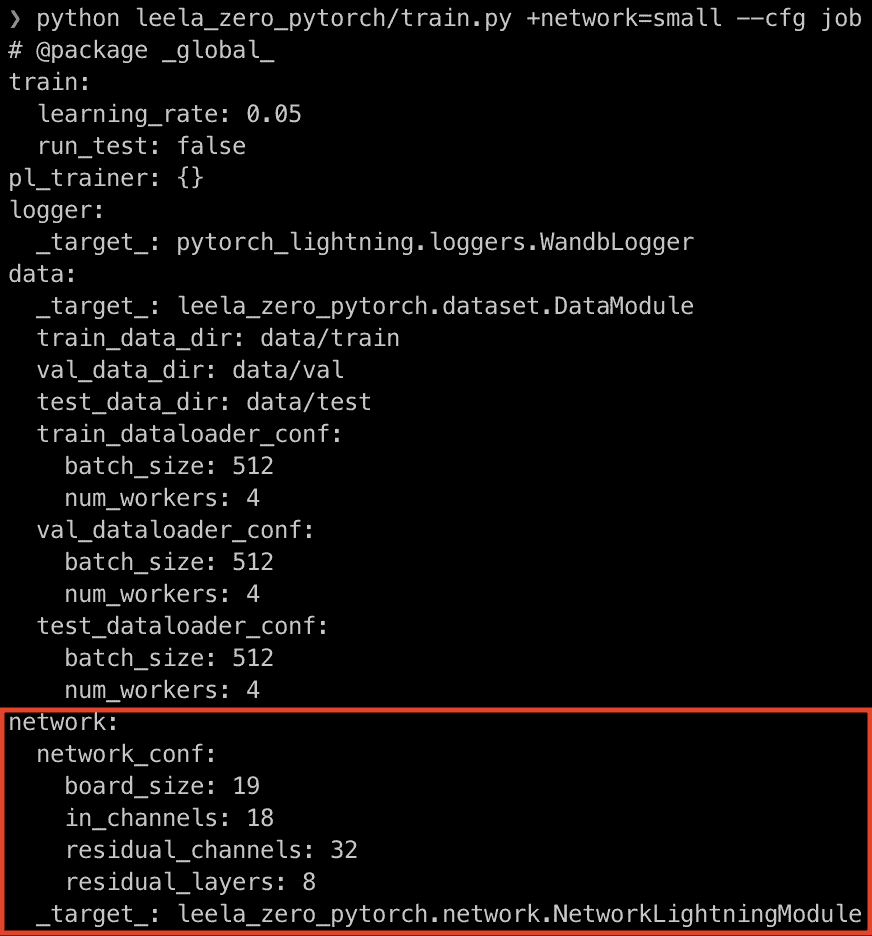

# 跟上 PyTorch 闪电和九头蛇—第二版

> 原文：<https://towardsdatascience.com/keeping-up-with-pytorch-lightning-and-hydra-2nd-edition-34f88e9d5c90?source=collection_archive---------21----------------------->

## 我如何使用 PyTorch lightning 1.1 和 Hydra 1.0 的新特性将我的训练脚本缩减了 50%

*第二版短评:回到 2020 年 8 月，我写了一篇关于我如何使用 PyTorch Lightning 0.9.0 和 Hydra 1 . 0 . 0 的第四个发布候选版本将我的训练脚本缩减了 50%的故事。半年后的 2021 年 2 月，我们现在有了*[*py torch Lightning 1.1*](https://medium.com/pytorch/pytorch-lightning-1-1-model-parallelism-training-and-more-logging-options-7d1e47db7b0b)*和* [*九头蛇 1.0*](https://hydra.cc/blog/2020/09/03/Hydra_1.0) *。在 Hydra 1.0 中没有引入重大的变化，但是 PyTorch Lightning 1.0 包含了一些重大的变化，比如不再使用结果抽象。所以我决定写第二版我的原始帖子来“跟上”PyTorch 闪电和九头蛇。如果你愿意，你仍然可以阅读第一版***，但第二版应该涵盖截至 2021 年 2 月的最新变化。尽情享受吧！**

**

*努力跟上！— [来源](https://unsplash.com/photos/H30w37gpkro)*

# *介绍*

*PyTorch Lightning 1.1 和 [Hydra 1.0](https://hydra.cc/blog/2020/09/03/Hydra_1.0) 最近发布，充满了新功能和大部分最终 API。我认为这是一个很好的时机让我重温我的副业项目 [Leela Zero PyTorch](https://github.com/yukw777/leela-zero-pytorch) 来看看这些新版本是如何融入其中的。在这篇文章中，我将谈论这两个库的一些新特性，以及它们如何帮助 Leela Zero PyTorch。我不会在这里过多地谈论关于 Leela Zero PyTorch 的细节，所以如果你想更多地了解我的副业项目，你可以在这里阅读我以前关于它的博文[。](/training-neural-networks-for-leela-zero-using-pytorch-and-pytorch-lightning-bbf588683065)*

# *PyTorch 闪电 1.1*

*经过几个月的努力，PyTorch Lightning 于 2020 年 10 月发布了 1.0 版本。它引入了许多新特性和一个最终稳定的 API。几个月后，他们发布了 1.1 版，提供了令人兴奋的模型并行支持。我们将把重点放在 1.0 中引入的最终 API 上，并在将来为模型并行性专门写一篇文章。在我们开始之前，如果你想了解更多关于这些版本的信息，请查看官方博客文章: [1.0](https://medium.com/pytorch/pytorch-lightning-1-0-from-0-600k-80fc65e2fab0) 和 [1.1](https://medium.com/pytorch/pytorch-lightning-1-1-model-parallelism-training-and-more-logging-options-7d1e47db7b0b) 。如果你想了解更多关于 PyTorch Lightning 的知识，请查看 Github 页面以及官方文档。*

## *简化日志记录*

*你有没有发现自己重复地实现`*_epoch_end`方法，只是为了从你的`*_step`方法中聚集结果？您是否发现自己在如何正确记录您的`*_step`和`*_epoch_end`方法中计算出的指标时被绊倒了？你并不孤单，PyTorch Lightning 1.0 引入了一种新方法`self.log()`来解决这些问题。*

*您真正要做的就是用您想要记录的指标调用`self.log()`，它将为您处理记录和聚合的细节，这可以通过关键字参数定制。让我们看看它们是如何在我的项目中使用的:*

*新的、简化的日志记录界面有助于您不再重复度量日志记录。*

*在`training_step()`中，我计算总损失并记录下来，将`prog_bar`设置为`True`，这样它就会显示在进度条中。然后，我使用便利的方法`log_dict()`记录均方误差损失、交叉熵损失和准确度(使用 PyTorch Lightning 的新度量包计算，稍后将讨论)。默认情况下，如果在`training_step()` ( `on_step=True`，`on_epoch=False`)中调用，`self.log()`只记录当前步骤，而不是纪元级别，但是我们可以根据需要改变行为。在`validation_step()`和`test_step()`中，`self.log()`的行为与聚合相反:它只在 epoch 级别(`on_step=False`、`on_epoch=True`)记录日志。我们不需要编写代码来在纪元级别聚合它们，因为它会自动为您处理。同样，这种行为可以通过关键字参数定制。你可以在这里阅读更多关于 PyTorch Lightning [如何记录日志的细节。](https://pytorch-lightning.readthedocs.io/en/stable/logging.html)*

## *韵律学*

*PyTorch Lightning 团队在 0.8 中继续他们的工作，在 1.0 中引入了更多的度量实现。PyTorch Lightning 中的每一个指标实现都是一个 PyTorch 模块，并且有其对应的功能，使用起来非常简单灵活。模块实现负责跨步骤聚合指标数据，而功能实现则用于简单的即时计算。对于我的项目，我决定使用 accuracy 的模块实现，因为我对验证和测试的纪元级别的准确性感兴趣。让我们看一下代码:*

*精度模块正在运行。请注意调用它们的两种不同方式。*

*第一步是将单独的度量模块初始化为 Lightning 模块的实例属性。然后，只要在有数据的地方调用它们，就可以计算出想要的指标。然而，您将看到在我的代码中调用度量模块的两种不同方式。第一种方法可以在`training_step()`中找到，在这里我记录了调用度量模块的返回值。这是一种更直接的日志记录方式，其中根据给定参数计算的指标被记录，而没有任何自动聚合。因此，对于训练来说，只记录步进式精度，我可以只使用函数实现来获得相同的最终结果。*

*第二种方式可以在`validation_step()`和`test_step()`中找到。我用一行数据调用模块，然后直接记录模块。这里，自动聚合根据日志设置发生，即准确性指标将在纪元级别聚合和报告，因为这是我们使用的日志设置(记住，默认情况下，日志记录在纪元级别发生，用于验证和测试)。您不需要在单独的`*_epoch_end()`方法中聚合数据和计算指标，省去了您自己处理数据聚合的麻烦。*

*PyTorch Lightning 现在包含许多其他指标实现，包括高级 NLP 指标，如 BLEU score。你可以在这里阅读更多关于它的[。](https://pytorch-lightning.readthedocs.io/en/stable/metrics.html)*

## *照明数据模块*

*PyTorch Lightning 的另一个棘手问题是处理各种数据集。直到 0.9，PyTorch Lightning 对如何组织你的数据处理代码保持沉默，除了你使用 PyTorch 的[数据集](https://pytorch.org/docs/stable/data.html#torch.utils.data.Dataset)和[数据加载器](https://pytorch.org/docs/stable/data.html#torch.utils.data.DataLoader)。这无疑给了您很大的自由，但也使您很难保持数据集实现的整洁、可维护和易于与他人共享。在 0.9 中，PyTorch Lightning 在`LightningDataModule`中引入了一种新的组织数据处理代码的方式，它在 1.0 中正式成为稳定 API 的一部分。`LightningDataModule`封装了数据处理中最常见的步骤。它有一个简单的接口，有五种方法:`prepare_data()`、`setup()`、`train_dataloader()`、`val_dataloader()`和`test_dataloader()`。让我们回顾一下它们在我的项目中是如何实现的，以理解它们的作用。*

*LightningDataModule 帮助您组织数据处理代码。*

*   *`prepare_data()`:该方法适用于分布式培训在派生子流程之前，主流程中必须完成的任何事情。下载、预处理或保存到磁盘等任务是这种方法的理想选择。需要注意的一点是，在这里设置的任何状态都不会被带到分布式培训中的子流程，因此您应该注意不要在这里设置任何状态。在我的项目中，我依赖 Leela Zero 来预处理 Go sgf 文件，所以我决定跳过实现这个方法，但是我可以在技术上实现这个方法中的预处理步骤。*
*   *setup():该方法用于分布式培训中每个子流程必须完成的任何事情。您应该构造实际的 PyTorch `Datasets`并在这里设置任何必要的状态。在 Leela Zero PyTorch 中，我初始化了我的`Datasets`，它从磁盘中读入数据，并将它们转换成张量，并保存为状态。*
*   *`*_dataloader()`:这是你初始化`DataLoaders`进行训练/验证/测试的地方。在我的例子中，我简单地使用在`setup()`中构建的数据集以及在`LightningDataModule`初始化期间传递的配置来初始化`DataLoaders`。*

*现在只需要把`LightningDataModule`传入`trainer.fit()`和`trainer.test()`就可以了。你也可以想象这样一个场景，我为不同类型的数据集(比如国际象棋游戏数据)实现了另一个`LightningDataModule`,而训练员将同样接受它。我可以更进一步，使用 Hydra 的对象实例化模式，在各种数据模块之间轻松切换。*

# *九头蛇 1.0*

*Hydra 是一个“优雅地配置复杂应用程序的框架”正如你可能已经知道的那样，深度学习训练脚本可能会很快变得复杂，有很多旋钮和转盘。Hydra 可以帮助您以优雅的方式处理这种复杂性。*

*Hydra 早在 2020 年 9 月就发布了官方 1.0，现在正在向下一个 1.1 前进。发布在我们开始之前，如果你想从总体上了解更多关于九头蛇的信息，请查看[官方网站](https://hydra.cc/)以及[官方文档](https://hydra.cc/docs/intro)！*

## *@hydra.main()*

*您可以将这个装饰器添加到任何接受 OmegaConf 的`DictConfig`的函数中，Hydra 将自动处理您的脚本的各个方面。这本身并不是一个新特性，但是我最初决定不使用这个特性，因为它接管了输出目录结构和工作目录。我实际上使用了 Hydra 的实验性 Compose API 来解决这个问题，我将在后面讨论。然而，在与 Hydra 的创建者 [Omry](https://medium.com/u/18354ccdb814?source=post_page-----31e8ed70b2cc--------------------------------) 交谈后，我意识到这不仅不是推荐的方法，而且我还失去了 Hydra 提供的一些很酷的功能，如命令行界面的自动处理、自动帮助消息和 tab 补全。此外，在使用一段时间后，我发现 Hydra 的输出目录和工作目录管理非常有用，因为我不必在 PyTorch Lightning 端手动设置日志目录结构。你可以在[九头蛇的基础教程](https://hydra.cc/docs/tutorials/basic/your_first_app/simple_cli)中读到更多关于这个装饰师的内容。*

## *打包指令*

*在 Hydra 0.11 中，配置只有一个全局名称空间，但在 1.0 中，您可以使用包指令在不同的名称空间中组织配置。这允许您保持 yaml 配置文件的平整和整洁，没有不必要的嵌套。让我们来看看 Leela Zero PyTorch 的网络规模配置:*

*“@package _group_”表示此配置应在当前组下，在本例中为“网络”。*

**

*网络大小配置已按规定添加到“网络”下。请注意“board_size”和“in_channels”来自数据配置(composition！)*

*如您所见，包指令使您的配置更易于管理。你可以在这里阅读更多关于包指令及其更高级的用例。*

## *实例化对象*

*Hydra 提供了一个特性，可以根据配置实例化一个对象或调用一个函数。当您希望您的脚本有一个简单的接口在各种实现之间切换时，这是非常有用的。这也不是一个新特性，但是它的界面在 1.0 中有了很大的改进。在我的例子中，我用它在网络大小、训练记录器和数据集之间切换。我们以网络规模配置为例。*

*“大”、“巨型”和“小型”网络的配置*

*基于所选配置实例化网络。请注意，您可以传入额外的参数来实例化()，就像我在这里对 cfg.train 所做的那样。*

*`NetworkLightningModule`对其`__init__()`、`network_conf`和`train_conf`接受两种说法。前者从配置中传入，后者在`instantiate()` ( `cfg.train`)中作为额外参数传入。你所要做的就是在命令行中输入`+network={small,big,huge}`来选择不同的网络大小。您甚至可以想象通过用不同的`_target_`创建一个新的配置，并在命令行中传递配置名，来选择一个完全不同的架构。不需要通过命令行传递所有的小细节！你可以在这里阅读更多关于这个模式[的内容。](https://hydra.cc/docs/patterns/instantiate_objects/overview)*

## *撰写 API*

*尽管 Hydra 的 Compose API 不是编写脚本的推荐方式，但它仍然是编写单元测试的推荐方式，并且非常有用。我用它来为主培训脚本编写单元测试。同样，这不是一个新特性，但是 Hydra 1.0 确实为使用 Python 的上下文管理器的 Compose API 引入了一个更干净的接口(即`with`语句)。*

*您可以使用 Hydra 的 Compose API 轻松编写配置字典。它有助于保持单元测试的整洁和易于调试。*

*你可以在这里阅读更多关于组合 API [的内容，以及如何在这里](https://hydra.cc/docs/experimental/compose_api)使用它进行单元测试[。](https://hydra.cc/docs/advanced/unit_testing)*

## *未使用的功能:结构化配置和变量插值*

*Hydra 1.0 中还有很多其他特性我没有利用，主要是因为我还没有足够的时间来集成它们。我将讨论本节中最大的一个问题——结构化配置。*

*结构化配置是 1.0 中引入的一个主要新特性，它利用 [Python 的 dataclasses](https://docs.python.org/3/library/dataclasses.html) 来提供运行时和静态类型检查，这在应用程序变得复杂时非常有用。我可能会在将来有时间的时候整合它们，所以请继续关注另一篇博文！*

# *结论*

*自从我写了关于 Leela Zero PyTorch 的第一篇博文以来，Hydra 和 PyTorch Lightning 都引入了许多新的特性和抽象，可以帮助您极大地简化 PyTorch 脚本。看看我的培训脚本，看看它们有什么帮助:*

*我的新旧训练脚本。行数从 56 增加到 28。五折优惠！*

*正如你在上面看到的，我的主要训练脚本现在只有 28 行，而以前是 56 行。此外，训练管道的每个部分，神经网络体系结构，数据集和记录器，都是模块化的，易于交换。这使得迭代更快，维护更容易，重现性更好，让您可以专注于项目中最有趣和最重要的部分。我希望这篇博文对你“跟上”这两个了不起的库有所帮助！你可以在这里找到 Leela Zero PyTorch [的代码。](https://github.com/yukw777/leela-zero-pytorch)*