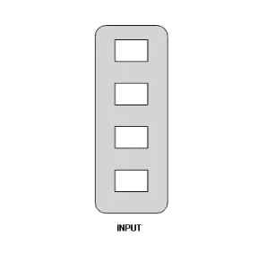
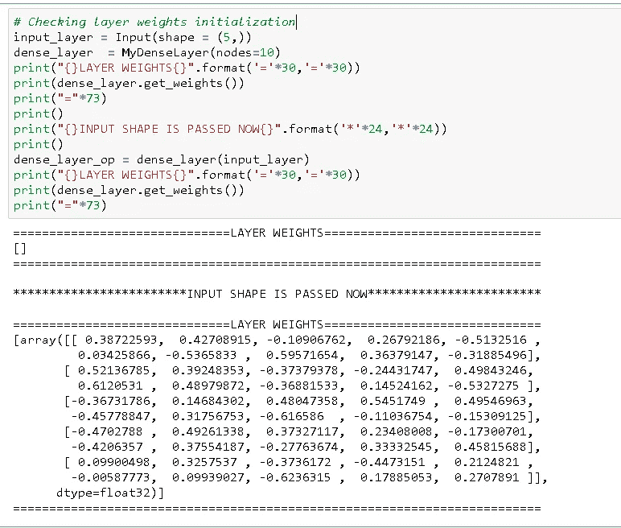
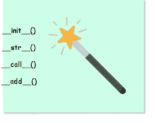

# 克拉斯:引擎盖下

> 原文：<https://towardsdatascience.com/keras-under-the-hood-afb2cb86b4fa?source=collection_archive---------25----------------------->

## 了解 keras 中的模型架构


来源: [Pixabay](https://pixabay.com/illustrations/matrix-full-program-data-code-3145364/)

# 介绍

深度学习的入门变得非常简单和方便，这都要归功于 keras 和 tensorflow 的精彩二人组。你只需要做一些导入，定义一些层，宾果，你就有了你的深度学习架构准备好接受训练，并最终给出一些惊人的结果。Keras 做出了如此惊人的抽象，以至于即使对这个主题完全陌生的人也可以开始训练他们自己的深度学习模型。然而，如果你自称是数据科学家/机器学习工程师，那么对幕后发生的事情有一些基本的了解是必须的，我不是说你需要确切地知道背后的数百行代码，但至少对这些代码行在做什么有一些了解。


来源:[知识共享](https://creativecommons.org/licenses/by-sa/4.0/deed.en)

# 入门指南

不要浪费任何时间，让我们深入一些最常用的 keras 组件，并尝试一点一点地理解它们，这将涉及对面向对象编程的基本理解，但不要担心，我会尽量保持简单。我将采用一个非常简单的深度学习架构，然后尝试逐行解释其工作原理，为了更好地解释，我创建了一个自定义的密集层，我将在我的架构中使用。

```
**class** *MyDenseLayer*(tf.keras.layers.Layer):

    **def** *__init__*(self, nodes):
        super(MyDenseLayer, self).__init__()
        self.num_outputs = nodes

    **def** *build*(self, input_shape):
        print("="*20)
        print('we are here in build')
        self.kernel = self.add_weight("kernel",shape=      [int(input_shape[-1]),self.num_outputs],dtype=tf.float32)        

    **def** *call*(self, input):
        print('='*20)
        print('we are here in call')
        **return** tf.matmul(input, self.kernel)
```

你可能想知道里面的这些构建/调用方法是什么，我稍后会深入挖掘它们的细节，下面是一个使用 *keras Functional API* 的非常简单的模型架构。

```
input_layer = Input(shape = (5,))
dense_layer  = MyDenseLayer(nodes=10)
dense_layer_op = dense_layer_one(input_layer)
model = Model(inputs = input_layer,outputs = dense_layer_op)
```

现在让我们来看看这个架构，并试着一行一行地理解它。第一行非常简单，我们正在创建一个名为 Input 的类的对象，它基本上创建了一个符号**张量/占位符** *(这意味着我们在这里不需要实际的输入数据，而是为稍后在网络中流动的数据保留了一块内存)*这个张量告诉网络将给予模型的输入的大小，这通常是网络的入口点，在 shape 参数中，我们指定输入向量的维度。((5，)表示输入是 1×5 向量，批量大小尚未确定，即模型可以采用稍后在模型拟合期间定义的任何批量大小)



占位符的图示(作者提供的图像)

第二行和第三行是实际事情开始的地方，这里我们定义了神经网络架构的第一层。第二行创建了一个自定义层类的对象，这一行基本上定义了自定义层中的节点数。

第三行是我们的实际层建立的地方，层的权重是在这里创建和初始化的，你可能会有一些问题，比如为什么在层对象创建过程中权重没有初始化？此外，这个层对象是如何作为某种 python 方法使用的？如果是，那么这个方法在做什么？。让我一个一个地回答它们，在创建对象时，我们可能事先不知道输入的大小(如果我们要在创建对象时创建权重，那么我们每次都需要将大小作为参数显式地传递给类)，没有输入的大小，我们就无法创建这个权重矩阵。因此，我们希望仅当输入的大小已知时才创建这些权重，这就是我们在第三行中所做的，在这里，一旦我们获得了输入形状的信息，我们就完全构建了我们的层，为了证明我的观点，我已经分别在创建层对象和将输入形状传递给该层对象后获取了层权重，您可以清楚地看到，只有当层的输入形状已知时，权重才被初始化，对吗？。



在传递输入形状之前和之后调用权重矩阵(图片由作者提供)

现在第二个问题来了，这个对象是如何被当作 python 方法的，如果它是一个方法，那么它在做什么？在此之前，让我们先谈一谈我们在自定义类中定义的这些方法。

> **__init__ ()** :这是一个非常简单的函数，对于那些使用过 JAVA 等其他编程语言的人来说，这个 __init__ 相当于一个构造函数，用来初始化一个类对象。
> 
> **build ()** :顾名思义，这个方法实际上是用来构建层的，也就是说，它创建层的权重，一旦我们得到了将要输入到模型中的输入的形状，它就会调用这个方法，并相应地创建权重
> 
> **call ()** :这是该层的逻辑所在，也就是说，它接受提供给该层的输入，对其进行处理，并输出该层的输出，这些输出可能会被其他层使用

我们讨论了这些方法做什么，但我们没有谈论一件非常重要的事情，这些方法是如何以及何时被调用的， *__init__* 非常简单，它在对象创建时被调用，至于这些*构建和调用方法*它们是在我们将层对象用作方法时被调用的，这可能会有点混乱，但请耐心，让我们分解一下。 到目前为止，我们知道了**的哪一部分**即被视为方法，这个对象实际上在做什么，现在是**的哪一部分**，这个对象如何被视为方法，在没有任何显式函数调用的情况下，如何调用 call 和 build 方法。

这是一种特殊的对象——可调用的对象，这个对象可以被看作是一个有点魔力的函数。这正是实现这一奇迹所需要的，一个**魔法方法**，python 有这些特殊类型的方法，它们的调用不需要任何显式的函数调用。它们是在内部调用的(由一些操作符重载或内置函数调用)，我们可能没有意识到这一点，但我们已经广泛地使用了这些神奇的方法，这里有一个简单的例子，在 python 中，当我们做类似于 *a = 5* 的事情时，我们知道一切都是对象，那么实际上 *a* 是类 str 的对象， 当我们执行**print(***a***)**print 方法是如何生成这个输出的呢这里是另一个神奇的函数 *__str__* 发挥作用的地方，这个方法以字符串形式返回一个对象的输出，当我们将那个对象放入 print 方法中时，它会被自动调用，这里有一小段代码可以让你更好地理解上面的语句。

```
**class** PrintTest():
    **def** __init__(self,obj):
        self.obj = obj
    **def** __str__(self):
        **return** "__str__ method is invoked when print object is put inside print/str method"
str_obj = PrintTest('Hello')
```

这是当我们将 PrintTest 类的对象放入像 print 这样的内置方法时的输出。


检查 __str__ 方法调用(作者图片)

*(* ***注*******:****在 python 中有一个名为 Object 的类，默认情况下，Object 是 python 中创建的每个类的父类，这个 __str__ 已经在那里定义了，在我们的示例中，我们简单地覆盖了 __str__ 方法。)**

**

*检查自定义类的父类(图片由作者提供)*

*现在回到我们最初的讨论，有另一个神奇的方法叫做 *__call__* ，它帮助你的类对象像常规方法一样工作，一旦我们在对象名后面加上括号圆括号()它就会被自动调用，简单地说 **obj()** 相当于 **obj。__call__()** 。*

*这就是为什么当我们创建原始层的一个对象，然后使用它工作的同一个对象进行函数调用时，敏锐的观察者会注意到一件事，在我们的自定义层类中，我们没有显式定义任何 *__call__* 方法，我们确实有一个 call 方法，但它是一个常规方法，它不是一个神奇的方法，为了回答这个问题，我想触及一个称为继承的概念， 你一定已经注意到我们的自定义层类从 Keras 继承了一个叫做**层**的基类，你可能知道继承的基本概念，一旦一个类继承了另一个类(父类)，它就可以访问那个父类的所有功能(方法)，所以这个神奇的方法 *__call__* 被写在层类中，当我们继承它时，我们的自定义类就可以访问这个 *__call__* 神奇的方法。 这些*构建和调用方法*也不是一些随机的方法，它们在层构建中也有意义。这些方法实际上已经在基础层类中定义了，它们扮演着我们前面已经讨论过的特殊角色。*

**

*来源:[知识共享](https://creativecommons.org/licenses/by-sa/4.0/deed.en)*

*这两个方法都是通过 *__call__* 方法调用的，因此，为了总结整个流程，一旦我们通过层可调用对象传递了张量/占位符，然后 *__call__* 方法被调用，该方法依次首先调用构建方法来实例化层，然后调用方法来运行层的逻辑。为了证明我的语句，我在*调用和构建方法*中添加了打印语句，让我们看看输入张量/占位符传递给可调用层对象后的输出。*

**

*在构建和调用方法调用时检查(图片由作者提供)*

*现在，您可能已经注意到，在定义架构时，我们不需要实际数据，我们只需要层所需的张量形状，并为该张量创建一个占位符，实际数据在 *model.fit()* 期间传递，数据通过架构向前传播，随后计算误差/损失，然后反向传播，从而更新流程中的权重并训练模型。*

# ***结论***

*虽然这些东西看起来很小，但当我们进入更复杂的深度学习架构，如 LSTM、编码器-解码器等时，了解它们会特别有帮助，对这些基本概念有一点了解有助于我们以后更好地掌握这些复杂的架构，并最终修改和创建我们自己的架构。*