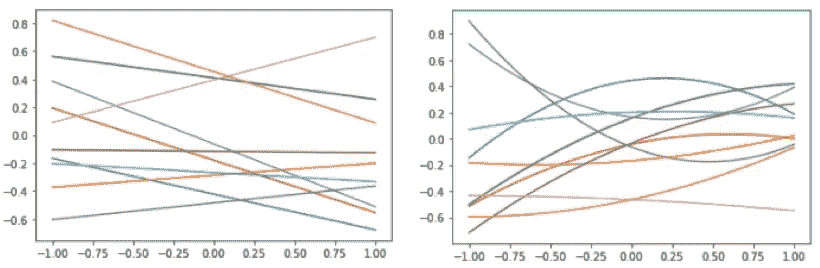
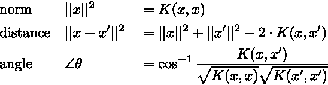
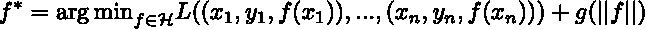
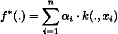
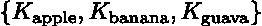
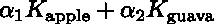
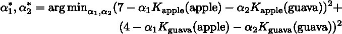
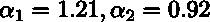
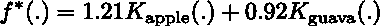
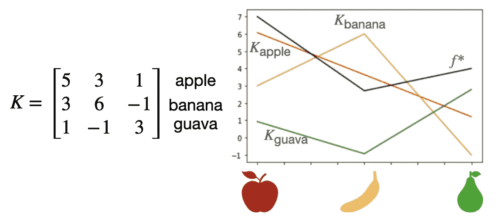

# 内核机器从零开始

> 原文：<https://towardsdatascience.com/kernel-machine-from-scratch-718eba74ea3e?source=collection_archive---------16----------------------->

## 图解学习核和再生核希尔伯特空间的概念

本顿·谢尔曼在 [Unsplash](https://unsplash.com?utm_source=medium&utm_medium=referral) 上的照片

T 训练一个神经网络模型可能很难，但知道它学到了什么就更难了。早在 1995 年，拉德福德·m·尼尔就证明了具有随机参数的单层神经网络在宽度趋于无穷大时会收敛到高斯过程。2018 年，Lee 等人进一步将结果推广到任意深度的无限宽网络。基于这种联系，我们可以使用高斯过程建立一个模型，模拟一个无限宽的网络——将问题转换成一个可以理解的机制。最近，Arthur Jacot 等人证明了无限宽神经网络在基于梯度下降的训练期间的进化也可以用核(称为神经切线核)来描述。沿着这条道路，越来越多的工作正在用核方法的理论工具来研究神经网络的有趣行为。在深入研究这些伟大的作品之前，有必要深入回顾一下与内核相关的定理。

# 1.机器学习中的函数空间

为了充分理解核方法背后的理论，首先必须澄清函数空间的概念及其在机器学习中的作用。众所周知，在监督学习中，我们收集一组元组( *x₁* 、 *y₁* )、…、( *xₙ* 、 *yₙ* )，想要找到一个最适合它的函数。更具体地说，目标是找到一个函数 *f* (。)在一组函数内*ℌ*s . t .σ*ᵢ**l*(*f*(*xᵢ*)*yᵢ*)最小化 w.r.t. a 损失函数 *l* (。,.).这样一组函数，在机器学习领域被称为假设集，就是一个函数空间。因为我们是在 *ℌ* 内寻找最优解，它越大，我们得到的可接受的解就越多。那么，它能有多大呢？

把函数想成ℝ域上的一个向量，索引为 *x* ∈𝒳。对于输入空间𝒳of 基数|𝒳|，最大的函数空间将是ℝ^|𝒳 *|* ，这意味着一旦输入空间具有无限的基数(例如ℝ)，相应的函数空间将因此具有无限的维度——如果我们考虑所有的可能性，它最终会有一个我们永远没有机会彻底搜索的无限空间。

为了让生活更容易，我们经常把自己限制在一个更小的假设集内。表征功能形式是这样做的一种方式。通过由参数 *w* 建立函数形式，我们将搜索空间减少到ℝ^| *w* |并且确实使问题处于可解状态。然而，没有不带刺的玫瑰。在现实世界的应用程序中，为复杂的数据找到一种函数形式并不容易。即使我们真的想出了一个，学习功能所具备的能力也可能太有限而没有用。现在，我们可能会想，有没有一种方法可以解决这个问题，同时又不会牺牲太多的容量？这就是内核方法的补救方法。

*f* 的函数空间:线性/多项式函数形式的ℝ → ℝ。图片作者。

# 2.超越理论——核诱导函数空间的示意图

核，通俗地说，就是输入空间中实例之间的广义内积。像内积所做的一样，一个核函数 *K* : 𝒳 ×𝒳 *→ ℝ* 描述了输入空间的几何属性，如范数、距离和角度，其中

除了能够表征输入空间，更重要的是能够表征函数空间，也就是再生核希尔伯特空间(简称 RKHS)。

## **2.1。内核诱导函数空间**

让我们试着从零开始构建它，而不是通过定义来理解 RKHS。考虑一个满足内积性质的核函数*k*:𝒳×*t15】𝒳*→ℝ*。对于每一个 *x* ∈𝒳，我们进一步定义 *Kₓ* (。)≦*K*(。， *x* ，即 *K* (。,.)后面的部分固定在 *x* 处。现在再把函数想象成一个向量。以这组函数为基础，它跨越了一个函数空间*ℌ*s . t .*ℌ*中的每一个函数都是 *Kₓ* 的线性组合，建立在 *Kₓ* 的基础上，如果 *Kₓ* 形成一个线性独立的集合，那么由此产生的 *ℌ* 就会有 dim( *ℌ* )=|𝒳|)达到前述可能的最大空间。*

## **2.2。没有刺的玫瑰——RKHS 和表象定理**

在上述的基础上，我们建立了一个最大的功能空间。接下来的问题是，如何在一个无限维的空间内找到一个损耗最小的函数？我们所需要的只是简单地给 *ℌ* 配备一个复制内核 *K* 的内积——对于每一个 *u* 、 *v* ∈𝒳、 *Kᵤ* 、*kᵥ*⟩=*k*(*u*、 *v* )。有了这个特殊化的内积，就有了最强大的定理——表象定理:

> 给定一组训练样本 *(* x₁ *，* y₁ *)，…，(* xₙ *，*yₙ*)∑*𝒳*×ℝ*，每一个经验损失的极小值

> 对于任意损失函数 L *: (* 𝒳 *× ℝ )* ⁿ → ℝ以及任意严格递增函数 g *: [0，∞)* → ℝ，基于其范数来度量函数的复杂度允许以下形式的表示:

总之，它告诉我们，为了找到损失极小值，我们不需要搜索整个无限维空间，而只需要搜索训练数据的表示者(又名 *Kₓ* )所跨越的子空间。这种特殊的内积背后有什么魔力？怎么能不考虑补空间来找优化器呢？源于内积的非常重要的性质是，对于所有可能的 *f* ∈ *ℌ* 和*x*∈𝒳*t49】的 *f* 在 *x* 处的求值相当于在 *f* 和 *Kₓ之间取内积，即 f* ( *x* )=⟨ *Kₓ在此基础上，我们可以进一步表明，对于 *ℌ* 中的任何函数 *f* ，当我们在训练数据内的任何 *x* 处对 *f* 求值时，正交补部分总是贡献零，因此对损失没有贡献。**

## **2.3。亲手制作 RKHS**

了解了内核机器背后的基本原理之后，让我通过一个简单的例子来帮助您更好地理解。假设现在我们要估计一个衡量对三种不同水果偏好的函数，我们得到一个衡量它们之间关系的核矩阵。为了从 *K* 建立一个函数空间，我们可以用

作为依据，如下图所示。

现在我们观察两点:(苹果，7)和(番石榴，4)。基于表象定理，最优解必须承认以下形式:

结合平方损失，问题就变成了:

生产的

因此

图片作者。

# 3.内核血液中的奥卡姆剃刀

到目前为止，我们已经演示了如何使用内核来建立假设集，以及如何找到经验损失的最小值。事实上，该解对应于所有产生最小损失的函数中具有最小范数的一个(在某些情况下，通过所有观测数据)。就奥卡姆剃刀的原理而言，它恰恰是最受青睐的一个。

众所周知，神经网络的强大之处不在于能够完美地拟合训练数据，而是能够推广到那些看不见的数据。在将神经网络(用梯度下降训练)与内核机器连接时，内核血液中的剃刀为其成功提供了一种可能的解释。

# 4.最后的话

自 20 世纪 60 年代以来，与核相关的理论已经非常成熟，利用核技巧的算法通常是处理新数据的首选算法之一。如今，大多数实践者可能具有关于如何针对不同数据构造强大的核的良好知识和经验，并且利用核技巧来建立高容量的学习器，然而，对 RKHS 和相关定理了解不多。在这篇文章中，我试图用一种不涉及太多数学的方式来阐述 RKHS 的思想，希望它能给每一个需要的人带来一些启示。