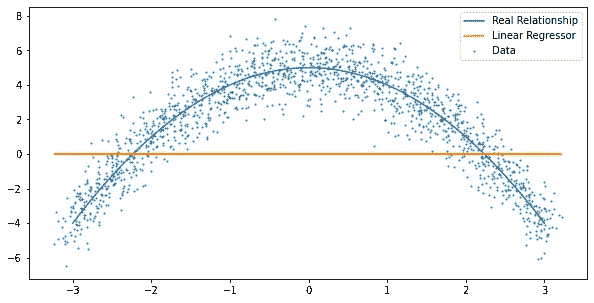

# 内核方法:简单介绍

> 原文：<https://towardsdatascience.com/kernel-methods-a-simple-introduction-4a26dcbe4ebd?source=collection_archive---------6----------------------->

## 机器学习必须知道

## 核方法和径向基函数的基础

马库斯·温克勒在 [Unsplash](https://unsplash.com?utm_source=medium&utm_medium=referral) 上的照片

# 介绍

偏差-方差困境支配着机器学习方法。如果一个模型太简单，这个模型将很难找到输入和输出之间的适当关系。但是，如果模型太复杂，它在训练中会表现得更好，但是在处理看不见的数据时会表现出更大的差异，此外，复杂的模型通常计算成本更高。在一个理想的世界中，我们想要一个简单的模型，它训练速度快，并且足够复杂，可以找到输入和输出之间的复杂关系。**核方法通过将数据的输入空间映射到高维特征空间来实现这一点，在高维特征空间中可以训练简单的线性模型，从而产生高效、低偏差、低方差的模型。**

在这篇文章结束时，希望你能很好地理解这句话的意思以及它为什么重要。

# 核心方法

在机器学习领域有许多核心方法。支持向量机(SVMs)特别受欢迎，在 20 世纪后期甚至更受欢迎，当时它们开始胜过神经网络。如今，核方法最适用于中小型数据集，以及结果的可解释性很重要的问题。

核方法使用核(或基函数)将输入数据映射到不同的空间。在这种映射之后，可以在新的特征空间而不是输入空间上训练简单的模型，这可以导致模型性能的提高。

由于这是对核方法的介绍，我将把重点放在径向基函数上，这是一个非常简单但很常见的核。在以后的文章中，我将详细讨论支持向量机。

# 线性回归和径向基函数

在回归问题中，我们试图估计从 X 推断 Y 的最佳函数。如果我们在 X 和 Y 之间有非线性关系，就不能简单地用此数据拟合线性模型。然而，内核方法的目标是使用这些线性模型，并且仍然创建非线性关系。

内核方法通过将数据转换到一个更高的维度，并在这个维度上拟合一个线性模型来做到这一点。通过这样做，我们有效地拟合了原始输入空间中的高阶模型。

## 线性回归

让我们看看线性回归的解析解，然后我们就可以理解如何使用核方法来生成使用这种线性模型的非线性映射。

最佳线性回归是使我们的模型预测和目标输出 y 之间的平方距离最小化的回归。平方误差如上所示。最小化该误差给出了最佳解决方案。

我们可以对最小二乘误差相对于我们的模型的权重进行微分，以找到产生最小误差的权重向量。结果是伪逆解。

为了正确理解任何线性代数公式，你必须熟悉每个变量的维数:

输入数据 *X* 是 *(Nxd)* 维，其中 *N* 是数据点的数量， *d* 是特征的数量。因此，逆计算将是一个 *(dxd)* 矩阵，并且得到的权重矩阵是一个 *(dx1)* 。我们的权重向量与输入数据中的要素具有相同的维数。这是有意义的，因为当我们从 X 推断 Y 时，我们取权重和输入数据之间的点积，因此输入必须与我们的权重具有相同的维数。

## 高维空间中的线性回归

核方法通过使用核或一组 M 基函数将数据矩阵 X 映射到新的设计矩阵 U。新的设计矩阵具有更高的维数(NxM，其中 M ≥ d)。

我们可以通过取 m 个基函数(ϕ)来构造一个设计矩阵 u，每个基函数由它们自己的均值和标准差来参数化。上述等式中的平均值将具有 *(dx1)* 的维数。因此，对于输入空间中的每个数据点，我们应用 M 个基函数，将输入维度 *(Nxd)* 转换为新的设计矩阵 *(NxM)* 。

RBF 使用高斯基函数。每个基函数代表输入空间中的高斯分布。在所有高斯分布中评估每个数据点。结果是输入向量从 d 维到 M 维的映射。

为了选择参数化这些高斯分布的均值和标准差，可以使用 k 均值聚类来获得参数化基函数的均值和标准差。

现在我们有了设计矩阵 U，并且我们已经将输入数据映射到高维空间，我们可以在这个新的特征空间中拟合线性模型。

通过表达来自特征空间的估计和我们的目标 y 之间的最小二乘误差，并对我们的新权重向量 *l* 进行微分，我们发现最优解与输入数据中的线性回归的最优解具有相同的形式。

这里需要注意的关键点是，我们的权重向量 *(l)* 现在是一个 *Mx1* 向量，在原来的输入空间中，权重向量是一个 *dx1* 向量(还记得 M > d)。

# 合成数据示例

作者图片

这是合成的非线性数据。我有 10000 个数据点，我的 Y 坐标是一维的。这意味着我的数据矩阵 X 的维数为(10，000×1)。我们可以通过使用上面看到的伪逆解决方案计算最佳权重，尝试将线性模型拟合到该数据。显然，正如你在上面看到的，它的表现并不好。

通过在高维特征空间中拟合该相同的线性模型，我们获得了数据中真实关系的更好的近似。

首先，我对每个数据点应用 200 个基函数。我在输入空间中取 200 个高斯分布，并在所有基本函数上评估每个数据点。我的新设计矩阵现在是(10，000x200)维。然后，我使用相同的伪逆解来获得这个新特征空间中的最优权重。

作者图片

如您所见，RBF 模型估计的关系是非线性的，并且与数据吻合得很好。**记住，这个新模型仍然是一个线性回归变量！**但是因为我们在新的特征空间中拟合它，所以我们在原始输入空间中间接地拟合一个复杂的非线性模型。

# **结论**

核方法使用核(或一组基函数)将我们的低维输入空间映射到高维特征空间。当在新的特征空间中训练线性模型(类型为 *ax + b* 的线性模型)时，我们本质上是在原始输入空间中训练高阶模型(例如类型为 *ax +bx +c* )。通过这样做，您保留了简单模型的所有优势(如训练速度、有分析解决方案、较低的方差)，但也获得了更复杂模型的优势(更好的映射、更低的偏差)。本质上，这就是内核方法如此强大的原因！

## 支持我

希望这对你有所帮助，如果你喜欢，你可以跟我来！

你也可以使用我的推荐链接成为**中级会员**，访问我所有的文章等等:[https://diegounzuetaruedas.medium.com/membership](https://diegounzuetaruedas.medium.com/membership)

# 你可能喜欢的其他文章

</support-vector-machines-svms-important-derivations-4f50d1e3d4d2>  </kalman-filtering-a-simple-introduction-df9a84307add> 